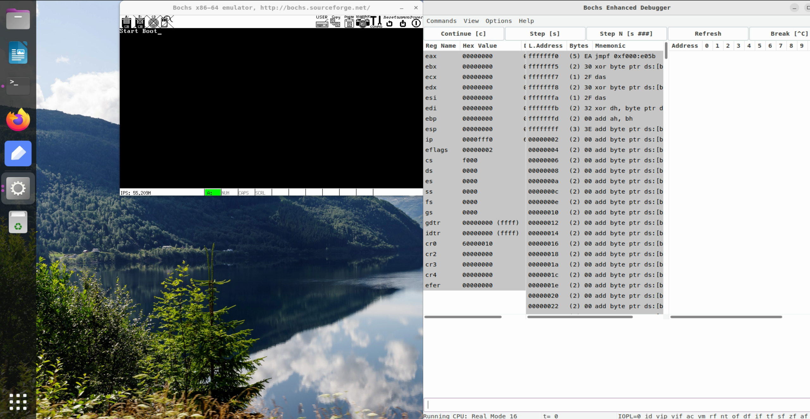

# BootLoader 引导启动程序

[TOC]


## Boot 启动程序


### 环境准备

#### 1. 编译工具

安装 nasm、g++、make 等编译工具


#### 2. bochs 虚拟机调试工具

此处使用的版本是 bochs-2.7.tar.gz 。官网下载解压后后，源码安装


1. 下载依赖

```shell
sudo apt-get install libx11-dev libc6-dev build-essential xorg-dev libgtk2.0-dev libreadline-dev
```


2. 配置(可以使用普通用户)

```shell
/configure --with-x11 --with-wx --enable-debugger --enable-disasm --enable-all-optimizations --enable-readline --enable-long-phy-address --enable-ltdl-install --enable-idle-hack --enable-plugins --enable-a20-pin --enable-x86-64 --enable-smp --enable-cpu-level=6 --enable-large-ramfile --enable-repeat-speedups --enable-fast-function-calls  --enable-handlers-chaining  --enable-trace-linking --enable-configurable-msrs --enable-show-ips --enable-cpp --enable-debugger-gui --enable-iodebug --enable-logging --enable-assert-checks --enable-fpu --enable-vmx=2 --enable-svm --enable-3dnow --enable-alignment-check  --enable-monitor-mwait --enable-avx  --enable-evex --enable-x86-debugger --enable-pci --enable-usb --enable-voodoo
```


3. 编译(root用户)

```shell
sudo make
```


4. 安装(root用户)

```shell
sudo make install
```


编译过程中遇到的错误：

1. `No rule to make target 'parser.cc' , needed by 'parser.o' Stop.`

解决：

```shell
cp ./bx_debug/parser.cpp ./bx_debug/parser.cc
```


2. `No rule to make target 'misc/bximage.cc', needed by 'misc/bximage.o'`

解决：

```shell
cp misc/bximage.cpp misc/bximage.cc
cp iodev/hdimage/hdimage.cpp iodev/hdimage/hdimage.cc
cp iodev/hdimage/vmware3.cpp iodev/hdimage/vmware3.cc
cp iodev/hdimage/vmware4.cpp iodev/hdimage/vmware4.cc
cp iodev/hdimage/vpc-img.cpp iodev/hdimage/vpc-img.cc
cp iodev/hdimage/vbox.cpp iodev/hdimage/vbox.cc
```

3. `config.h osdep.h cpu/decoder/decoder.h`

解决：此类问题都是头文件引入路径问题，config.h 其实在上一层目录

```c++
"config.h"--->"../config.h"
```


bochs 虚拟机的配置：

```tex
# configuration file generated by Bochs
plugin_ctrl: unmapped=1, biosdev=1, speaker=1, extfpuirq=1, parallel=1, serial=1, iodebug=1
config_interface: textconfig
display_library: x,options="gui_debug"
#memory: host=2048, guest=2048
romimage: file="/usr/local/share/bochs/BIOS-bochs-latest"
vgaromimage: file="/usr/local/share/bochs/VGABIOS-lgpl-latest"
boot: floppy
floppy_bootsig_check: disabled=0
floppya: type=1_44, 1_44="shos.img", status=inserted, write_protected=0
# no floppyb
ata0: enabled=1, ioaddr1=0x1f0, ioaddr2=0x3f0, irq=14
ata0-master: type=none
ata0-slave: type=none
ata1: enabled=1, ioaddr1=0x170, ioaddr2=0x370, irq=15
ata1-master: type=none
ata1-slave: type=none
ata2: enabled=0
ata3: enabled=0
pci: enabled=1, chipset=i440fx
vga: extension=vbe, update_freq=5

cpu: count=1:1:1, ips=4000000, quantum=16, model=corei7_haswell_4770, reset_on_triple_fault=1, cpuid_limit_winnt=0, ignore_bad_msrs=1, mwait_is_nop=0, msrs="msrs.def"

cpuid: x86_64=1,level=6, mmx=1, sep=1, simd=avx512, aes=1, movbe=1, xsave=1,apic=x2apic,sha=1,movbe=1,adx=1,xsaveopt=1,avx_f16c=1,avx_fma=1,bmi=bmi2,1g_pages=1,pcid=1,fsgsbase=1,smep=1,smap=1,mwait=1,vmx=1
cpuid: family=6, model=0x1a, stepping=5, vendor_string="GenuineIntel", brand_string="Intel(R) Core(TM) i7-4770 CPU (Haswell)"

print_timestamps: enabled=0
debugger_log: debugger_log.log
magic_break: enabled=0
port_e9_hack: enabled=0
private_colormap: enabled=0
clock: sync=none, time0=local, rtc_sync=0
# no cmosimage
# no loader
log: -
logprefix: %t%e%d
debug: action=ignore
info: action=report
error: action=report
panic: action=ask
keyboard: type=mf, serial_delay=250, paste_delay=100000, user_shortcut=none
mouse: type=ps2, enabled=0, toggle=ctrl+mbutton
speaker: enabled=1, mode=system
parport1: enabled=1, file=none
parport2: enabled=0
com1: enabled=1, mode=null
com2: enabled=0
com3: enabled=0
com4: enabled=0

megs: 512
```

说明：[The configuration file bochsrc (sourceforge.io)](https://bochs.sourceforge.io/doc/docbook/user/bochsrc.html)

- **`megs`**：设置虚拟平台的可用物理内存容量，MB单位，Bochs 虚拟机可以使用的内存上限是 2048MB。
- `boot: floppy`:  设置 BIOS 的启动项，此处设置软盘
- `floppya: type=1_44, 1_44="shos.img", status=inserted, write_protected=0`:  设置插入第一块软盘的类型为容量1.44MB的软盘，软盘镜像文件为 shos.img，状态是已插入，写保护关闭
- `cpu`与`cpuid`: 处理器信息，详见上面链接。


bochs 命令行调试：

[The Bochs internal debugger (sourceforge.io)](https://bochs.sourceforge.io/doc/docbook/user/internal-debugger.html)

也可以使用 debug gui 来调试程序：

[The Bochs debugger gui (sourceforge.io)](https://bochs.sourceforge.io/doc/docbook/user/debugger-gui.html)


### 第一个 Boot 引导程序

#### 1. 编写汇编程序

汇编代码如下：

```assembly
        org     0x7c00        ; org 是 Origin 的缩写，伪指令，表示程序的起始地址
        ; 若程序没有使用 org 指定起始地址，默认 0x0000

    BaseOfStack     equ   0x7c00    ; equ 表示左边标识符代表右边的表达式
    ; equ 等价语句不会给标识符分配空间，表示常量、表达式、助记符

Label_Start:
        
        mov     ax,   cs        ; 代码段寄存器赋值给 ax
        mov     ds,   ax        ; ax 给 ds 数据段寄存器
        mov     es,   ax        ; ax 给 es 附加段寄存器 
        mov     ss,   ax        ; ax 给 ss 栈段寄存器 
        mov     sp,   BaseOfStack       ; 设置 sp 栈指针寄存器为 BaseOfStack,即 0x7c00


; ========== clear screen   清屏
        
        mov     ax,   0600h       ; AH=06H 或 AH=07H 初始化或滚屏（滚动窗口，也有清屏功能）
        ; AH＝06H : 向上滚屏，07H : 向下滚屏
        ; AL＝滚动行数(0: 清窗口)
        ; BH＝空白区域的缺省属性,即滚动后空出位置放入的属性
        ;   - bit 0~2 : 字体颜色(0:黑，1:蓝，2:绿，3:青，4:红，5:紫，6:棕，7:白)
        ;   - bit 3   : 字体亮度(0:不高亮，1:高亮)
        ;   - bit 4~6 : 背景颜色(0:黑，1:蓝，2:绿，3:青，4:红，5:紫，6:棕，7:白)
        ;   - bit 7   : 字体闪烁(0:不闪烁，1:闪烁)
        ; (CH、CL)＝窗口的左上角位置(Y 坐标，X 坐标)
        ; (DH、DL)＝窗口的右下角位置(Y 坐标，X 坐标)

        mov     bx,   8f00h       ; BH=8fh=1000 1111  
        ; bit 0~2:111=7 字体颜色白色
        ; bit 3:1 字体高亮
        ; bit 4~6:000=0 背景颜色黑色
        ; bit 7:1 字体闪烁
        mov     cx,   0           ; (CH,CL) = (0,0) 滚动范围左上角坐标
        mov     dx,   0184fh      ; (DH,DL) = (y:24,x:79)  一共80行，25列
        
        int     10h;              ; 显示服务(vedio service)中断，具体功能由 AH 决定


; ========== set focus    设置光标在开头

        mov     ax,   0200h       ; AH=02H 用文本坐标下设置光标位置
        ; BH＝显示页码
        ; DH＝行(Y 坐标)
        ; DL＝列(X 坐标)
        mov     bx,   0000h       ; BH=00H 页码0 
        mov     dx,   0000h       ; (DH,DL)=(0,0) 游标在开头

        int     10h;              ; 显示服务(vedio service)中断，具体功能由 AH 决定

; ========== display on screen: Start Booting...    屏幕显示字符串
        mov     ax,   1301h       ; AH=13H 在 Teletype 模式下显示字符串
        ; BH＝页码
        ; BL＝字体/颜色 属性(见功能06H的 BH)
        ; CX＝显示字符串长度
        ; (DH、DL)＝游标坐标(行、列)
        ; ES:BP＝显示字符串的地址
        ; AL＝显示输出方式
        ;   - AL=00H: 字符串中只含显示字符，其显示属性在 BL 中。显示后，光标位置不变，即显示前的光标位置
        ;   - AL=01H: 字符串中只含显示字符，其显示属性在 BL 中。显示后，光标位置改变，即光标移动到字符串阿末尾
        ;   - AL=02H: 字符串中含显示字符和显示属性，即字符串属性由每个字符后面紧跟的字节提供，光标位置不变。
        mov     bx,   008fh       ; BH=00H=0 页码0  BL=8fH
        mov     dx,   0000h 
        mov     cx,   10          ; 字符串长度 10

        push    ax                ; ax 入栈
        mov     ax,   ds          ; 
        mov     es,   ax          ; es 附加段寄存器设置为 ds 数据段寄存器
        pop     ax

        mov     bp,   StartBootMessage      ; ES:BP 字符串位置
        int     10h;              ; 显示服务(vedio service)中断，具体功能由 AH 决定


; ========== reset floppy     重置软盘
        xor     ah,   ah          ; AH=00H 表示重置磁盘驱动器，磁盘系统复位，为下一次读写作准备
        ; DL＝驱动器：
        ;   - 00H~7FH：软盘
        ;       - DL=00H : 代表第一个软盘驱动器("driver A:")
        ;       - DL=01H : 代表第二个软盘驱动器("driver B:")
        ;   - 80H~0FFH：硬盘
        ;       - DL=80H : 代表第一个硬盘驱动器
        ;       - DL=81H : 代表第二个硬盘驱动器
        ; 出口参数：
        ;   - 操作成功：CF＝0，AH＝00f00h
        ;   - 操作失败：AH＝状态代码
        xor     dl,   dl          ; DL=00h，表示第一个软盘
        int     13h               ; 直接磁盘服务(Direct Disk Service)

        jmp     $                 ; 跳转到当前指令，无限循环


StartBootMessage:       db    "Start Boot..."

; ========== fill zero utile whole sector     将扇区剩下位置写 0 
        times     510 - ($ - $$)    db    0 
        ; $ 表示当前指令的位置，$$ 表示程序开始的位置，$-$$ 表示当前位置减去程序开头位置，也就是已经使用的大小
        ; 一个扇区有 512 字节，MBR 分区格式，需要在扇区最后两个字节写入结束标识符，因此还剩 510字节
        ; times 重复某个操作多少次
        ; 此语句表示填充扇区 510 除去程序剩下的空间为 0 
        dw      0xaa55    
        ; MBR 结束标志为 0x55aa, 代表是一个引导扇区，intel 为小端存储


```


#### 2. 创建软盘镜像文件

可以通过 bximage 工具生成，bximage 命令是 bochs 中带有的工具。生成过程：

```shell
❯ bximage                                                                                                                                ─╯
========================================================================
                                bximage
  Disk Image Creation / Conversion / Resize and Commit Tool for Bochs
         $Id: bximage.cc 14091 2021-01-30 17:37:42Z sshwarts $
========================================================================

1. Create new floppy or hard disk image
2. Convert hard disk image to other format (mode)
3. Resize hard disk image
4. Commit 'undoable' redolog to base image
5. Disk image info

0. Quit

Please choose one [0] 1

Create image

Do you want to create a floppy disk image or a hard disk image?
Please type hd or fd. [hd] fd

Choose the size of floppy disk image to create.
Please type 160k, 180k, 320k, 360k, 720k, 1.2M, 1.44M, 1.68M, 1.72M, or 2.88M.
 [1.44M] 

What should be the name of the image?
[a.img] boot.img

Creating floppy image 'boot.img' with 2880 sectors

The following line should appear in your bochsrc:
  floppya: image="boot.img", status=inserted

```


#### 3. 编译汇编程序，并写入扇区


编译汇编程序，使用 nasm 编译器，编译格式`nasm 文件名 -o 目标程序名`

```shell
nasm boot.asm -o boot.bin
```


将生成的二进制文件写入到第二步生成的软盘的第一个扇区中

```shell
dd if=boot.bin of=./shos.img bs=512 count=1 conv=notrunc
```

- if: 文件源
- of: 目标输出文件
- bs: 每次传输的块大小（block size），拷贝扇区，因此 512
- count: 写入到目标文件的块数量
- conv=notrunc: 写入文件后不截断输出文件的大小 


#### 4. 在 bochs 中运行 boot 程序

修改 bochs 配置文件中的 floopya 配置，指定软盘，即可启动：

```shell
❯ bochs -f bochsrc                                                                                                                       ─╯
00000000000i[      ] LTDL_LIBRARY_PATH not set. using compile time default '/usr/local/lib/bochs/plugins'
========================================================================
                        Bochs x86 Emulator 2.7
              Built from SVN snapshot on August  1, 2021
                Timestamp: Sun Aug  1 10:07:00 CEST 2021
========================================================================
00000000000i[      ] BXSHARE not set. using compile time default '/usr/local/share/bochs'
00000000000i[      ] lt_dlhandle is 0x5622b2d1c5e0
00000000000i[PLUGIN] loaded plugin libbx_iodebug.so
00000000000i[      ] lt_dlhandle is 0x5622b2d1cf40
00000000000i[PLUGIN] loaded plugin libbx_parallel.so
00000000000i[      ] lt_dlhandle is 0x5622b2d1eb80
00000000000i[PLUGIN] loaded plugin libbx_unmapped.so
00000000000i[      ] lt_dlhandle is 0x5622b2d1f3e0
00000000000i[PLUGIN] loaded plugin libbx_serial.so
00000000000i[      ] lt_dlhandle is 0x5622b2d236e0
00000000000i[PLUGIN] loaded plugin libbx_extfpuirq.so
00000000000i[      ] lt_dlhandle is 0x5622b2d23ea0
00000000000i[PLUGIN] loaded plugin libbx_speaker.so
00000000000i[      ] lt_dlhandle is 0x5622b2d24c20
00000000000i[PLUGIN] loaded plugin libbx_biosdev.so
00000000000i[      ] reading configuration from bochsrc
00000000000i[      ] Ignoring magic break points
00000000000i[      ] lt_dlhandle is 0x5622b2d25700
00000000000i[PLUGIN] loaded plugin libbx_textconfig.so
------------------------------
Bochs Configuration: Main Menu
------------------------------

This is the Bochs Configuration Interface, where you can describe the
machine that you want to simulate.  Bochs has already searched for a
configuration file (typically called bochsrc.txt) and loaded it if it
could be found.  When you are satisfied with the configuration, go
ahead and start the simulation.

You can also start bochs with the -q option to skip these menus.

1. Restore factory default configuration
2. Read options from...
3. Edit options
4. Save options to...
5. Restore the Bochs state from...
6. Begin simulation
7. Quit now

Please choose one: [6] 6
```


运行结果如下图：




### 将 Boot Loader 加载到内存


#### 读取软盘扇区模块


（Cylinder/Head/Sector，柱面/磁头/扇区），而我们所用的是LBA（逻辑区块地址）是扇区的形式，所以将这个转换过程包装在`Func_ReadeOneSector`里。
$$
\rm LBA扇区号 \div 每磁道扇区数 = \left\{
\begin{aligned}
商Q \rightarrow \left\{
    \begin{aligned}
    柱面号 & = Q  >> 1 \\
    磁头号 & = Q \ \&  \ 1
    \end{aligned}
    \right.\\
余数R \rightarrow 起始扇区号 = \rm R + 1
\end{aligned}
\right.
$$


这部分主要是用来读取软盘的第一个扇区的内容，通过 BIOS INT 13h 中断，AH=02h 读取软盘功能的封装

```assembly
        org     0x7c00        ; org 是 Origin 的缩写，伪指令，表示程序的起始地址
        ; 若程序没有使用 org 指定起始地址，默认 0x0000
        ; 注意：这里不是该程序在内存中的地址，而是当前程序使用的基地址，例如MOV AX,[02H]，表示 MOV AX,7C00H+02H
        ; ORG的影响只是针对DS、ES等寄存器来说的

BaseOfStack     equ   0x7c00    ; equ 表示左边标识符代表右边的表达式
; equ 等价语句不会给标识符分配空间，表示常量、表达式、助记符
BaseOfLoader    equ   0x1000
OffsetOfLoader  equ   0x00 
; BootLoader 的起始地址，段地址为 BaseOfLoader ，偏移地址为 OffsetOfLoader , 物理地址为 BaseOfLoader << 4 + OffsetOfLoader = 0x10000


RootDirSectors                equ   14        ; 根目录占用的扇区数
; 根据 FAT12 文件系统信息计算得出，即 根目录占用的扇区数量 = 根目录个数(BPB_RootEntCnt 224) * 每个根目录项大小(32Bytes) / 每个扇区大小(512Bytes) = 14
SectorNumOfRootDirStart       equ   19        ; 根目录的起始扇区号
; 根据 FAT12 文件系统定义，引导扇区(1) + FAT表(FAT1+FAT2)(9+9) = 19，扇区从0开始计数
SectorNumOfFAT1Start          equ   1         ; FAT1表的起始扇区号
; 根据 FAT12 文件系统定义，引导扇区(1) 后就是 FAT1 表，扇区从0开始计数
SectorBalance                 equ   17        ; 平衡文件或者目录的起始簇号与数据区起始簇号的差值
; FAT 表项记录文件下一个簇号信息是从 FAT[2](也就是第三个扇区) 开始
; 数据区的起始簇号（扇区号）从 33 开始，那么 33 对应的 FAT[2] ，因此 2-33 3-34
; 计算数据区的起始簇号 = 根目录的起始簇号(扇区号) + 根目录占用的扇区数
; 那么 FAT[n] 对应的数据区簇号 = n - 2 + 数据区的起始簇号 = n - 2 + 根目录的起始簇号(扇区号) + 根目录占用的扇区数 
; 这里取巧，不用每次都 - 2, 统一在根目录起始簇号 -2 记为 SectorBalance, 上面的公式就变成了:
; FAT[n] 对应的数据区簇号 = n + (根目录的起始簇号(扇区号) - 2)+ 根目录占用的扇区数 = n + SectorBalance + RootDirSectors


        
        jmp     Label_Start     ; 输出字符串
        nop                     ; no operation 空操作，是程序计数器 PC 加 1，占用一个时钟周期

        ; 下面是 FAT12 文件系统的 引导扇区的初始化内容
        BS_OEMNAME        db    "GSHBoot"
        BPB_BytesPerSec   dw    512 
        BPB_SecPerClus    db    1 
        BPB_RsvdSecCnt    db    1 
        BPB_NumFats       db    2
        BPB_RootEntCnt    dw    224
        BPB_TotSec16      dw    2880
        BPB_Media         db    0xf0
        BPB_FATSz16       dw    9
        BPB_SecPerTrk     dw    18 
        BPB_NumHeads      dw    2 
        BPB_HiddSec       dd    0
        BPB_TotSec32      dd    0 
        BS_DrvNum        db    0 
        BS_Reserved1     db    0
        BS_BootSig       db    0x29
        BS_VolID         dd    0
        BS_VolLab        db    "boot loader"
        BS_FileSysType   db    "FAT12   "


   
; 函数 Func_ReadOneSector 是对 BIOS 13h 中断服务的封装，需要传入一下参数：
; AX - 待读取的磁盘起始扇区号
; CL - 读入的扇区数量
; ES:BX - 读取的目标缓冲区起始地址  
; ========== read one sector from floppy  读取软盘第一个扇区内容

Func_ReadOneSector:
  
        push    bp              ; bp 是基址指针,段地址默认在SS中，bp 入栈
        ; 堆栈中压入了很多数据或者地址，你肯定想通过SP来访问这些数据或者地址，但SP是要指向栈顶的，是不能随便乱改的
        ; 这时候你就需要使用BP，把SP的值传递给BP，通过BP来寻找堆栈里数据或者地址
        mov     bp,     sp      ; 将栈寄存器 sp 放入 bp 中
        sub     esp,    2       ; esp是32位, esp 表示栈顶元素，从高地址向低地址压栈，因此这里做减法
        ; 这里将栈顶元素 - 2，即在栈区预留两个字节的区域，后面压栈在新的栈顶压入
        mov     byte  [bp - 2],   cl      ; 将传入参数 cl 放入预留位置，cl 表示读入的扇区数量

        push    bx              ; bx 入栈，因为 ES:BX 表示 读取的目标缓冲去地址，不能破坏
        mov     bl,     [BPB_SecPerTrk]     ; 每个磁道的扇区数放入 bl 
        div     bl              ; 除法操作，A/B ，这里表示 AX/BL (AX 表示带读取磁盘起始扇区号 / BL 每个磁道的扇区数) , AL保存商，AH保存余数
        ; 除数 B 可以是 8 位或 16 位
        ; 被除数 A，如果是 16 位，存放在 AX 中；如果是 32 位，DX 存放高 16 位，AX 存放低 16 位
        ; 结果：如果除数 B 是8位，那么除法的结果AL保存商，AH保存余数；如果除数 B 是16位，那么除法的结果 AX保存商，DX保存余数

        inc     ah              ; 根据 LBR 转 CHS 公式，余数+1，表示起始扇区(磁道内起始扇区号从1开始，LBA从0开始，所以要+1)
        mov     cl,     ah      ; AH 赋值给 CL，此时 CL 表示 扇区号 s 
        mov     dh,     al      ; 商的结果 AL 赋值给 DH
        shr     al,     1       ; 根据 LBR 转 CHS 公式，商右移 1 位，表示柱面号
        mov     ch,     al      ; 求得的柱面号 AL 移动至CH 
        and     dh,     1       ; 根据 LBR 转 CHS 公式，商 & 1 的结果就是 磁头号

        ; 此时，dh 表示 磁头号 H(Headers)，ch 表示 柱面号 C(Cylinder)，cl 表示 扇区号 S(Sector)
        
        pop     bx              ; 之前入栈的 bx 出栈
        mov     dl,     [BS_DrvNum]     ; 驱动盘号 此处第一个软盘 0 
        
Label_Go_On_Reading:
        mov     ah,     2       ; AH=02h，读取扇区功能，下面的寄存器都在上面初始化完成
        ; AL＝读取的扇区数(非0)
        ; CH＝柱面号(磁道号)
        ; CL＝扇区号1-63(bit 0~5)，磁道号(柱面号)的高 2 位(bit 6~7，只对硬盘有效)
        ; DH＝磁头号
        ; DL＝驱动器号，00H~7FH：软盘；80H~0FFH：硬盘
        ; ES:BX＝读入的缓冲区的地址
        ; 出口参数：CF＝0——操作成功，AH＝00H，AL＝传输的扇区数，否则，AH＝状态代码
        mov     al,     byte    [bp - 2]      ; 从预留空间中取出之前存入的 cl 值，也就是读取的扇区数量

        int     13h             ; INT 13h 直接磁盘服务(Direct Disk Service)
        jc      Label_Go_On_Reading     ; 根据 INT 13h 中断的返回  CF 标志
        ; 如果 cf = 0，读取结束
        ; 如果 cf = 1，继续执行读取，还没结束


```


#### 访问文件

