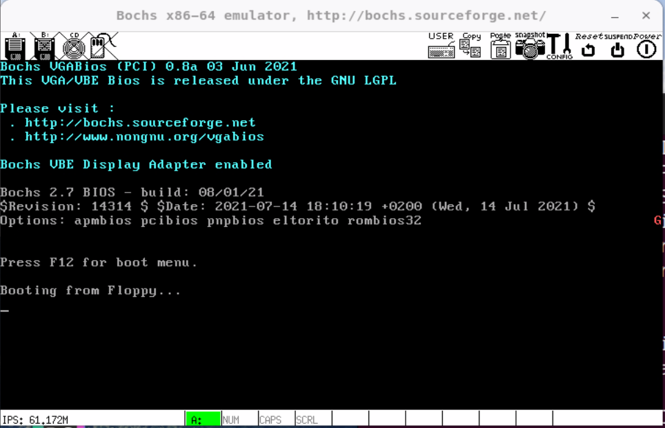
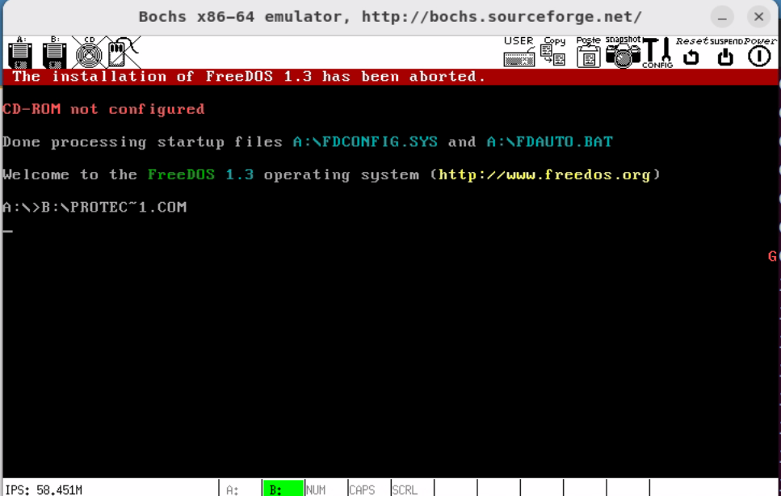
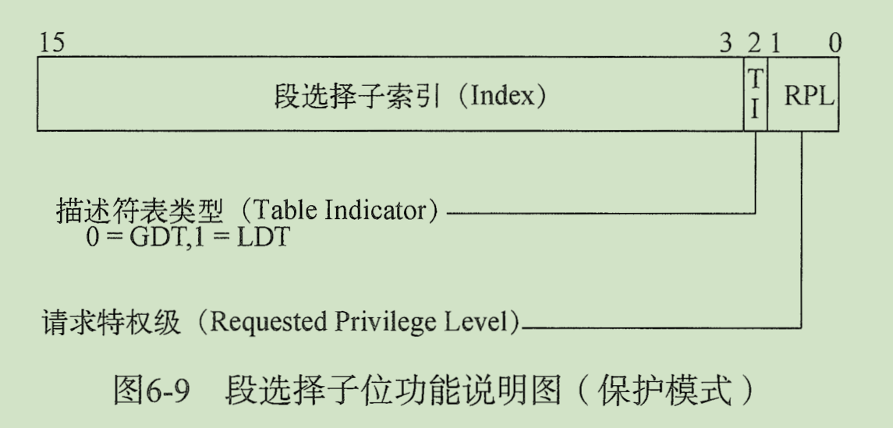
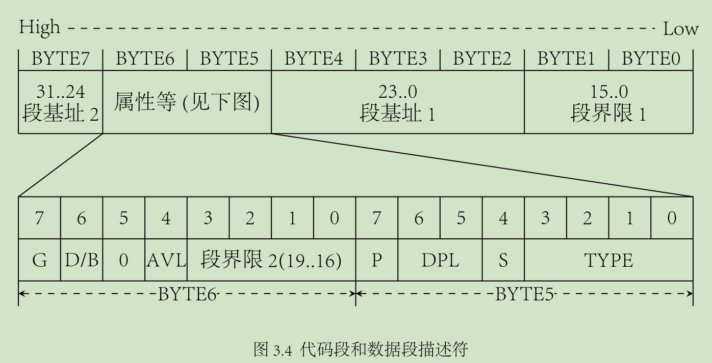

# 保护模式入门


[toc]


## 1. 从一段汇编开始

在深入保护模式前，先看一段代码(`OrangeOS/Protect-Mode/a/protect_mode_test_a.asm`) :

```assembly
; ==========================================
; chat03 保护模式入门
; protect_mode_test_a.asm
; 编译方法 nasm protect_mode_test_a.asm -o protect_mode_test_a.bin
; ==========================================


%include "protect_mode.inc"						; 常量、宏等说明


org			07c00h								; org 是 Origin 的缩写，伪指令，表示程序的起始地址
; 不是该程序在内存中的地址，而是当前程序使用的基地址

		jmp			LABEL_BEGIN


[SECTION	.gdt]
; GDT 声明代码段
;									段基址,			   段界限,			属性
LABEL_GDT:			Descriptor			0,				   0,			   0	; 空描述符
LABEL_DESC_CODE32:	Descriptor			0,	SegCode32Len - 1,	DA_C + DA_32	; 非一致性代码段
LABEL_DESC_VIDEO:	Descriptor	  0B8000h,			  0ffffh,		  DA_DRW	; 显存首地址
;
; GDT 结束


GdtLen			equ			$ - LABEL_GDT			; GDT 长度
GdtPtr			dw			GdtLen - 1				; GDT 界限
				dd			0						; GDT 基地址
				
				
; GDT 选择子
SelectorCode32			equ			LABEL_DESC_CODE32 - LABEL_GDT
SelectorVideo			equ			LABEL_DESC_VIDEO - LABEL_GDT

; END of [SECTION .gdt]


[SECTION	.s16]
[BITS	16]			; BITS 指令指定 NASM 是否应生成设计为在 16 位模式、32 位模式或 64 位模式下运行的处理器上运行的代码
; 此段还在实模式，因此是 16 位
;
LABEL_BEGIN:
		; 初始化段寄存器
		mov			ax,		cs
		mov			ds,		ax
		mov			es,		ax
		mov			ss,		ax
		mov			sp,		0100h
		
		; 初始化 32 位代码段描述符
		xor			eax,	eax
		mov			ax,		cs
		shl			eax,	4
		add			eax,	LABEL_SEG_CODE32
		mov			word	[LABEL_DESC_CODE32 + 2],	ax
		shr			eax,	16
		mov			byte	[LABEL_DESC_CODE32 + 4], 	al
		mov			byte	[LABEL_DESC_CODE32 + 7],	ah
		
		; 为加载 GDTR 做准备
		xor			eax,	eax
		mov			ax,		ds
		shl			eax,	4
		add			eax,	LABEL_GDT			; gdt 基地址赋 -> eax
		mov			dword	[GdtPtr + 2],	eax	; eax gdt 基地址 -> [Gdt + 2]
		
		; 加载 GDTR
		lgdt		[GdtPtr]
		
		; 关中断
		cli
		
		; 打开地址线 A20
		in			al,		92h
		or			al,		00000010b
		out			92h,	al
		
		; 准备切换到保护模式
		mov			eax,	cr0
		or			eax,	1
		mov			cr0,	eax
		
		; 真正进入保护模式
		jmp			dword	SelectorCode32:0		; 将 SelectorCode32 装入 cs，并且跳转到 SelectorCode32:0 处

; END of [SECTION .s16]


[SECTION	.s32]			; 32 位代码段，由实模式跳入
[BITS	32]
; 此处进入保护模式，为 32 位
;
LABEL_SEG_CODE32:
		mov			ax,		SelectorVideo
		mov			gs,		ax				; gs 段选择子寄存器
		
		mov			edi,	(80 * 11 + 79) * 2		; 屏幕第 11 行，第 79 列
		mov			ah,		0Ch						; 0000: 黑底，1100: 红字
		mov			al,		'G'
		mov			[gs:edi],	ax

		; 到此停止
		jmp			$
		
SegCode32Len		equ		$ - LABEL_SEG_CODE32
; END of [SECTION .s32]
```


上述代码引用了 protect_mode.inc 文件，该文件定义了一些 宏，相当于常量和公共函数 (`OrangeOS/Protect-Mode/a/protect_mode.inc`)：

```assembly
; 描述符宏，需要3个参数
; Usage: Descriptor Base, Limit, Attr
; 		Base:		dd (段基址)
;		Limit:		dd (段界限，低 20 位有效)                  
;		Attr:		dw (属性，高字节序，低 4 位始终为 0)
%macro	Descriptor	3
		dw			%2 & 0FFFFh										; 段界限1
		dw			%1 & 0FFFFh										; 段基址1
		db			(%1 >> 16) & 0FFh								; 段基址2
		dw			((%2 >> 8) & 0F00h) | (%3 & 0F0FFh)				; 属性1 + 段界限2 + 属性2
		db			(%1 >> 24) & 0FFh								; 段基址3
%endmacro 	； 共 8 字节

; 汇编 宏：宏是一系列指令，由名称分配，可以在程序中的任何位置使用，类似一个函数。NASM 的宏格式如下：
;
; %macro macro_name  number_of_params
; 	<macro body>
; %endmacro
;
; 	- 其中，number_of_params指定数字参数， macro_name指定宏的名称
;	- 在 marco body 中，想要引用参数，可以使用 %，例如第一个参数 %1, ...
;
; 宏的使用很简单: macro_name param1, param2, ...


; 描述符类型
DA_32			EQU		4000h		; 32 位段

; DPL 位										   **	
DA_DPL0			EQU		00h			; DPL = 0(0000 0000)
DA_DPL1			EQU		20h			; DPL = 1(0010 0000)
DA_DPL2			EQU		40h			; DPL = 2(0100 0000)
DA_DPL3			EQU		60h			; DPL = 3(0110 0000)


; 存储段描述符类型
; TYPE位*							   P  S ****
DA_DR			EQU		90h			; (1001 0000) 存的是只读数据段类型值
DA_DRW			EQU		92h			; (1001 0010) 存的是可读写数据段属性值
DA_DRWA			EQU		93h			; (1001 0011) 存的是已访问可读写数据段类型值
DA_C			EQU		98h			; (1001 1000) 存的是只执行代码段属性值
DA_CR			EQU		9Ah			; (1001 1010) 存的是可执行可读代码段属性值
DA_CCO			EQU		9Ch			; (1001 1100) 存的是只执行一致代码段属性值
DA_CCOR			EQU		9Eh			; (1001 1110) 存的是可执行可读一致代码段属性值


; 系统段描述符类型
DA_LDT			EQU		82h			; (1000 0010) 局部描述符表段类型值
DA_TaskGate		EQU		85h			; (1000 0101) 任务门类型值
DA_386TSS		EQU		89h			; (1000 1001) 可用 386 任务状态段类型值
DA_386CGate		EQU		8Ch			; (1000 1100) 386 调用门类型值
DA_386IGate		EQU		8Eh			; (1000 1110) 386 中断门类型值
DA_386TGate		EQU		8Fh			; (1000 1111) 386 陷阱门类型值

```


上述代码如何运行呢？可以使用 bochs 虚拟机，通过 软盘 floopy 启动，并将 bin 文件写入第一个引导扇区。

1. 生成软盘镜像文件

```shell
❯ bximage                                                                                                                                ─╯
========================================================================
                                bximage
  Disk Image Creation / Conversion / Resize and Commit Tool for Bochs
         $Id: bximage.cc 14091 2021-01-30 17:37:42Z sshwarts $
========================================================================

1. Create new floppy or hard disk image
2. Convert hard disk image to other format (mode)
3. Resize hard disk image
4. Commit 'undoable' redolog to base image
5. Disk image info

0. Quit

Please choose one [0] 1

Create image

Do you want to create a floppy disk image or a hard disk image?
Please type hd or fd. [hd] fd

Choose the size of floppy disk image to create.
Please type 160k, 180k, 320k, 360k, 720k, 1.2M, 1.44M, 1.68M, 1.72M, or 2.88M.
 [1.44M] 

What should be the name of the image?
[a.img] gshos.img

Creating floppy image 'gshos.img' with 2880 sectors

The following line should appear in your bochsrc:
  floppya: image="gshos.img", status=inserted
```

2. 编译汇编文件

```shell
❯ nasm protect_mode_test_a.asm -o protect_mode_test_a.bin
```

3. 将 bin 文件写入软盘镜像的第一个引导扇区

```shel
❯ dd if=protect_mode_test_a.bin of=./gshos.img bs=512 count=1 conv=notrunc
```

4. 修改 bochs 虚拟机配置(bochsrc)，主要是软盘引导

```shell
floppya: type=1_44, 1_44="gshos.img", status=inserted, write_protected=0
```

5. 启动 bochs 虚拟机

```shell
❯ bochs -f ./bochsrc
```



可以看到，屏幕中部右侧，出现了一个红色的字母 'G'。


## 2 保护模式的运行环境

上一小节中直接将编译好的 bin 文件写入到镜像文件的第一个引导扇区中，但这样做有一个弊端，就是引导扇区空间有限，只有 512 个字节，如果我们的程序越来越大超过了 512 个字节就无法执行了。

有两个解决办法：

1. 写一个引导扇区，可以读取我们的程序并运行它，就好像这程序是个操作系统内核似的。也就是区分 Boot 和 Load 两个功能，Boot程序简短放入引导分区，通过加载并跳转 Loader 程序，来执行后续操作
2. 借助别的东西，比如 DOS，我们把程序编译成 COM 文件，然后让 DOS 来执行它

第一种办法是操作系统普遍用的办法，后面我们会逐渐实现一个 Boot 和 Loader 的功能，这里我们先使用第二种办法来模拟。


使用 Dos 的步骤：

1. 到[freedos官方网站](http://www.freedos.org/)下载一个 FreeDos，解压后将其中的 `FD13BOOT.img` 复制到我们的工作目录中，改名为 `freedos.img`

2. 用 `bximage` 生成一个软盘映像，起名为 `gshos.img`， **注意， 此时要格式化才能使用，否则在第6步会出现问题，"mount 您必须指定文件系统的类型 "**

3. 修改 `bochsrc`，确保有以下三行：

    ```shell
    floppya: 1_44=freedos.img, status=inserted
    floppyb: 1_44=gshos.img, status=inserted
    boot: a
    ```

4. 启动 bochs，待 freedos 启动完毕后格式化 B: 盘，即使用命令:  `A:> format b:`

5. 将 `protect_mode_test_a.asm` 中第 11 行 `07c00` 改为 `0100h` ，并重新编译
    ```shell
    ❯ nasm protect_mode_test_a.asm -o protect_mode_test_a.com
    ```

6. 将 `protect_mode_test_a.com` 复制到软盘 `gshos.img` 上

    ```shell
    # 将 gshos.img 镜像文件置空
    ❯ dd if=/dev/null of=gshos.img bs=512 count=1 conv=notrunc
    
    # 使用 losetup 命令，将 gshos.img 作为 loop0 device 使用
    ❯ sudo losetup /dev/loop0 gshos.img
    
    # 格式化绑定的 loop0 device
    ❯ sudo mkfs.vfat /dev/loop0
    
    # 检查文件系统
    ❯ sudo fsck.vfat /dev/loop0
    
    # 接触绑定 loop0 device
    ❯ sudo losetup -d /dev/loop0
    
    # 此时，gshos.img 已经格式化完成，可以作为一个软盘镜像使用。进行挂载
    ❯ sudo mount -o loop -t vfat gshos.img /mnt/learn
    
    # 将 protect_mode_test_a.com 复制到软盘 gshos.img 上
    ❯ sudo cp protect_mode_test_a.com /mnt/learn
    
    # 解挂载
    ❯ sudo umount /mnt/learn
    ```

7. 到 freedos 下执行命令

    ```shell
    b:\protect_mode_test_a.com
    ```

    


## 3. GDT (Global Descriptor Table)

在 IA32 下，CPU 有两种工作模式：

- **实模式**
- **保护模式**


CPU 刚上电时，处于 实模式，通过某种机制，才可以进入保护模式。


### 实模式

Intel8086是 16 位的 CPU，它有着 **16 位的寄存器(Register)**、**16 位的数据总线(Data Bus)**、以及 **20 位的地址总线(Address Bus)** 和 **1MB 的寻址能力**。


物理地址的计算公式（其中，段值和偏移都是 16 位的）：

```shell
物理地址(Physical Address) = 段值(Segment) × 16 + 偏移(Offset)
```


### 保护模式

从 80386 开始，Intel 家族的 CPU 进入 32 位时代。**80386 有 32 位地址线**，所以寻址空间可以达到 4GB。


保护模式下的地址仍然使用 `段:偏移` 的形式。在实模式下，段值可以看做是地址的一部分。而在保护模式下，段值变成了指向 GDT 或 LDT 中一个表项的段选择子了,表项中才详细定义了段的起始地址、界限、属性等内容。

**GDT 中的表项也有一个专门的名字，叫做描述符(Descriptor)**


描述符表的结构及内存管理可以翻阅 `操作系统/实模式与保护模式` 的 保护模式下的内存管理 章节。

下面以上面的示例代码进行讲解。

该示例代码中 GDT 中共有 3 个描述符(line 20-22)，分别称它们为 DESC_DUMMY(GDT 的第一个描述符为空描述符)、DESC_CODE32(代码段) 和 DESC_VIDEO(显存段，段基
址是 `0B8000h`)，

```assembly
; GDT 声明代码段
;									段基址,			   段界限,			属性
LABEL_GDT:			Descriptor			0,				   0,			   0	; 空描述符
LABEL_DESC_CODE32:	Descriptor			0,	SegCode32Len - 1,	DA_C + DA_32	; 非一致性代码段
LABEL_DESC_VIDEO:	Descriptor	  0B8000h,			  0ffffh,		  DA_DRW	; 显存首地址
```

- <u>这里有一个后面需要处理的地方，就是 LABEL_DESC_CODE32 描述符中，参数1也就是段基址没有传入，需要后面确定，并且重新赋值</u>

GDT中的每一个描述符定义一个段，那么cs、ds等段寄存器是如何和这些段对应起来的呢？就是**段选择子**。

段选择子的结构如下：



总体的保护模式寻址思路，当要对某个地址寻址时，例如：`cs:offset` ：

- cs、ds、es等段寄存器的低 16 位保存了段选择子，段选择子指明了要访问的段地址在 GDT 表中的位置
- 通过 GDTR(GDT表的首地址) 找到在 GDT 表中的位置
- 找到 GDT 表中的段描述符，该描述符明确了段的地址，访问权限属性等状态
- 找到线性地址空间中的段基址后，通过 offset，就可以确定在线性地址空间的位置 段基址:offset


示例代码中一共定义了两个段选择子(line 32-34):

```assembly
; GDT 选择子
SelectorCode32			equ			LABEL_DESC_CODE32 - LABEL_GDT
SelectorVideo			equ			LABEL_DESC_VIDEO - LABEL_GDT
```

- 定义的两个选择子值，就是在 GDT 表中的偏移地址
- 其中，RPL 和 TI 都为 0，表示了特权级0，描述符类型为 GDT


在真正使用选择子时(line 96-102)：

```assembly
		mov			ax,		SelectorVideo
		mov			gs,		ax				; gs 段选择子寄存器
		
		mov			edi,	(80 * 11 + 79) * 2		; 屏幕第 11 行，第 79 列
		mov			ah,		0Ch						; 0000: 黑底，1100: 红字
		mov			al,		'G'
		mov			[gs:edi],	ax
```

- 将选择子 SelectorVideo 放入 gs 段寄存器
- 通过 `mov  [gs:edi], ax` 将 ax 的内容写入到段选择子 gs 指向的线性基地址，edi 作为偏移的位置


**实模式到保护模式**

到 [SECTION .s16] 这段中，先看一下初始化 32 位代码段描述符的这一段(line 52-60)：

```assembly
		; 初始化 32 位代码段描述符
		xor			eax,	eax
		mov			ax,		cs
		shl			eax,	4
		add			eax,	LABEL_SEG_CODE32
		mov			word	[LABEL_DESC_CODE32 + 2],	ax
		shr			eax,	16
		mov			byte	[LABEL_DESC_CODE32 + 4], 	al
		mov			byte	[LABEL_DESC_CODE32 + 7],	ah
```

- 首先 eax 全置 0 (xor)
- 将 cs (代码段寄存器) 放入 ax，即 eax 的低 16 位
- eax 左移 4 位，并加上 LABEL_SEG_CODE32 (保护模式的代码段偏移地址)
    - 此时还在实模式下，计算还是通过 `段地址 * 16 + offset` 
    - 计算的结果就是 保护模式代码段地址的首地址(线性地址)
- 计算出保护模式代码段地址的首地址，然后写入到 LABEL_DESC_CODE32 GDT 描述符中，因为之前没有写入，此时分别将 2、4、7 字节处。


DESC_CODE32 描述符的初始化全部完成。接着就是装载 GDTR 寄存器（用于寻找 GDT 表）

<u>GDT 全局描述符表的 32 位基地址</u>和 <u>16 位表界限</u>。以下代码用户初始化变量 GdtPtr ，用于填充 GDTR(line 27-29)

```assembly
GdtLen			equ			$ - LABEL_GDT			; GDT 长度
GdtPtr			dw			GdtLen - 1				; GDT 界限
				dd			0						; GDT 基地址
```

- GDT 表的界限，就是 GDT 表项数目 - 1
-  这里有一个后面需要处理的地方，GDT 的基地址设置为0，后面需要重新赋值

示例代码还需要重新对 GDT 基地址进行赋值(line 62-67):

```assembly
		; 为加载 GDTR 做准备
		xor			eax,	eax
		mov			ax,		ds
		shl			eax,	4
		add			eax,	LABEL_GDT			; gdt 基地址赋 -> eax
		mov			dword	[GdtPtr + 2],	eax	; eax gdt 基地址 -> [Gdt + 2]
```

- 通过实模式下的地址计算办法，将 ds 左移 4 位，就是段基地址了
- 将 基地址 赋值给 GdtPtr 的 第三个字节处，也就是 基地址位置


把 GDT 的物理地址填充到了 GdtPtr 这个 6 字节的数据结构中(line 69-70)

```assembly
		; 加载 GDTR
		lgdt		[GdtPtr]
```


接下来就是打开 A20 地址线。

【问】什么是 A20 呢? 

【答】

- 8086 中，“段: 偏移”这样的模式能表示的最大内存是FFFF:FFFF，即10FFEFh。可是 8086 只有 20 位的地址总线，只能寻址到 1MB，那么如果试
    图访问超过 1MB 的地址时会怎样呢？实际上系统并不会发生异常，而是回卷(wrap)回去，也就是重新从地址零开始寻址。
- 可是到了 80286 时，真的可以访问到 1MB 以上的内存了，如果遇到同样的情况，系统不能回卷寻址，这就造成了向上不兼容。为了保证百分之百兼容，IBM 想出一个办法，使用 8042 键盘控制器来控制第 20 个(从零开始数)地址位，这就是 A20 地址线，如果不被打开，第 20 个地址位将会总是零

- 为了访问所有的内存，我们需要把 A20 打开，开机时它默认是关闭的。

A20 有几种开启的方法：

1. **Using the BIOS functions to enable the A20 Gate**
    - INT 15 2400、2401、2402 分别用于禁用、启用、返回 A20 Gate 的状态
2. **Using System Port 0x92**
    - 方法比较危险，因为它可能会与某些硬件设备发生冲突，迫使系统停止运行。
    - **Port 0x92 Bits**
        - **Bit 0** - Setting to 1 causes a fast reset 
        - **Bit 1** - 0: disable A20, 1: enable A20
        - **Bit 2** - Manufacturer defined
        - **Bit 3** - power on password bytes. 0: accessible, 1: inaccessible
        - **Bits 4-5** - Manufacturer defined
        - **Bits 6-7** - 00: HDD activity LED off, 01 or any value is "on"
3. **Using  the keyboard to enable A20**
    - 这是启用 A20 Gate 的最常见方法。键盘微控制器提供了禁用和启用 A20 的功能。在启用 A20 之前，我们<u>需要禁用中断以防止内核混乱</u>。
    - 端口 0x64 用于发送命令字节：
        - 0xDD Enable A20 Address Line
        - 0xDF Disable A20 Address Line 

为了打开 A20  地址线，采用了如下方法(line 75-78)

```assembly
		; 打开地址线 A20
		in			al,		92h
		or			al,		00000010b
		out			92h,	al
```


接下来就是修改 CR0 控制器，寄存器 cr0 第 0 位是 PE 位：

- 此位为 0 时，CPU 运行于实模式
- 此位为 1 时，CPU 运行于保护模式

```assembly
		; 准备切换到保护模式
		mov			eax,	cr0
		or			eax,	1
		mov			cr0,	eax
```


在 `mov  cr0, eax` 这句指令结束后，已经进入到保护模式下了。但是，此时cs的值仍然是实模式下的值，我们需要把代码段的选择子装入cs，这就是关键的 jmp 指令(line 89-90)：

```assembly
		; 真正进入保护模式
		jmp			dword	SelectorCode32:0		; 将 SelectorCode32 装入 cs，并且跳转到 SelectorCode32:0 处
```

- 根据寻址机制我们知道，这个跳转的目标将是描述符 DESC_CODE32 对应的段的首地址，即标号LABEL_SEG_CODE32处

- 因为此时已经进入到了保护模式，目的地址是 32 位的，而 SelectorCode32 选择子又是 16 位的，需要加上 dword 关键字


## 4. 总结

至此，已成功进入保护模式，下面总结一下进入保护模式的主要步骤：
1. 准备 GDT。
2. 用 lgdt 加载 gdtr。
3. 打开 A20。
4. 置 cr0 的 PE 位。
5. jmp 跳转，进入保护模式。


## 5. 描述符属性

代码段与数据段的描述符的结构如下：



描述符各属性如下：

- **P 位** 存在（Present）位。P=1 表示段在内存中存在，P=0 表示段在内存中不存在。
-  **DPL** 描述符特权级（Descriptor Privilege Level）。特权级可以是 0、1、2 或者 3。数字越小特权级越大。
- **S 位** 指明描述符是数据段/代码段描述符（S=1），还是系统段/门描述符（S=0）。
- **TYPE** 描述符类型，详情如下：

| TYPE 值 |    数据段和代码段描述符     | 系统段和门描述符 |
| :-----: | :-------------------------: | :--------------: |
|    0    |            只读             |    < 未定义 >    |
|    1    |        只读，已访问         |   可用 286TSS    |
|    2    |           读 / 写           |       LDT        |
|    3    |       读 / 写，已访问       |   忙的 286TSS    |
|    4    |       只读，向下扩展        |    286 调用门    |
|    5    |   只读，向下扩展，已访问    |      任务门      |
|    6    |      读 / 写，向下扩展      |    286 中断门    |
|    7    |  读 / 写，向下扩展，已访问  |    286 陷阱门    |
|    8    |           只执行            |    < 未定义 >    |
|    9    |       只执行、已访问        |   可用 386TSS    |
|    A    |          执行 / 读          |    < 未定义 >    |
|    B    |      执行 / 读、已访问      |   忙的 386TSS    |
|    C    |      只执行、一致码段       |    386 调用门    |
|    D    |  只执行、一致码段、已访问   |    < 未定义 >    |
|    E    |     执行 / 读、一致码段     |    386 中断门    |
|    F    | 执行 / 读、一致码段、已访问 |    386 陷阱门    |


- **G 位** 段界限粒度（Granularity）位。G=0 时段界限粒度为字节，G=1 时段界限粒度为 4KB。
- **D/B 位** 这一位比较复杂，分三种情况。
    - 在可执行代码段描述符中，这一位叫做 D 位。D=1 时，在默认情况下指令使用 32 位地址及 32 位或 8 位操作数。D=0 时，在默认情况下使用 16 位地址及 16 位或 8 位操作数。
    - 在向下扩展数据段的描述符中，这一位叫做 B 位。B=1 时，段的上部界限为 4GB；B=0 时，段的上部界限为 64KB。
    - 在描述堆栈段（由ss寄存器指向的段）的描述符中，这一位叫做 B 位。B=1 时，隐式的堆栈访问指令（如push、pop和call）使用 32 位堆栈指针寄存器esp；D=0 时，隐式的堆栈访问指令（如push、pop和call）使用 16 位堆栈指针寄存器sp。
-  **AVL 位** 保留位，可以被系统软件使用。


那么问题来了，什么是一致性呢?

- “一致”的意思是这样的，当转移的目标是一个特权级更高的一致代码段，当前的特权级会被延续下去，而向特权级更高的非一致代码段的转移会引起常规保护错误）（general-protection exception，#GP），除非使用调用门或者任务门。

- 如果系统代码不访问受保护的资源和某些类型的异常处理（比如，除法错误或溢出错误），它可以被放在一致代码段中。为避免低特权级的程序访问而被保护起来的系统代码则应放到非一致代码段中。
- 要注意的是，如果目标代码的特权级低的话，无论它是不是一致代码段，都不能通过call或者jmp转移进去，尝试这样的转移将会导致常规保护错误。
- 所有的数据段都是非一致的，这意味着不可能被低特权级的代码访问到。然而，与代码段不同的是，数据段可以被更高特权级的代码访问到，而不需要使用特定的门。

总之，通过call和jmp的转移遵从下表所示的规则：

|                      | 特权级<br />低 → 高 | 特权级<br />高 → 低 | 相同特权级之间 |                  适用于何种代码                  |
| :------------------: | :-----------------: | :-----------------: | :------------: | :----------------------------------------------: |
|      一致代码段      |         Yes         |         No          |      Yes       | 不访问受保护的资源和某些类型的异常处理的系统代码 |
|     非一致代码段     |         No          |         No          |      Yes       |   避免低特权级的程序访问而被保护起来的系统代码   |
| 数据段（总是非一致） |         No          |         Yes         |      Yes       |                                                  |


回到代码，现在再来看  (`OrangeOS/Protect-Mode/a/protect_mode.inc`) 宏就好理解了：

```assembly
; 描述符宏，需要3个参数
; Usage: Descriptor Base, Limit, Attr
; 		Base:		dd (段基址)
;		Limit:		dd (段界限，低 20 位有效)                  
;		Attr:		dw (属性，高字节序，低 4 位始终为 0)
%macro	Descriptor	3
		dw			%2 & 0FFFFh										; 段界限1
		dw			%1 & 0FFFFh										; 段基址1
		db			(%1 >> 16) & 0FFh								; 段基址2
		dw			((%2 >> 8) & 0F00h) | (%3 & 0F0FFh)				; 属性1 + 段界限2 + 属性2
		db			(%1 >> 24) & 0FFh								; 段基址3
%endmacro 	； 共 8 字节
```

- 需要传入三个参数，分别是 段基址(32位)、段界限(16位)、属性
- 根据 代码段与数据段的描述符位图，可知(从低到高)：
    - <u>0-1 前两个字节，存放段界限1</u>，第二个参数段界限的低16位(0-15)
    - <u>2-3 字节，存放段基址1</u>，第一个参数段基址的低16位(0-15)
    - <u>4 字节，存放段基址2</u>，第一个参数段基址的 16-23 位
    - <u>5-6 字节，存放的是段属性和段界限</u>，用 第二个参数段界限的高八位 或 第三个参数属性
    - <u>7 字节，存放的是段基址3</u>，第一个参数段基址的24-31 位
