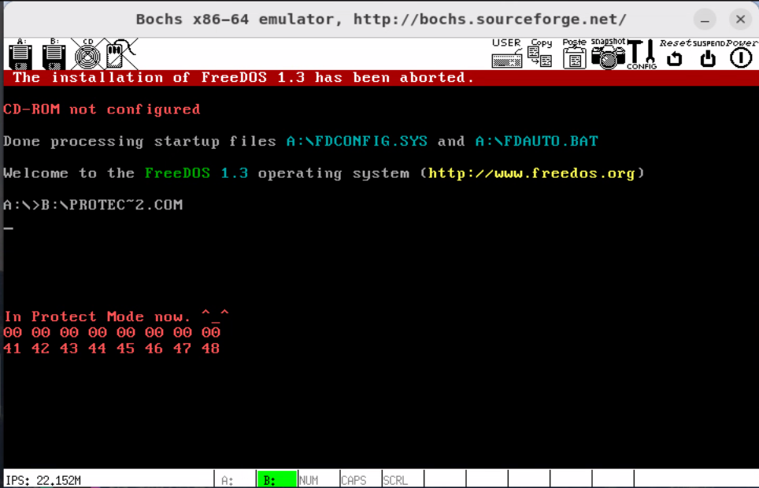

# 保护模式进阶

[toc]


## 完整代码及注释


在保护模式下寻址空间可以达到 4GB，实模式下 1MB 的寻址能力，为了测试保护模式可以访问更大的内存，代码如下(`OrangeOS/Protect-Mode/b/protect_mode_test_b.asm`)：

```assembly
; ==========================================
; chat03 保护模式进阶
; protect_mode_test_b.asm
; 编译方法 nasm protect_mode_test_b.asm -o protect_mode_test_b.bin
; ==========================================


%include "protect_mode.inc"						; 常量、宏等说明


org			0100h								; org 是 Origin 的缩写，伪指令，表示程序的起始地址
; 不是该程序在内存中的地址，而是当前程序使用的基地址

		jmp			LABEL_BEGIN


[SECTION	.gdt]
; GDT 声明代码段, GDT 表项
;									段基址,			   段界限,			属性
LABEL_GDT:			Descriptor			0,				   0,			  	   0	; 空描述符
LABEL_DESC_NORMAL:	Descriptor			0,			  0ffffh,		      DA_DRW	; Normal 描述符
LABEL_DESC_CODE32:	Descriptor			0,	SegCode32Len - 1,		DA_C + DA_32	; 非一致性代码段，32位
LABEL_DESC_CODE16:	Descriptor			0,			  0ffffh,				DA_C	; 非一致性代码段，16位
LABEL_DESC_DATA:	Descriptor			0,		 DataLen - 1,		  	  DA_DRW	; Data 数据段
LABEL_DESC_STACK:	Descriptor			0,		  TopOfStack,	 DA_DRWA + DA_32	; Stack 栈段，32 位
LABEL_DESC_TEST:	Descriptor	 0500000h,			  0ffffh,			  DA_DRW	; 测试段
LABEL_DESC_VIDEO:	Descriptor	  0B8000h,			  0ffffh,		  	  DA_DRW	; 显存首地址
;
; GDT 结束

; GDT 表的长度，界限，基地址
GdtLen			equ			$ - LABEL_GDT			; GDT 长度
GdtPtr			dw			GdtLen - 1				; GDT 界限
				dd			0						; GDT 基地址
				
				
; GDT 选择子的偏移地址
SelectorNormal			equ			LABEL_DESC_NORMAL	- LABEL_GDT
SelectorCode32			equ			LABEL_DESC_CODE32 	- LABEL_GDT
SelectorCode16			equ			LABEL_DESC_CODE16	- LABEL_GDT
SelectorData			equ			LABEL_DESC_DATA 	- LABEL_GDT
SelectorStack			equ			LABEL_DESC_STACK 	- LABEL_GDT
SelectorTest			equ			LABEL_DESC_TEST 	- LABEL_GDT
SelectorVideo			equ			LABEL_DESC_VIDEO 	- LABEL_GDT

; END of [SECTION .gdt]


[SECTION	.data1]					; 数据段
ALIGN	32					; align 地址对齐的伪指令，用来指定符号的对齐方式。align的作用范围只限于紧跟它的那条指令或者数据，而接下来的指令或者数据的地址由上一条指令的地址和其长度决定。
[BITS	32]
LABEL_DATA:

SPValueInRealMode			dw		0
; 字符串
PMMessage:					db		"In Protect Mode now. ^_^", 0
OffsetPMMessage				equ		PMMessage - $$						; 相对于 LABEL_DATA 的偏移
StrTest:					db		"ABCDEFGHIJKLMNOPQRSTUVWXYZ", 0
OffsetStrTest				equ		StrTest - $$						; 相对于 LABEL_DATA 的偏移
DataLen						equ		$ - LABEL_DATA

; END of [SECTION	.data1]	


[SECTION	.gs]				; 全局堆栈段
ALIGN	32
[BITS	32]
LABEL_STACK:
		times		512		db		0					; 填充 512 字节

TopOfStack			equ		$ - LABEL_STACK - 1			; LABEL_DESC_STACK 描述的界限

; END of [SECTION	.gs]	


[SECTION	.s16]
[BITS	16]			; BITS 指令指定 NASM 是否应生成设计为在 16 位模式、32 位模式或 64 位模式下运行的处理器上运行的代码
; 此段还在实模式，因此是 16 位
;
LABEL_BEGIN:
		; 初始化段寄存器
		mov			ax,		cs
		mov			ds,		ax
		mov			es,		ax
		mov			ss,		ax
		mov			sp,		0100h
		
		; 为回到实模式的这个跳转指令指定正确的段地址
		; jmp 指令的结构为： 低 -> 字节1(0EAh) -> 字节2-字节3(Offset) -> 字节4-字节5(Segment)
		; 因此在此时还处于实模式时，修改保护模式跳回实模式的段地址，为当前的 cs\
		; [LABEL_GO_BACK_TO_REAL + 3] 就是 jmp 结构中的 segment 部分
		mov			[LABEL_GO_BACK_TO_REAL+3], 		ax
		
		; 为回到实模式，具有正确的栈顶指针，保存栈顶指针的地址
		mov			[SPValueInRealMode],				sp
		
		
		; 初始化 32 位代码段描述符 （补全 GDT 描述符的段基址部分）
		xor			eax,	eax
		mov			ax,		cs
		shl			eax,	4
		add			eax,	LABEL_SEG_CODE32
		mov			word	[LABEL_DESC_CODE32 + 2],	ax
		shr			eax,	16
		mov			byte	[LABEL_DESC_CODE32 + 4], 	al
		mov			byte	[LABEL_DESC_CODE32 + 7],	ah
		
		; 初始化 32 位数据段描述符 （补全 GDT 描述符的段基址部分）
		xor			eax,	eax
		mov			ax,		ds
		shl			eax,	4
		add			eax,	LABEL_DATA
		mov			word	[LABEL_DESC_DATA + 2],	ax
		shr			eax,	16
		mov			byte	[LABEL_DESC_DATA + 4], 	al
		mov			byte	[LABEL_DESC_DATA + 7],	ah
		
	
		; 初始化 32 位堆栈段描述符 （补全 GDT 描述符的段基址部分）
		xor			eax,	eax
		mov			ax,		ds
		shl			eax,	4
		add			eax,	LABEL_STACK
		mov			word	[LABEL_DESC_STACK + 2],	ax
		shr			eax,	16
		mov			byte	[LABEL_DESC_STACK + 4], 	al
		mov			byte	[LABEL_DESC_STACK + 7],	ah
		
		; 初始化 16 位代码段描述符 （补全 GDT 描述符的段基址部分）
		xor			eax,	eax
		mov			ax,		cs
		shl			eax,	4
		add			eax,	LABEL_SEG_CODE16
		mov			word	[LABEL_DESC_CODE16 + 2],	ax
		shr			eax,	16
		mov			byte	[LABEL_DESC_CODE16 + 4], 	al
		mov			byte	[LABEL_DESC_CODE16 + 7],	ah
		
		
		; 为加载 GDTR 做准备
		xor			eax,	eax
		mov			ax,		ds
		shl			eax,	4
		add			eax,	LABEL_GDT			; gdt 基地址赋 -> eax
		mov			dword	[GdtPtr + 2],	eax	; eax gdt 基地址 -> [Gdt + 2]
		
		; 加载 GDTR
		lgdt		[GdtPtr]
		
		; 关中断
		cli
		
		; 打开地址线 A20
		in			al,		92h
		or			al,		00000010b
		out			92h,	al
		
		; 准备切换到保护模式
		mov			eax,	cr0
		or			eax,	1
		mov			cr0,	eax
		
		; 真正进入保护模式
		jmp			dword	SelectorCode32:0		; 将 SelectorCode32 装入 cs，并且跳转到 SelectorCode32:0 处


LABEL_REAL_ENTRY:				; 由保护模式跳回实模式的入口
		
		mov			ax,			cs
		mov			ds,			ax
		mov			es,			ax
		mov			ss,			ax				; 恢复寄存器内容
		
		mov			sp,			[SPValueInRealMode]			; 栈顶地址
		
		in			al, 		92h	
		and			al, 		11111101b	
		out			92h, 		al				; 关闭 A20 地址线
		
		sti										; 开中断
		
		mov 		ax, 		4c00h
		int			21h							; ah=4CH — 带返回码方式的终止进程 （int 21h）


; END of [SECTION .s16]


[SECTION	.s32]			; 32 位代码段，由实模式跳入
[BITS	32]
; 此处进入保护模式，为 32 位
;
LABEL_SEG_CODE32:

		; 初始化段寄存器
		mov			ax,		SelectorData
		mov			ds,		ax					; 初始化数据段选择子
		mov			ax,		SelectorTest
		mov			es,		ax					; 初始化测试段选择子
		mov			ax,		SelectorVideo
		mov			gs,		ax					; 初始化video显存段选择子
		mov			ax,		SelectorStack
		mov			ss,		ax					; 初始化堆栈段段选择子

		mov			esp,	TopOfStack			; 栈顶地址
		
		
		; 下面显示一个字符串
		mov			ah,		0Ch						; 0000: 黑底，1100: 红字
		xor			esi,	esi
		xor			edi,	edi						; edi、esi 置零
		mov			esi,	OffsetPMMessage			; 源数据偏移赋给 esi
		mov			edi,	(80 * 15 + 0) * 2		; 目的数据偏移。屏幕第 10 行 , 第 0 列。
		; 此处设置 esi  ，为了后面调用 lodsb，edi 为了屏幕显示
		
		cld					; CLD用来操作方向标志位DF（Direction Flag）。CLD使DF复位，即DF=0
		
		
.1:					; 读取数据，并显示
		lodsb				; 汇编指令LODSB,该命令的加载方向与DF标志位有关,因此在使用此命令时需用CLD指令清DF标志位
        ;
        ; 串操作指令LODSB/LODSW/LODSD是块装入指令,
        ;     - 具体操作是把 DS:(R|E)SI 指定的内存地址中的数据读取到 AL/AX/EAX/RAX 累加寄存器中.
        ;     - 当数据载入到 AL/AX/EAX/RAX 寄存器后, (R|E)SI 寄存器将会根据 R|EFLAGS 标志寄存器的 DF 标志位,来自动增加/减少载入的数据长度
        ;         - 当DF=0时，变址寄存器SI(和DI)增加1/2/4/8
        ;         - 当DF=1时，变址寄存器SI(和DI)减少1/2/4/8
		
		test		al,			al				; 将两个操作数进行逻辑与运算，并根据运算结果设置相关的标志位，并不改变操作数1和操作数2的值，判断是否为0
		jz			.2							; 如果 al 为 0，即 zf=1，跳转到 .2 ，表示已经读取到0，读取完成
		mov			[gs:edi],	ax				; 将读取到的数据 ax 写入到 视频段，屏幕显示
		add			edi,		2				; ax 长度两个字节，每次显示两个字节
		jmp			.1
		
		
.2:					; 读取数据，并显示完成
		call		DisplayRetrun
		
		call		TestRead
		call		TestWrite
		call		TestRead
		
		
		; 到此停止
		jmp			SelectorCode16:0
	

; ---------------------------------函数区(32位)---------------------------		
		
; =============================== TestRead
; 测试读内存
TestRead:					; 测试读函数
		xor			esi,		esi
		mov			ecx,		8						; 循环显示 8 次
		
.loop:	
		mov			al,			[es:esi]
		call		DisplayAL
		inc			esi
		
		loop		.loop			; loop 循环指令，如果 cx=0, 则结束，否则循环
		; LOOP: 在实地址模式下使用CX寄存器而不是ECX寄存器。
		; LOOPW：在任何模式下都会使用CX寄存器作为计数器。
		; LOOPD：在任何模式下都会使用ECX寄存器作为计数器。
		call 		DisplayRetrun
		
		ret
		


; END of TestRead ===============
		
; =============================== TestWrite
; 测试写内存
; 在程序的整个执行过程中 edi 始终指向要显示的下一个字符的位置。
; 所以如果程序中除显示字符外还用到 edi，需要事先保存它的值，以免在显示时产生混乱。
TestWrite:
		push			esi
		push			edi
		
		xor				esi,		esi
		xor				edi,		edi
		mov				esi,		OffsetStrTest				; 源测试数据偏移地址
		cld														; 同样清除 df 标志位，后面使用 lodsb
		
.1:
		lodsb													; 从 ds:esi 处读取数据
		test			al,			al							; 是否已经读取到结尾
		jz				.2										; 如果 al=0，即 zf=1，读取到结尾，跳转到 .2
		mov				[es:edi],	al							; 否则，将 al 处的字符放到 es:edi 偏移处, 写入 SelectorTest 段
		inc				edi										; 光标后移
		jmp				.1										; 循环读取，直到结束
		
.2:
		pop				edi
		pop				esi

		ret
		
; END of TestWrite ===============

; =============================== DisplayAL
; DispAL将al中的字节用十六进制数形式显示出来，字的前景色仍然是红色
;
; 显示 AL 中的数字（十六进制）
; 输入参数 :
; 		数字已经存在 AL 中
; 		edi 始终指向要显示的下一个字符的位置
;		ecx 表示循环的次数
; 被改变的寄存器 :
; 		ax, edi
DisplayAL:
		push		ecx
		push		edx
		
		mov			ah,			0Ch						; 0000: 黑底，1100: 红字
		mov			dl,			al
		shr			al,			4						; al 分高4位，低4位，十六进制需要每四位显示一个十六进制数
		mov			ecx,		2						; 高 4 位一次，低 4 位一次，一共循环两次
		; 此时，al 中存放的是 高 4 位，dl 中存放的是完整8位
		
.begin:
		and			al,			01111b					; al 将高 4 位置0，只保留低4位
		cmp			al,			9						; 如果十进制大于9，需要用 ABCDEF 表示 
		ja			.1								; JA  无符号大于则跳转，大于9，跳转到 .1
		add			al,			'0'						; 否则显示 0-9，通过 ascll 码
		jmp			.2
		
.1:		
		sub			al,			0Ah						; 计算超出 9 的偏移
		add			al,			'A'						; 通过 ascll 码计算
		
.2:
		mov			[gs:edi],	ax				; ax 放到 视频段 edi 偏移处
		add			edi,		2				; 光标后移
		
		mov			al,			dl						; 继续显示 al 的低四位
		loop		.begin
		add			edi,		2
		
		pop			edx
		pop			ecx
		
		ret
		
; END of DisplayAL ===============


; =============================== DisplayRetrun
; DispReturn模拟一个回车的显示，实际上是让下一个字符显示在下一行的开头处。
; edi 保存的是下一个显示字符的位置，因此换行就是 edi 指向下一行的开头
DisplayRetrun:
		push		eax
		push		ebx						; 保存 eax,ebx
		mov			eax,		edi			
		mov			bl,			160			
		div			bl						; edi/160(每行列数160？)，计算出当前的行数 eax
		; 商保存在 eax 中，余数保存在 edx 中。

		and			eax,		0FFh		
		inc 		eax						; 换行，到下一行
		
		mov			bl,			160
		mul			bl						; 当前行号数 * 160，行开头位置
		
		mov			edi,		eax			; 置 edi
		pop			ebx
		pop			eax
		
		ret
		
; END of DisplayRetrun ===============
; ---------------------------函数区结束------------------

SegCode32Len		equ		$ - LABEL_SEG_CODE32
; END of [SECTION .s32]


		


[SECTION	.s16code]					; 跳回 实模式
ALIGN	32
[BITS	16]
LABEL_SEG_CODE16:
; 因为在准备结束保护模式回到实模式之前，需要加载一个合适的描述符选择子到有关段寄存器，
; 以使对应段描述符高速缓冲寄存器中含有合适的段界限和属性。
; 而且，我们不能从32位代码段返回实模式，只能从16位代码段中返回。
; 这是因为无法实现从32位代码段返回时cs高速缓冲寄存器中的属性符合实模式的要求(实模式不能改变段属性)
		
		mov			ax,			SelectorNormal
		mov			ds,			ax
		mov			es,			ax
		mov			gs,			ax
		mov			fs,			ax
		mov			ss,			ax

		mov			eax, 		cr0							; 设置 cr0 控制器 PE 位 ，进入到 实模式
		and			al, 		11111110b
		mov			cr0, 		eax

LABEL_GO_BACK_TO_REAL:	
		jmp			0:LABEL_REAL_ENTRY						; 段地址会在程序开始处被设置成正确的值

SegCode16Len		equ		$ - LABEL_SEG_CODE16
; END of [SECTION .s32]


```


主要有两个验证的点：

- 保护模式下可以读取内存超 1M 的地址范围，根据 LABEL_DESC_TEST gdt 段描述符，从 0500000h 地址处的段读取内容
  - 由于  gshos.img 在写入文件前作了初始化(dd) ，因此可以看到结果是 00 00 .... 

```assembly
LABEL_DESC_TEST:	Descriptor	 0500000h,			  0ffffh,			  DA_DRW	; 测试段
```

- 保护模式下可以写入内存超 1M 的地址范围，通过 LABEL_DESC_DATA gdt 段描述符，写 ABCD... 字符串到 LABEL_DESC_TEST 段，然后在读取，最终显示以 ascii 码形式展示。


## 执行结果


