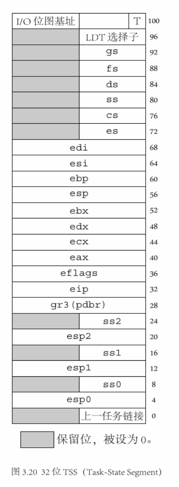

# 保护模式-特权级

[toc]

## 一致代码段和非一致代码段

在操作系统中，我们有些高特权级的代码是希望被低特权级的程序所访问的，比如一些库函数，于是我们将这些高特权级代码放在一个叫做**一致代码段**的段里。而有些高特权级的代码，我们并不想让低特权级的程序所访问，于是我们把他们放在一个叫做**非一致代码段**的段里。

具体来说，当通过call或者jmp指令转移到其它段时（即访问其他段），当转移的目标是一个优先级更高的一致代码段时，我们是可以进行访问的，但是当前的特权级会被延续下去；当转移的目标是一个优先级更高的非一致代码段时，这时的访问会引起常规保护错误（除非使用调用门或任务门）。


在段描述符位图中，

- **一致位**，在描述符属性中TYPE(包含4个二进制位)字段的第2位。
- **S 描述符类型标志 (descriptor type)** ，指明了一个段描述符是一个<u>系统段描述符（该标志位为 0）</u>，还是一个<u>代码或数据段描述符（该标志位为 1）</u>

当 S=1 时，

- 当S=1，type的最高有效位为0时，该段描述符指向一个**数据段**；
- 当S=1，type的最高有效位为1时，该段描述符指向一个**代码段**。


所以，对代码段来说，type 的最高位为1，剩余三位分别表示一致位(C)、读写位(W)、访问位(A)

- 一致位：置1时表示一致码段，置0时表示非一致码段；
- 读写位：置1时表示可读可写，置0时表示只读；
- 访问位：置1时表示已访问，置0时表示未访问。

**一致代码段往往是用在内核共享的段，这些段是允许应用程序去访问的，而不需要内核转移到应用程序中来访问这些 共享的资源。**


对于一致代码段，有以下规则：

- 特权级高的程序不允许访问特权级低的数据。比如，核心态不允许调用用户态的数据。
- 特权级低的程序可以访问到特权级高的数据，但是访问程序的特权级不会发生变化。比如，用户态访问内核态共享的资源时，不会变成内核态。

而对于非一致代码段，则有着不同的规则：

- 只允许同级访问。
- 绝对禁止不同级程序访问。即内核态不能访问用户态，用户态也不能访问内核态。


之所以这么做是为了系统的安全性考虑，分离内核和用户程序，使内核不能被用户程序干涉，同时避免使用户态程序修改内核态的逻辑，导致在内核态下执行 用户程序的代码。上面所说的是代码段，而数据段则全都是非一致的，这意味着不可能被低特权级的代码访问到。然而，与代码段不同的是，数据段可以被更高特权级的代码访问到，而不需要使用特定的门。规则总如如下:

|                    | 特权级 低 -> 高 | 特权级 高 -> 低 | 相同特权级之间 |               适用于何种代码               |
| :----------------: | :-------------: | :-------------: | :------------: | :----------------------------------------: |
|    一致性代码段    |       YES       |       NO        |      YES       | 不访问受保护资源，和某些异常处理的系统代码 |
|   非一致性代码段   |       NO        |       NO        |      YES       |   避免低特权级的程序访问而保护起来的代码   |
| 数据段(总是非一致) |       NO        |       YES       |      YES       |                                            |


## 特权级

### 1. CPL、RPL和DPL

处理器通过识别 CPL、DPL、RPL 这 3 种特权级进行特权级检验

- **CPL(Current Privilege Level)** ：是当前进程的权限级别，
    - 是当前正在执行的代码所在的段的特权级，存在于 cs 和 ss 寄存器的低两位。
    - <u>CPL 等于代码所在的段的特权级</u>。当程序转移到不同特权级的代码段时，处理器将改变 CPL。在遇到一致代码段时，情况稍稍有点特殊，一致代码段可以被相同或者更低特权级的代码访问。当处理器访问一个与 CPL 特权级不同的一致代码段时，CPL 不会被改变
    - 可以看成是段描述符未加载入 CS 前，该段的 DPL，加载入 CS 后就存入 CS 的低两位，所以叫做 CPL，其值就等于原段DPL的值


- **RPL(Request Privilege Level)** ：是进程对段访问的请求权限， 是对于段选择子而言的
    - 每个段选择子有自己的RPL，它说明的是进程对段访问的请求权限，有点像函数参数。而且 RPL 对每个段来说不是固定的，两次访问同 一段时的RPL可以不同。
    - RPL可能会削弱CPL的作用，例如当前CPL=0的进程要访问一个数据段，它把段选择符中的RPL设为3，这样它对该段仍然只有特权为3的访问权限。处理器通过检查RPL和CPL来确认一下请求是否合法。即便提出访问请求的段有足够的特权级，如果RPL不够也是不行的。
    - 以CPL来访问段DPL所出示的“证件(RPL)”，如出示的“证件”权级范围在CPL之内且满足DPL的特权检查规则：DPL >= max{CPL,RPL}，就能正常通过DPL；反之则不会通过还会发生错误
    - 操作系统过程往往用RPL来避免低特权级应用程序访问高特权级段内的数据。当操作系统过程（被调用过程）从一个应用程序 （调用过程）接收到一个选择子时，将会把选择子的RPL设成调用者的特权级。于是，当操作系统用这个选择子去访问相应的段时，处理器将会调用过程的特权级 （已经被存到RPL中），而不是更高的操作过程的特权级（CPL）进行特权检验。这样，RPL就保证了操作系统不会越俎代疱地代表一个应用程序去访问一个段，除非这个程序本身是有权限的。
    - 可以理解位调用方的 CPL 是基础，通过 CPL 可以有不同的访问权限（RPL，RPL 的权限必须小于等于 CPL），被调用的段检查，权级范围在CPL之内且满足DPL的 特权检查规则：DPL >= max{CPL,RPL}，就能正常通过DPL；反之则不会通过还会发生错误。


- **DPL(Descriptor Privilege Level)** ：存储在段描述符中，规定访问该段的权限级别，每个段的DPL固定。

    - DPL 表示段或者门的特权级。它被存储在段描述符或者门描述符的 DPL 字段中

    - 当进程访问一个段时，需要进程特权级检查，一般要求**DPL >= max {CPL, RPL}** 。当当前代码段试图访问一个段或者门时，DPL将会和CPL以及段或门选择子的RPL相比较，根据段或者门类型的不同，DPL将会被区别对待，下面介绍一下各种类型的段或者门的情况：

        - 数据段：DPL规定了可以访问此段的**最低特权级** 。比如，一个数据段的DPL是1，那么只有运行在CPL为0或者1的程序才有权访问它。

        - 非一致代码段（不使用调用门的情况下）：DPL规定访问此段的特权级。比如，一个非一致代码的特权级为0，那么只有CPL为0的程序才可以访问它。

        - 调用门：DPL规定了当前执行的程序或任务可以访问此调用门的**最低特权级** （这与数据段的规定是一致的）。

        - 一致代码段：DPL规定了访问此段的**最高特权级** 。比如，一个一致代码段的DPL是2，那么CPL为0和1的程序将无法访问此段。

        - TSS：DPL规定了可以访问此TSS的**最低特权级** （这与数据段的规定是一致的）。

​     下面打一个比方，中国官员分为6级国家主席1、总理2、省长3、市长4、县长5、乡长6，假设我 是当前进程，级别总理（CPL=2）,我去聊城市(DPL=4)考察(呵呵),我用省长的级别(RPL=3 这样也能吓死他们)去访问,可以吧，如果我用县长的级别，人家就不理咱了(你看看电视上的微服私访，呵呵)，明白了吧！为什么采用RPL，是考虑到安全的问题，就好像你明明对一个文件拥有写权限，为什么用只读打开它呢，还不是为了安全！


下面做一个实验：

将在第三篇的 保护模式之LDT 中的代码，做一些小的修改，把先前例子中的数据段描述符的 DPL 修改一下。

将LABEL_DESC_DATA对应的段描述符的 DPL 修改为 1：

```assembly
LABEL_DESC_DATA:	Descriptor			0,		 DataLen - 1,	DA_DRW + DA_DPL1	; Data 数据段
```

此时的 RPL 不变，还是原来的(还是 RPL = 0)：

```assembly
SelectorData			equ			LABEL_DESC_DATA 	- LABEL_GDT
```


编译运行，都正常，说明 RPL = 0 ，且 CPL =0，可以访问 DPL=1 的数据段（非一致性）


继续修改，将数据段的选择子 RPL 修改为 3，

```assembly
SelectorData			equ			LABEL_DESC_DATA 	- LABEL_GDT + SA_RPL3
```


再次编译运行，这时候运行出错 ` RPL & CPL must be <= DPL`：

说明，RPL = 3，且 CPL=0，不能访问 DPL=1 的数据段。


### 2. 不同特权级代码段之间的转移

序从一个代码段转移到另一个代码段之前，目标代码段的选择子会被加载到cs中。作为加载过程的一部分，处理器将会检查描述符的界限、类型、特权级等内容。如果检验成功，cs 将被加载，程序控制将转移到新的代码段中，从 eip 指示的位置开始执行。

程序控制转移的发生，可以是由指令 jmp、 call、 ret、 sysenter、sysexit、 int n 或 iret 引起的，也可以由中断和异常机制引起。

使用jmp或call指令可以实现下列 4 种转移：

1. 目标操作数包含目标代码段的段选择子。

2. 目标操作数指向一个包含目标代码段选择子的调用门描述符。

3. 目标操作数指向一个包含目标代码段选择子的 TSS。

4. 目标操作数指向一个任务门这个任务门指向一个包含目标代码段选择子
    的 TSS。

  

这 4 种方式可以看做是两大类，一类是通过jmp和call的直接转移，上述第1种，另一类是通过某个描述符的间接转移(上述第2、3、4种)。


## 特权及转移


JMP 和 CALL 命令之前已经提到：

- 如果目标是非一致代码段要求 CPL 必须等于目标段的 DPL，同时要求 RPL 小于等于 DPL。
- 如果目标是一致代码段，则要求 CPL 大于或者等于目标段的 DPL，RPL 此时不做检查。当转移到一致代码段中后，CPL 会被延续下来，而不会变成目标代码段的 DPL。


总结，通过 jmp 和 call 所能进行的代码段间转移是非常有限的：

- 对于非一致代码段，只能在相同特权级代码段之间转移。
- 遇到一致代码段也最多能从低到高，而且 CPL 不会改变。


如果想自由地进行不同特权级之间的转移，显然需要其他几种方式，即运用**门描述符或者 TSS**。


当段描述符中的**S标志位（描述符类型）被复位(置0)**时，表明该段描述符为一个**系统描述符**。处理器能识别以下一些类型的系统段描述符：

- **局部描述符表(LDT)的段描述符**
- **任务状态段(TSS)描述符**
- **调用门描述符**
- **中断门描述符**
- **陷阱门描述符**
- **任务门描述符**


下面主要介绍调用门，中断门和陷阱门是特殊的调用门。


### 1. 调用门


段描述符中的 Type 标志位(4位) 是 `1100` 时，表示该段描述符为 call descriptor，也就是调用门。

#### 代码示例

```assembly
; ==========================================
; chat03 保护模式入门
; protect_mode_test_a.asm
; 编译方法 nasm protect_mode_test_a.asm -o protect_mode_test_a.bin
; ==========================================


%include "protect_mode.inc"						; 常量、宏等说明


org			0100h								; org 是 Origin 的缩写，伪指令，表示程序的起始地址
; 不是该程序在内存中的地址，而是当前程序使用的基地址

		jmp			LABEL_BEGIN


[SECTION	.gdt]
; GDT 声明代码段, GDT 表项
;									    段基址,			   段界限,			属性
LABEL_GDT:			    Descriptor			0,				   0,			  	   0	; 空描述符
LABEL_DESC_NORMAL:	    Descriptor			0,			  0ffffh,		      DA_DRW	; Normal 描述符
LABEL_DESC_CODE32:	    Descriptor			0,	SegCode32Len - 1,		DA_C + DA_32	; 非一致性代码段，32位
LABEL_DESC_CODE16:	    Descriptor			0,			  0ffffh,				DA_C	; 非一致性代码段，16位
LABEL_DESC_CODE_DEST:   Descriptor          0,SegCodeDestLen - 1,       DA_C + DA_32    ; 非一致代码段,32 位，库函数/调用门函数段
LABEL_DESC_DATA:	    Descriptor			0,		 DataLen - 1,		  	  DA_DRW	; Data 数据段
LABEL_DESC_STACK:	    Descriptor			0,		  TopOfStack,	 DA_DRWA + DA_32	; Stack 栈段，32 位
LABEL_DESC_TEST:	    Descriptor	 0500000h,			  0ffffh,			  DA_DRW	; 测试段
LABEL_DESC_LDT:		    Descriptor			0,		  LdtLen - 1,			  DA_LDT	; LDT 段，LDT 必须在GDT 表中定义
LABEL_DESC_VIDEO:	    Descriptor	  0B8000h,			  0ffffh,		  	  DA_DRW	; 显存首地址
;
; 系统描述符 - 调用门
;									  段选择子,			   偏移,			   DCount,                属性
LABEL_CALL_GATE_TEST:   Gate SelectorCodeDest,               0,                 0,         DA_386CGate + DA_DPL0


; GDT 结束

; GDT 表的长度，界限，基地址
GdtLen			equ			$ - LABEL_GDT			; GDT 长度
GdtPtr			dw			GdtLen - 1				; GDT 界限
				dd			0						; GDT 基地址
				
				
; GDT 选择子的偏移地址
SelectorNormal			equ			LABEL_DESC_NORMAL	 - LABEL_GDT
SelectorCode32			equ			LABEL_DESC_CODE32 	 - LABEL_GDT
SelectorCode16			equ			LABEL_DESC_CODE16	 - LABEL_GDT
SelectorData			equ			LABEL_DESC_DATA 	 - LABEL_GDT
SelectorCodeDest        equ         LABEL_DESC_CODE_DEST - LABEL_GDT
SelectorStack			equ			LABEL_DESC_STACK 	 - LABEL_GDT
SelectorTest			equ			LABEL_DESC_TEST 	 - LABEL_GDT
SelectorLdt				equ			LABEL_DESC_LDT		 - LABEL_GDT
SelectorVideo			equ			LABEL_DESC_VIDEO 	 - LABEL_GDT

; 调用门选择子
SelectorCallGateTest    equ        LABEL_CALL_GATE_TEST  - LABEL_GDT
; END of [SECTION .gdt]


[SECTION	.data1]					; 数据段
ALIGN	32					; align 地址对齐的伪指令，用来指定符号的对齐方式。align的作用范围只限于紧跟它的那条指令或者数据，而接下来的指令或者数据的地址由上一条指令的地址和其长度决定。
[BITS	32]
LABEL_DATA:

SPValueInRealMode			dw		0
; 字符串
PMMessage:					db		"In Protect Mode now. ^_^", 0
OffsetPMMessage				equ		PMMessage - $$						; 相对于 LABEL_DATA 的偏移，与段选择子一起进行索引
StrTest:					db		"ABCDEFGHIJKLMNOPQRSTUVWXYZ", 0
OffsetStrTest				equ		StrTest - $$						; 相对于 LABEL_DATA 的偏移，与段选择子一起进行索引
DataLen						equ		$ - LABEL_DATA

; END of [SECTION	.data1]	


[SECTION	.gs]				; 全局堆栈段
ALIGN	32
[BITS	32]
LABEL_STACK:
		times		512		db		0					; 填充 512 字节

TopOfStack			equ		$ - LABEL_STACK - 1			; LABEL_DESC_STACK 描述的界限

; END of [SECTION	.gs]	


[SECTION	.s16]
[BITS	16]			; BITS 指令指定 NASM 是否应生成设计为在 16 位模式、32 位模式或 64 位模式下运行的处理器上运行的代码
; 此段还在实模式，因此是 16 位
;
LABEL_BEGIN:
		; 初始化段寄存器
		mov			ax,		cs
		mov			ds,		ax
		mov			es,		ax
		mov			ss,		ax
		mov			sp,		0100h
		
		; 为回到实模式的这个跳转指令指定正确的段地址
		; jmp 指令的结构为： 低 -> 字节1(0EAh) -> 字节2-字节3(Offset) -> 字节4-字节5(Segment)
		; 因此在此时还处于实模式时，修改保护模式跳回实模式的段地址，为当前的 cs\
		; [LABEL_GO_BACK_TO_REAL + 3] 就是 jmp 结构中的 segment 部分
		mov			[LABEL_GO_BACK_TO_REAL+3], 		ax
		
		; 为回到实模式，具有正确的栈顶指针，保存栈顶指针的地址
		mov			[SPValueInRealMode],				sp
		
		
		; 初始化 32 位代码段描述符 （补全 GDT 描述符的段基址部分）
		xor			eax,	eax
		mov			ax,		cs
		shl			eax,	4
		add			eax,	LABEL_SEG_CODE32
		mov			word	[LABEL_DESC_CODE32 + 2],	ax
		shr			eax,	16
		mov			byte	[LABEL_DESC_CODE32 + 4], 	al
		mov			byte	[LABEL_DESC_CODE32 + 7],	ah
		
		; 初始化 32 位数据段描述符 （补全 GDT 描述符的段基址部分）
		xor			eax,	eax
		mov			ax,		ds
		shl			eax,	4
		add			eax,	LABEL_DATA
		mov			word	[LABEL_DESC_DATA + 2],	ax
		shr			eax,	16
		mov			byte	[LABEL_DESC_DATA + 4], 	al
		mov			byte	[LABEL_DESC_DATA + 7],	ah
		
	
		; 初始化 32 位堆栈段描述符 （补全 GDT 描述符的段基址部分）
		xor			eax,	eax
		mov			ax,		ds
		shl			eax,	4
		add			eax,	LABEL_STACK
		mov			word	[LABEL_DESC_STACK + 2],	ax
		shr			eax,	16
		mov			byte	[LABEL_DESC_STACK + 4], 	al
		mov			byte	[LABEL_DESC_STACK + 7],		ah
		
		; 初始化 16 位代码段描述符 （补全 GDT 描述符的段基址部分）
		xor			eax,	eax
		mov			ax,		cs
		shl			eax,	4
		add			eax,	LABEL_SEG_CODE16
		mov			word	[LABEL_DESC_CODE16 + 2],	ax
		shr			eax,	16
		mov			byte	[LABEL_DESC_CODE16 + 4], 	al
		mov			byte	[LABEL_DESC_CODE16 + 7],	ah

        ; 初始化测试调用门的代码段描述符（补全 GDT 描述符的段基址部分）
        xor			eax,	eax
        mov			ax,		cs
        shl			eax,	4
        add			eax,	LABEL_SEG_CODE_DEST
        mov			word	[LABEL_LDT_DESC_CODEA + 2],	ax
        shr			eax,	16
        mov			byte	[LABEL_LDT_DESC_CODEA + 4], 	al
        mov			byte	[LABEL_LDT_DESC_CODEA + 7],	ah

		; 初始化 LDT 在 GDT 中的描述符（补全 GDT 描述符的段基址部分）
		xor			eax,	eax
		mov			ax,		cs
		shl			eax,	4
		add			eax,	LABEL_LDT
		mov			word	[LABEL_DESC_LDT + 2],	ax
		shr			eax,	16
		mov			byte	[LABEL_DESC_LDT + 4], 	al
		mov			byte	[LABEL_DESC_LDT + 7],	ah

        ; 初始化 LDT 局部段描述符（补全 LDT 描述符的段基址部分）
        xor			eax,	eax
        mov			ax,		cs
        shl			eax,	4
        add			eax,	LABEL_CODE_A
        mov			word	[LABEL_LDT_DESC_CODEA + 2],	ax
        shr			eax,	16
        mov			byte	[LABEL_LDT_DESC_CODEA + 4], 	al
        mov			byte	[LABEL_LDT_DESC_CODEA + 7],	ah


		
		; 为加载 GDTR 做准备
		xor			eax,	eax
		mov			ax,		ds
		shl			eax,	4
		add			eax,	LABEL_GDT			; gdt 基地址赋 -> eax
		mov			dword	[GdtPtr + 2],	eax	; eax gdt 基地址 -> [Gdt + 2]
		
		; 加载 GDTR
		lgdt		[GdtPtr]
		
		; 关中断
		cli
		
		; 打开地址线 A20
		in			al,		92h
		or			al,		00000010b
		out			92h,	al
		
		; 准备切换到保护模式
		mov			eax,	cr0
		or			eax,	1
		mov			cr0,	eax
		
		; 真正进入保护模式
		jmp			dword	SelectorCode32:0		; 将 SelectorCode32 装入 cs，并且跳转到 SelectorCode32:0 处


LABEL_REAL_ENTRY:				; 由保护模式跳回实模式的入口
		
		mov			ax,			cs
		mov			ds,			ax
		mov			es,			ax
		mov			ss,			ax				; 恢复寄存器内容
		
		mov			sp,			[SPValueInRealMode]			; 栈顶地址
		
		in			al, 		92h	
		and			al, 		11111101b	
		out			92h, 		al				; 关闭 A20 地址线
		
		sti										; 开中断
		
		mov 		ax, 		4c00h
		int			21h							; ah=4CH — 带返回码方式的终止进程 （int 21h）


; END of [SECTION .s16]


[SECTION	.s32]			; 32 位代码段，由实模式跳入
[BITS	32]
; 此处进入保护模式，为 32 位
;
LABEL_SEG_CODE32:

		; 初始化段寄存器
		mov			ax,		SelectorData
		mov			ds,		ax					; 初始化数据段选择子
		mov			ax,		SelectorTest
		mov			es,		ax					; 初始化测试段选择子
		mov			ax,		SelectorVideo
		mov			gs,		ax					; 初始化video显存段选择子
		mov			ax,		SelectorStack
		mov			ss,		ax					; 初始化堆栈段段选择子

		mov			esp,	TopOfStack			; 栈顶地址
		
		
		; 下面显示一个字符串
		mov			ah,		0Ch						; 0000: 黑底，1100: 红字
		xor			esi,	esi
		xor			edi,	edi						; edi、esi 置零
		mov			esi,	OffsetPMMessage			; 源数据偏移赋给 esi
		mov			edi,	(80 * 10 + 0) * 2		; 目的数据偏移。屏幕第 10 行 , 第 0 列。
		; 此处设置 esi  ，为了后面调用 lodsb，edi 为了屏幕显示
		
		cld					; CLD用来操作方向标志位DF（Direction Flag）。CLD使DF复位，即DF=0
		
		
.1:					; 读取数据，并显示
		lodsb				; 汇编指令LODSB,该命令的加载方向与DF标志位有关,因此在使用此命令时需用CLD指令清DF标志位
        ;
        ; 串操作指令LODSB/LODSW/LODSD是块装入指令,
        ;     - 具体操作是把 DS:(R|E)SI 指定的内存地址中的数据读取到 AL/AX/EAX/RAX 累加寄存器中.
        ;     - 当数据载入到 AL/AX/EAX/RAX 寄存器后, (R|E)SI 寄存器将会根据 R|EFLAGS 标志寄存器的 DF 标志位,来自动增加/减少载入的数据长度
        ;         - 当DF=0时，变址寄存器SI(和DI)增加1/2/4/8
        ;         - 当DF=1时，变址寄存器SI(和DI)减少1/2/4/8
		
		test		al,			al				; 将两个操作数进行逻辑与运算，并根据运算结果设置相关的标志位，并不改变操作数1和操作数2的值，判断是否为0
		jz			.2							; 如果 al 为 0，即 zf=1，跳转到 .2 ，表示已经读取到0，读取完成
		mov			[gs:edi],	ax				; 将读取到的数据 ax 写入到 视频段，屏幕显示
		add			edi,		2				; ax 长度两个字节，每次显示两个字节
		jmp			.1
		
		
.2:					; 读取数据，并显示完成
		call		DisplayReturn

		; 此时不做函数调用，下面函数放在 LDT 中调用，函数的位置也放在了新的段中，而 DisplayReturn 还在此段中
		;call		TestRead
		;call		TestWrite
		;call		TestRead

        ; 测试调用门，无特权级转换，都是 0
        call        SelectorCallGateTest:0

		; 加载局部描述符 LDT
		mov         ax,         SelectorLdt
		lldt        ax							; lldt指令加载ldtr
		
		; 跳入 LDT 局部描述符所在的局部段任务
		jmp			SelectorLDTCodeA:0


; ----------------------------- SECTION	.s32 函数区 ---------------------
; =============================== DisplayRetrun
; DispReturn模拟一个回车的显示，实际上是让下一个字符显示在下一行的开头处。
; edi 保存的是下一个显示字符的位置，因此换行就是 edi 指向下一行的开头
DisplayReturn:
		push		eax
		push		ebx						; 保存 eax,ebx
		mov			eax,		edi
		mov			bl,			160
		div			bl						; edi/160(每行列数160？)，计算出当前的行数 eax
		; 商保存在 eax 中，余数保存在 edx 中。

		and			eax,		0FFh
		inc 		eax						; 换行，到下一行

		mov			bl,			160
		mul			bl						; 当前行号数 * 160，行开头位置

		mov			edi,		eax			; 置 edi
		pop			ebx
		pop			eax

		ret

; END of DisplayRetrun ===============

; ----------------------------- End of SECTION	.s32 函数区 ---------------------

SegCode32Len		equ		$ - LABEL_SEG_CODE32
; END of [SECTION .s32]


[SECTION    .ldt]           ; 局部描述符段，定义 LDT
ALIGN   32
LABEL_LDT:
; LDT 声明代码段, LDT 表项
;									            段基址,			   段界限,			属性
LABEL_LDT_DESC_CODEA:			Descriptor			0,		CodeALen - 1,	DA_C + DA_32	; LDT 表项，CODEA，32 位
;
; LDT 结束

; LDT 表的长度
LDTLen          equ         $ - LABEL_LDT


; LDT 选择子，在LDT表项中的偏移地址
; 之前 GDT 选择子没有加 TI 值，因为 GDT 就是 0，而 LDT TI 值为 1
SelectorLDTCodeA            equ         LABEL_LDT_DESC_CODEA - LABEL_LDT + SA_TIL

; END of [SECTION    .ldt]


[SECTION    .ldta]
ALIGN   32
[BITS   32]
LABEL_CODE_A:
        mov         ax,         SelectorVideo
        mov         gs,         ax                          ; gs 设置为是频段选择子

        mov         edi,        (80 * 12 + 0) * 2           ; 屏幕第 10 行, 第 0 列。
        mov         ah,         0Ch                         ; 0000: 黑底    1100: 红字
        mov         al,         'L'
        mov         [gs:edi],   ax

        ; 准备经由16位代码段跳回实模式
        jmp         SelectorCode16:0

CodeALen            equ         $ - LABEL_CODE_A

; End of [SECTION    .ldta]


[SECTION	.s16code]					; 跳回 实模式
ALIGN	32
[BITS	16]
LABEL_SEG_CODE16:
; 因为在准备结束保护模式回到实模式之前，需要加载一个合适的描述符选择子到有关段寄存器，
; 以使对应段描述符高速缓冲寄存器中含有合适的段界限和属性。
; 而且，我们不能从32位代码段返回实模式，只能从16位代码段中返回。
; 这是因为无法实现从32位代码段返回时cs高速缓冲寄存器中的属性符合实模式的要求(实模式不能改变段属性)
		
		mov			ax,			SelectorNormal
		mov			ds,			ax
		mov			es,			ax
		mov			gs,			ax
		mov			fs,			ax
		mov			ss,			ax

		mov			eax, 		cr0							; 设置 cr0 控制器 PE 位 ，进入到 实模式
		and			al, 		11111110b
		mov			cr0, 		eax

LABEL_GO_BACK_TO_REAL:	
		jmp			0:LABEL_REAL_ENTRY						; 段地址会在程序开始处被设置成正确的值

Code16Len		equ		$ - LABEL_SEG_CODE16
; END of [SECTION .s32]


[SECTION    .sdest]                 ; 调用门目标段，也就是库函数
[BITS   32]
LABEL_SEG_CODE_DEST:                ; 在屏幕第十二行显示字符 C
        ; jmp           $
        mov         ax,             SelectorVideo
        mov         gs,             ax                          ; 视频段选择子

        mov         edi,            (80 * 12 + 0) * 2           ; 屏幕第 12 行, 第 0 列。
        mov         ah,             0Ch                         ; 0000: 黑底    1100: 红字
        mov         al,             'C'                         ; 显示字符 C
        mov         [gs:edi],       ax

        retf                                                    ; 打算用call指令调用将要建立的调用门，所以，在这段代码的结尾处调用了一个retf指令

SegCodeDestLen          equ         $ - LABEL_SEG_CODE_DEST

; END of [SECTION .sdest]


```


宏定义 `protect_mode.inc`

```assembly
; 汇编 宏：宏是一系列指令，由名称分配，可以在程序中的任何位置使用，类似一个函数。NASM 的宏格式如下：
;
; %macro macro_name  number_of_params
; 	<macro body>
; %endmacro
;
; 	- 其中，number_of_params指定数字参数， macro_name指定宏的名称
;	- 在 marco body 中，想要引用参数，可以使用 %，例如第一个参数 %1, ...
;
; 宏的使用很简单: macro_name param1, param2, ...

; 描述符宏，需要3个参数
; Usage: Descriptor Base, Limit, Attr
; 		Base:		dd (段基址)
;		Limit:		dd (段界限，低 20 位有效)                  
;		Attr:		dw (属性，高字节序，低 4 位始终为 0)
%macro	Descriptor	3
		dw			%2 & 0FFFFh										; 段界限1
		dw			%1 & 0FFFFh										; 段基址1
		db			(%1 >> 16) & 0FFh								; 段基址2
		dw			((%2 >> 8) & 0F00h) | (%3 & 0F0FFh)				; 属性1 + 段界限2 + 属性2
		db			(%1 >> 24) & 0FFh								; 段基址3
%endmacro 	； 共 8 字节

; 调用门，需要3个参数
; Usage: Gate Selector, Offset, DCount, Attr
; 		Selector:	dw (被调用门的段选择子)
;		Offset:		dd (段偏移地址)
;       DCount:     db (属性-参数个数，使用 低 5 位，高 3 位置0)
;		Attr:		db (属性，8 位)
%macro	Gate	4
		dw			%2 & 0FFFFh										; 段偏移1
		dw			%1          									; 选择子
		dw			(%3 & 1Fh) | ((%4 << 8) && 0FF00h)			        ; 属性
		dw			((%2 >> 16) && 0FFFFh)                  		; 段偏移2
%endmacro 	； 共 8 字节


; 描述符类型
;----------------------------------------------------------------------------
; 描述符类型值说明
; 其中:
;       DA_  : Descriptor Attribute
;       D    : 数据段
;       C    : 代码段
;       S    : 系统段
;       R    : 只读
;       RW   : 读写
;       A    : 已访问
;       其它 : 可按照字面意思理解
;----------------------------------------------------------------------------
DA_32			EQU		4000h		; 32 位段

; DPL 位										   **	
DA_DPL0			EQU		00h			; DPL = 0(0000 0000)
DA_DPL1			EQU		20h			; DPL = 1(0010 0000)
DA_DPL2			EQU		40h			; DPL = 2(0100 0000)
DA_DPL3			EQU		60h			; DPL = 3(0110 0000)


; 存储段描述符类型
;----------------------------------------------------------------------------
; 存储段描述符类型值说明
;----------------------------------------------------------------------------
; TYPE位*							   P  S ****
DA_DR			EQU		90h			; (1001 0000) 存的是只读数据段类型值
DA_DRW			EQU		92h			; (1001 0010) 存的是可读写数据段属性值
DA_DRWA			EQU		93h			; (1001 0011) 存的是已访问可读写数据段类型值
DA_C			EQU		98h			; (1001 1000) 存的是只执行代码段属性值
DA_CR			EQU		9Ah			; (1001 1010) 存的是可执行可读代码段属性值
DA_CCO			EQU		9Ch			; (1001 1100) 存的是只执行一致代码段属性值
DA_CCOR			EQU		9Eh			; (1001 1110) 存的是可执行可读一致代码段属性值


; 系统段描述符类型
;----------------------------------------------------------------------------
; 系统段描述符类型值说明
;----------------------------------------------------------------------------
; TYPE位*							   P  S ****
DA_LDT			EQU		82h			; (1000 0010) 局部描述符表段类型值
DA_TaskGate		EQU		85h			; (1000 0101) 任务门类型值
DA_386TSS		EQU		89h			; (1000 1001) 可用 386 任务状态段类型值
DA_386CGate		EQU		8Ch			; (1000 1100) 386 调用门类型值
DA_386IGate		EQU		8Eh			; (1000 1110) 386 中断门类型值
DA_386TGate		EQU		8Fh			; (1000 1111) 386 陷阱门类型值


; 选择子最后三位表示两个标志位，TI 和 RPL
;----------------------------------------------------------------------------
;
; RPL(Requested Privilege Level): 请求特权级，用于特权检查。 （选择子的最后两位）
;
; TI(Table Indicator): 引用描述符表指示位（选择子的倒数第三位）
;	TI=0 指示从全局描述符表GDT中读取描述符；
;	TI=1 指示从局部描述符表LDT中读取描述符。
;
; 选择子类型值说明
; 其中:
;       SA_  : Selector Attribute
;----------------------------------------------------------------------------
; TI *									    *
SA_TIL			EQU		4				; (0100)	1-LDT
SA_TIG			EQU		0				; (0000)	0-GDT

; RPL *									     **
SA_RPL0			EQU		0				; (0000)	RPL - 0
SA_RPL1			EQU		1				; (0001)	RPL - 1
SA_RPL2			EQU		2				; (0010)	RPL - 2
SA_RPL3			EQU		3				; (0011)	RPL - 3


```


### 2. 长/短调用

如果一个调用或跳转指令是在段间而不是段内进行的，那么我们称之为“长”的（Far jmp/call）。反之，如果在段内则是“短”的（Near jmp/call）。

【问】：那么长的和短的jmp或call有什么分别呢？

【答】：

- 对于 jmp 而言，仅仅是结果不同罢了，短跳转对应段内，而长跳转对应段间。
- 而 call 则稍微复杂一些，因为 call 指令是会影响堆栈的，长调用和短调用对堆栈的影响是不同的。
  - 对于短调用来说，call 指令执行时下一条指令的 eip 压栈，到 ret 指令执行时，这个 eip 会被从堆栈中弹出
  - 长调用的情况与此类似，返回的时候跟调用的时候一样也是“长”转移，所以返回的时候也需要调用者的 cs，于是 call 指令执行时被压栈的就不仅有 eip 还应该有 cs


这就衍生出另一个问题，对于长调用，call一个调用门是长调用，由于一些原因堆栈发生了切换，call 指令执行前后的堆栈已经不再是同一个。我们在堆栈 A 中压入参数和返回时地址，等到需要使用它们的时候堆栈已经变成 B 了，这该怎么办呢？

**Intel 提供了这样一种机制，将堆栈 A 的诸多内容复制到堆栈 B 中**。由于每一个任务最多都可能在 4 个特权级间转移，所以，每个任务实际上需要 4 个堆栈。

TSS（Task-State Stack）是一个数据结构，里面包含多个字段，32 位 TSS 结构如下：



注意：

- ss0-esp0，ss1-esp1，ss2-esp2，分别表示 ring0 - ring2 的堆栈
- 由于只是在由外层到内层，低特权级到高特权级（切换时新堆栈才会从 TSS 中取得）所以 TSS 中没有位于最外层的 ring3 的堆栈信息。


整个的转移过程，CPU 在整个过程中所做的工作：

1. 根据目标代码段的 DPL（新的 CPL）从 TSS 中选择应该切换至哪个 ss 和 esp。
2. 从 TSS 中读取新的 ss 和 esp。在这过程中如果发现 ss、esp或者 TSS 界限错误都会导致无效 TSS 异常（#TS）。
3. 对 ss 描述符进行检验，如果发生错误，同样产生 #TS 异常。
4. 暂时性地保存当前 ss 和 esp 的值。
5. 加载新的 ss 和 esp。
6. 将刚刚保存起来的 ss 和 esp 的值压入新栈。
7. 从调用者堆栈中将参数复制到被调用者堆栈（新堆栈）中，复制参数的数目由调用门中 Param Count 一项来决定。如果 Param Count 是零的话，将不会复制参数。
   - Param Count 只有 5 位，也就是说，最多只能复制 31 个参数。如果参数多于 31 ，这时可以让其中的某个参数变成指向一个数据结构的指针，或者通过保存在新堆栈里的 ss 和 esp 来访问旧堆栈中的参数
8. 将当前的 cs 和 eip 压栈。
9. 加载调用门中指定的新的 cs 和 eip，开始执行被调用者过程。


ret 基本上是 call 的反过程，只是带参数的 ret 指令会同时释放事先被压栈的参数。
<u>实际上，ret 这个指令不仅可以实现短返回和长返回，而且可以实现带有特权级变换的长返回</u>。由被调用者到调用者的返回过程中，处理器的工作包含以下步骤：

1. 检查保存的 cs 中的 RPL 以判断返回时是否要变换特权级。
2. 加载被调用者堆栈上的 cs 和 eip（此时会进行代码段描述符和选择子类型和特权级检验）。
3. 如果 ret 指令含有参数，则增加 esp 的值以跳过参数，然后 esp 将指向被保存过的调用者 ss 和 esp。注意，ret 的参数必须对应调用门中的 Param Count 的值。
4. 加载 ss 和 esp，切换到调用者堆栈，被调用者的 ss 和 esp 被丢弃。在这里将会进行 ss 描述符、esp 以及 ss 段描述符的检验。
5. 如果 ret 指令含有参数，增加 esp 的值以跳过参数（此时已经在调用者堆栈中）。
6. 检查 ds，es，fs，gs 的值，如果其中哪一个寄存器指向的段的 DPL 小于 CPL（此规则不适用于一致代码段），那么一个空描述符会被加载到该寄存器。

