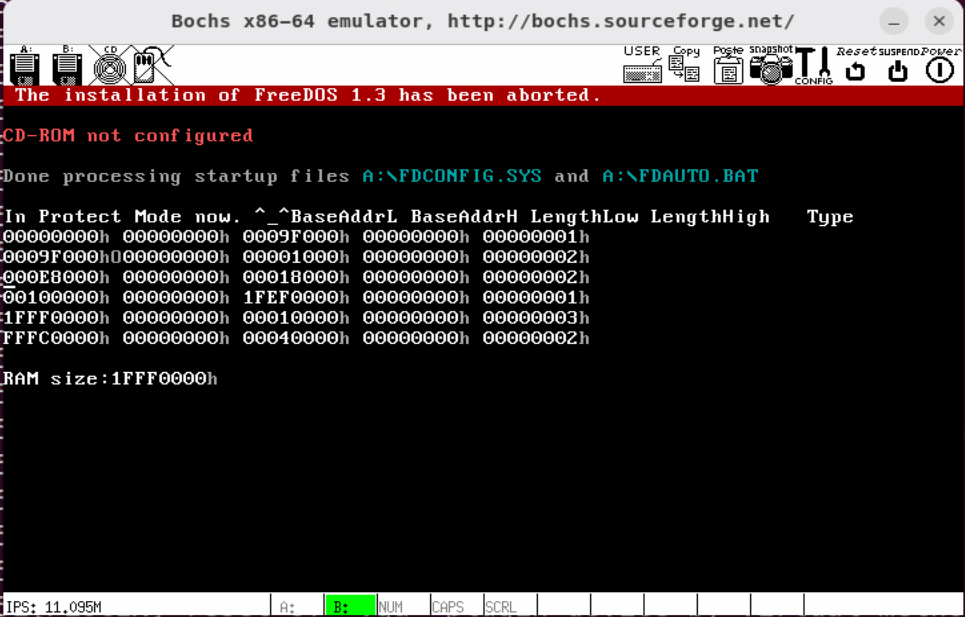
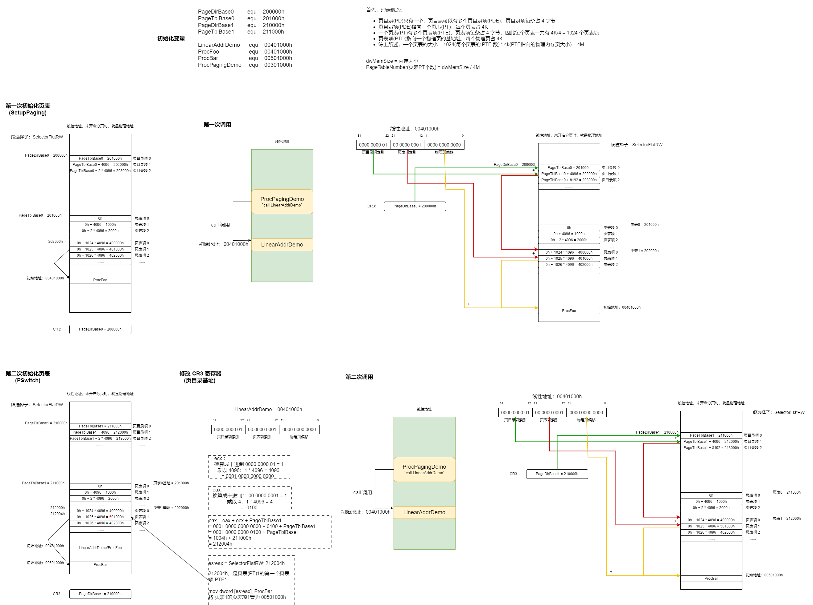
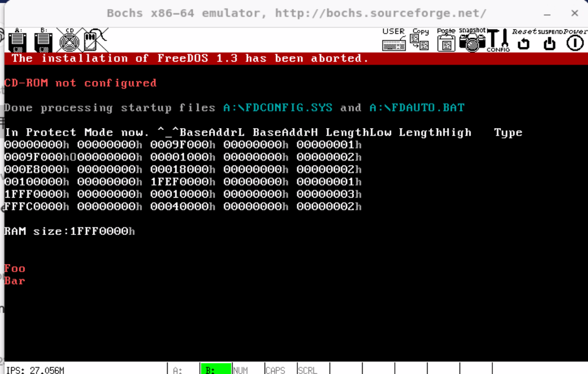

# 保护模式-分页


分页的前提是要知道物理内存有多少。那么程序如何知道机器有多少内存呢？实际上方法不止一个，在此我们仅介绍一种通用性比较强的方法，那就是利用中断15h （INT 15h）。


## 系统支持例程(INT 15H)


| 中断    | 说明                                                         |
| ------- | ------------------------------------------------------------ |
| AH=4FH  | 键盘拦截。                                                   |
| AH=83H  | 事件等待。                                                   |
| AH=84H  | 读游戏杆。                                                   |
| AH=85H  | SysRq 键。                                                   |
| AH=86H  | 等待。                                                       |
| AH=87H  | 块移动。                                                     |
| AH=88H  | 获取扩展内存容量。                                           |
| AH=C0H  | 获取系统参数。                                               |
| AH=C1H  | 获取扩展 BIOS 数据区块。                                     |
| AH=C2H  | 指针设备功能。                                               |
| AH=E8h, | AL=01h (AX = E801h) 获取扩展内存容量（自从 1994 年引入的新功能），可获取到 64MB 以上的内存容量。 |
| AH=E8h, | AL=20h (AX = E820h) 查询系统地址映射。该功能取代了 AX=E801h 和 AH=88h。 |


获取内存信息，可以通过 `AH=E8h  AL=20h` 的 INT 15h 系统中断。

该系统中断的功能概括为：

- 每执行一次 `int 15h` 这个指令将会将一个描述内存区域的数据结构保存到 `ES:DI`，然后返回一个ebx，用于确定下一个能够探测的内存区域
- 当 `ebx=0` 时，表示当前已经时最后一个内存区域了。
-  ebx 的初始值，就是设置成ebx=0。其中可能遇到检查发生错误的情况，这个指令就会直接将 CF 设置为 1。


下面是输入时各个寄存器的作用：

| 寄存器 |                             作用                             |
| :----: | :----------------------------------------------------------: |
|  eax   |          **功能码**，当输入 `e820h` 时能够探测内存           |
|  ebx   | 主要用于指向内存区域，<u>第一次调用时 ebx=0</u>，被称为**后续值(continuation value)** |
| es:di  | 用于指令执行后，指向一个地址范围描述符结构 ARDS（Address Range Descriptor Structure），BIOS 将会填充此结构。 |
|  ecx   | es:di所指向的地址范围描述符结构的大小，即用于限制指令填充的 ARDS 的大小，实际上大多数情况这个是无效的，无论 ecx 设置为多少，BIOS始终会填充20字节的 ARDS |
|  edx   | `0534D4150h`('SMAP')，输入时在 edx，输出时将会在 eax 中。BIOS 将会使用此标志，对调用者将要请求的系统映像信息进行校验，这些信息会被 BIOS 放置到 `es:di` 所指向的结构中。 |


下面是输出时各个寄存器的作用：

| 寄存器 |                             作用                             |
| :----: | :----------------------------------------------------------: |
|   CF   |              当没有发生错误时，CF=0，否则 CF=1               |
|  eax   |                     `0534D4150h`('SMAP')                     |
|  ebx   | 指向下一个内存区域，而不是调用之前的内存区域，当 ebx=0 且 CF=0 时，表示当前是最后一个内存区域。 |
| es:di  | 和调用之前一样，如果要保存多个 ARDS，需要手动修改 `es:di`，返回的地址范围描述符结构指针，和输入值相同 |
|  ecx   | 返回写入的 ARDS 的大小，BIOS 填充在地址范围描述符中的字节数量，被 BIOS 所返回的最小值是 20 字节。 |


地址范围描述符结构 ARDS（Address Range Descriptor Structure）详细结构如下：

| 偏移 | 名称         | 意义                           |
| ---- | ------------ | ------------------------------ |
| 0    | BaseAddrLow  | 基地址的低32位                 |
| 4    | BaseAddrHigh | 基地址的高32位                 |
| 8    | LengthLow    | 长度（字节）的低32位           |
| 12   | LengthHigh   | 长度（字节）的高32位           |
| 16   | Type         | 这个内存区域（地址范围）的类型 |


其中 Type 的值为：

| 取值 | 名称                 | 意义                                                         |
| ---- | -------------------- | ------------------------------------------------------------ |
| 1    | AddressRangeMemory   | 可以被OS使用的内存                                           |
| 2    | AddressRangeReserved | 正在使用的区域，或者系统保留不能使用的区域                   |
| 其他 | 未定义               | 保留，各个具体机器会有不同的意义，在这里我们暂时不用关心，将它视为AddressRangeReserved即可 |


## 开启分页、获取内存信息、计算 PDE 和 PTE


代码位置在 

- `Protect-Mode/g/protect_mode.inc` 
- `Protect-Mode/g/lib.inc`
- `Protect-Mode/g/protect_mode_test_g.asm`


执行结果为：




## 分页demo

代码位置：

- `Protect-Mode/h/protect_mode.inc` 
- `Protect-Mode/h/lib.inc`
- `Protect-Mode/h/protect_mode_test_h.asm`


整个代码的执行流程：




`protect_mode_test_h.asm` 的功能，先执行某个线性地址处的模块，然后通过改变 CR3 来转换地址映射关系，再执行同一个线性地址处的模块，由于地址映射已经改变，所以两次得到的应该是不同的输出

步骤：

1. 用两个描述符来描述存放分页的段，因为我们不仅仅要读写这段内存，而且要执行其中的代码，而这对描述符的属性要求是不一样的，这两个段的段基址都是零，长度是4GB

    ```assembly
    LABEL_DESC_FLAT_C: 	Descriptor 0, 0fffffh,	DA_CR|DA_32|DA_LIMIT_4K	 	;0-4G
    LABEL_DESC_FLAT_RW: Descriptor 0, 0fffffh,	DA_DRW|DA_LIMIT_4K 			;0-4G
    ```

    

2. `SetupPaging`： 根据内存大小获得页表个数进行分页段首地址 `SelectorFlatRW` 分页起始地址依然是从 0 开始，只是页目录表、页表地址变成了`PageDirBase0`

3. `PagingDemo`：主要功能是将显示 FOO 字符的代码片段复制到指定的位置 `ProcFoo 0x00401000h` 将显示 BAR 字符的代码片复制到指定位置`ProcBar 0x00501000h` 将 `ProcPagingDemo` 代码复制到 `0x00301000`

4. 接下来四个call是重点：

    1. `call SetupPaging` 开始分页

    2. `call SelectorFlatC:ProcPagingDemo` 开始运行 301000 处的代码

        - 由于此时没有切换目录，运行代码就是301000处的代码，这里是被复制的 `PagingDemoProc` 核心代码：

            ```assembly
            mov 	eax, 	LinearAddrDemo
            call 	eax
            ```

        - 调用 `LinearAddrDemo` 然而 `LinearAddrDemo equ 00401000h` 所以直接跳转 去运行 `401000h` 处的代码，即显示 FOO

    3. `call PSwitch` 切换页目录改变地址映射

        - 根据内存大小获得页表个数进行分页，段首地址 `SelectorFlatRW` 是一致的，页目录表是 `PageDirBase1` ， 页表地址是 `PageTblBase1`分页之后找到 `LinearAddrDemo` 所对应的页表，将页表中的访问页的地址换掉，原来访问页的地址内部是 FOO 的地址现在换了里面是跳转到 BAR 的地址，这样完成了同一个地址确实访问了两处代码

    4. `call SelectorFlatC:ProcPagingDemo` 再次运行 301000 处的代码


执行结果：




