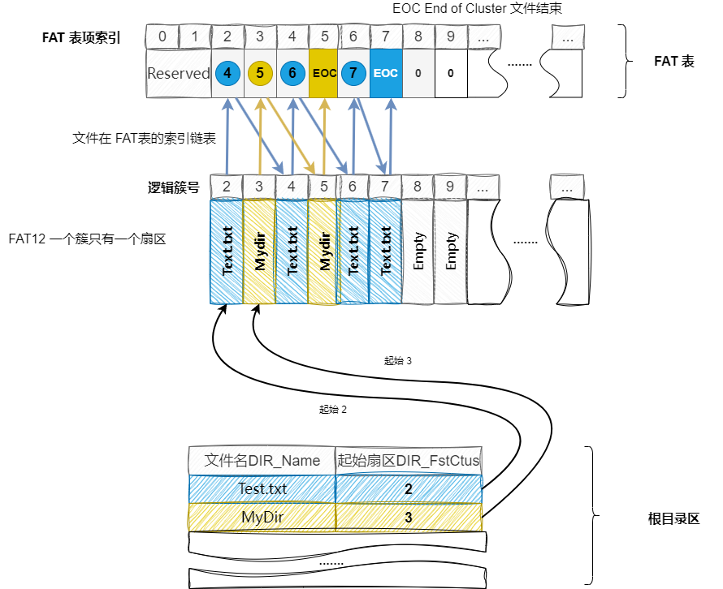

# FAT12 文件系统原理

[TOC]


## FAT 介绍

**FAT 全称 The File Allocation Table**(文件分配表)，在磁盘上规定一种特定的存储格式，这种存储格式高效方便，功能强大，因此形成了统一的规定。即文件分配表（FAT）是存储在硬盘或软盘上的一张表，指示磁盘上所有数据簇的状态和位置。


FAT 可以看作是一个磁盘的目录，如果 FAT 损坏，那么磁盘就无法读取。

FAT 是 DOS 时代就开始使用的文件系统（File System），直到现在仍然在软盘上使用。几乎所有的文件系统都会把磁盘划分为若干层次以方便组织和管理，这些层次包括：

- **扇区**（Sector）：磁盘上的最小数据单元。
- **簇**（Cluster）：一个或多个扇区。
- **分区**（Partition）：通常指整个文件系统。


在本文档中，描述了 FAT12 文件系统。 FAT12 是**软盘上**的文件系统。


FAT12、FAT16、FAT32：

- **FAT12** 是 FAT 文件系统的原始版本，于 1980 年首次随 MSDOS 引入。它是为小型磁盘设计的，最大大小为 16MB，簇大小为 512 字节(也就是一个扇区)。 FAT12 已不再常用，但在一些较旧的设备（例如数码相机和音乐播放器）上仍然可以找到它。

- **FAT16** 是 FAT 文件系统的下一个版本，于 1984 年随 MS-DOS 3.0 发布而引入。它支持比FAT12更大的磁盘，最大大小为2GB，簇大小最大为64KB。 FAT16 仍在某些设备上使用，但已不像以前那么普遍。
- **FAT32** 是 FAT 文件系统的最新版本，于 1996 年随 Windows 95 OSR2 的发布而引入。它旨在支持比 FAT16 更大的磁盘，最大大小为 2TB，簇大小最大为 32KB。 FAT32 至今仍被广泛使用，特别是在 USB 驱动器和 SD 卡等可移动存储设备上。


FAT12、FAT16、FAT32 本质区别：本质的不同之处在于描述文件存储的<u>FAT表中各元素的长度分别为12位, 16位和32位</u>。


## FAT12 介绍

具体来说FAT12文件系统为1.44M的软盘设计。1.44M 的软盘有 2812 个扇区，一个扇区有 512 个字节；那么 FAT12 文件系统的管理的空间大小就是 `2812 * 512 = 1,439,744` 个字节


FAT12 文件系统会对软盘里的扇区进行结构化的处理，进而把软盘扇区划分成：**引导扇区（MBR）**、**FAT表**、**根目录区**和**数据区**四个部分


## FAT12 原理


### FAT12 磁盘结构

FAT12文件系统将2880个扇区分成5个部分：**MBR引导记录、FAT表(FAT1表、FAT2表)、根目录区、数据区**


#### Boot Sector 引导扇区

**引导扇区位于磁盘上的扇区 0**，不仅包含有引导程序，还包含基本的磁盘组成结构，这是操作系统正确使用磁盘所需的一组信息。

每当使用磁盘时，都会读取引导扇区中的信息，并从中提取任何所需的信息。 


下表就是 FAT12 引导扇区的组成结构：

|        名称        | 起始字节(偏移) | 长度(字节) |    默认值    |                             描述                             |
| :----------------: | :------------: | :--------: | :----------: | :----------------------------------------------------------: |
|   **BS_JmpBoot**   |       0        |     3      |      -       |                        一个短跳转指令                        |
|   **BS_OEMName**   |       3        |     8      |   FREEDOS    |          厂商名，必须为 8 个字符，不足会以空格填充           |
| **BPB_BytePerSec** |       11       |     2      | 0x200 = 512  |                        每个扇区字节数                        |
| **BPB_SecPerClus** |       13       |     1      |     0x1      |        每簇占用的扇区数，2的整数次方个扇区表示为一簇         |
| **BPB_RsvdSecCnt** |       14       |     2      |     0x1      |       Boot记录占用的扇区数，不能为0，引导扇区必须存在        |
|  **BPB_NumFATs**   |       16       |     1      |     0x2      |               FAT表的数量，任何 FAT 类型都是 2               |
| **BPB_RootEntCnt** |       17       |     2      |  0xE0 = 224  | 根目录可容纳的目录项数，此值乘以 32 必须是 BPB_BytePerSec 的偶数倍 |
|  **BPB_TotSec16**  |       19       |     2      | 0xB40 = 2880 |         扇区总数，如果此值为0，BPB_TotSec32 必须非0          |
|   **BPB_Media**    |       21       |     1      |     0xF0     | 介质(媒体)描述符，常用值 0xF0 表示可移动介质类型，不可移动存储介质为 0xF8 |
|  **BPB_FATSz16**   |       22       |     2      |      9       | 每个FAT占用扇区数，FAT1 和 FAT2 具有相同的容量，均由此值记录 |
| **BPB_SecPerTrk**  |       24       |     2      |  0x12 = 18   |                        每个磁道扇区数                        |
|  **BPB_NumHeads**  |       26       |     2      |      2       |                         磁头数(面数)                         |
|  **BPB_HiddSec**   |       28       |     4      |      0       |                          隐藏扇区数                          |
|  **BPB_TotSec32**  |       32       |     4      |      0       |           若BPB_TotSec16是0，则在这里记录扇区总数            |
|   **BS_DrvNum**    |       36       |     1      |      0       |                  中断 13(int 13h)的驱动器号                  |
|  **BS_Reserved1**  |       37       |     1      |      0       |                            未使用                            |
|   **BS_Bootsig**   |       38       |     1      |     0x29     |                      扩展引导标志(29h)                       |
|    **BS_VolID**    |       39       |     4      |      0       |                           卷序列号                           |
|   **BS_VolLab**    |       43       |     11     |      -       |            卷标，必须为11个字符，不足会以空格填充            |
| **BS_FileSysType** |       54       |     8      |    FAT12     |         文件系统类型，必须是8个字符，不足以空格填充          |
|   **BOOT_Code**    |       62       |    448     |     0x00     | 引导代码、数据及其他填充字符等，由偏移0字节(BS_JmpBoot)跳转过来 |
|      **END**       |      510       |     2      |  0x55, 0xAA  |                系统引导标识，引导扇区结束标识                |


#### FAT 表（FAT1和FAT2）

FAT 文件系统的存储单位是一个簇。FAT 表类似于一个数组，**FAT 表中的每个条目对应于磁盘上的一个数据簇**。 数据区的簇号与FAT表中的表项是一一对应的关系。

注意：文件在 FAT 文件系统中以簇为存储单位，即使一个1字节的文件，也是需要分配一个簇的空间


FAT12 文件系统每个簇的长度为 `BPB_BytePerSec * BPB_SecPerClus`


FAT表的每个条目中的值应该有： 

- 哪个数据簇是文件的最后一个簇
- 数据簇当前未使用的值
- 当前文件的 Next(下一个) 数据簇所在位置的值


FAT 表表项的位宽与 FAT 类型有关：

- **FAT12 表每 12 个 bit(1.5个字节) 为一个簇**，这也正是FAT12名字的由来。

- **FAT16 表每 16 个 bit(2个字节) 为一个簇**
- **FAT表每 32 个 bit(4个字节) 为一个簇**


注意：

- **FAT1 和 FAT2 是相互备份的关系，数据内容完全一致**
- **数据区的每个簇，都在 FAT 表中有一个表项**


FAT 表的作用：

当一个文件的体积增大时，其所需的磁盘存储空间也会增大，随着时间推移，<u>文件系统将无法确保文件中的数据存储在连续的磁盘扇区内</u>。**文件往往分成若干个片段**。

**FAT 表项，可将不连续的文件片段按簇号链接起来，与链表相似**。

- 12个二进制数字表示这个簇指向的下一个簇。
- FAT表从零开始编号。如果2号簇储存的数字为3，那么说明2号簇指向3号簇。3号簇的12位数字储存的是5的话，那么说明3号簇指向5号簇。这就形成了一个链表，链表的空指针NULL（结尾标志），使用0xFFF表示。
- FAT表有9个扇区一共有3072个簇，12位的二进制数能表示的最大簇号为4096。每个簇都能被访问，需要关心的是不要让簇号越界。


**FAT表项的具体内容含义如下**：

| FAT 项 |    Value    |                   Meaning                   |
| :----: | :---------: | :-----------------------------------------: |
|   0    |    0xFF0    | 磁盘标示字，低字节与 BPB_Media 数值保持一致 |
|   1    |    0xFFF    |             第一个簇已经被占用              |
|  2~N   |    0x000    |             可用，但未使用的簇              |
|  ....  | 0x002~0xFEF |         已用簇，标识下一个簇的簇号          |
|  ...   | 0xFF0-0xFF6 |                   保留簇                    |
|  ...   |    0xFF7    |                    坏簇                     |
|  ...   | 0xFF8-0xFFF |              文件的最后一个簇               |
|  ...   |    ....     |                    ....                     |


说明：

- FAT 表的表项1，低字节与 BPB_Media 数值保持一致，剩余位全位1，如果 BPB_Media 为 0xF0，那么 表项1 就为 0xFF0
- FAT 表的表项2，全为1，表示此表项已被占用
- 剩下的表项，可以是上表的第三行开始的 value 值
- 由于 FAT 文件系统是以簇为存储单位。第三项开始的表项vec，DIR_FstCtus(根目录区字段) 表示起始簇
    - DIR_FstCtus 表示文件第 0 簇的位置
    - vec[DIR_FstCtus] 表示文件第 1 簇的位置
    - vec[vec[DIR_FstCtus]]  表示文件第 2 簇的位置
    - ......


**FAT 从物理数据扇区号到逻辑数据扇区号的转换**：对于FAT12系统，在根据物理扇区号确定逻辑扇区号时，需要考虑以下两个因素

- 从磁盘的组织结构可以看出，前33个扇区是预定义的（引导扇区、FAT表、根目录区）。保存用户数据的实际数据扇区并不存在于前 33 个扇区中，并且从扇区号 33 开始（记住从 0 开始）
- FAT 表位置 0 和 1 中的表项被保留。因此，FAT 的条目 2 实际上包含物理扇区号 33 的描述

```
物理扇区号 = 33 + FAT 表项号 - 2 (FAT12一簇就是一个扇区)
```

例如：FAT 表的第 5 表项，那么物理扇区号就是 33 + 5 - 2 = 36


#### 根目录区

本质上，根目录区和数据区都保存着与文件相关的数据，只不过根目录区只能保存目录项信息，而数据区既可以保存目录项，也可以保存文件内的数据。


目录的每个扇区（512 字节）包含 16 个目录项（每个目录项长 32 字节）。而根目录区一共有 14 个扇区，因此一共可以有 14 * 16 = 224 个目录项（文件）


每个目录项描述并指向磁盘上的某个文件或子目录。每个目录项都包含有关其指向的文件或子目录的信息，因此可以形成一棵树一样的目录结构。

根目录的目录项结构如下表：

|       名称       | 偏移 | 长度 |                             描述                             |
| :--------------: | :--: | :--: | :----------------------------------------------------------: |
|   **DIR_Name**   | 0x00 |  11  |               文件名前 8 字节，扩展名后 3 字节               |
|   **DIR_Attr**   | 0x0B |  1   |                           文件属性                           |
|     **保留**     | 0x0C |  10  | 保留位(2字节保留位，2字节创建时间，2字节创建日期，2字节最后一次访问日期，2字节FAT12忽略位) |
| **DIR_WrtTime**  | 0x16 |  2   |                       最后一次写入时间                       |
| **DIR_WrtDate**  | 0x18 |  2   |                       最后一次写入日期                       |
| **DIR_FstCtus**  | 0x1A |  2   |                           起始簇号                           |
| **DIR_FileSize** | 0x1C |  4   |                           文件大小                           |

说明：

- 起始簇号字段 DIR_FstCtus，表示一个索引，对应在 FAT表中的表项索引。根据文件大小，判断是否继续找下一个 簇
- 如果文件名字段 DIR_Name 的第一个字节是 0xE5，则目录项是空闲的（即当前未使用），因此不存在与该目录项关联的文件或子目录，没有子目录或文件
- 如果文件名字段 DIR_Name 的第一个字节是 0x00，则该目录项是空闲的，并且该目录中的所有剩余目录项也是空闲的，有子目录，但为空
- 文件名字段格式，例如 1. "foo.bar" -> "FOOxxxxxBAR"； 2. "PICKLE.A" -> "PICKLExxAxx" 其中 x 表示空格。遵循 前 8 字节，扩展名后 3 字节
- 文件属性字段 DIR_Attr 一个字节 8 位，8 位的内容如下(可以同时有多个属性，即多个位置1)：

| Bit  |     16 进制     |       Attribute        |
| :--: | :-------------: | :--------------------: |
|  0   | 0x01(0000 0001) |    Read-only (只读)    |
|  1   | 0x02(0000 0010) |   Hidden (隐藏文件)    |
|  2   | 0x04(0000 0100) |   System (系统文件)    |
|  3   | 0x08(0000 1000) |  Volume label (卷标)   |
|  4   | 0x10(0001 0000) | Subdirectory (子目录)  |
|  5   | 0x20(0010 0000) | Archive (归档，已删除) |
|  6   | 0x40(0100 0000) |         Unused         |
|  7   | 0x80(1000 0000) |         Unused         |


### FAT12 文件存储原理



### FAT12 文件系统大小计算

- FAT12 软盘大小(The space on a floppy disk) = 1.44 Mbytes 
- FAT12 每个扇区大小(The number of bytes in a sector) = 512
- FAT12 共有多少个扇区(The number of sectors in 1.44 Mbytes) = `1.44 * 1000 * 1000 / 512 = 2812`
- FAT 表的表项位数最小为 12 位，因为 `2^11 = 2048 < 2812 < 2^12 = 4096`，12位是访问软盘整个1.44M空间所需的最小位数
