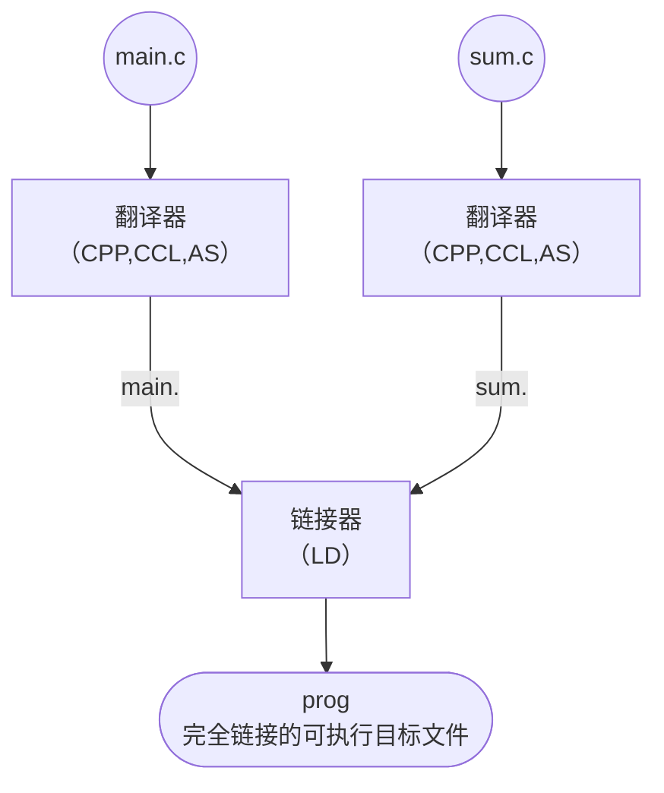
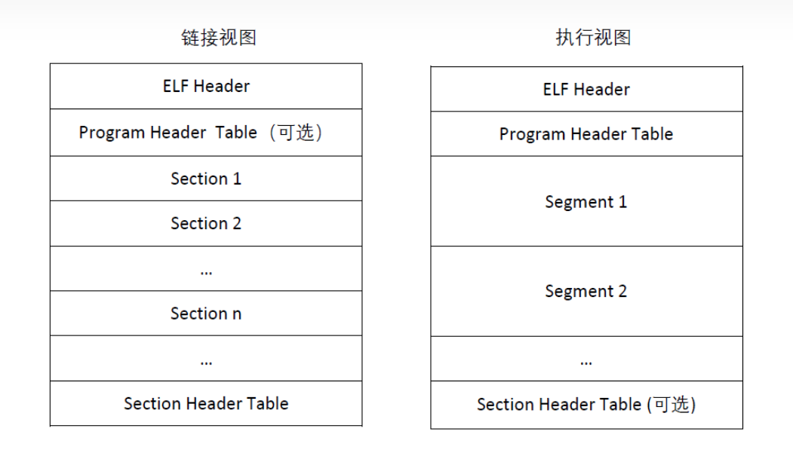

# ld linker script

[toc]


## 什么是ld linker script


### 编译程序的几个阶段

程序编译经历下图四个阶段，链接是编译的最后一步，无论是在PC上编译代码，还是在PC上使用嵌入式gcc工具交叉编译嵌入式代码，编译过程都是如下几步：

- **预处理（Preprocessing）**： **预处理器**
- **编译（Compilation）**： **编译器**
- **汇编（Assembly）**：**汇编器**
- **链接（Linking）**： **链接器**


**预处理阶段：**

1. 预处理器（cpp）将所有的 #define 删除，并且展开所有的宏定义。
2. 处理所有的条件预编译指令，比如 `#if、#ifdef、#elif、#else、#endif` 等。
3. 处理 #include 预编译指令，将被包含的文件直接插入到预编译指令的位置。
4. 删除所有的注释。
5. 添加行号和文件标识，以便编译时产生调试用的行号及编译错误警告行号。
6. 保留所有的 #pragma 编译器指令，因为编译器需要使用它们。
7. 使用 `gcc -E hello.c -o hello.i` 命令来进行预处理， 预处理得到的另一个程序通常是以 `.i` 作为文件扩展名。


**编译阶段：**

编译器（ccl）将预处理完的文本文件 hello.i 进行一系列的词法分析、语法分析、语义分析和优化，翻译成文本文件hello.s，它包含一个汇编语言程序。汇编语言是不同高级语言的不同编译器提供了通用的输出语言。

编译过程可分为6步：**扫描（词法分析）、语法分析、语义分析、源代码优化、代码生成、目标代码优化**。

1. 词法分析：扫描器（Scanner）将源代的字符序列分割成一系列的记号（Token）。lex工具可实现词法扫描。
2. 语法分析：语法分析器将记号（Token）产生语法树（Syntax Tree）。yacc工具可实现语法分析(yacc: Yet Another Compiler Compiler)。
3. 语义分析：静态语义（在编译器可以确定的语义）、动态语义（只能在运行期才能确定的语义）。
4. 源代码优化：源代码优化器(Source Code Optimizer)，将整个语法书转化为中间代码（Intermediate  Code）（中间代码是与目标机器和运行环境无关的）。中间代码使得编译器被分为前端和后端。编译器前端负责产生机器无关的中间代码；编译器后端将中间代码转化为目标机器代码。
5. 目标代码生成：代码生成器(Code Generator).
6. 目标代码优化：目标代码优化器(Target Code Optimizer)。


**汇编阶段：**

汇编器（as）将hello.s翻译成机器语言指令，把这些指令打包成一种叫做**可重定位目标程序**的格式，并将结果保存在目标文件hello.o中，hello.o是一个二进制文件。


**链接阶段：**

hello 程序调用了 printf 函数，它存在于一个名为 printf.o 的单独的预编译好了的目标文件中，而这个文件必须以某种方式合并到我们的 hello.o 程序中。**连接器（ld）就负责处理这种合并**。结果就得到了hello文件，它是一个**可执行目标文件**（或者称为**可执行文件**），可以被加载到内存中，由系统执行。（链接程序运行需要的一大堆目标文件，以及所依赖的其它库文件，最后生成可执行文件）。


## ld linker script

程序链接时，目标文件根据一系列规则合并成可执行文件。这一步骤同时伴随着复杂的符号重定位、段合并和地址空间分配等步骤。

  涉及`u-boot`和`kernel`开发时，编译产出需要根据硬件环境进行特殊适配。例如，需要把指定指令放入固定存储空间内。甚至编译产出为binary类型文件，对指令和数据的分配都有硬性要求。这些对编译产出的精确控制，都离不开`ld linker script`的帮助。


## 链接


**链接（linking）是将各种代码和数据片段收集并组合成为一个单一文件的过程**，这个文件可被加载（复制）到内存并执行。

- 链接可以执行于**编译时（compile time）**，也就是在源代码被翻译成机器代码时；
- 也可以执行于**加载时（load time）**，也就是在程序被**加载器（loader）**加载到内存并执行时；
- 甚至执行于**运行时（run time）**，也就是由应用程序来执行。链接是由叫**链接器（linker）**的程序自动执行的。

**意义：**

链接使得**分离编译（separate compilation）**成为可能，我们不用将一个大型的应用程序组织成一个巨大的源文件，而是可以把它分解成为更小、更好管理的模块，可以独立的修改和编译这些模块。当我们改变这些模块中的一个时，只需要简单的重新编译它，并重新链接应用，而不必重新编译其他文件。

### 

**虚拟内存又叫虚拟存储器（Virtual Memory）**，是建立在主存--辅存物理结构基础上，有附加的硬件装置及操作系统存储管理软件组成的一种存储体系。是一个抽象概念，它为每个进程提供了一个假象，即每个进程都在独占地使用主存。每个进程看到的内存都是一致的，称为**虚拟地址空间**。

它提供了三个重要的能力：

1. 将主存看成一个存储在磁盘上的地址空间的高速缓存，在主存中只保存活动区域，并根据需要在磁盘和主存之间来回传送数据（这里存在“交换空间”以及“页面调度”等概念），通过这种方式，高效地利用主存；
2. 为每个进程提供了统一的地址空间（以虚拟地址编址），从而简化了存储器管理；
3. 操作系统会为每个进程提供独立的地址空间，从而保护了每个进程的地址空间不被其他进程破坏。 

虚拟存储器与虚拟地址空间是两个不同的概念：虚拟存储器是假想的存储器，而虚拟存储空间是假想的内存。它们之间的关系应该与主存储器与内存空间之间的关系类似。


### 示例


贯穿本文的例子：

`main.c` :

```c
#include "stdio.h"

int sum(int *a, int n);

int array[4] = {1, 2, 3, 4};


int main()
{
    int val = sum(array, 4);
    printf("Hello world: %d", val);
    return val;
}
```

`sum.c`:

```c
int sum(int *a, int n)
{
    int i, s = 0;
    for (i = 0; i < n; i ++ ) {
        s += a[i];
    }
    return s;
}
```


大多数编译系统 提供编译器驱动程序（compiler driver)，它代表用户在需要时调用语言预处理器、编译器、汇编器和链接器。
比如 ，要用 GNU 编译系统构，就要 通过在 shell 中输人下列命令来调用 GCC 驱动 程序：

```shell
❯ gcc -Og -o prog main.c sum.c 
❯ ./prog                                                                                                           
Hello world: 10
```


整个过程如下：



- 驱动程序首先运行 C 预处理器（cpp)， 它将 C 的源程序 main.c 翻译成一个 ASCII 码的中间文件 `main.i`

```shell
cpp [other argumets] main.c /tmp/main.i
```

- 驱动程序运行 C 编译器（ccl), 它将 `main.i` 翻译成一个 ASCII 汇编语言文件 `main.s`:

```shell
ccl /tmp/main.i -Og [other argumets] -o /tmp/main.s
```

- 驱动程序运行汇编器（as)，它将 `main.s` 翻译成一 个可重定位目标文件（relocatable object file) `main,o`:

```shell
as [other argumets] -o /tmp/main.o /tmp/main.s
```

- 驱动程序经过相同的过程生成 `sum.o`
- 最后 ，它运行链接器程序 Id, 将 `main.o` 和 `sum.o` 以及 一些必要的系统目标文件组合起来 ，创一个可执行目标文件（executable object file）prog。

```shell
Id -o prog [system object files and args] /tmp/main.o /tmp/sum.o
```


### 静态链接

像 Linux LD 程序这样的静态链接器（static linker）以一组可重定位目标文件和命令行参数作为输入，生成一 个完全链接的、可以加载和运行的可执行目标文件作为输出。

输人的可重定位目标文件由各种不同的代码和数据节(section)组成 ，每一节都是一个连续的字节序列 。


为了构造可执行文件，链接器必须完成两个主要任务：

- **符号解析 (symbol resolution)**。目标文件定义和引用符号，每个符号对应于一个函数、一个全局变量或一个静态变量（即 C 语言中任何以 static 属性声明的变量 ）。<u>符号解析的目的是将每个符号引用正好和一个符号定义关联起来</u>。
  - 多文件声明与调用
  - 调用替换为具体函数入口
- **重定位（relocation）**。 <u>编译器和汇编器生成从地址 0 开始的代码和数据节。链接器通过把每个符号定义与一个内存位置关联起来，从而重定位这些节，然后修改所有对这些符号的引用，使得它们指向这个内存位置</u>。链接器使用汇编器产生的重定位条目（relocation entry）的详 细指令 ，不加甄别地执行这样的重定位
  - 相同段合并，例如 `.text`
  - Section Placement, 各段在内存中的位置


### 目标文件

目标文件有三种形式 ：

- **可重定位目标文件**。包含二进制代码和数据，其形式可以在编译时与其他可重定位目标文件合并起来，创建一个可执行目标文件。
- **可执行目标文件**。包含二进制代码和数据，其形式可以被直接复制到内存并执行。
- **共享目标文件**。一种特殊类型的可重定位目标文件，可以在加载或者运行时被动态地加载进内存并链接。


目标文件是按照特定的目标文件格式来组织的，各个系统的目标文件格式都不相同。

Windows 使用**可移植可执行（Portable Executable，PE)格式**。 Mac OS-X 使用 **Mach-0 格式** 。现代 x86-64 Linux 和 Unix 系统使用**可执行可链接格式（ Execute-able and Linkable Format，ELF)**


### ELF

ELF 全称 “Executable and Linkable Format”，即可执行可链接文件格式，目前常见的Linux、 Android可执行文件、共享库（.so）、目标文件（ .o）以及Core 文件（吐核）均为此格式。

常见的ELF文件大致结构如下：



ELF 文件由 4 部分组成，分别是 ELF 头（ELF header）、程序头表（Program header table）、节（Sections）和节头表（Section header table）。

- ELF Header，ELF文件头，它包含了描述整个文件的基本属性
- ELF 文件中的各个段(section)
- 段表(section header table), 该表描述了 ELF 文件包含的所有段的信息，比如每个段的段名，段的长度等
- 其他一些辅助结构，如字符串表，符号表等

实际上，一个文件中不一定包含全部这些内容，而且它们的位置也未必如上图所示这样安排。只有 ELF 头的位置是固定的，其余各部分的位置、大小等信息由 ELF 头中的各项值来决定。

- **链接视图：**
  - 静态链接器（即编译后参与生成最终 ELF 过程的链接器，如ld ）会以链接视图解析 ELF。
  - 编译时生成的 .o（目标文件）以及链接后的 .so （共享库）均可通过链接视图解析，链接视图可以没有段表（如目标文件不会有段表）。
- **执行视图：**
  - 动态链接器（即加载器，如x86架构 linux下的 /lib/ld-linux.so.2或者安卓系统下的 /system/linker均为动态链接器）会以执行视图解析ELF并动态链接，执行视图可以没有节表。

#### ELF 文件头


##### 1. Elf header


```c
#define EI_NIDENT (16)
typedef struct
{
    unsigned char	e_ident[EI_NIDENT];	/* Magic number and other info */
    Elf_Half		e_type;			/* Object file type */
    Elf_Half		e_machine;		/* Architecture */
    Elf_Word	        e_version;		/* Object file version */
    Elf_Addr		e_entry;		/* Entry point virtual address */
    Elf_Off		e_phoff;		/* Program header table file offset */
    Elf_Off		e_shoff;		/* Section header table file offset */
    Elf_Word	        e_flags;		/* Processor-specific flags */
    Elf_Half		e_ehsize;		/* ELF header size in bytes */
    Elf_Half		e_phentsize;		/* Program header table entry size */
    Elf_Half		e_phnum;		/* Program header table entry count */
    Elf_Half		e_shentsize;		/* Section header table entry size */
    Elf_Half		e_shnum;		/* Section header table entry count */
    Elf_Half		e_shstrndx;		/* Section header string table index */
} Elf_Ehdr;
```

首先说明：ELF header 中的类型，支持从 8 位到 32 位不同架构的处理，有以下类型：

|     名称      | 大小 | 对齐 |        用途        |
| :-----------: | :--: | :--: | :----------------: |
|  Elf32_Addr   |  4   |  4   |   无符号程序地址   |
|  Elf32_Half   |  2   |  2   | 无符号中等大小整数 |
|   Elf32_Off   |  4   |  4   |   无符号文件偏移   |
|  Elf32_Sword  |  4   |  4   |    有符号大整数    |
|  Elf32_Word   |  4   |  4   |    无符号大整数    |
| unsigned char |  1   |  1   |    无符号小整数    |

下面是 ELF 文件头 Elf_Ehdr 的字段说明：

- e_ident ：

  - |   宏名称   | 下标 |      目的      |
    | :--------: | :--: | :------------: |
    |  EI_MAG0   |  0   |    文件标识    |
    |  EI_MAG1   |  1   |    文件标识    |
    |  EI_MAG2   |  2   |    文件标识    |
    |  EI_MAG3   |  3   |    文件标识    |
    |  EI_CLASS  |  4   |     文件类     |
    |  EI_DATA   |  5   |    数据编码    |
    | EI_VERSION |  6   |    文件版本    |
    |   EI_PAD   |  7   | 补齐字节开始处 |

    

  - `e_ident[EI_MAG0]` 到 `e_ident[EI_MAG3]`，即文件的头 4 个字节，被称作 “魔数”，标识该文件是一个 ELF 目标文件

  - 魔数的作用是用来确认文件的类型，操作系统在加载可执行文件时会检验魔数是否正确，如果不正确则会拒绝加载

  - 比如最开始的 4 个字节是所有 ELF 文件都必须相同的标识码：`0x7f`, `0x45`, `0x4c`, `0x46`, 第一字节对应 DEL 控制符的 ASCII 码，后面 3 个字节则正好是 ELF 三个字母的 ASCII 码

  - 第 5 个字节用于标识 ELF 文件类，0x01 表示 32 位，0x02 表示 64 位

  - 第 6 个字节用于标记字节序，规定该 ELF 文件是大端还是小端的

  - 第 7 个字节用于标记 ELF 文件主版本号，一般是 1

  - 后面的 9 个字节，ELF 标准还没有定义，一般填0，有些平台会使用这 9 个字节作为扩展标志

    

- e_type

  - `e_type` 标识目标文件类型。

  - |   名称    |   值   |      意义      |
    | :-------: | :----: | :------------: |
    |  ET_NONE  |   0    |   无文件类型   |
    |  ET_REL   |   1    |  可重定位文件  |
    |  ET_EXEC  |   2    |   可执行文件   |
    |  ET_DYN   |   3    |  共享目标文件  |
    |  ET_CORE  |   4    |  核心转储文件  |
    | ET_LOPROC | 0xff00 | 处理器指定下限 |
    | ET_HIPROC | 0xffff | 处理器指定上限 |

  - 虽然核心转储文件的内容没有被详细说明，但 `ET_CORE` 还是被保留用于标志此类文件。从 `ET_LOPROC` 到 `ET_HIPROC` (包括边界) 被保留用于处理器指定的场景。其它值在未来必要时可被赋予新的目标文件类型。

- e_machine

  - 指定了当前文件可以运行的机器架构。

  - |   名称   |  值  |      意义      |
    | :------: | :--: | :------------: |
    | EM_NONE  |  0   |   无机器类型   |
    |  EM_M32  |  1   | AT&T WE 32100  |
    | EM_SPARC |  2   |     SPARC      |
    |  EM_386  |  3   |  Intel 80386   |
    |  EM_68K  |  4   | Motorola 68000 |
    |  EM_88K  |  5   | Motorola 88000 |
    |  EM_860  |  7   |  Intel 80860   |
    | EM_MIPS  |  8   |  MIPS RS3000   |

- e_version

  - 标识目标文件的版本。

  - |    名称    |  值  |   意义   |
    | :--------: | :--: | :------: |
    |  EV_NONE   |  0   | 无效版本 |
    | EV_CURRENT |  1   | 当前版本 |

- e_entry

  - 系统转交控制权给 ELF 中相应代码的虚拟地址。如果没有相关的入口项，则这一项为 0。
  - 程序的入口地址

- e_phoff

  - 给出**程序头部表**在文件中的字节偏移（**Program Header table OFFset**）。如果文件中没有程序头部表，则为 0。

- e_shoff

  - 给出**节头表**在文件中的字节偏移（ **Section Header table OFFset** ）。如果文件中没有节头表，则为 0。

- e_flags

  - 给出文件中与特定处理器相关的标志，这些标志命名格式为`EF_machine_flag`。

- e_ehsize

  - 给出 ELF 文件头部的字节长度（ELF Header Size）。

- e_phentsize

  - 给出程序头部表中每个表项的字节长度（**Program Header ENTry SIZE**）。每个表项的大小相同。

- e_phnum

  - 给出程序头部表的项数（ **Program Header entry NUMber** ）。因此，`e_phnum` 与 `e_phentsize` 的乘积即为程序头部表的字节长度。如果文件中没有程序头部表，则该项值为 0。

- e_shentsize

  - 给出节头的字节长度（**Section Header ENTry SIZE**）。一个节头是节头表中的一项；节头表中所有项占据的空间大小相同。

- e_shnum

  - 给出节头表中的项数（**Section Header NUMber**）。因此， `e_shnum` 与 `e_shentsize` 的乘积即为节头表的字节长度。如果文件中没有节头表，则该项值为 0。

- e_shstrndx

  - 给出节头表中与节名字符串表相关的表项的索引值（**Section Header table InDeX related with section name STRing table**）。如果文件中没有节名字符串表，则该项值为`SHN_UNDEF`。


##### 2. Program Header Table

Program Header Table 是一个结构体数组，每一个元素的类型是 `Elf32_Phdr`，描述了一个段或者其它系统在准备程序执行时所需要的信息。其中，ELF 头中的 `e_phentsize` 和 `e_phnum` 指定了该数组每个元素的大小以及元素个数。一个目标文件的段包含一个或者多个节。**程序的头部只有对于可执行文件和共享目标文件有意义。**

可以说，Program Header Table 就是专门为 ELF 文件运行时中的段所准备的。

`Elf32_Phdr` 的数据结构如下

```c
typedef struct {
    ELF32_Word  p_type;
    ELF32_Off   p_offset;
    ELF32_Addr  p_vaddr;
    ELF32_Addr  p_paddr;
    ELF32_Word  p_filesz;
    ELF32_Word  p_memsz;
    ELF32_Word  p_flags;
    ELF32_Word  p_align;
} Elf32_Phdr;
```

|   字段   |                             说明                             |
| :------: | :----------------------------------------------------------: |
|  p_type  |        该字段为段的类型，或者表明了该结构的相关信息。        |
| p_offset |     该字段给出了从文件开始到该段开头的第一个字节的偏移。     |
| p_vaddr  |        该字段给出了该段第一个字节在内存中的虚拟地址。        |
| p_paddr  | 该字段仅用于物理地址寻址相关的系统中， 由于 “System V” 忽略了应用程序的物理寻址，可执行文件和共享目标文件的该项内容并未被限定。 |
| p_filesz |         该字段给出了文件镜像中该段的大小，可能为 0。         |
| p_memsz  |         该字段给出了内存镜像中该段的大小，可能为 0。         |
| p_flags  |                 该字段给出了与段相关的标记。                 |
| p_align  | 可加载的程序的段的 p_vaddr 以及 p_offset 的大小必须是 page  的整数倍。该成员给出了段在文件以及内存中的对齐方式。如果该值为 0 或 1 的话，表示不需要对齐。除此之外，p_align 应该是 2  的整数指数次方，并且 p_vaddr 与 p_offset 在模 p_align 的意义下，应该相等。 |


1. p_type : 段类型

可执行文件中的段类型如下

|        名字         |          取值          |                             说明                             |
| :-----------------: | :--------------------: | :----------------------------------------------------------: |
|       PT_NULL       |           0            |         表明段未使用，其结构中其他成员都是未定义的。         |
|       PT_LOAD       |           1            | 此类型段为一个可加载的段，大小由 p_filesz 和 p_memsz 描述。文件中的字节被映射到相应内存段开始处。如果 p_memsz 大于 p_filesz，“剩余” 的字节都要被置为 0。p_filesz 不能大于 p_memsz。可加载的段在程序头部中按照 p_vaddr  的升序排列。 |
|     PT_DYNAMIC      |           2            |                  此类型段给出动态链接信息。                  |
|      PT_INTERP      |           3            | 此类型段给出了一个以 NULL 结尾的字符串的位置和长度，该字符串将被当作解释器调用。这种段类型仅对可执行文件有意义（也可能出现在共享目标文件中）。此外，这种段在一个文件中最多出现一次。而且这种类型的段存在的话，它必须在所有可加载段项的前面。 |
|       PT_NOTE       |           4            |              此类型段给出附加信息的位置和大小。              |
|      PT_SHLIB       |           5            | 该段类型被保留，不过语义未指定。而且，包含这种类型的段的程序不符合 ABI 标准。 |
|       PT_PHDR       |           6            | 该段类型的数组元素如果存在的话，则给出了程序头部表自身的大小和位置，既包括在文件中也包括在内存中的信息。此类型的段在文件中最多出现一次。**此外，只有程序头部表是程序的内存映像的一部分时，它才会出现**。如果此类型段存在，则必须在所有可加载段项目的前面。 |
| PT_LOPROC~PT_HIPROC | 0x70000000 ~0x7fffffff |              此范围的类型保留给处理器专用语义。              |

2. 虚拟地址

**程序头部的虚拟地址可能并不是程序内存中实际的虚拟地址**。通常来说，可执行程序都会包含绝对地址的代码。

- 为了使得程序可以正常执行，段必须在相应的虚拟地址处。
- 另一方面，共享目标文件通常来说包含与地址无关的代码。这可以使得共享目标文件可以被多个进程加载，同时保持程序执行的正确性。尽管系统会为不同的进程选择不同的虚拟地址，但是它仍然保留段的相对地址，**因为地址无关代码使用段之间的相对地址来进行寻址，内存中的虚拟地址之间的差必须与文件中的虚拟地址之间的差相匹配**。

内存中任何段的虚拟地址与文件中对应的虚拟地址之间的差值对于任何一个可执行文件或共享对象来说是一个单一常量值。这个差值就是基地址，基地址的一个用途就是在动态链接期间重新定位程序。

可执行文件或者共享目标文件的基地址是在执行过程中由以下三个数值计算的

- 虚拟内存加载地址
- 最大页面大小
- 程序可加载段的最低虚拟地址

要计算基地址，首先要确定可加载段中 p_vaddr 最小的内存虚拟地址，之后把该内存虚拟地址缩小为与之最近的最大页面的整数倍即是基地址。根据要加载到内存中的文件的类型，内存地址可能与 p_vaddr 相同也可能不同。


3. p_flags：段权限

被系统加载到内存中的程序至少有一个可加载的段。当系统为可加载的段创建内存时，它会按照 p_flags 将段设置为对应的权限。可能的段权限位有：

|    名称     |    取值    |  说明  |
| :---------: | :--------: | :----: |
|    PF_X     |    0x1     | 可执行 |
|    PF_W     |    0x2     |  可写  |
|    PF_R     |    0x4     |  可读  |
| PF_MASKPROC | 0xf0000000 | 未定义 |

- 其中，所有在 PF_MASKPROC 中的比特位都是被保留用于与处理器相关的语义信息。
- 如果一个权限位被设置为 0，这种类型的段是不可访问的
- 下面给出了所有的可能组合
  - 例如，一般来说，.text 段一般具有读和执行权限，但是不会有写权限。数据段一般具有写，读，以及执行权限。

|        Flag        | Value |        Exact         |      Allowable       |
| :----------------: | :---: | :------------------: | :------------------: |
|        none        |   0   |  All access denied   |  All access denied   |
|        PF_X        |   1   |     Execute only     |    Read, Execute     |
|        PF_W        |   2   |      Write only      | Read, Write, Execute |
|    PF_W + PF_X     |   3   |    Write, Execute    | Read, Write, Execute |
|        PF_R        |   4   |      Read only       |    Read, Execute     |
|    PF_R + PF_X     |   5   |    Read, Execute     |    Read, Execute     |
|    PF_R + PF_W     |   6   |     Read, Write      | Read, Write, Execute |
| PF_R + PF_W + PF_X |   7   | Read, Write, Execute | Read, Write, Execute |


4.  段内容 

一个段可能包括一到多个节区，但是这并不会影响程序的加载。尽管如此，我们也必须需要各种各样的数据来使得程序可以执行以及动态链接等等。

下面会给出一般情况下的段的内容。对于不同的段来说，它的节的顺序以及所包含的节的个数有所不同。此外，与处理相关的约束可能会改变对应的段的结构。

| ELK Header |
| :--------: |
|   .text    |
|  .rodata   |
|   .data    |
|    .bss    |
|  .symtab   |
| .rel.text  |
| .rel.data  |
|   .debug   |
|   .line    |
|  .strtab   |
|  节头部表  |

- `.text`：已编译程序的机器代码
- `.rodat_a`: 只读数据，比如 printf 语句中的格式化串和开关语句的跳转表。
- `.data`: 已初始化的全局和静态 C 变量 。
  - 局部 C 变量在运行时被保存在栈中，既不出现在 .data 节中，也不出现在 .bss 节中。
- `.-bss`: 未初始化的全局和静态 C 变量，以及所有被初始化为 0 的全局或静态变量 。
  - 在目标文件中这个节不占据实际的空间，它仅仅是一个占位符。
  - 目标文件格式区分已初始化和未初始化变量是为了空间效率：在目标文件中，未初始化变量不需要占据任何实际的磁盘空间。运行时 ，在内存中分配这些变量，初始值为 0
- `.symtab`: —个符号表，它存放在程序中定义和引用的函数和全局变量的信息。
  - 一些程序员错误地认为必须通过 -g 选项来编译一 个程序，才能得到符号表信息。实际上，每个可重定位目标文件在 .symtab 中都有一张符号表（除非 程序员 特意用 STRIP 命令去掉它）。
  -  然而，和编译器中的符号表不同，.symtab 符号表不包含局部变量的条目。
- `.rel.text`: —个 .text 节中位置的列表，当链接器把这个目标文件和其他文件组合时，需要修改这些位置。
  - 一 般而言，任何调用外部函数或者引用全局变量的指令都需要修改。
  - 另一 方面，调用本地函数的指令则不需要修改。
  - 注意，可执行目标文件中并不需要重定位信息，因此通常省略，除非用户显式地指示链接器包含这些信息。
- `.rel.data`: 被模块引用或定义的所有全局变量的重定位信息。
  - 一 般而言，任何已初始化的全局变量，如果它的初始值是一个全局变量地址或者外部定义函数的地址，都需要被修改。

- `.debug`：调试符号表，其条目是程序中定义的局部变量和类型定义，程序中定义和引用的全局变量 ，以及原始的 C 源文件 。
  - 只有以 -g 选项调用编译器驱动程序时 ，才有此表

- `.line`: 原始 C 源程序中的行号和 .text 节中机器指令之间的映射。
  - 只有以 -g 选项调用编译器驱动程序时，才会得到这 张表。
- `.strtab`: —个字符串表，其内容包括 .symtab 和 .debug 节中的符号表，以及节头部中的令名字。字符串表就是以 null 结 尾的字符串的序列。


##### 3. Section Header Table

这个数据结构是在 ELF 文件的尾部。该结构用于定位 ELF 文件中的每个节区的具体位置。

首先，ELF 头中的 `e_shoff` 项给出了从文件开头到节头表位置的字节偏移。`e_shnum` 告诉了我们节头表包含的项数；`e_shentsize` 给出了每一项的字节大小。

其次，节头表是一个数组，每个数组的元素的类型是 `ELF32_Shdr` ，每一个元素都描述了一个节区的概要内容。

每个节区头部可以用下面的数据结构 ELF32_Shdr 进行描述：

```c
typedef struct {
    ELF32_Word      sh_name;
    ELF32_Word      sh_type;
    ELF32_Word      sh_flags;
    ELF32_Addr      sh_addr;
    ELF32_Off       sh_offset;
    ELF32_Word      sh_size;
    ELF32_Word      sh_link;
    ELF32_Word      sh_info;
    ELF32_Word      sh_addralign;
    ELF32_Word      sh_entsize;
} Elf32_Shdr;
```


| 成员         | 说明                                                         |
| :----------- | ------------------------------------------------------------ |
| sh_name      | 节名称，是节区头字符串表节区中（Section Header String Table Section）的索引，因此该字段实际是一个数值。在字符串表中的具体内容是以 NULL 结尾的字符串。 |
| sh_type      | 根据节的内容和语义进行分类，具体的类型下面会介绍。           |
| sh_flags     | 每一比特代表不同的标志，描述节是否可写，可执行，需要分配内存等属性。 |
| sh_addr      | 如果节区将出现在进程的内存映像中，此成员给出节区的第一个字节应该在进程镜像中的位置。否则，此字段为 0。 |
| sh_offset    | 给出节区的第一个字节与文件开始处之间的偏移。SHT_NOBITS 类型的节区不占用文件的空间，因此其 sh_offset 成员给出的是概念性的偏移。 |
| sh_size      | 此成员给出节区的字节大小。除非节区的类型是 SHT_NOBITS ，否则该节占用文件中的 sh_size 字节。类型为 SHT_NOBITS 的节区长度可能非零，不过却不占用文件中的空间。 |
| sh_link      | 此成员给出节区头部表索引链接，其具体的解释依赖于节区类型。   |
| sh_info      | 此成员给出附加信息，其解释依赖于节区类型。                   |
| sh_addralign | 某些节区的地址需要对齐。例如，如果一个节区有一个 doubleword 类型的变量，那么系统必须保证整个节区按双字对齐。也就是说，sh_addr%sh_addralign=0。目前它仅允许为 0，以及 2 的正整数幂数。 0 和 1 表示没有对齐约束。 |
| sh_entsize   | 某些节区中存在具有固定大小的表项的表，如符号表。对于这类节区，该成员给出每个表项的字节大小。反之，此成员取值为 0。 |

- sh_type 节类型目前有下列可选范围，其中 SHT 是 **Section Header Table** 的简写。

| 名称         | 取值       | 说明                                                         |
| ------------ | ---------- | ------------------------------------------------------------ |
| SHT_NULL     | 0          | 该类型节区是非活动的，这种类型的节头中的其它成员取值无意义。 |
| SHT_PROGBITS | 1          | 该类型节区包含程序定义的信息，它的格式和含义都由程序来决定。 |
| SHT_SYMTAB   | 2          | 该类型节区包含一个符号表（**SYMbol TABle**）。目前目标文件对每种类型的节区都只 能包含一个，不过这个限制将来可能发生变化。 一般，SHT_SYMTAB 节区提供用于链接编辑（指 ld 而言） 的符号，尽管也可用来实现动态链接。 |
| SHT_STRTAB   | 3          | 该类型节区包含字符串表（ **STRing TABle** ）。               |
| SHT_RELA     | 4          | 该类型节区包含显式指定位数的重定位项（ **RELocation entry with Addends** ），例如，32 位目标文件中的 Elf32_Rela 类型。此外，目标文件可能拥有多个重定位节区。 |
| SHT_HASH     | 5          | 该类型节区包含符号哈希表（ **HASH table** ）。               |
| SHT_DYNAMIC  | 6          | 该类型节区包含动态链接的信息（ **DYNAMIC linking** ）。      |
| SHT_NOTE     | 7          | 该类型节区包含以某种方式标记文件的信息（**NOTE**）。         |
| SHT_NOBITS   | 8          | 该类型节区不占用文件的空间，其它方面和 SHT_PROGBITS 相似。尽管该类型节区不包含任何字节，其对应的节头成员 sh_offset 中还是会包含概念性的文件偏移。 |
| SHT_REL      | 9          | 该类型节区包含重定位表项（**RELocation entry without Addends**），不过并没有指定位数。例如，32 位目标文件中的 Elf32_rel 类型。目标文件中可以拥有多个重定位节区。 |
| SHT_SHLIB    | 10         | 该类型此节区被保留，不过其语义尚未被定义。                   |
| SHT_DYNSYM   | 11         | 作为一个完整的符号表，它可能包含很多对动态链接而言不必 要的符号。因此，目标文件也可以包含一个 SHT_DYNSYM 节区，其中保存动态链接符号的一个最小集合，以节省空间。 |
| SHT_LOPROC   | 0X70000000 | 此值指定保留给处理器专用语义的下界（ **LOw PROCessor-specific semantics** ）。 |
| SHT_HIPROC   | OX7FFFFFFF | 此值指定保留给处理器专用语义的上界（ **HIgh PROCessor-specific semantics** ）。 |
| SHT_LOUSER   | 0X80000000 | 此值指定保留给应用程序的索引下界。                           |
| SHT_HIUSER   | 0X8FFFFFFF | 此值指定保留给应用程序的索引上界。                           |

- sh_flags 字段的每一个比特位都可以给出其相应的标记信息，其定义了对应的节区的内容是否可以被修改、被执行等信息。

| 名称          | 值         | 说明                                                         |
| ------------- | ---------- | ------------------------------------------------------------ |
| SHF_WRITE     | 0x1        | 这种节包含了进程运行过程中可以被写的数据。                   |
| SHF_ALLOC     | 0x2        | 这种节在进程运行时占用内存。对于不占用目标文件的内存镜像空间的某些控制节，该属性处于关闭状态 (off)。 |
| SHF_EXECINSTR | 0x4        | 这种节包含可执行的机器指令（**EXECutable INSTRuction**）。   |
| SHF_MASKPROC  | 0xf0000000 | 所有在这个掩码中的比特位用于特定处理器语义。                 |

- sh_link 和 sh_info

| sh_type               | sh_link                                                      | sh_info                    |
| --------------------- | ------------------------------------------------------------ | -------------------------- |
| SHT_DYNAMIC           | 节区中使用的字符串表的节头索引                               | 0                          |
| SHT_HASH              | 此哈希表所使用的符号表的节头索引                             | 0                          |
| SHT_REL/SHT_RELA      | 与符号表相关的节头索引                                       | 重定位应用到的节的节头索引 |
| SHT_SYMTAB/SHT_DYNSYM | 操作系统特定信息，Linux 中的 ELF 文件中该项指向符号表中符号所对应的字符串节区在 Section Header Table 中的偏移。 | 操作系统特定信息           |
| other                 | `SHN_UNDEF`                                                  | 0                          |


### 符号与符号表

每个可重定位目标模块 m 都有一个符号表，它包含 m 定义和引用的符号的信息 。在链接器的上下文中，有三种不同的符号 ：

* **由模块 m 定义并能被其他模块引用的全局符号** 。全局链接器符号对应于<u>非静态的 C 函数和全局变量</u>。
* **由其他模块定义并被模块 m 引用的全局符号** 。这些符号称为<u>外部符号</u>，对于<u>在其他模块中定义的非静态 C 函数和全局变量</u>。
* **只被模块 m 定义和引用的局部符号**。它们<u>对应于带 static 属性的 C 函数和全局变量</u> 。这些符号在模块 m 中任何位置都可见，但是不能被其 他模块引用。

**.symtab 中的符号表不包含对应于本地非静态程序变量的任何符号**。这些符号在运行时在栈中被管理，链接器对此类符号不感兴趣。

<u>定义为带有 C static 属性的本地过程变量是不在栈中管理的。相反 ，编译器在 .data 或 .bss 中为每个定义分配空间，并在符号表中创建一 个有唯一名字的本地链接器符号</u> 。任何带有 static 属性声明的全局变量或者函数都是模块私有的。


符号表是由汇编器构造的，使用编译器输出到汇编语言 .s 文件中的符号。.symtab 节中包含 ELF 符号表 。


### 符号解析


#### 1. 链接器解析全局变量

链接器的输入是一 组可重定位目标模块。每个模块定义一组符号，有些是局部的（只对定义该符号的模块可见），有些是全局的（对其他模块也可见）。如果多个模块定义同名的全局符号，该如何解析？

- 函数和已初始化的全局变量是**强符号**
- 未初始化的全局变量是**弱符号**。


根据强弱符号的定义，Linux 链接器使用下面的规则来处理多重 定义的 符号名 ：
* 规则 1：<u>不允许有多个同名的强符号</u>。
* 规则 2： <u>如果有一个强符号和多个弱符号同名，那么选择强符号</u>。
* 规则 3：<u>如果有多个弱符号同名，那么从这些弱符号中任意选择 一个</u>


### 与静态库链接


#### 概述

所有的编译系统都提供一种机制，<u>将所有相关的目标模块打包成为一个单独的文件</u>，称为**静态库**（static library），它可以用做链接器的输人。
**当链接器构造一个输出的可执行文件时，它只复制静态库里被应用程序引用的目标模块**。


相关的函数可以被编译为独立的目标模块，然后封装成一个单独的静态库文件。然后，应用程序可以通过在命令行上指定单独的文件名字来使用这些在库中定义的函数。比如，使用 C 标准库和数学库中函数的程序可以用形式如下的命令行来编译和链接 ：

```shell
gcc main.c /usr/lib/libm.a /usr/lib/libc.a
```

在链接时，链接器**将只复制被程序引用的目标模块**，这就减少了可执行文件在磁盘和内存中的大小。另一方面 ，应用程序员只需要包含较少的库文件的名字（实际上，C 编译 器驱动程序总是传送 libc.a 给链接器，所以前面提到的对 libc.a 的引用是不必要的）。


静态库：在 Linux 系统中，**静态库以一种称为存档（archive）的特殊文件格式存放在磁盘中**。<u>存档文件是一组连接起来的可重定位目标文件的集合，有一个头部用来描述每个成员目标文件的大小和位置</u>。**存档文件名由后缀 .a 标识**。


#### **如何创建静态链接库？** 

以上面提到的 `sum.c` 和 `main.c` 文件为例，将 `sum.c` 创建成为一个静态链接库

```shell
❯ gcc -c sum.c  
❯ ls                                                                                                              
main.c  sum.c  sum.o

❯ ar rcs libsum.a sum.o 
❯ ls                                                                                                               
libsum.a  main.c  sum.c  sum.o

```


静态库链接库生成好后，可以直接通过链接器进行使用：

```shell
❯ gcc -c main.c 
❯ ls   
libsum.a  main.c  main.o  sum.c  sum.o

❯ gcc -static -o prog main.o ./libsum.a
❯ ./prog  
Hello world: 10
```

或者使用：

```shell
❯ gcc -c main.c 
❯ ls   
libsum.a  main.c  main.o  sum.c  sum.o

❯ gcc -static -o prog main.o -L./ -lsum 
```


- `-static` 参数告诉编译器驱动程序，链接器应该构建一个完全链接的可执行目标文件，它可以加载到内存并运行，在加载时无须更进一步的链接。
- `-lsum` 参数是 libsum.a 的缩写，文件的格式是 lib + "-l参数" + .a
- `-L./` 参数告诉链接器在当前目录下査找


#### 链接器如何使用静态库来解析引用

**在符号解析阶段，链接器<u>从左到右</u>按照它们在编译器驱动程序<u>命令行上出现的顺序</u>来扫描可重定位目标文件和存档文件** 。

这种算法会导致一些令人困扰的链接时错误，因为命令行上的库和目标文件的顺序非常重要。在命令行中，<u>如果定义一个符号的库出现在引用这个符号的目标文件之前，那么引用就不能被解析，链接会失败</u>。


### 重定位


一旦链接器完成了符号解析这一步，就把代码中的每个符号引用和正好一个符号定义（即它的一个输入目标模块中的一个符号表条目）关联起来 。此时，链接器就知道它的输人目标模块中的代码节和数据节的确切大小 。现在就可以开始**重定位**步骤了，在这个步骤中，将合并输人模块，并 为每个符号分配运行时地址。重定 位由两 步组成 ：

- **重定位节和符号定义**。
  - 在这一步中，链接器将所有相同类型的节合并为同一类型的新的聚合节。例如，来自所有输人模块的 .data 节被全部合并成一个节，这个节成为输出的可执行目标文件的.data节。
  - 然后，链接器将运行时内存地址赋给新的聚合节，赋给输入模块定义的每个节，以及赋给输入模块定义的每个符号。当这一步
    完成时，程序中的每条指令和全局变量都有唯一的运行时内存地址了。
- **重定位节中的符号引用**。
  - 在这一步中，链接器修改代码节和数据节中对每个符号的引用，使得它们指向正确的运行时地址。要执行这一步，链接器依赖于可重定位目标模块中称为重定位条目（relocationentry）的数据结构。


### 动态链接库


#### 概述

共享库（sharedlibrary）是致力于解决静态库缺陷的一个现代创新产物。共享库是一个目标模块，**在运行或加载时，可以加载到任意的内存地址，并和一个在内存中的程序链接起来**。这个**过程称为动态链接**（dynamic linking），是由一个叫做动态链接器（dynamiclinker）的程序来执行的。共享库也称为共享目标（shared object），**在Linux系统中通常用 .so 后缀来表示**。微软的操作系统大量地使用了共享库，它们称为 DLL (动态链接库）。


共享库是以两种不同的方式来“共享”的。

- 首先，在任何给定的文件系统中，对于一个库只有一个.so文件。**所有引用该库的可执行目标文件共享这个 .so 文件中的代码和数据**，而不是像静态库的内容那样被复制和嵌人到引用它们的可执行的文件中。
- 其次，在内存中，一个共享库的 .text 节的一个副本可以被不同的正在运行的进程共享。


#### 如何创建动态链接库？

同样还是以 `sum.c` 和 `main.c` 示例。


创建动态链接库：

```shell
❯ gcc -shared -fpic -o libsum.so sum.c 
❯ ls 
libsum.so  main.c  sum.c

```

- `-fpic` 选项指示编译器生成与位置无关的代码。
- `-shared` 选项指示链接器创建一个共享的目标文件 。


一旦创建了这个库 ，随后就要将它链接到 `main.c` 程序中

```shell
❯ gcc -o prog main.c ./libsum.so
❯ ./prog  
Hello world: 10%
```


#### 从应用程序中加载和链接共享库

前面已经讨论了<u>在应用程序被加载后执行前时</u>，动态链接器加载和链接共享库的情景。然而，<u>**应用程序还可以在它运行时要求动态链接器加载和链接某个共享库**</u>，无需在编译时将那些库链接到应用中。


Linux系统为动态链接器提供了一个简单的接口，允许应用程序在运行时加载和链接共享库：

```c
#include <dlfcn.h>
void *dlopen(const char *filename, int flag);
// 返回：若成功则为指向句柄的指针，若出错则为 NULL
```

dlopen 函数加载和链接共享库 filename。

- 用带 RTLD_GLOBAL 选项打开了的库解析 filename 中的外部符号。
- 如果当前可执行文件是带 `-rdynamic` 选项编译的，那么对符号解析而言，它的全局符号也是可用的。
- flag参数必须要么包括 RTLD_NOW，该标志告诉链接器立即解析对外部符号的引用，要么包括 RTLD_LAZY 标志，该标志指示链接器推
  迟符号解析直到执行来自库中的代码。这两个值中的任意一个都可以和 RTLD_GLOBAL 标志取或。


dlsym 函数判断动态链接库是否存在。

- 输入是一个指向前面已经打开了的享库的句柄和一个symbol名字
- 如果该符号存在，就返回符号的地址，否则返回NULL

```c
#include <dlfcn.h>
void *dlsym(void *handle, char *symbol);
// 返回：若成功则为指向符号的指针，若出错则为 NULL
```


如果没有其他享库还在使用这个共享库，dlclose 函数就卸载该共享库。

```c
#include <dlfcn.h>
int dlclose (void *handle);
// 返回：若成功则为 0, 若出错则为 -1
```


dlerror 函数返回一个字符串，它描述的是调用 dlopen、dlsym 或者 dlclose 函数时发生的最近的错误，如果没有错误发生，就返回NULL。

```c
#include <dlfcn.h>
const char *dlerror(void);
// 返回：如果前面对 dlopen、dlsym 或 dlclose 的调用 失败，则为错误消息，如果前面的调用成功，则为 NULL
```


#### 位置无关代码


可以加载而无需重定位的代码称为位置无关代码（Position-IndependentCode，PIC），用户对 GCC 使用 `-fpic` 选项指示 GNU 编译系统生成PIC代码。**共享库的编译必须总是使用该选项**。


#### 库打桩机制


Linux链接器支持一个很强大的技术，称为**库打桩**（library interpositioning），它**允许你截获对共享库函数的调用，取而代之执行自己的代码**。

使用打桩机制，你可以追踪对某个特殊库函数的调用次数，验证和追踪它的输入和输出值，或者甚至把它替换成一个完全不同的实现。

下面是它的基本思想（python 装饰器）：

- 给定一个需要打桩的目标函数，创建一个包装函数，它的原型与目标函数完全一样。
- 使用某种特殊的打桩机制，你就可以欺骗系统调用包装函数而不是目标函数了。
- 包装函数通常会执行它自己的逻辑，然后调用目标函数，再将目标函数的返回值传递给调用者。


## ld linker script


详细说明：

https://sourceware.org/binutils/docs/ld/


### 语法


#### 1. 指定程序入口


​    使用ENTRY指令指定程序入口。格式为如下。

> ENTRY(*symbol*)

​    其它指定入口方式如下。

- 使用命令行 -e 参数
- 使用`ENTRY(symbol)`指令
- 平台相关定义，众多平台为 start
- .text 段的第一个字节
- 地址零


##### 2. 包含其它链接脚本

> INCLUDE *filename*


##### 3. 指定输入文件

> INPUT (*filename*, *filename*, ...)

> INPUT (*filename* *filename* ...)

​    如果指定`INPUT (-lfile)`形式时，`ld`会转化为`lib*file*.a`形式。


##### 4. 输出文件名

> OUTPUT(*filename*)

​    支持命令行-o 参数设置输出文件名。


##### 5. 设置二进制文件搜索路径

> SEARCH_DIR(*path*)


##### 6. 设置首个输入文件

> STARTUP(*filename*)

​    设置文件为第一个输入文件，相当于在命令行指定文件为第一个参数。


##### 7. 测试示例


​    测试示例为该级目录下的`01`文件夹。`linker script`脚本如下。

```
ENTRY(main)
INPUT(tool.o tool_base.o)
STARTUP(app.o)
OUTPUT(app)

SECTIONS
{
  . = 0x400000;
  .text : { *(.text) }
  . = 0x8000000;
  .data : { *(.data) }
  . = 0xc000000;
  .bss : { *(.bss) }
}
```

​    

##### 8. 指定输出文件格式


> OUTPUT_FORMAT(*bfdname*) OUTPUT_FORMAT(default, big, little)

​    `OUTPUT_FORMAT`命令指定输出文件的格式。其用法和命令行的中`--oformat bfdname`参数一致。

​    可以通过`objdump -i`命令查看所有的bfd格式。本机的格式输出如下图。

```
BFD header file version (GNU Binutils for Debian) 2.28
elf64-x86-64
 (header little endian, data little endian)
  i386
elf32-i386
 (header little endian, data little endian)
  i386
elf32-iamcu
 (header little endian, data little endian)
  iamcu
elf32-x86-64
 (header little endian, data little endian)
  i386
a.out-i386-linux
 (header little endian, data little endian)
  i386
pei-i386
 (header little endian, data little endian)
  i386
pei-x86-64
 (header little endian, data little endian)
  i386
elf64-l1om
 (header little endian, data little endian)
  l1om
elf64-k1om
 (header little endian, data little endian)
  k1om
elf64-little
 (header little endian, data little endian)
  i386
  l1om
  k1om
  iamcu
  plugin
elf64-big
 (header big endian, data big endian)
  i386
  l1om
  k1om
  iamcu
  plugin
elf32-little
 (header little endian, data little endian)
  i386
  l1om
  k1om
  iamcu
  plugin
elf32-big
 (header big endian, data big endian)
  i386
  l1om
  k1om
  iamcu
  plugin
pe-x86-64
 (header little endian, data little endian)
  i386
pe-bigobj-x86-64
 (header little endian, data little endian)
  i386
pe-i386
 (header little endian, data little endian)
  i386
plugin
 (header little endian, data little endian)
srec
 (header endianness unknown, data endianness unknown)
  i386
  l1om
  k1om
  iamcu
  plugin
symbolsrec
 (header endianness unknown, data endianness unknown)
  i386
  l1om
  k1om
  iamcu
  plugin
verilog
 (header endianness unknown, data endianness unknown)
  i386
  l1om
  k1om
  iamcu
  plugin
tekhex
 (header endianness unknown, data endianness unknown)
  i386
  l1om
  k1om
  iamcu
  plugin
binary
 (header endianness unknown, data endianness unknown)
  i386
  l1om
  k1om
  iamcu
  plugin
ihex
 (header endianness unknown, data endianness unknown)
  i386
  l1om
  k1om
  iamcu
  plugin

         elf64-x86-64 elf32-i386 elf32-iamcu elf32-x86-64 a.out-i386-linux 
    i386 elf64-x86-64 elf32-i386 ----------- elf32-x86-64 a.out-i386-linux
    l1om ------------ ---------- ----------- ------------ ----------------
    k1om ------------ ---------- ----------- ------------ ----------------
   iamcu ------------ ---------- elf32-iamcu ------------ ----------------
  plugin ------------ ---------- ----------- ------------ ----------------

         pei-i386 pei-x86-64 elf64-l1om elf64-k1om elf64-little elf64-big 
    i386 pei-i386 pei-x86-64 ---------- ---------- elf64-little elf64-big
    l1om -------- ---------- elf64-l1om ---------- elf64-little elf64-big
    k1om -------- ---------- ---------- elf64-k1om elf64-little elf64-big
   iamcu -------- ---------- ---------- ---------- elf64-little elf64-big
  plugin -------- ---------- ---------- ---------- elf64-little elf64-big

         elf32-little elf32-big pe-x86-64 pe-bigobj-x86-64 pe-i386 plugin srec 
    i386 elf32-little elf32-big pe-x86-64 pe-bigobj-x86-64 pe-i386 ------ srec
    l1om elf32-little elf32-big --------- ---------------- ------- ------ srec
    k1om elf32-little elf32-big --------- ---------------- ------- ------ srec
   iamcu elf32-little elf32-big --------- ---------------- ------- ------ srec
  plugin elf32-little elf32-big --------- ---------------- ------- ------ srec

         symbolsrec verilog tekhex binary ihex 
    i386 symbolsrec verilog tekhex binary ihex
    l1om symbolsrec verilog tekhex binary ihex
    k1om symbolsrec verilog tekhex binary ihex
   iamcu symbolsrec verilog tekhex binary ihex
  plugin symbolsrec verilog tekhex binary ihex
```

​    

##### 9. 指定输入文件格式

> TARGET(*bfdname*)

​    该指令影响`INPUT`和`GROUP`指令。等同于命令行`-b bfdname`参数。如果TARGET参数被使用，而`OUTPUT_FORMAT`参数未使用，则输出文件时指定为`TARGET`的最后一个参数。


##### 10. 存储别名

> REGION_ALIAS(*alias*, *region*)

​    给存储单元`*region*`指定别名`*alias*`。

```
MEMORY
  {
    RAM : ORIGIN = 0, LENGTH = 4M
  }

REGION_ALIAS("REGION_TEXT", RAM);
REGION_ALIAS("REGION_RODATA", RAM);
REGION_ALIAS("REGION_DATA", RAM);
REGION_ALIAS("REGION_BSS", RAM);
```

​    

​    上述例子中，RAM被指定REGION_TEXT、REGION_RODATA、REGION_DATA和REGION_BSS四个别名。


##### 11. 断言

> ASSERT(exp, message)


##### 12. 声明外部符号

> EXTERN(symbol symbol ...)


.......


## 常用的编译命令


### 1. as 命令

as 命令是二进制工具集 GNU Binutils 的一员，是 GNU 推出的一款汇编语言编译器集，用于将汇编代码编译为二进制代码，它支持多种不同类型的处理器。 

as 命令，其格式为 `as [选项] 汇编文件` 。

常用参数：

|     选项     |              说明              |
| :----------: | :----------------------------: |
|     -ac      |          忽略失败条件          |
|     -ad      |          忽略调试指令          |
|     -ah      |           包括高级源           |
|     -al      |            包括装配            |
|     -am      |           包括宏扩展           |
|     -an      |          忽略形式处理          |
|     -as      |            包括符号            |
|    =file     |       设置列出文件的名字       |
| --alternate  |        以交互宏模式开始        |
|      -f      |      跳过空白和注释预处理      |
|      -g      |          产生调试信息          |
|      -J      |  对于有符号溢出不显示警告信息  |
|      -L      |     在符号表中保留本地符号     |
|      -o      |      指定要生成的目标文件      |
| --statistics | 打印汇编所用的最大空间和总时间 |
|  --32/--64   |        生成32/64位代码         |


实例：

```shell
as --64 -o head.o head.s
```

这条命令的作用是把汇编源文件 head.s 编译成 64 位的二进制程序段，并将其保存在文件 head.o 里。之所以将 head.o 文件称为二进制程序段而不是二进制程序，是因为 head.o 文件不是可执行文件，它需要经过链接后，才能成为可执行程序。


### 2. gcc 命令

gcc命令来自英文词组 GNU Compiler Collection 的缩写，是 C/C++ 语言编译器。gcc 是开源领域使用最广泛的编译工具，具有功能强大、兼容性强、效率高等特点。

编译工作由4个阶段组成：预编译（Preprocessing）、编译（Compilation）、汇编（Assembly）、链接（Linking）。

- 预处理，**生成 `.i` 的文件**[预处理器cpp] 
- 将预处理后的文件转换成汇编语言,，**生成文件 `.s`** [编译器egcs] 
- 有汇编变为目标代码(机器代码)**生成 `.o` 的文件**[汇编器as] 
- 连接目标代码，**生成可执行程序** [链接器ld] 


语法: `gcc (选项) (参数)`


1. **gcc 基本使用**

最常用的有以下参数：

- `-c` ：**只编译，不链接成为可执行文件**。编译器只是由输入的 .c 等源代码文件生成 .o 为后缀的目标文件，通常用于编译不包含主程序的子程序文件。
- `-o output_filename` ：**确定输出文件的名称**为output_filename。同时这个名称不能和源文件同名。如果不给出这个选项，gcc就给出默认的可执行文件 a.out 。
- `-g`：**产生符号调试工具**（GNU的 gdb）所必要的符号信息。想要对源代码进行调试，就必须加入这个选项。
- `-O`：**对程序进行优化编译、链接**。采用这个选项，整个源代码会在编译、链接过程中进行优化处理，这样产生的可执行文件的执行效率可以提高，但是编译、链接的速度就相应地要慢一些，而且对执行文件的调试会产生一定的影响，造成一些执行效果与对应源文件代码不一致等一些令人“困惑”的情况。因此，一般在编译输出软件发行版时使用此选项。
- `-O2`：比 -O 更好的优化编译、链接。当然整个编译链接过程会更慢。
- `-Idirname`：**将 dirname 所指出的目录加入到程序头文件目录列表中，是在预编译过程中使用的参数**。
- `-C` ：在预处理过程中，它不删除注释信息，通常情况下和-E联合使用。
- `-mcmodel=large` ：mcmodel 用于限制程序访问的地址空间，选项 large 表明程序可访问任何虚拟地址空间，其他选择无法使程序访问整个虚拟地址空间。
- `-fno-builtin` ：除非使用前缀__builtin_明确引用，否则编译器不识别所有系统内建函数。常见的系统内建函数有alloca、memcpy等
- `-m32/-m64`：生成32/64位代码

编译过程的分步执行：为了更好地理解gcc的工作过程，可以让在gcc工作的4个阶段中的任何一个阶段中停止下来。相关的参数有：

-  `-E` 预编译后停下来，生成后缀为 `.i` 的预编译文件。 它使编译器只执行预处理过程，不执行编译、汇编、链接等过程，也不会生成目标文件，此时需要将源文件预处理的结果重定向到一个输出文件中
- `-c` 编译后停下来，生成后缀为 `.o` 的目标文件。 
- `-S` 汇编后停下来，生成后缀为 `.s` 的汇编源文件。


2. **警告提示功能选项**


gcc包含完整的出错检查和警告提示功能，它们可以帮助Linux程序员写出更加专业的代码。 

- `-pedantic` 选项： 当gcc在编译不符合 ANSI/ISO C 语言标准的源代码时，将产生相应的警告信息。
- `-wall` ： 显示警告信息。除了 `-pedantic` 之外，gcc 还有一些其他编译选项，也能够产生有用的警告信息。这些选项大多以 -W 开头。其中最有价值的当数 `-Wall` 了，使用它能够使 gcc 产生尽可能多的警告信息。
- `-Werror` 选项 ：在处理警告方面，另一个常用的编译选项是 -Werror。它**要求 gcc 将所有的警告当成错误进行处理**，这在使用自动编译工具（如 Make  等）时非常有用。如果编译时带上 -Werror 选项，那么 gcc  会在所有产生警告的地方停止编译，迫使程序员对自己的代码进行修改。只有当相应的警告信息消除时，才可能将编译过程继续朝前推进。


3. **库操作选项**

在Linux下开发软件时，完全不使用第三方函数库的情况是比较少见的，通常来讲都需要借助一个或多个函数库的支持才能够完成相应的功能。 从程序员的角度看，函数库实际上就是一些头文件（.h）和库文件（.so 或 .a）的集合。虽然**Linux下的大多数函数都默认将头文件放到  /usr/include/ 目录下，而库文件则放到 /usr/lib/ 目录下**，但并不是所有的情况都是这样。

正因如此，gcc  在编译时必须有自己的办法来查找所需要的头文件和库文件。常用的方法有： 

- `-I` ： **可以向 gcc 的头文件搜索路径中添加新的目录**。 
- `-L` ： **如果使用了不在标准位置的链接库文件，那么可以通过 -L 选项向 gcc 的库文件搜索路径中添加新的目录**。 
- `-l` ： Linux下的**库文件在命名**时有一个约定，就是应该**以 lib 这3个字母开头**，由于所有的库文件都遵循了同样的规范，因此在用 `-l`  选项指定链接的库文件名时可以省去 lib 这3个字母。例如，gcc 在对 -lfoo 进行处理时，会自动去链接名为 libfoo.so 的文件。 
- `-static` ： Linux下的库文件分为两大类，分别是：动态链接库（通常以 .so 结尾）和静态链接库（通常以 .a 结尾）。 两者的差别仅在程序执行时所需的代码是在运行时动态加载的，还是在编译时静态加载的。 默认情况下，**gcc 在链接时优先使用动态链接库**，<u>只有当动态链接库不存在时才考虑使用静态链接库</u>。 如果需要的话，可以在编译时加上 <u>-static 选项，强制使用静态链接库</u>。
- `-shared`： **创建共享库/动态库**，**生成一个共享的目标文件**，它能够与其他的目标一起链接生成一个可执行的文件。


4. **调试选项**

对于Linux程序员来讲，gdb（GNU Debugger）通过与 gcc 的配合使用，为基于Linux的软件开发提供了一个完善的调试环境。常用的有：

- `-g` 和 `-ggdb` ： 默认情况下，gcc 在编译时不会将调试符号插入到生成的二进制代码中，因为这样会增加可执行文件的大小。**如果需要在编译时生成调试符号信息，可以使用 gcc 的 -g 或 -ggdb 选项**。 
  - gcc 在产生调试符号时，同样采用了分级的思路，开发人员可以通过在 -g 选项后附加数字1、2、3指定在代码中加入调试信息的多少。
  - 默认的级别是2（-g2），此时产生的调试信息包括：扩展的符号表、行号、局部或外部变量信息。 
  - 级别3（-g3）包含级别2中的所有调试信息以及源代码中定义的宏。 
  - 级别1（-g1）不包含局部变量和与行号有关的调试信息，因此只能够用于回溯跟踪和堆栈转储。 回溯追踪：指的是监视程序在运行过程中函数调用历史。 堆栈转储：则是一种以原始的十六进制格式保存程序执行环境的方法。
  - 注意：使用任何一个调试选项都会使最终生成的二进制文件的大小急剧增加，同时增加程序在执行时的开销，因此，调试选项通常仅在软件的开发和调试阶段使用。

- `-p` 和 `-pg` ： **会将剖析（Profiling）信息加入到最终生成的二进制代码中**。剖析信息对于找出程序的性能瓶颈很有帮助，是协助Linux程序员开发出高性能程序的有力工具。
- `-save-temps` ：保存编译过程中生成的一些列中间文件。


实例：

```shell
gcc -E entry.S > entry.s
```

这条命令的作用是对汇编源文件 entry.S 进行预处理，同时将预处理的结果重定向（导出）到目标文件entry.s中。

注意：如果注释符在编译过程中引发错误，可尝试将注释符 '//' 改为 '/* */'


```shell
gcc -mcmodel=large -fno-builtin -m64-c main.c
```

这条命令的作用是将C语言源文件main.c编译成64位的二进制程序段文件main.o。与此同时，这条命令还不限制地址空间的访问范围、不识别所有系统内建函数。


### 3. ld 命令

ld命令是二进制工具集GNU Binutils的一员，是GNU链接器，用于将目标文件与库链接为可执行程序或库文件


命令格式：`ld [options] <objfile...>`

ld 命令的所有选项为：

- `-b <input-format>`：指定目标代码输入文件的格式。它指定输入文件的文件格式。ld命令支持的文件格式有：elf64-x86-64、elf32-i386、a.out-i386-linux、pei-i386、pei-x86-64、elf64-l1om、elf64-little、elf64-big、elf32-little、elf32-big、srec、symbolsrec、verilog、tekhex、binary、ihex等。
- `-Bstatic`：只使用静态库
- `-Bdynamic`：只使用动态库
- `-Bsymbolic`：把引用捆绑到共享库中的全局符号
- `-c <MRI-commandfile>,--mri-script=<MRI-commandfile>`：为与MRI链接器兼容，ld接受由MRI命令语言编写的脚本文件
- `--cref`：创建跨引用表
- `-d,-dc,-dp`：即使指定了可重定位的输出文件（使用-r），也会为公共符号分配空间。脚本命令“FORCE_COMMON_ALLOCATION”具有相同的效果
- `-defsym`：在输出文件中创建指定的全局符号
- `demangle`：在错误消息中还原符号名称
- `-e <entry>`：使用指定的符号作为程序的初始执行点
- `-E,--export-dynamic`：对于ELF格式文件，创建动态链接的可执行文件时，把所有符号添加到动态符号表
- `-f <name>,--auxiliary=<name>`：对于ELF格式共享对象，设置 DT_AUXILIARY 名称
- `-F <name>,--filter=<name>`：对于ELF格式共享对象，设置 DT_FILTER 名称。这告诉动态链接器，正在创建的共享对象的符号表应该用作共享对象名称的符号表的筛选器。
- `-g`：被忽略。用于提供和其他工具的兼容性
- `-h`：对于ELF格式共享对象，设置 DT_SONAME 名称
- `-I<file>,--dynamic-linker=<file>`：指定动态链接器。这仅在生成动态链接的ELF可执行文件时才有意义。默认的动态链接器通常是正确的，除非您知道正在做什么，否则不要使用该选项。
- `-l <namespec>,--library=<namespec>`：把指定的库文件添加到要链接的文件清单
- `-L <searchdir>,--library-path=searchdir`:把指定的路径添加添加到搜索库的目录清单
- `-M,--print-map`:显示链接映射，用于诊断目的
- `-Map=<mapfile>` ：将链接映射输出到指定的文件
- `-m <emulation>`：模拟指定的链接器
- `-N,--omagic`：指定读取/写入文本和数据段
- `-n,--nmagic`：关闭节的页面对齐，并禁用对共享库的链接。如果输出格式支持Unix样式的幻数，则将输出标记为"NMAGIC"
- `-noinhibit-exec`：生成输出文件，即使出现非致命链接错误。通常，如果链接器在链接过程中遇到错误，它将不会生成输出文件。
- `-no-keep-memory`：ld通常在内存中缓存输入文件的符号表来优化内存使用速度。此选项告诉ld不要缓存符号表。当链接大型可执行文件时，如果ld耗尽内存空间，则可能需要使用该选项
- `-O <level>`：对于非零的优化等级，ld将优化输出。此操作会比较耗时，应该在生成最终的结果时使用。
- `-o <output>,--output=<output>`：指定输出文件的名称
- `-oformat=<output-format>`：指定输出文件的二进制格式
- `-R <filename>,--just-symbols=<filename>`：从指定的文件读取符号名称和地址
- `-r,--relocatable`：生成可重定位的输出（称为部分连接）
- `-rpath=<dir>`：把指定的目录添加到运行时库搜索路径
- `-rpath-link=<dir>`：指定搜索运行时共享库的目录
- `-S,--strip-debug`：忽略来自输出文件的调试器符号信息
- `-s,--strip-all`：忽略来自输出文件的所有符号信息
- `-shared,-Bshareable`：创建共享库
- `-split-by-file[=size]`：为每个目标文件在输出文件中创建额外的段大小达到size。size默认为1
- `-split-by-reloc[=count]`：按照指定的长度在输出文件中创建额外的段
- `--section-start=<sectionname>=<org>`：在输出文件中指定的地址定位指定的段
- `-T <scriptfile>,--script=<scriptfile>`：使用scriptfile作为链接器脚本。此脚本将替换ld的默认链接器脚本（而不是添加到其中），因此脚本必须指定输出文件所需的所有内容。如果当前目录中不存在脚本文件，“ld”会在-L选项指定的目录中查找
- `-Ttext=<org>`：使用指定的地址作为文本段的起始点
- `-Tdata=<org>`：使用指定的地址作为数据段的起始点
- `-Tbss=<org>`：使用指定的地址作为bss段的起始点
- `-t,--trace`：在处理输入文件时显示它们的名称
- `-u <symbol>,--undefined=<symbol>`：强制指定符号在输出文件中作为未定义符号
- `-v,-V,--version`：显示ld版本号
- `-warn-common`：当一个通用符号和另一个通用符号结合时发出警告
- `-warn-constructors`：如果没有使用任何全局构造器，则发出警告
- `-warn-once`：对于每个未定义的符号只发出一次警告
- `-warn-section-align`：如果为了对齐而改动了输出段地址，则发出警告
- `--whole-archive`：对于指定的存档文件，在存档中包含所有文件
- `-X,--discard-locals`：删除所有本地临时符号
- `-x,--discard-al`：删除所有本地符号


### 4. objcopy命令

将目标文件的一部分或者全部内容拷贝到另外一个目标文件中，或者实现目标文件的格式转换。 

GNU实用工具程序objcopy的作用是拷贝一个目标文件的内容到另一个目标文件中。Objcopy使用GNU  BFD库去读或写目标文件。Objcopy可以使用不同于源目标文件的格式来写目的目标文件（也即是说可以将一种格式的目标文件转换成另一种格式的目标文 件）。


格式：`objcopy [选项]... 输入文件 [输出文件]`

命令参数： 

- infile ：源文件
- outfile ：目标文件，如果不指定目标文件那么objcopy将会创建一个临时文件，并且将其命名为源文件。 

命令项： 

- `-I bfdname` 或 `--input-target=bfdname`  ：指定输入文件的bfdname,可取值elf32-little，elf32-big等。 明确告诉Objcopy，源文件的格式是什么，bfdname是BFD库中描述的标准格式名。这样做要比“让Objcopy自己去分析源文件的格式，然后去和BFD中描述的各种格式比较，通过而得知源文件的目标格式名”的方法要高效得多。
- `-O bfdname` 或 `--output-target=bfdname` ：指定输出文件的 bfdname ，使用指定的格式来写输出文件（即目标文件），bfdname是BFD库中描述的标准格式名。

- `-F bfdname` 或 `--target=bfdname` ：指定输入、输出文件的bfdname，目标文件格式，只用于在目标和源之间传输数据，不转换。 明确告诉Objcopy，源文件的格式是什么，同时也使用这个格式来写输出文件（即目标文件），也就是说将源目标文件中的内容拷贝到目的目标文件的过程中，只进行拷贝不做格式转换，源目标文件是什么格式，目的目标文件就是什么格式。

- `-j sectionname` 或 `--only-section=sectionname` ：只将由sectionname指定的section拷贝到输出文件，可以多次指定，并且注意如果使用不当会导致输出文件不可用。 
- `-R sectionname` 或 `--remove-section=sectionname` ：从输出文件中去除掉由sectionname指定的section，可以多次指定，并且注意如果使用不当会导致输出文件不可用。注意：不恰当地使用这个选项可能会导致输出文件不可用。

- `-S` 或 `--strip-all` ：不从源文件拷贝符号信息和relocation信息。 

- `-g` 或 `--strip-debug` ：不从源文件拷贝调试符号信息和相关的段。对使用-g编译生成的可执行文件执行之后，生成的结果几乎和不用-g进行编译生成可执行文件一样。 

- `--strip-unneeded` ：去掉所重定位处理不需要的符号。 

- `-K symbolname` 或 `--keep-symbol=symbolname` ：strip的时候，保留由symbolname指定的符号信息。可以指定多次。 

- `-N symbolname` 或 `--strip-symbol=symbolname` ： 不拷贝由symbolname指定的符号信息，可以多次指定。 

- `-G symbolname ` 或 `--keep-global-symbol=symbolname`：只保留symbolname为全局的，让其他的都是文件局部的变量这样外部不可见，这个选项可以多次指定。 

- `-L symbolname` 或 ` --localize-symbol=symbolname` ：将变量symbolname变成文件局部的变量。可以多次指定。 

- `-W symbolname` 或 ` --weaken-symbol=symbolname`：弱化变量。 

- `--globalize-symbol=symbolname` ：让变量symbolname变成全局范围，这样它可以在定义它的文件外部可见。可以多次指定。 

- `-w` 或 `--wildcard` ：允许对其他命令行项中的symbolnames使用正则表达式。问号(?)，星号(*)，反斜线(\)，和中括号([])操作可以用在标号名称的任何位置。如果标号的第一个字符是感叹号(!)，那么表示相反的含义，例如： `-w -W !foo -W fo*`， 表示objcopy将要弱化所有以"fo"开头的标号，但是除了标号"foo"。 

- `-x` 或 `--discard-all` ：不从源文件中拷贝非全局变量。 

- `-X` 或 `--discard-locals` ： 不拷贝编译生成的局部变量(一般以L或者..开头)。 

- `-b byte` 或 `--byte=byte` ：只保留输入文件的每个第byte个字节(不会影响头部数据)。byte的范围可以是0到interleave-1。这里，interleave通过-i选项指定，默认为4。将文件创建成程序rom的时候，这个命令很有用。它经常用于srec输出目标。 

- `-i interleave` 或 `--interleave=interleave` ：每隔interleave字节拷贝1 byte。通过-b选项指定选择哪个字节，默认为4。如果不指定-b那么objcopy会忽略这个选项。 

- `--gap-fill val`：在section之间的空隙中填充val, 

- `--set-start val`：设定新文件的起始地址为val，并不是所有格式的目标文件都支持设置起始地址。 

- `--change-start incr 
  --adjust-start incr 
      通过增加incr量来调整起始地址，并不是所有格式的目标文件都支持设置起始地址。 

- `--change-address incr` 或 `--adjust-vma incr` ：通过增加incr量调整所有sections的VMA(virtual memory address)和LMA(linear memory address),以及起始地址。 

- `--change-section-address section{=,+,-}val` 或 `--adjust-section-vma section{=,+,-}val` ：调整指定section的VMA/LMA地址。 

- `--set-section-flags section=flag` ：指定指定section的flag，flag的取值可以alloc，contents, load, noload, readonly, code, data, rom, share, debug。我们可以设置一个没有内容的节的flag，但是清除一个有内容的节的flag是没有意义的--应当把相应的节移除。并不是所有的flags对于所有的目标文件都有意义。 

- `--add-section sectionname=filename` ：在拷贝文件的时候，添加一个名为sectionname的section，该section的内容为filename的内容，大小为文件大小。这个选项只在那些可以支持任意名称section的文件好用。 

- `--rename-section oldname=newname[,flags]` ：更改section的名 

  - 将一个section的名字从oldname更改为newname，同时也可以指定更改其flags。这个在执行linker脚本进行重命名的时候，并且输出文件还是一个目标文件并不成为可执行的连接文件，这个时候很有优势。

  - 这个项在输入文件是binary的时候很有用，因为这经常会创建一个名称为.data的section，例如，你想创建一个名称为.rodata的包含二进制数据的section，这时候，你可以使用如下命令： 

  -  ```shell
     objcopy -I binary -O <output_format> -B <architecture> \ 
         --rename-section .data=.rodata,alloc,load,readonly,data,contents \ 
         <input_binary_file> <output_object_file> 
     ```

    

- `--add-gnu-debuglink=path-to-file` ：创建一个.gnu_debuglink节，这个节包含一个特定路径的文件引用，并且把它添加到输出文件中。 

- `--only-keep-debug` ：对文件进行strip，移走所有不会被--strip-debug移走的section，并且保持调试相关的section原封不动。


示例：

```shell
objcopy -I elf64-x86-64-S -R ".eh_frame" -R ".comment" -O binary system kernel.bin
```

这条命令的作用是移除可执行程序system中的所有symbol和relocation信息，并移除名为．eh_frame和．comment的程序段，最后将剩余程序段以二进制格式输出到文件kernel.bin中。此处提及的 .eh_frame 程序段用于处理异常，而 .comment 程序段则用于存放注释信息，由于系统内核只能以二进制程序执行，那么使用objcopy指令将ELF格式的文件转换为二进制文件就有必要，同时为了减少内核程序中的脏数据，多余的段数据要移除掉。
