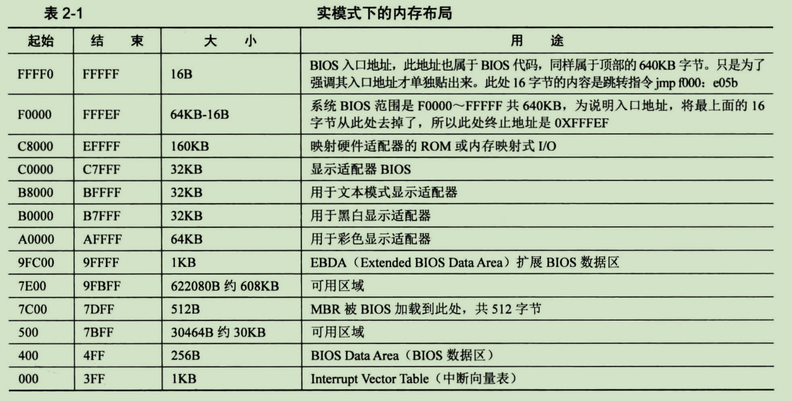
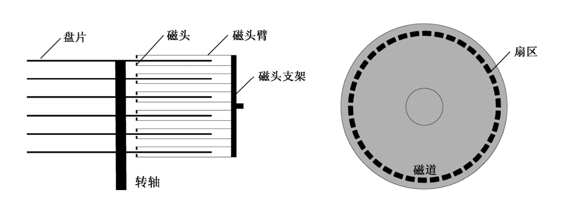
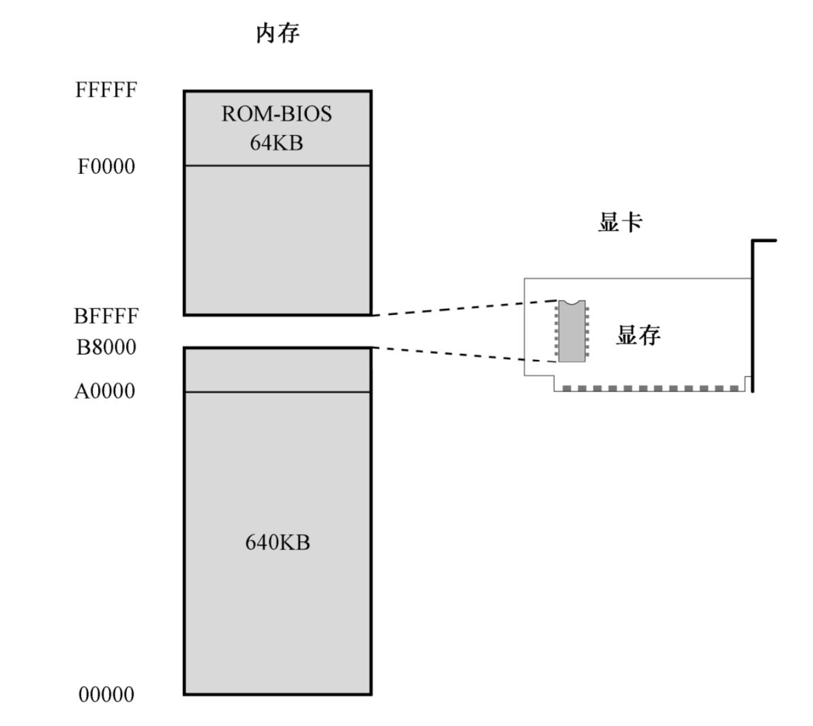
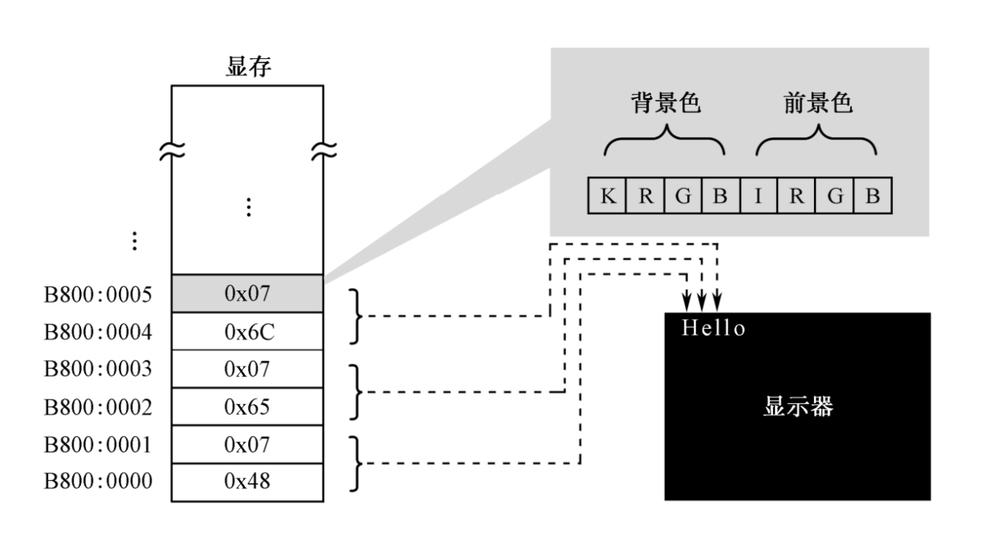
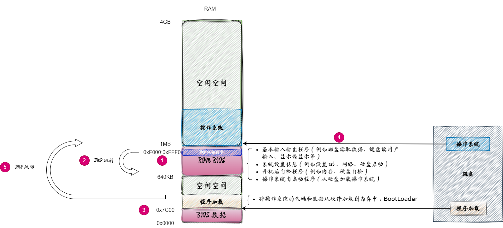
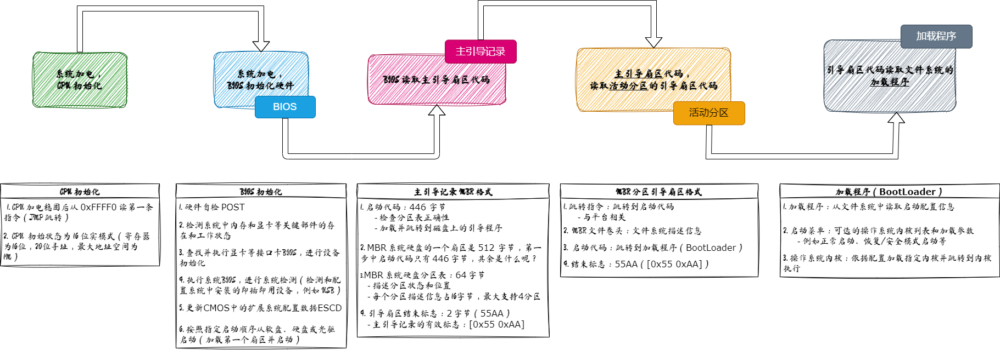
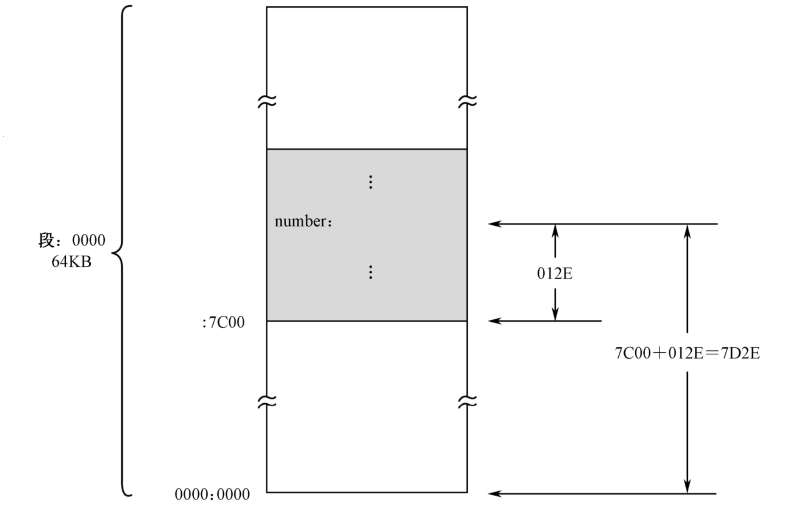

[toc]


## 1. 基本输入输出系统（BIOS）


8086有20根地址线，可以访问1MB的内存空间，地址范围为 `0x00000` 到 `0xFFFFF`。出于各方面的考虑，计算机系统的设计者将这1MB的内存空间从物理上分为几个部分。

- 这些地址线经过分配，大部分用于访问DRAM（也就是内存条）
- 剩余的部分给了只读存储器(Read Only Memory, ROM)和外围的板卡


### DRAM 简介

内存是**动态随机访问存储器(Dynamic Random Access Memory, DRAM)**


随机访问的意思是，访问任何一个内存单元的速度和它的位置（地址）无关。举个例子来说，读写地址为 `0x00001` 的内存单元，和读写地址为 `0xFFFF0` 的内存单元，所需要的时间是一样的。


断电之后，所有保存的内容都会统统消失。所以，每当处理器加电之后，它无法从内存中取得任何指令。


### ROM

与DRAM不同，ROM不需要刷新，它的内容是**预先写入**的，<u>即使掉电也不会消失，但也很难改变</u>。可以将一些程序指令固化在ROM中，使处理器在每次加电时都自动执行。


在以 INTEL 8086 为处理器的系统中，

- <u>ROM 占据着整个内存空间顶端的 64KB</u>，**物理地址范围是 `0xF0000～0xFFFFF`**，里面固化了开机时要执行的指令；
- <u>DRAM 占据着较低端的 640KB</u>，**地址范围是 `0x00000～0x9FFFF`**；
- 中间还有一部分分给了其他外围设备，

**因为 8086 加电或者复位时，`CS=0xFFFF，IP=0x0000`，所以，它取的第一条指令位于物理地址 `0xFFFF0`，正好位于ROM中，那里固化了开机时需要执行的指令。**


#### ROM中指令的执行

(CS 代码段寄存器，IP 指令偏移地址寄存器)

处理器取指令执行的自然顺序是从内存的低地址往高地址推进。如果从 ROM 的 `0xFFFF0` 开始执行，这个位置离 1MB 内存的顶端（物理地址 `0xFFFFF`）只有16字节的长度，一旦IP寄存器(CS:IP)的值超过 `0x000F`，比如 `IP=0x0011`，那么，它与CS一起形成的物理地址将因为溢出而变成`0x00001`，这将回绕到1MB内存的最底端。

所以，**ROM中位于物理地址 `0xFFFF0` 的地方，通常是一个跳转指令**，它通过改变CS和IP的内容，使处理器从ROM中的较低地址处开始取指令执行。在NASM汇编语言里，一个典型的跳转指令像这样：

```assembly
jmp 0xf000:0xe05b
```

说明：

- `0xf000` 是要跳转到的段地址，用来改变CS寄存器的内容；
- `0xe05b` 是目标代码段内的偏移地址，用来改变IP寄存器的内容。
- 最终目标位置的物理地址是 `0xfe05b`。
- 处理器将开始从指定的"段:偏移"处开始重新取指令执行。


#### ROM作用

ROM芯片中的内容包括很多部分，主要是进行<u>硬件的诊断、检测和初始化</u>。所谓初始化，就是让硬件处于一个正常的、默认的工作状态。最后，它<u>还负责提供一套软件例程，让人们在不必了解硬件细节的情况下从外围设备（比如键盘）获取输入数据，或者向外围设备（比如显示器）输出数据</u>。设备当然是很多的，所以这块**ROM芯片只针对那些最基本的、对于使用计算机而言最重要的设备，而它所提供的软件例程，也只包含最基本、最常规的功能**。正因为如此，这块芯片又叫**基本输入输出系统**(Base Input ＆ Output System,BIOS)ROM，简称**ROM-BIOS**。


ROM-BIOS的容量是有限的，当它完成自己的使命后，**最后所要做的**，就是<u>从辅助存储设备读取指令数据，然后转到那里开始执行</u>。（例如硬盘系统启动程序）


### 实模式下 1MB 内存布局

Intel 8086 有 20 根地址总线，所以可以访问 
$$
2^20=1048576=1MB
$$
从 0x00000 到 0xFFFFF。

其实就是 20 位的地址空间分布，因为 cpu 无法直接访问内存，只能通过 地址总线来



- 0-0x9FFFF 是 DRAM，空间范围是 640KB
- 0xF0000-0xFFFFF 是 ROM，空间范围是 64KB，里面就是 BIOS 代码。


## 2. 硬盘启动

ROM-BIOS 在完成自己的使命之前，<u>最后要做的一件事是从外存储设备读取更多的指令来交给处理器执行</u>。

对于ROM-BIOS来说，绝大多数时候，<u>硬盘都是首选的外存储设备</u>。


### 硬盘结构

硬盘的内部结构如下所示（纵切图和俯视图）：



说明：

- 硬盘可以只有一个**盘片**（这称为单碟），也可能有好几个盘片。但无论如何，它们都串在同一个轴上，由电动机带动着一起高速旋转。一般来说，转速可以达到每分钟3600转或者7200转，有的能达到一万多转，这个参数就是我们常说的“转/分”(Round Per Minute, RPM)。
- 每个盘片都有两个**磁头**(Head)，上面一个，下面一个，经常用磁头来指代盘面。磁头都有编号，第1个盘片，上面的磁头编号为0，下面的磁头编号为1；第2个盘片，上面的磁头编号为2，下面的磁头编号为3，依次类推。
- 每个磁头不是单独移动的。相反，它们都通过磁头臂固定在同一个支架上，由步进电动机带动着一起在盘片的中心和边缘之间来回移动。也就是说，它们是同进退的。步进电动机由脉冲驱动，每次可以旋转一个固定的角度，即可以步进一次。
- 可以想象，当盘片高速旋转时，磁头每步进一次，都会从它所在的位置开始，绕着圆心“画”出一个看不见的圆圈，这就是**磁道**(Track)。磁道是数据记录的轨迹。因为所有磁头都是联动的，故每个盘面上的同一条磁道又可以形成一个虚拟的圆柱，称为**柱面**(Cylinder)。
- 磁道，或者柱面，也要编号。编号从盘面最边缘的那条磁道开始，向着圆心的方向，从0开始编号。
- 柱面是一个用来优化数据读写的概念。初看起来，用硬盘来记录数据时，应该先将一个盘面填满后，再填写另一个盘面。实际上，移动磁头是一个机械动作，看似很快，但对处理器来说，却很漫长，这就是寻道时间。为了加速数据在硬盘上的读写，最好的办法就是尽量不移动磁头。这样，当0面的磁道不足以容纳要写入的数据时，应当把剩余的部分写在1面的同一磁道上。如果还写不下，那就继续把剩余的部分写在2面的同一磁道上。换句话说，在硬盘上，数据的访问是以柱面来组织的。
- 实际上，磁道还不是硬盘数据读写的最小单位，磁道还要进一步划分为**扇区**(Sector)。磁道很窄，也看不见，但在想象中，它仍呈带状，占有一定的宽度。将它划分为许多段之后，每一部分都呈扇形，这就是扇区的由来。每条磁道能够划分为几个扇区，取决于磁盘的制造者，但通常为63个。而且，每个扇区都有一个编号，与磁头和磁道不同，扇区的编号是从1开始的。
- 扇区与扇区之间以间隙（空白）间隔开来，<u>每个扇区以扇区头开始，然后是512字节的数据区</u>。扇区头包含了每个扇区自己的信息，主要有**本扇区的磁道号、磁头号和扇区号**，用来定位。现代的硬盘还会在扇区头部包括一个指示扇区是否健康的标志，以及用来替换该扇区的扇区地址。用于替换扇区的，是一些保留和隐藏的磁道。


### 硬盘启动


硬盘的第一个扇区是 `0面0道1扇区`，或者说是 `0头0柱1扇区`，这个扇区称为**主引导扇区**。

如果计算机的设置是从硬盘启动的，那么，ROM-BIOS将读取硬盘主引导扇区的内容，将它加载到内存地址 `0x0000:0x7c00`（也就是物理地址0x07C00），然后用一个jmp指令跳到那里接着执行：

```assembly
jmp 0x0000:0x7c00
```

主引导扇区的功能是继续从硬盘的其他部分读取更多的内容加以执行


如果我们把自己编译好的程序写到主引导扇区里，也能够让处理器在系统启动时运行。


### 硬盘操作


要访问硬盘，运行中的程序必须至少向硬盘控制器提供4个参数，分别是<u>磁头号、磁道号、扇区号，以及访问意图（是读还是写）</u>

硬盘的读写是**以扇区为最小单位的**。所以，无论什么时候，要从硬盘读数据，或者向硬盘写数据，**至少得是1个扇区**。

问：我只有2字节的数据，不足以填满一个扇区，怎么办呢？

答：可以用无意义的废数字来填充，凑够一个扇区的长度，然后写入。读取的时候也是这样，你需要自己跟踪和把握从扇区里读到的数据，哪些是你真正想要的。


在VHD（虚拟硬盘格式）规范里，每个扇区是512字节。VHD文件<u>**一开始**的512字节就对应着物理硬盘的0面0道1扇区</u>。然后，VHD文件的第二个512字节，对应着0面0道2扇区，后面的依次类推，一直对应到0面0道n扇区。这里，n等于每磁道的扇区数。


因为**硬盘的访问是按柱面进行的**，所以，在VHD文件中，紧接着前面的数据块，下一个数据块对应的是1面0道1扇区，就这样一直往后排列，当把第一个柱面全部对应完后，再从第二个柱面开始对应。


为了标志一个文件是VHD格式的虚拟硬盘，并为使用它的虚拟机提供该硬盘的参数，在VHD文件的**结尾**，包含了512字节的格式信息。包含了诸如文件的创建日期、VHD的版本、创建该文件的应用程序名称和版本、创建该文件的应用程序所属的操作系统、该虚拟硬盘的参数（磁头数、每面磁道数、每磁道扇区数）、VHD类型（固定尺寸还是动态增长）、虚拟硬盘容量等。


### IDE / ATA / PIO Mode

PIO ：Port Input Output 表示端口输入输出模式。其中端口，表示外部设备内部的寄存器。

- IDE ：Integrated Drive Electronics 集成电子驱动器 
- ATA ：Advance Technology Attachment 美国标准协会ANSI将IDE驱动器标准化后名为 ATA
    - PATA
    - SATA


### 硬盘读写模式

- CHS 模式：Cylinder(柱面)/Head(磁头)/Sector(扇区)
- LBA 模式：Logic Block Address 逻辑化地址


### 硬盘的LBA模式

采用磁头、磁道和扇区这种模式来访问硬盘的方法称为CHS模式，但不是很方便。如果有一大堆数据要写，还得注意磁头号、磁道号和扇区号不要超过界限。所以，后来引入了**逻辑块地址(Logical Block Address, LBA)**的概念。

现在市场上销售的硬盘，无论哪个厂家生产的，都支持LBA模式。<u>LBA模式由硬盘控制器在硬件一级上提供支持，所以效率很高，兼容性很好</u>。**LBA模式不考虑扇区的物理位置（磁头号、磁道号），而是把它们全部组织起来统一编号**。在这种编址方式下，原先的物理扇区被组织成逻辑扇区，且**都有唯一的逻辑扇区号**。

比如，某硬盘有6个磁头（也就是3个盘片），每面有1000个磁道，每磁道有17个扇区。那么：

```
逻辑0扇区 对应着0面0道1扇区；
逻辑1扇区 对应着0面0道2扇区；
......
逻辑16扇区 对应着0面0道17扇区；
逻辑17扇区 对应着1面0道1扇区；
逻辑18扇区 对应着1面0道2扇区；
```

扇区在编号时，是**以柱面为单位**的。即，<u>先是0面0道，接着是1面0道，直到把所有盘面上的0磁道处理完，再接着处理下一个柱面</u>。之所以这样做，是因为我们讲过，要加速硬盘的访问速度，最好不移动磁头


计算方法：

```bash
LBA =  C * 磁头总数 * 每道扇区数 + H * 每道扇区数 + (S - 1)
```

说明：

- LBA是逻辑扇区号
- C、H、S是想求得逻辑扇区号的那个物理扇区所在的磁道、磁头和扇区号。


好处：

采用LBA模式的好处是简化了程序的操作，使得程序员不用关心数据在硬盘上的具体位置。对于本书来说，VHD文件是按LBA方式组织的，一开始的512字节就是逻辑0扇区，然后是逻辑1扇区；最后一个逻辑扇区排在文件的最后（最后512字节除外，那是VHD文件的标识部分）。


LBA 模式转 CHS 模式：
$$
\rm LBA扇区号 \div 每磁道扇区数 = \left\{
\begin{aligned}
商Q \rightarrow \left\{
    \begin{aligned}
    柱面号 & = Q  >> 1 \\
    磁头号 & = Q \ \&  \ 1
    \end{aligned}
    \right.\\
余数R \rightarrow 起始扇区号 = \rm R + 1
\end{aligned}
\right.
$$


​	

### 硬盘控制端口

| Primary 通道 | Secondary 通道 |   in 操作    |   out 操作   |
| :----------: | :------------: | :----------: | :----------: |
|    0x1F0     |     0x170      |     Data     |     Data     |
|    0x1F1     |     0x171      |    Error     |   Features   |
|    0x1F2     |     0x172      | Sector count | Sector count |
|    0x1F3     |     0x173      |   LBA low    |   LBA low    |
|    0x1F4     |     0x174      |   LBA mid    |   LBA mid    |
|    0x1F5     |     0x175      |   LBA high   |   LBA high   |
|    0x1F6     |     0x176      |    Device    |    Device    |
|    0x1F7     |     0x177      |    Status    |   Commnad    |


- 0x1F0 端口：16bit 端口，用于读写数据
- 0x1F1 端口：检测前一个指令的错误
- 0x1F2 端口：读写扇区的数量
- 0x1F3 端口：起始扇区的 0~7 位
- 0x1F4 端口：起始扇区的 8~15 位
- 0x1F5 端口：起始扇区的 16~23 位
- 0x1F6 端口：
    - 0-3 位：起始扇区的 24~27
    - 4：0 主盘；1 从片
    - 5：默认是 1
    - 6：0 CHS；1 LBA
    - 7：默认是 1
- 0x1F7 端口：
    - out：
        - 0xEC：识别硬盘
        - 0x20：读硬盘
        - 0x30：写硬盘
    - in：8bit
        - 0：Err 错误
        - 3：DRQ 数据准备完毕
        - 7：BSY 硬盘繁忙


## 3. 显卡与显存


为了显示文字，通常需要两种硬件：

- 一是**显示器**。显示器的职责是将那些内容以视觉可见的方式呈现在屏幕上
- 二是**显卡**。显卡的职责是为显示器提供内容，并控制显示器的显示模式和状态


显卡控制显示器的最小单位是像素，一个像素对应着屏幕上的一个点。

显卡都有自己的存储器，因为它位于显卡上，故称**显示存储器(Video RAM, VRAM)**，简称显存，要显示的内容都预先写入显存。

对显示器来说，显示黑白图像是最简单的，因为只需要控制每个像素是亮，还是不亮。不亮当成比特“0”，亮看成比特“1”。但要显示更多的颜色，1比特就不够了。现在最流行的，是用24比特，即3字节，来对应一个像素。因为224=16777216，所以在这种模式下，同屏可以显示16777216种颜色，这称为真彩色。


**字符显示：**

每个字符可以表示成一个二进制数，比如，数字0x4C就代表字符“L”，这个数被称为是字符“L”的**ASCII代码**


**文本模式**和**图形模式**是显卡的两种基本工作模式，可以用指令访问显卡，设置它的显示模式。


### 访问显存

为了给出要显示的字符，处理器需要访问显存，把字符的ASCII码写进去。但是，显存是位于显卡上的，访问显存需要和显卡这个外围设备打交道。为了实现一些快速的游戏动画效果，或者播放高码率的电影，不**直接访问显存**是办不到的。


**内存地址分配：**

- 8086可以访问1MB内存
- 其中，`0x00000～0x9FFFF` 属于常规内存，由内存条提供；
- `0xF0000～0xFFFFF` 由主板上的一个芯片提供，即ROM-BIOS。
- 中间还有一个320KB的空洞，即 `0xA0000～0xEFFFF` ，这段地址空间**由特定的外围设备来提供，其中就包括显卡**。

由于历史的原因，所有在个人计算机上使用的显卡，在加电自检之后都会把自己初始化为80×25的文本模式。在这种模式下，屏幕上可以显示25行，每行80个字符，每屏总共2000个字符。




### 显存的段寄存器初始化

为了访问显存，也需要使用逻辑地址，也就是采用“段地址:偏移地址”的形式，这是处理器的要求。考虑到文本模式下显存的起始物理地址是`0xB8000`，这块内存可以看成段地址为`0xB800`，偏移地址从`0x0000`延伸到`0xFFFF`的区域，因此我们可以把段地址定为`0xB800`。


访问内存可以使用**段寄存器DS(代码段寄存器)**，但这不是强制性的，**也可以使用ES(扩展段寄存器)**。


例如下面程序：

```assembly
mov ax,0xb800                 ;指向文本模式的显示缓冲区
mov es,ax
```


汇编代码中 6，7 两行的原因是，INTEL处理器不允许将一个立即数传送到段寄存器，只能：

```bash
mov 段寄存器, 通用寄存器
mov 段寄存器, 内存单元
```

而不允许：`mov es, 0xb800`


### ASCII 码


ASCII是7位代码，只用了一字节中的低7比特，最高位通常置0。这意味着，ASCII只包含128个字符的编码。所以，在表中，水平方向给出了代码的高3比特，而垂直方向给出了代码的低4比特。

- ASCII表中有相当一部分代码是**不可打印和显示**的，它们**用于控制通信过程**。比如，<u>LF是换行；CR是回车；DEL和BS分别是删除和退格；BEL是振铃（使远方的终端响铃，以引起注意）；SOH是文头；EOT是文尾；ACK是确认</u>。


屏幕上的每个字符对应着显存中连续2字节，<u>前一个是字符的ASCII代码</u>，<u>后面是字符的显示属性</u>，包括字符颜色（前景色）和底色（背景色）。如下图，字符“H”的ASCII代码是0x48，其显示属性是0x07；字符“e”的ASCII代码是0x65，其显示属性是0x07。



字符的显示属性（1字节）分为两部分，低4位定义的是前景色，高4位定义的是背景色。色彩主要由R、G、B这3位决定，毕竟我们知道，可以由红(R)、绿(G)、蓝(B)三原色来配出其他所有颜色。K是闪烁位，为0时不闪烁，为1时闪烁；I是亮度位，为0时正常亮度，为1时呈高亮


## 4. 系统上电过程

### 启动流程

上面介绍了 RAM（随机访问存储）、ROM（只读存储）、硬盘。

ROM 断电开机后，内容不会丢，并且（80386）：

- <u>ROM 占据着整个内存空间顶端的 64KB</u>，**物理地址范围是 `0xF0000～0xFFFFF`**，里面固化了开机时要执行的指令；
- <u>DRAM 占据着较低端的 640KB</u>，**地址范围是 `0x00000～0x9FFFF`**；

解释：

- **80286**：之后cs寄存器的值是 `0xF000`，ip 寄存器的值是 `0xFFF0`，所以形成的物理地址也是 `0xFFFF0`

- **80386**：到了386时代一切都变了，此时在CPU reset之后cs寄存器的值仍然是 `0xF000`，但是 cs 除了**段选择子之外还有一个隐藏的基址寄存器**，这个寄存器的值是 `0xFFFF0000`，ip 寄存器的值仍然是 `0xFFF0`。此时的地址不在是 `0xF000` 左移4位加上 `0xFFF0` 了，而是 `0xFFFF0000+ 0xFFF0 = 0xFFFFFFF0`。所以第一条指令是在一个很高的地址，<u>是4G往下16字节的位置</u>。


步骤（如下图）：

1. 当计算机上电后，**系统必须处于 16 位实模式下，CS、IP等寄存器是 16 位**，**即有 20 位地址空间，最大内存寻址为 1MB**，CPU 会设置寄存器 CS:IP 为 `0xF000:0xFFF0` 或者 `0xFFFF:0x0000`，即 `0xFFFF0`
2. 第一条指令的位置在 `CS:IP = 0xF000:0xFFF0 = 0xFFFF0`，最大地址空间为 20 (`0xFFFFF`) 位，即可操作的空间只有 16 字节，因此第一条指令通常是一条跳转指令，跳转指令会跳转到 ROM BIOS 固件的位置，ROM BIOS 作用：
    - 基本输入输出程序（例如磁盘读取数据、键盘读用户输入、显示器显示等）
    - 系统设置信息（例如设置 usb 、网络、硬盘启动）
    - 开机后自检程序（例如内存、硬盘自检）
    - 操作系统自启动程序（从硬盘加载操作系统）
3. BIOS 固件将 **加载程序** 从磁盘的**第一个引导扇区（512字节）**加载到 `0x7C00` 位置。然后跳转到 `CS:IP = 0x0000:0x7C00` 
4. 开始执行加载程序，**加载程序将操作系统的代码和数据从硬件加载到内存中**，然后跳转到操作系统的起始程序。
    - 加载程序主要为了通用，可以约定某种协议，加载不同的文件系统。
    - 加载程序也就是 BootLoader
5. 加载完成后，跳转到操作系统的第一条指令上，运行操作系统程序。

 


BIOS在启动过程中，发挥了重要的功能，同样，以中断调用的方式，提供了基本的I/O功能：

- `INT 10h`: 字符显示
- `INT 13h`: 磁盘扇区读写
- `INT 15h`: 检测内存大小
- `INT 16h`: 键盘输入
- ......

BIOS 的限制：<u>只能在 x86 的实模式下访问</u>


系统启动的宏观流程为：



​	


### BIOS 规范

- 固化到计算机主板的程序
- 包括系统设置、自检程序、系统自启动程序
- 已经有 BIOS-MBR、BIOS-GPT、PXE（网络启动）


现在已经有了新的启动规范 UEFI（旨在所有平台上具有一致的系统启动服务），扩展了 BIOS 功能。MBR 也有了新的扩展 GPT。


### CMOS 存储器

在计算机中，出需要使用内存 RAM 和 ROM BIOS 以外，还需要使用**只有很少存储容量的（只有64字节或128字节）CMOS（Complementary Metal Oxide Semiconductor，互补金属氧化物半导体）存储器来存放计算机的实时时钟信息和系统硬件配置信息**。

CMOS 内存的地址空间在基本内存空间之外，需要使用 I/O 指令来访问


## 5. 示例

### demo 示例

汇编代码示例：

```assembly
         ;代码清单6-1 
         ;文件名：c06_mbr.asm
         ;文件说明：硬盘主引导扇区代码
         ;创建日期：2011-3-31 21:15，修订于2021-09-06 23:05 
         
         mov ax,0xb800                 ;指向文本模式的显示缓冲区
         mov es,ax

         ;以下显示字符串"Label offset:"
         mov byte [es:0x00],'L'
         mov byte [es:0x01],0x07
         mov byte [es:0x02],'a'
         mov byte [es:0x03],0x07
         mov byte [es:0x04],'b'
         mov byte [es:0x05],0x07
         mov byte [es:0x06],'e'
         mov byte [es:0x07],0x07
         mov byte [es:0x08],'l'
         mov byte [es:0x09],0x07
         mov byte [es:0x0a],' '
         mov byte [es:0x0b],0x07
         mov byte [es:0x0c],"o"
         mov byte [es:0x0d],0x07
         mov byte [es:0x0e],'f'
         mov byte [es:0x0f],0x07
         mov byte [es:0x10],'f'
         mov byte [es:0x11],0x07
         mov byte [es:0x12],'s'
         mov byte [es:0x13],0x07
         mov byte [es:0x14],'e'
         mov byte [es:0x15],0x07
         mov byte [es:0x16],'t'
         mov byte [es:0x17],0x07
         mov byte [es:0x18],':'
         mov byte [es:0x19],0x07

         mov ax,number                 ;取得标号number的偏移地址
         mov bx,10

         ;设置数据段的基地址
         mov cx,cs
         mov ds,cx

         ;求个位上的数字
         mov dx,0
         div bx
         mov [0x7c00+number+0x00],dl   ;保存个位上的数字

         ;求十位上的数字
         xor dx,dx
         div bx
         mov [0x7c00+number+0x01],dl   ;保存十位上的数字

         ;求百位上的数字
         xor dx,dx
         div bx
         mov [0x7c00+number+0x02],dl   ;保存百位上的数字

         ;求千位上的数字
         xor dx,dx
         div bx
         mov [0x7c00+number+0x03],dl   ;保存千位上的数字

         ;求万位上的数字 
         xor dx,dx
         div bx
         mov [0x7c00+number+0x04],dl   ;保存万位上的数字

         ;以下用十进制显示标号的偏移地址
         mov al,[0x7c00+number+0x04]
         add al,0x30
         mov [es:0x1a],al
         mov byte [es:0x1b],0x04
         
         mov al,[0x7c00+number+0x03]
         add al,0x30
         mov [es:0x1c],al
         mov byte [es:0x1d],0x04
         
         mov al,[0x7c00+number+0x02]
         add al,0x30
         mov [es:0x1e],al
         mov byte [es:0x1f],0x04

         mov al,[0x7c00+number+0x01]
         add al,0x30
         mov [es:0x20],al
         mov byte [es:0x21],0x04

         mov al,[0x7c00+number+0x00]
         add al,0x30
         mov [es:0x22],al
         mov byte [es:0x23],0x04
         
         mov byte [es:0x24],'D'
         mov byte [es:0x25],0x07
          
   infi: jmp near infi                 ;无限循环
      
  number db 0,0,0,0,0
  
  times 203 db 0
            db 0x55,0xaa
            
```


通过 nasm 编译器，编译 上述汇编代码，并生成 lst 列表文件
```bash
nasm -l demo.lst demo.asm
```


### 标号

处理器访问内存时，采用的是**“段地址:偏移地址”**的模式。对于任何一个内存段来说，<u>段地址可以开始于任何16字节对齐的地方，偏移地址则总是从`0x0000`开始递增的</u>。

为了支持这种内存访问模式，<u>在源程序的编译阶段，编译器会把代码整体上作为一个独立的段来处理，并从0开始计算和跟踪每条指令的地址</u>。因为该地址是在编译期间计算的，故称为**汇编地址**。汇编地址是在源程序编译期间，<u>编译器为每条指令确定的</u>**汇编位置(Assembly Position)**，<u>指示该指令相对于程序或者段起始处的距离，以字节计</u>。**当编译后的程序装入物理内存后，它又是该指令在内存段内的偏移地址**。


下面是 demo.lst 列表文件的内容：

```assembly
     1                                           ;代码清单6-1 
     2                                           ;文件名：c06_mbr.asm
     3                                           ;文件说明：硬盘主引导扇区代码
     4                                           ;创建日期：2011-3-31 21:15，修订于2021-09-06 23:05 
     5                                           
     6 00000000 B800B8                           mov ax,0xb800                 ;指向文本模式的显示缓冲区
     7 00000003 8EC0                             mov es,ax
     8                                  
     9                                           ;以下显示字符串"Label offset:"
    10 00000005 26C60600004C                     mov byte [es:0x00],'L'
    11 0000000B 26C606010007                     mov byte [es:0x01],0x07
    12 00000011 26C606020061                     mov byte [es:0x02],'a'
    13 00000017 26C606030007                     mov byte [es:0x03],0x07
    14 0000001D 26C606040062                     mov byte [es:0x04],'b'
    15 00000023 26C606050007                     mov byte [es:0x05],0x07
    16 00000029 26C606060065                     mov byte [es:0x06],'e'
    17 0000002F 26C606070007                     mov byte [es:0x07],0x07
    18 00000035 26C60608006C                     mov byte [es:0x08],'l'
    19 0000003B 26C606090007                     mov byte [es:0x09],0x07
    20 00000041 26C6060A0020                     mov byte [es:0x0a],' '
    21 00000047 26C6060B0007                     mov byte [es:0x0b],0x07
    22 0000004D 26C6060C006F                     mov byte [es:0x0c],"o"
    23 00000053 26C6060D0007                     mov byte [es:0x0d],0x07
    24 00000059 26C6060E0066                     mov byte [es:0x0e],'f'
    25 0000005F 26C6060F0007                     mov byte [es:0x0f],0x07
    26 00000065 26C606100066                     mov byte [es:0x10],'f'
    27 0000006B 26C606110007                     mov byte [es:0x11],0x07
    28 00000071 26C606120073                     mov byte [es:0x12],'s'
    29 00000077 26C606130007                     mov byte [es:0x13],0x07
    30 0000007D 26C606140065                     mov byte [es:0x14],'e'
    31 00000083 26C606150007                     mov byte [es:0x15],0x07
    32 00000089 26C606160074                     mov byte [es:0x16],'t'
    33 0000008F 26C606170007                     mov byte [es:0x17],0x07
    34 00000095 26C60618003A                     mov byte [es:0x18],':'
    35 0000009B 26C606190007                     mov byte [es:0x19],0x07
    36                                  
    37 000000A1 B8[2E01]                         mov ax,number                 ;取得标号number的偏移地址
    38 000000A4 BB0A00                           mov bx,10
    39                                  
    40                                           ;设置数据段的基地址
    41 000000A7 8CC9                             mov cx,cs
    42 000000A9 8ED9                             mov ds,cx
    43                                  
    44                                           ;求个位上的数字
    45 000000AB BA0000                           mov dx,0
    46 000000AE F7F3                             div bx
    47 000000B0 8816[2E7D]                       mov [0x7c00+number+0x00],dl   ;保存个位上的数字
    48                                  
    49                                           ;求十位上的数字
    50 000000B4 31D2                             xor dx,dx
    51 000000B6 F7F3                             div bx
    52 000000B8 8816[2F7D]                       mov [0x7c00+number+0x01],dl   ;保存十位上的数字
    53                                  
    54                                           ;求百位上的数字
    55 000000BC 31D2                             xor dx,dx
    56 000000BE F7F3                             div bx
    57 000000C0 8816[307D]                       mov [0x7c00+number+0x02],dl   ;保存百位上的数字
    58                                  
    59                                           ;求千位上的数字
    60 000000C4 31D2                             xor dx,dx
    61 000000C6 F7F3                             div bx
    62 000000C8 8816[317D]                       mov [0x7c00+number+0x03],dl   ;保存千位上的数字
    63                                  
    64                                           ;求万位上的数字 
    65 000000CC 31D2                             xor dx,dx
    66 000000CE F7F3                             div bx
    67 000000D0 8816[327D]                       mov [0x7c00+number+0x04],dl   ;保存万位上的数字
    68                                  
    69                                           ;以下用十进制显示标号的偏移地址
    70 000000D4 A0[327D]                         mov al,[0x7c00+number+0x04]
    71 000000D7 0430                             add al,0x30
    72 000000D9 26A21A00                         mov [es:0x1a],al
    73 000000DD 26C6061B0004                     mov byte [es:0x1b],0x04
    74                                           
    75 000000E3 A0[317D]                         mov al,[0x7c00+number+0x03]
    76 000000E6 0430                             add al,0x30
    77 000000E8 26A21C00                         mov [es:0x1c],al
    78 000000EC 26C6061D0004                     mov byte [es:0x1d],0x04
    79                                           
    80 000000F2 A0[307D]                         mov al,[0x7c00+number+0x02]
    81 000000F5 0430                             add al,0x30
    82 000000F7 26A21E00                         mov [es:0x1e],al
    83 000000FB 26C6061F0004                     mov byte [es:0x1f],0x04
    84                                  
    85 00000101 A0[2F7D]                         mov al,[0x7c00+number+0x01]
    86 00000104 0430                             add al,0x30
    87 00000106 26A22000                         mov [es:0x20],al
    88 0000010A 26C606210004                     mov byte [es:0x21],0x04
    89                                  
    90 00000110 A0[2E7D]                         mov al,[0x7c00+number+0x00]
    91 00000113 0430                             add al,0x30
    92 00000115 26A22200                         mov [es:0x22],al
    93 00000119 26C606230004                     mov byte [es:0x23],0x04
    94                                           
    95 0000011F 26C606240044                     mov byte [es:0x24],'D'
    96 00000125 26C606250007                     mov byte [es:0x25],0x07
    97                                            
    98 0000012B E9FDFF                     infi: jmp near infi                 ;无限循环
    99                                        
   100 0000012E 0000000000                number db 0,0,0,0,0
   101                                    
   102 00000133 00<rep CBh>               times 203 db 0
   103 000001FE 55AA                                db 0x55,0xaa
   104                                              

```


列表文件共分五栏，从左到右依次是**行号**、**指令的汇编地址**、**指令编译后的机器代码**、**源程序代码**和**注释**。

说明：

- 在编译阶段，每条指令都被计算并赋予了一个汇编地址，<u>当编译好的程序加载到物理内存后，它在段内的**偏移地址**和它在编译阶段的**汇编地址**是相同的</u>
- 之所以箭头是交叉的，是因为源程序的编译是从上往下的，而内存地址的增长是从下往上的（从低地址往高地址方向增长）
- 源程序的第二条指令，是`mov es，ax`，它在编译阶段的汇编地址是`0x00000003`。在整个程序装入内存后，它在段内的偏移地址是`0x0003`


在NASM汇编语言里，每条指令的前面都可以拥有一个标号，以代表和指示该指令的汇编地址。

例如在列表文件的 98 行，

```assembly
    98 0000012B E9FDFF                     infi: jmp near infi                 ;无限循环
```

带冒号的是标号是“infi”。这条指令的汇编地址是 `0x0000012B`，故infi就代表数值 `0x0000012B`，或者说是 `0x0000012B` 的符号化表示。**标号之后的冒号是可选的**。标号也可以独占一行，那下面的写法也是正确的：

```assembly
infi jmp near infi

infi:
    jmp near infi
```

注意：

**标号可以由字母、数字、"_"、"$"、"#"、"@"、"～"、"."、"？" 组成，但必须以字母、"."、"\_\"和 "?"中的任意一个打头**


### 声明并初始化数据

在写汇编代码时，有时需要留出一些空间，用于保存一些临时变量，使用寄存器不太现实，因为它的数量很少，且还要在后续的指令中使用。因此，最好的办法是**在内存中专门留出一些空间来保存这些数位**。


例如在代码的 100 行, 声明并初始化了一块区域，而标号number则代表起始汇编地址：

```assembly
   100 0000012E 0000000000                number db 0,0,0,0,0
```

说明：

- **DB指令来声明(Declare)的**，DB的意思是声明字节(**Declare Byte**)，所以，<u>跟在它后面的操作数都占一字节的长度</u>（位置）。注意，如果要声明超过一个以上的数据，各个操作数之间必须以逗号隔开
- **声明的数据可以是任何值，只要不超过伪指令所指示的大小。**例如，用DB声明的数据，不能超过一字节所能表示的数的大小，即`0xFF`。上述代码，声明了五个字节大小，每个字节的值为 `0x00`
- <u>DW(Declare Word)用于声明字数据，DD(Declare Double Word)用于声明双字（两个字）数据，DQ(Declare Quad Word)用于声明四字数据。</u>
- DB、DW、DD和DQ并不是处理器指令，它只是编译器提供的汇编指令，所以称作伪指令(Pseudo Instruction)


**伪指令**是汇编指令的一种，它<u>没有对应的机器指令，所以它不是机器指令的助记符，仅仅在编译阶段由编译器执行，编译成功后，伪指令就消失了</u>。所以在程序执行时，伪指令是得不到处理器光顾的。实际上，程序执行时，伪指令已不存在。


和指令不同，对于在程序中声明的数值，在编译阶段，编译器会在它们被声明的汇编地址处原样保留。有人会问，处理器不是可以访问任何内存位置吗，为啥还要用DB声明？处理器当然可以访问任何内存位置，但那个位置可能是其他程序的，伪指令DB用来保留只供自己访问的内存位置。

按照标准的做法，**程序中用到的数据应当声明在一个独立的段，即数据段中**。


### 显示十进制数字

在 demo.asm 汇编代码的 37 行处：

```assembly
    37 000000A1 B8[2E01]                         mov ax,number                 ;取得标号number的偏移地址
```

取得标号number的偏移地址，而标号 number 的定义在 100 行(标号没有使用冒号:)：

```assembly
   100 0000012E 0000000000                number db 0,0,0,0,0
```

传送到寄存器AX的值是在源程序编译时确定的，在编译阶段，编译器会将标号number转换成立即数。


由上小节可以发现，number 标号声明了五字节大小的内存，其汇编地址为：`0x012E`。在 mov 指令编译结束后，得到的机器指令为 `B8［2E01］`，或者`B8 2E 01`。B8 是操作码，后面是字操作数 `0x012E`，只不过采用的是低端字节序。


源程序第41、42行，是把代码段寄存器CS的内容传送到通用寄存器CX，然后再从寄存器CX传送到数据段寄存器DS。在此之后，数据段和代码段都指向同一个段。之所以这么做，是因为我们刚才声明的数据是和指令代码混在一起的，可以认为是位于代码段中的

```
    40                                           ;设置数据段的基地址
    41 000000A7 8CC9                             mov cx,cs
    42 000000A9 8ED9                             mov ds,cx
```


 ### 除法

**除法指令div**，它可以做两种类型的除法。

- **第一种类型是用16位的二进制数除以8位的二进制数**。在这种情况下，**被除数必须在寄存器AX中**，必须事先传送到寄存器AX里。**除数可以由8位的通用寄存器或者内存单元提供**。指令执行后，**商在寄存器AL中，余数在寄存器AH中**。比如：

```assembly
div cl

; 偏移地址
div byte [0x0023]

; 段地址:偏移地址
div byte [cs:0x0023]

; 指令中的地址部分更常见的形式是使用标号
dividnd dw 0x23
divisor db 0x3f

mov ax, [dividnd]
div byte [divisor]
```

- **第二种类型是用32位的二进制数除以16位的二进制数**。在这种情况下，因为16位的处理器无法直接提供32位的被除数，故要求**被除数的高16位在寄存器DX中，低16位在寄存器AX中**。

```assembly
div cx

div word [0x0230]
```


在 demo 的汇编代码中的第 45 行开始，

```assembly
    37 000000A1 B8[2E01]                         mov ax,number                 ;取得标号number的偏移地址
    38 000000A4 BB0A00                           mov bx,10
    
    ...
    44                                           ;求个位上的数字
    45 000000AB BA0000                           mov dx,0
    46 000000AE F7F3                             div bx
    47 000000B0 8816[2E7D]                       mov [0x7c00+number+0x00],dl   ;保存个位上的数字
```

说明：

- 把0传送到寄存器DX，这意味着，我们是想把 `DX:AX` 作为被除数，即被除数的高16位全是0。至于被除数的低16位 AX 寄存器，已经在第37行的代码中被置为标号number的汇编地址。
- 第38行，把10作为除数传送到通用寄存器BX中
- 第46行，div指令用 `DX:AX` 作为被除数，除以寄存器BX的内容，执行后得到的商在寄存器AX中，余数在寄存器DX中。
- 因为除数是10，余数自然比10小，我们可以从寄存器DL中取得。第 47 行将余数取出
- 第 47 行，mov 指令并没有使用 `mov [段地址:偏移地址],dl`，因此，这里使用默认的 DS 段寄存器来访问内存


【问题】：问什么上面第 47 行中的偏移地址是 `0x7c00+number+0x00` ？

【答】：标号number所代表的汇编地址，其数值是在源程序编译阶段确定的，而且是相对于整个程序的开头，从0开始计算的。从 demo.lst 列表文件的第 100 行 ` 100 0000012E 0000000000 number db 0,0,0,0,0` 可以看出，number 标号的汇编地址是 `0x012E`，这其实就是在内存中的偏移地址。因为程序都是从 `0x0000` 偏移地址开始，但内存中主引导扇区代码是被加载到 `0x0000:0x7C00` 处的，即段地址是 `0x0000`，偏移地址是`0x7C00`，`CS=0x0000，IP=0x7C00`，如下图




说明：

- number的偏移地址实际上是 `0x012E+0x7C00=0x7D2E` 


指令 `mov [0x7c00+number+0x00],dl` 用于将余数所在的 dl 寄存器数值移动到 number 标号开始的 第一个 存储单元里


通过 xor 异或操作，清空 DX：

```assembly
    50 000000B4 31D2                             xor dx,dx
```


**xor与mov清空的区别：**

```assembly
mov dx,0
xor dx,dx
```

- `mov dx，0` 的机器码是 `BA 00 00`；而 `xor dx，dx` 的机器码则是 `31 D2`，不但较短，而且，因为 `xor dx，dx` 的两个操作数都是通用寄存器，所以执行速度最快


### 显示十进制数字


在计算出 “个、十、百、千、万” 位后，需要按顺序显示，

```assembly
    69                                           ;以下用十进制显示标号的偏移地址
    70 000000D4 A0[327D]                         mov al,[0x7c00+number+0x04]
    71 000000D7 0430                             add al,0x30
    72 000000D9 26A21A00                         mov [es:0x1a],al
    73 000000DD 26C6061B0004                     mov byte [es:0x1b],0x04
```


- 70行：先将 万 位数字放入 al 中
- 71行：然后加上 `0x30` 放入 al 寄存器，就是对应数字的 ASCII 码。
- 72行：将 ASCII 码，放入 `es:0x1A` 地址中。ex 就是在汇编代码开始处设置的 `0xb800` 指向文本模式的显示缓冲区
- 73行：将该字符的显示属性写入下一个内存位置 `0x1B`。属性值`0x04`的意思是黑底红字，无闪烁，无加亮。


```assembly
    95 0000011F 26C606240044                     mov byte [es:0x24],'D'
    96 00000125 26C606250007                     mov byte [es:0x25],0x07
```

第95、96行，用于以黑底白字显示字符“D”，意思是所显示的数字是十进制的。


### 程序进入循环

数字显示完成后，原则上整个程序就结束了，就会立即结束。


程序第 98 行有一个无限循环：

```assembly
    98 0000012B E9FDFF                     infi: jmp near infi                 ;无限循环
```

说明：

- **jmp**是转移指令，用于使处理器脱离当前的执行序列，转移到指定的地方执行
- 关键字**near**表示目标位置依然在当前代码段内。
- 从 infi 跳到 infi，无限循环


### 主引导扇区有效标志


一个有效的主引导扇区，**其最后2字节的数据必须是0x55和0xAA**。否则，这个扇区里保存的就不是一些有意而为的数据。


定义这2字节很简单，伪指令**db和dw**就可以实现,0x55在前，0xAA在后。源程序第103行就是db版本的实现：

```assembly
   103 000001FE 55AA                                db 0x55,0xaa
```


如果采用dw版本，应该这样写：

```assembly
dw 0xaa55
```

在INTEL处理器上，将一个字写入内存时，是采用低端字节序的，低字节0x55置入低地址端（在前），高字节0xAA置入高地址端（在后）


有前面章节可知，在VHD（虚拟硬盘格式）规范里，每个扇区是512字节。那如何知道当前位置就是 512 字节的最后两个字节呢？

这里通过一个简单的计算，得知到最后两个字节中间还差 203 字节，那么就以 0 补全：

```assembly
   102 00000133 00<rep CBh>               times 203 db 0
```

说明：

- **伪指令times可用于重复它后面的指令若干次**
- 102行：重复 203 次指令 `db 0`

