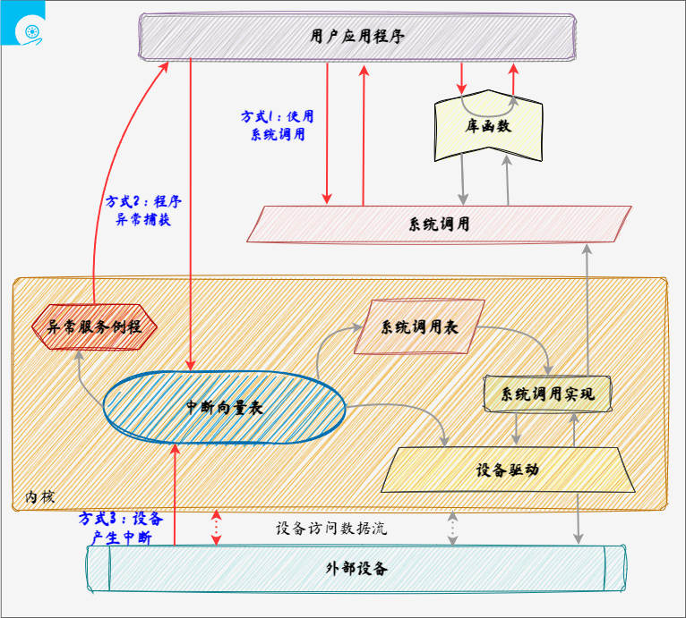

# 中断、异常和系统调用

[TOC]

## 背景

【问】为什么需要中断、异常和系统调用？

- 计算机运行中，BIOS启动后，操作系统的内核是被信任的
- **只有内核可以执行特权指令**
- 但是应用程序同样需要使用内核的方法，方便应用程序的运行，通过不同的机制可以陷入内核

【问】中断、异常分别是用来解决什么问题的？

- 当外设连接计算机后，例如敲击键盘，内核会通过**中断**来做出响应。
- 当应用程序出现了异常行为时，例如除零操作，内核会通过**异常**来进行响应

【问】系统调用是用来解决什么问题的？

- 用户程序通过**系统调用**来获得/使用系统服务
- 库函数/系统调用？
    - <u>库函数</u>用于提供用户态服务。它可能调用封装了一个或几个不同的系统调用，也可能不调用任何系统调用。

## 

### 基本概念

**中断（硬中断）- Hardware Interrupt**

- 含义：**由<u>硬件设备发起</u>的处理请求**，称为中断，例：I/O中断、时钟中断（如：时间片）、控制台中断等。中断也会使CPU 由用户态变为内核态，使操作系统内核重新夺回对CPU的控制权（也是内核夺回CPU使用权的唯一途径），当然操作系统内核也会在合适的时候主动把CPU的使用权让给应用程序。
- 处理：
    - 硬件处理：在 CPU 初始化时，设置中断标志，
        - 根据内部或外部事件设置中断标志
        - 根据中断向量调用相应的中断服务例程。
    - 软件处理：
        - 先进行现场保存，例如上下文（编译器）
        - 执行中断服务处理（服务例程）
        - 清除中断标志（服务例程）
        - 恢复现场（编译器）（暂停应用程序运行，保存应用程序运行状态，比如寄存器数据，待中断处理完成 即中断服务例程完成后 进行应用程序状态恢复）
- 中断嵌套：**硬件中断服务例程可以嵌套**
    - <u>不同硬件中断源，可能在其他硬件中断处理时出现</u>，例如鼠标和键盘，可能会根据优先级更高的优先处理
    - 硬件中断服务例程中，可能需要<u>临时禁止中断请求</u>，例如电源相关中断，可能会禁止其他设备中断
    - 中断请求会保持到 CPU 做出响应

**异常（软中断）- Exception**

- 含义：应用程序执行了**非法指令或其他原因（如：CPU自身异常、内存错误），导致当前<u>指令执行失败</u>的处理请求**，称为异常。
- 处理：操作系统内核选择 直接杀死进程 或准备资源重新尝试执行应用程序指令（重新尝试执行失败的指令，这过程对应用程序是透明的）。
- 异常嵌套：异常服务例程可以嵌套
    - 异常服务例程执行期间，可能出现硬件中断
    - 异常服务例程执行期间，可能出现另一个异常，例如缺页

 

**系统调用（陷入）- System Call**

- 含义：**应用程序<u>主动</u>向操作系统发出的服务请求**，调用系统提供的一些简单易用的服务。例：设备管理、文件管理、进程控制、进程通信、内存管理等

- 处理：等待或持续。系统的共享资源由内核统一管理，所以对共享资源的调用必须由操作系统内核来对各个请求进行协调处理，保证系统的稳定性和安全性。

- 系统调用的实现：
    - 每个系统调用对应一个系统调用号（系统调用接口-系统调用号）
    - 系统调用接口调用内核态中系统调用功能的实现，并返回结果和状态
    - 用户不需要知道系统调用的实现。
- 系统调用与库函数的区别：
    - 系统调用：INT 和 IRET 指令。系统调用时，有堆栈切换、特权级切换
    - 库函数调用：CALL 和 RET 指令。常规调用时，没有堆栈切换

### 三者区别

|              | **源头**               | **响应方式** | 处理机制                             |
| ------------ | ---------------------- | ------------ | ------------------------------------ |
| **中断**     | 外设                   | 异步         | 持续，对用户程序透明                 |
| **异常**     | 应用程序意想不到的行为 | 同步         | 杀死或重新执行意想不到的应用程序指令 |
| **系统调用** | 应用程序主动发起请求   | 异步或同步   | 等待和持续                           |

