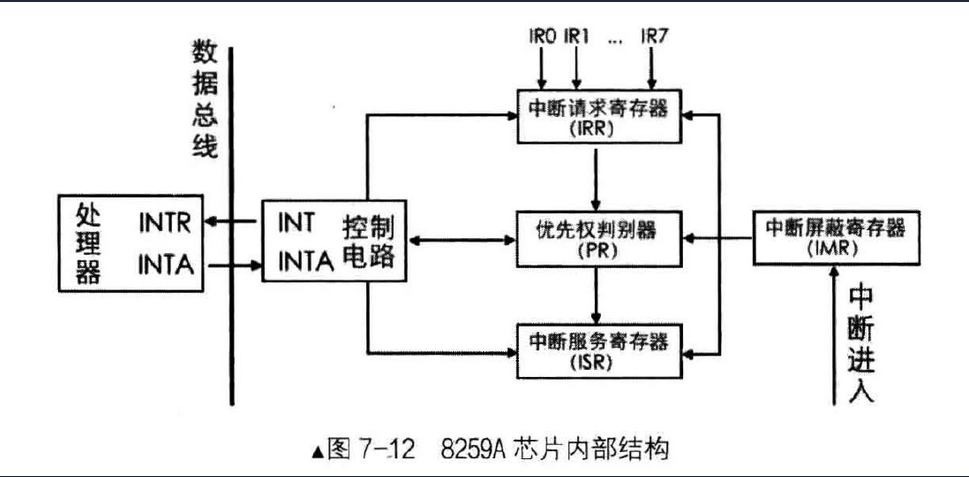
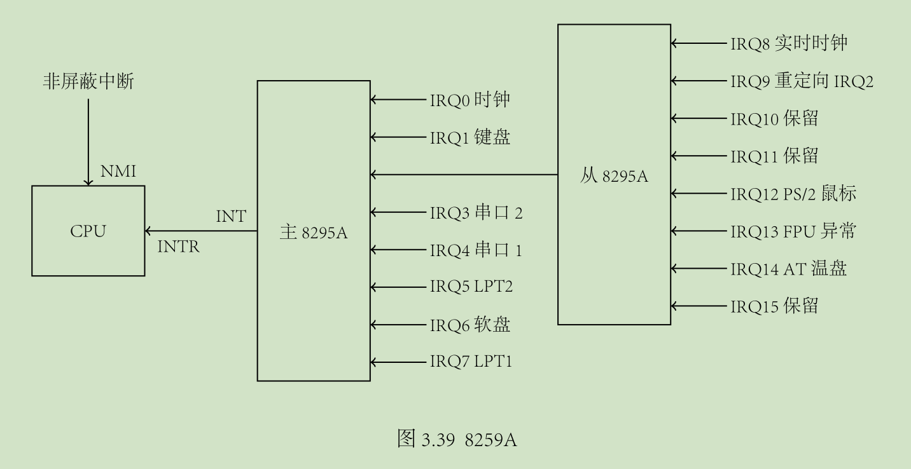
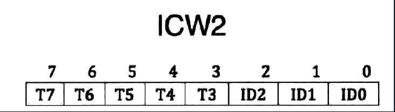
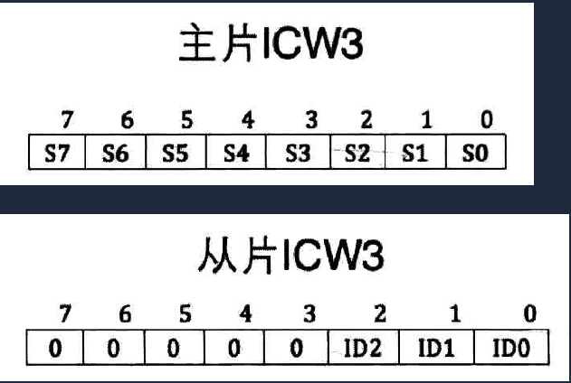
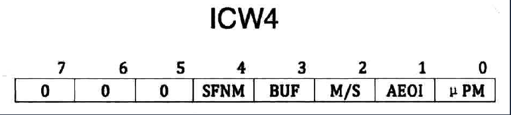
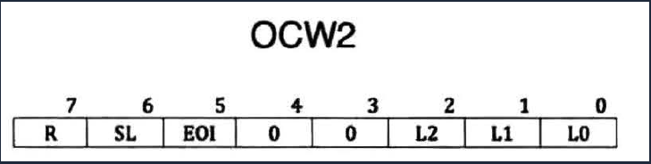
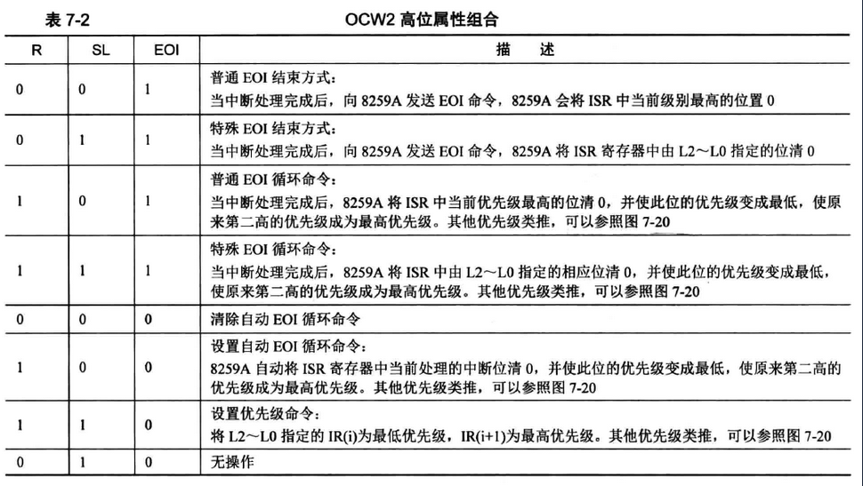
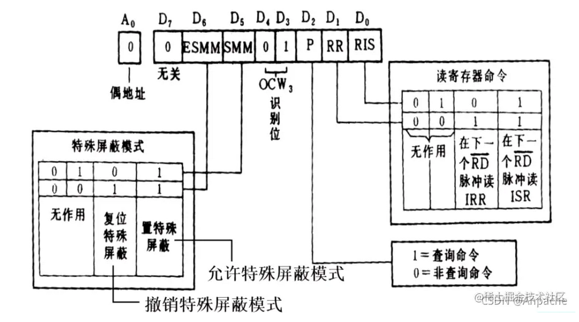

# 中断、异常和系统调用

[TOC]

## 背景

【问】为什么需要中断、异常和系统调用？

- 计算机运行中，BIOS启动后，操作系统的内核是被信任的
- **只有内核可以执行特权指令**
- 但是应用程序同样需要使用内核的方法，方便应用程序的运行，通过不同的机制可以陷入内核

【问】中断、异常分别是用来解决什么问题的？

- 当外设连接计算机后，例如敲击键盘，内核会通过**中断**来做出响应。
- 当应用程序出现了异常行为时，例如除零操作，内核会通过**异常**来进行响应

【问】系统调用是用来解决什么问题的？

- 用户程序通过**系统调用**来获得/使用系统服务
- 库函数/系统调用？
    - <u>库函数</u>用于提供用户态服务。它可能调用封装了一个或几个不同的系统调用，也可能不调用任何系统调用。


## 

### 基本概念


**中断（硬中断）- Hardware Interrupt**

- 含义：**由<u>硬件设备发起</u>的处理请求**，称为中断，例：I/O中断、时钟中断（如：时间片）、控制台中断等。中断也会使CPU 由用户态变为内核态，使操作系统内核重新夺回对CPU的控制权（也是内核夺回CPU使用权的唯一途径），当然操作系统内核也会在合适的时候主动把CPU的使用权让给应用程序。
- 处理：
    - 硬件处理：在 CPU 初始化时，设置中断标志，
        - 根据内部或外部事件设置中断标志
        - 根据中断向量调用相应的中断服务例程。
    - 软件处理：
        - 先进行现场保存，例如上下文（编译器）
        - 执行中断服务处理（服务例程）
        - 清除中断标志（服务例程）
        - 恢复现场（编译器）（暂停应用程序运行，保存应用程序运行状态，比如寄存器数据，待中断处理完成 即中断服务例程完成后 进行应用程序状态恢复）
- 中断嵌套：**硬件中断服务例程可以嵌套**
    - <u>不同硬件中断源，可能在其他硬件中断处理时出现</u>，例如鼠标和键盘，可能会根据优先级更高的优先处理
    - 硬件中断服务例程中，可能需要<u>临时禁止中断请求</u>，例如电源相关中断，可能会禁止其他设备中断
    - 中断请求会保持到 CPU 做出响应


**异常（软中断）- Exception**

- 含义：应用程序执行了**非法指令或其他原因（如：CPU自身异常、内存错误），导致当前<u>指令执行失败</u>的处理请求**，称为异常。
- 处理：操作系统内核选择 直接杀死进程 或准备资源重新尝试执行应用程序指令（重新尝试执行失败的指令，这过程对应用程序是透明的）。
- 异常嵌套：异常服务例程可以嵌套
    - 异常服务例程执行期间，可能出现硬件中断
    - 异常服务例程执行期间，可能出现另一个异常，例如缺页

 

**系统调用（陷入）- System Call**

- 含义：**应用程序<u>主动</u>向操作系统发出的服务请求**，调用系统提供的一些简单易用的服务。例：设备管理、文件管理、进程控制、进程通信、内存管理等

- 处理：等待或持续。系统的共享资源由内核统一管理，所以对共享资源的调用必须由操作系统内核来对各个请求进行协调处理，保证系统的稳定性和安全性。

- 系统调用的实现：
    - 每个系统调用对应一个系统调用号（系统调用接口-系统调用号）
    - 系统调用接口调用内核态中系统调用功能的实现，并返回结果和状态
    - 用户不需要知道系统调用的实现。
- 系统调用与库函数的区别：
    - 系统调用：INT 和 IRET 指令。系统调用时，有堆栈切换、特权级切换
    - 库函数调用：CALL 和 RET 指令。常规调用时，没有堆栈切换

### 三者区别

|              | **源头**               | **响应方式** | 处理机制                             |
| ------------ | ---------------------- | ------------ | ------------------------------------ |
| **中断**     | 外设                   | 异步         | 持续，对用户程序透明                 |
| **异常**     | 应用程序意想不到的行为 | 同步         | 杀死或重新执行意想不到的应用程序指令 |
| **系统调用** | 应用程序主动发起请求   | 异步或同步   | 等待和持续                           |


## 中断和异常

中断和异常是强制性的执行流的转移，从当前正在执行的程序或任务转移到一个特殊的称作句柄的例程或任务。


当硬件发出信号时，便产生**中断**，**中断**在一个程序执行期间内的**任意时间**都有可能发生，以响应**硬件发出的信号**。中断的产生同正在执行的程序是**异步**的。处理器响应中断或异常所采取的动作被称为**中断/异常服务或处理**。

-  系统硬件使用中断处理来自处理器外部的事件。比如外围设备的服务请求。
-  软件也可通过执行指令`INT n`产生中断。


**异常**是在处理器执行指令的过程中**发现错误而产生**的，比如除数为零。

- 处理器可以检测出多种不同的错误，包括保护异常、页错误、内部机器错误。
- P6家族和Pentium处理器还允许当出现硬件错误和总线错误时产生硬件检测异常。


当处理器收到中断信号或检测到异常时，便挂起当前正在运行的进程或任务，而转去执行中断或异常处理例程。中断或异常处理例程执行完之后，处理器继续被中

断的进程或任务。被中断的进程或任务继续执行，就像从未被打断过一样。除非**不能从异常中恢复**，或者**中断导致当前运行程序终止**。


### 打开和关闭中断

根据处理器的状态和 **EFLAGS 的 IF 位和 RF 位**，处理器可以禁止某些中断的产生。

 可以通过`STI` （set interrupt-enable flag）和`CLI` （clear interrupt-enable flag）指令设置和复位 IF 标志。 这些指令只有在 CPL 等于或小于 IOPL 时才能执行（即，正在执行的程序的权限足够大）。 当CPL大于IOPL时（数字越大，权限越小），会产生一个一般保护异常（#GP）。


#### 1. 屏蔽可屏蔽硬件中断

IF 标志可以禁用从处理器的 INTR 引脚或通过本地 APIC 接收的可屏蔽硬件中断的服务。

- 当 IF 标志为 0 时，处理器禁止发送到 INTR 引脚或通过本地 APIC 产生内部中断请求的中断
- 当 IF 标志为 1 时，传递给 INTR 或通过本地 APIC 引脚的中断被当作正常的外部中断处理


#### 2. 屏蔽断点

EFLAGS寄存器中的 RF (恢复)标志控制处理器对指令断点条件的响应

- 当设置 RF = 1 时，它防止指令断点生成调试异常 (#DB)；
- 当设置 RF = 0 时，指令断点将生成调试异常。


RF标志的主要功能是防止处理器在指令断点上进入调试异常循环。


#### 3. 在切换堆栈时屏蔽异常和中断

为了切换到不同的堆栈段，软件通常使用一对指令，例如:

```assembly
MOV SS, 	AX
MOV ESP, 	StackTop
```

如果一个中断或异常发生在新的SS段描述符被加载之后，但在ESP寄存器被加载之前，那么在中断或异常处理程序的持续时间内，逻辑地址的这两个部分进入堆栈空间是不一致的。


- 在下一条指令上的任何指令断点都被抑制(就像EFLAGS一样，RF为1)。

- 根据MOV到SS指令或POP到SS指令交付的任何单步陷阱(因为EFLAGS。TF = 1)被抑制。

    


### 中断源

处理器收到的中断有两个来源：

1. 外部中断（硬件产生）
2. 软件产生的中断


#### 1. 外部中断


外部中断是通过处理器的引脚接收的，也可以通过局部 APIC (Advanced Programmable Interrupt Controller(APIC)，高级可编程中断控制器) 串行总线接收。外部中断需要建立硬件中断与向量号之间的对应关系。

1. 当局部 APIC 被关闭时，这两个引脚被分别配置成 CPU 的 INTR 和 NMI 引脚。
    - 当信号由 INTR 引脚传递给处理器时，便发生了一个外部中断，处理器从系统总线读取由外部中断控制器(如8259A)发来的中断向量号。
    - 当信号从 NMI 引脚传递进来，则发生的是一个不可屏蔽中断(NMI)，其固定向量号为 2。

2. 当 APIC 打开时，可通过 APIC 向量表对 LINT[1:0] 引脚编程，使其和处理器的任意异常和中断向量绑定。

​	

处理器的本地 APIC 通常会与基于系统的 I/O APIC 连接。因而， I/O APIC 的引脚所接收到的外部中断信号可以通过系统总线（Pentium 4, Intel Core Duo, Intel Core 2, Intel®Atom™和Intel Xeon处理器）或APIC串行总线（P6家族和Pentium处理器）直接传递给本地APIC。 I/O APIC获得该中断的向量号，然后发送给本地APIC。 当系统中有多个处理器时，处理器之间也可以通过系统总线（Pentium 4、Intel Core Duo、Intel Core 2、Intel Atom、Intel Xeon处理器）或APIC串行总线9P6族和Pentium处理器）相互发送中断信号。

 在 Intel486 处理器和不包含片上本地APIC的早期 Pentium 处理器上，`LINT[1:0]`引脚是不可用的。 这些处理器有专用的`NMI`和`INTR`引脚。 对于这些处理器，外部中断通常由基于系统的中断控制器（8259A）产生，通过INTR引脚发送中断信号。

 需注意的是，处理器上的其他几个引脚可能会导致发生处理器中断。 然而，这些中断并不会被本章中描述的中断和异常机制处理。 这些引脚包括`RESET#， FLUSH#， STPCLK#， SMI#， R/S#和INIT#`引脚。 不是每个处理器都有这些引脚，这却决于处理器的实现。


##### 可屏蔽硬件中断

任何通过 **INTR 引脚**或局部 APIC 传递到处理器的外部中断都被称作**可屏蔽硬件中断**。

- 通过 INTR 引脚传递的可屏蔽硬件中断可使用所有 Intel 架构定义的中断向量 (0~255)
- 通过局部 APIC 传递的部分只能使用 16~255 号向量。


使用 EFLAGS 寄存器的 IF 位就可以屏蔽全部可屏蔽硬件中断。


###### 8259a 中断控制器


8259A 用于管理和控制可屏蔽中断，它表现在屏蔽外设中断，对它们实行优先级判决，向 CPU 提供中断向量号等功能。

一片 8259A 只能管理 8 个中断，通过级联芯片可以支持 7n+1 个中断源。


可屏蔽中断与 CPU 的关系是通过对可编程中断控制器 8259A 建立起来的。 8259A，可以认为它是中断机制中所有外围设备的一个代理，这个代理不但可以根据优先级在同时发生中断的设备中选择应该处理的请求，而且可以通过对其寄存器的设置来屏蔽或打开相应的中断。


下面是 8259a 芯片的内部结构：



处理流程：

- 8259A 芯片收到中断信号之后，芯片内部的中断屏蔽寄存器 IMR  会判断该信号是否屏蔽（编程控制），如果屏蔽就丢弃信号，否则送入中断请求寄存器 IRR
- IRR 相当于待处理中断队列，时机成熟时，优先级判别器  PR 会从中选择优先级高的中断，通过控制电路 INT 接口向 CPU 发送 INTR 信号

- CPU 处理完成后，通过自己的 INTA 接口向 8259A 的 INTA 接口回复一个响应信号
- 8259A  收到信号之后，立即将中断服务寄存器 ISR 中对应刚才选择的中断的位设置为 1，表示当前正在处理该中断，同时将该中断从 IRR 队列中去掉
- 之后 CPU 再次发送 INTA 信号给 8259A，8259A 将中断向量号（编程控制）通过系统数据总线发给 CPU ，CPU  进行执行中断处理程序。


硬件程序是固定的，可编程指的是我们可以控制硬件程序提供的输入和输出，CPU 提供了中断处理的框架，我们只需要提供 CPU 所需要的输入即可让 CPU 自动完成工作，需要的数据是：

- 中断描述符表
- 中断向量号

我们只需要在外部设备中设置好中断向量号，然后在中断描述符表中设置好对应的中断处理程序即可。


下面就是 8259a 中断控制器示意图：



可以发现：

- 与 CPU 相连的不是一片，而是两片级联的 8259A，每个 8259A 有 8 根中断信号线，于是两片级联总共可以挂接 15 个不同的外部设备。

- 在BIOS初始化它的时候，IRQ0∼IRQ7 被设置为对应向量号 08h∼0Fh，而通过中断向量表可以知道，在保护模式下向量号 08h-0Fh 已经被占用了，所以我们不得不重新设置主从 8259A。

- 8259A 是可编程中断控制器。通过向相应的端口写入特定的 ICW（Initialization Command Word）来实现的。

    - 主 8259A 对应的端口地址是 20h 和 21h
    - 从 8259A 对应的端口地址是 A0h 和 A1h

- 初始化过程（整个过程顺序不能颠倒）：

    1. 往端口 20h（主片）或 A0h（从片）写入 ICW1。

    2. 往端口 21h（主片）或 A1h（从片）写入 ICW2。
    3. 往端口 21h（主片）或 A1h（从片）写入 ICW3。
    4. 往端口 21h（主片）或 A1h（从片）写入 ICW4。

- ICW 共有4个，每一个都是具有特定格式的字节。格式如下所示：


###### 8259a 编程

8259A 内部有两组寄存器：

- 一组是初始化命令寄存器组，用来保存初始化命令字（ICW），ICW 共 4 个，ICW1 ~ ICW4。
- 另一组是操作命令寄存器，用来保存操作命令字（OCW），OCW 共 3 个，OCW1 ~ OCW3。


对 8259A 的编程，也分为初始化和操作两部分：

- 一部分是用 ICW 做初始化，用来确定是否需要级联，设置起始中断向量号，设置中断结束模式。其编程就是向端口发送一系列 ICW，后面的某个设置会依赖前面 ICW 的设置，所以必须依次写入 ICW1~4
- 另一部分是用 OCW 来操作控制 8259A，中断屏蔽和中断结束。写入顺序无所谓了


1. ICW1

ICW1 用来初始化 8259A 的连接方式和中断信号的触发方式。ICW1 需要写入主片的 `0x20` 端口和从片的 `0xA0` 端口。


说明：

- IC4 为 1 时表示要写入 ICW4，为 0 时不需要。x86 系统必须为 1
- SNGL 表示 single，若 SNGL 为 1，表示单片，否则表示级联，为 0 时主片和从片需要 ICW3
- ADI 用来设置 8085 的调用时间间隔，x86 不需要设置。
- LTIM 用来设置中断检测方式，LTIM 为 0 表示边沿触发，LTIM 为 1 表示电平触发。
- 第 4 位的 1 是固定的，标识这是 ICW1
- 第 5-7 位是服务 8085 CPU的，x86 不需要


2. ICW2 - **中断类型控制字（中断类型码）**

ICW2 用来设置起始中断向量号。ICW2 需要写入到主片的 `0x21` 端口和从片的 `0xA1` 端口。



> 只需要设置 IRQ0 的中断向量号，剩下的就会依次顺延

- 低 3 位：不用管，会依据接口的排列自动导入
- 高 5 位：起始中断向量号


3. ICW3 - **主/从片初始化（级联控制字）**

ICW3 仅在级联的方式下才需要，用来设置主片和从片用哪个 IRQ 接口互连。ICW3 需要写入主片的 `0x21` 端口及从片的 `0xA1` 端口。

主片和从片的 ICW3 结构不同。

- 主片上中置 1 的那一位对应的 IRQ 接口用于连接从片。
- 从片上低三位用于表示连接到主片上的 IRQ 接口。




4. ICW4 - **方式控制字**


ICW4 用于设置 8259A 的工作模式，ICW3 需要写入主片的 `0x21` 端口及从片的 `0xA1` 端口。

- SFNM 表示特殊全嵌套模式，若 SFNM 为 0，则表示全嵌套模式，为 1 则表示特殊全嵌套模式。
- BUF 表示是否工作在缓冲模式。BUF 为 0，表示工作在非缓冲模式，BUF 为 1，表示工作在缓冲模式。
- 如果工作在缓冲模式下，M/S 为 1 表示是主片，M/S 为 0 表示是从片。若工作在非缓冲模式下，M/S 无效。
- AEOI 表示自动结束中断，8259A 在收到中断结束信号时才能继续处理下一个中断。若 AEOI 为 0，表示非自动。若 AEOI 为 1，表示自动结束中断。
- μPM 表示位处理器类型。若 μPM 为 0，表示 8080 或 8085 处理器。若 μPM 为 1，表示 x86 处理器。




1. OCW1 - **屏蔽操作命令字**


OCW1 用来屏蔽连接在 8259A 上的外部设备的中断信号，某位为 1，对应的 IRQ 上的中断信号就屏蔽了。OCW 要写入主片的 `0x21` 或从片的 `0xA1` 端口。


2. OCW2 - **中断方式命令字**

OCW2 用来设置中断结束方式和优先级模式。OCW2 写入主片的 `0x20` 及从片的 `0xA0` 端口。

OCW2 其中一个作用是发 EOI 信号结束中断。

- SL 位针对某个特定优先级的中断进行操作。SL 为 0表示自动将正在处理的中断结束，L0-L2 无效
- R 位 0 表示固定优先级方式，为 1 表示循环优先级方式。
- EOI，中断结束命令位，为 1 会令 ISR 寄存器中相应位清 0



OCW2 高位可以组合出多种不同的结束方式：




3. OCW3 - **状态操作命令字**

设置和撤销特殊屏蔽方式、设置中断查询方式、设置对8259A内部寄存器的读出命令。OCW3 需要写入主 8259A `0x20` 端口和从 8259A 的 `0xA0` 端口



说明：

- BIT0：RIS 标志位，该位置位则读取 ISR 寄存器的值，该位清零则读取 IRR 寄存器. 
- BIT1： RR  标志位，该位置位则读取寄存器，该位清零则无意义。
- BIT2： P 标志位，该位置位则表示中断查询命令查询当前最高中断优先级，该位清零则无意义;  
- BIT3-BIT4： 在 X86 架构固定为 0x01; BIT5 SMM  标志位，该位置位表示工作于特殊屏蔽模式，该位清零则未工作于特殊屏蔽模式; 
- BIT6： ESMM 标志位，该位置位则表示启用特殊屏蔽模拟,  该位清零则表示关闭特殊屏蔽模式. 


##### 不可屏蔽硬件中断


在两种情况下产生不可屏蔽中断(NMI)：

- 外部硬件向 NMI 引脚发信号
- 处理器从 APIC 串行总线上收到 NMI 模式的信号


处理过程：

- 当处理器从这两种中的任一种收到 NMI 时，便立即作出响应，<u>调用由 2 号中断向量指向的处理例程</u>。

- 处理器还会调整某些硬件以保证在当前 NMI 处理例程完成前，不再接收任何中断信号，包括NMI中断（即，当处理NMI中断时，不会被其他任何中断打断，也就说屏蔽了所有其他中断信号）。


从上述的任一来源所收到的 NMI 信号时，<u>其不能被EFLAGS寄存器中的IF标志位给屏蔽</u>。


可以将一个可屏蔽硬件中断重定向到 2 号向量，以调用 NMI 处理例程。但是，这种中断不是真正的 NMI 中断。真正的 NMI 可以激活处理器的硬件处理部分，只能由上面提到的两种情况产生 NMI。


#### 2. 软件中断

将中断向量号作为 INT 指令的操作数即可通过 INT指 令在程序中产生中断。比如，指令 INT 35 即可调用第 35 号中断处理例程。

- 0 到 255 号中断均可使用 INT 指令调用。
- 但是，当处理器预先定义好的 NMI 不可屏蔽中断被这样调用时，处理器作出的响应与真正 NMI 中断发生时的响应并不一样。也就是说，执行 INT 2 (NMI

的向量号) 时，NMI 处理例程被调用，但是处理器的 NMI 硬件处理并未被激活。


注意：<u>EFLAGS 的 IF 位并不能屏蔽由 INT 指令产生的中断</u>。


### 异常源

处理器接收的异常信号有三个来源：

1. 处理器检测到的程序错误异常
2. 软件产生的异常
3. 机器检测异常


#### 1. 程序异常

在应用程序执行过程中,或操作系统执行中，**当检测到程序错误时**，处理器产生一个或多个异常。

Intel 为每个处理器可检测到的异常定义了一个向量号。异常又进一步被划分为错误，陷阱和终止

#### 2. 软件产生的异常

INTO, INT 3 和 BOUND 指令允许**在软件中产生异常**。这些指令允许在指令流中检测指定的异常条件。

例如，INT 3 产生一个中断异常。INT n 指令可以在软件中用来模拟某个异常，但有一点要注意。若该指令中的n指向 Intel 定义的某个异常，处理器便会产生一个指向相应的中断，接着就是调用相应的处理例程。

 **`INT n`指令可用于在软件中模拟指定的异常**；但也存在限制。 如果`INT n`指令指定的向量号`n`是系统架构定义的异常的向量号之一，那么处理器会为该向量号产生一个对应的中断（以访问异常处理程序），但不会把产生的错误码压入栈，因为处理器将其看作为一个中断，而不是异常。 即使与之关联硬件产生的异常通常会产生一个错误码。虽然前面处理器并没有将错误码压入栈，但当处理异常时，异常处理程序仍会尝试将错误码弹出堆栈。因为处理器没有将错误码压入堆栈，而处理程序会把EIP（代正好处于缺失的错误码的位置处）弹栈，从而造成返回位置错误。


#### 3. 机器检测异常

P6系列和Pentium处理器同时提供了**内部和外部的机器检测机制**，用来检查内部芯片部件的操作和总线传输。这些机制组成了扩展异常机制(并不能独立完成)。当检测到一个机器检测错误时，处理器发出一个机器检测异常(18号向量)，并返回一个出错码。


### 异常分类

 根据**异常的报告方式**以及**导致异常的指令是否能在不损害程序或任务执行连续性的情况下重新启动**（简言之，就是重新执行导致异常的指令，并从此继续执行），可以将异常分为**错误（Faults）、陷阱（Traps）或终止（Abort）**。

1. **错误**：错误是一种通常**可被纠正**的异常。
    - 错误是一种通常能够被修正的异常，一旦修正，程序能够不失连续性地接着执行。
    - 错误处理例程的返回地址(CS和EIP的存储值)指向产生错误的指令，而不是产生错误指令之后的那条指令。
    - 即：是一种可被更正的异常，而且一旦被更正，程序可以不失连续性地继续执行。当一个 fault 发生时，处理器会把产生 fault 的指令之前的状态保存起来。异常处理程序的返回地址将会是产成 fault 的指令，而不是其后的那条指令。

2. **陷阱**：陷阱是一种执行 trapping 指令后**立即报告**的异常。
    - 陷阱是一种异常，当引起陷阱的指令发生时，马上产生该异常。陷阱允许程序不失连续性的继续执行。
    - 陷阱处理例程的返回地址指向引起陷阱指令的下一条指令。
    - 即：是一种在发生 trap 的指令执行之后立即被报告的异常，它也允许程序或任务不失连续性地继续执行。异常处理程序的返回地址将会是产成 trap 的指令之后的那条指令

3. **终止**：终止是一种异常，其<u>并不总是报告引起异常的指令的精确位置</u>，并且**不允许异常程序或任务的重新继续执行**。 
    - 终止是另一种异常，它并不总是报告产生异常的指令的确切位置，也不允许引起终止的进程或任务重新执行。
    - 终止被用来报告严重错误，比如硬件错误、不一致或非法系统表值。
    - 即：是一种不总是报告精确异常发生位置的异常，它不允许程序或任务继续执行，而是用来报告严重错误的。

注意：被报告为错误的一个异常子集是不能重新继续程序执行的。 这样的异常会丢失处理器的某些状态信息。 例如，执行 POPAD  指令会导致堆栈帧越界，从而报告错误。 在这种情况下，异常处理程序会看到指令指针（CS:EIP）已经恢复，就像POPAD指令没有被执行一样。 但是，内部处理器状态（通用寄存器）将被修改。 这种情况被认为是编程错误。 操作系统会终止引起这类异常的应用程序。


### 中断异常向量

处理器为每个需被处理器特殊处理的异常和中断条件都赋予了一个独一无二的标识号，称为**向量号**

处理器赋予一个异常或中断的**向量号**作为访问**中断描述符表（IDT）**的一个索引。中断描述符表提供了到一个异常或中断处理程序的入口点位置。

**向量号的范围为 0 到 255** 。其中 0 到 31 被分配给异常和 NMI 中断使用。目前的处理器还未使用完全 0-31 的所有 32 个向量号，未使用的向量号保留给将来使用。**不要使用这些保留的向量号。**

**在 32 到 255 范围内的所有向量号用于用户定义的中断**，这些中断不在 Intel 的保留部分之列。这些中断通常用于外部I/O设备，以确保这些设备可以通过外部硬件中断机制发送中断给处理器。

 下表展示了分配给系统架构定义的异常以及NMI中断的向量号。该表还给出了异常类型以及是否会产生一个错误码并保存在栈上。同时还给出了每个预定义的异常和NMI中断源。


下面是 保护模式中的中断和异常向量：

| 向量号 | 助记符 |             描述             |    类型    | 出错码 |                             源                              |
| :----: | :----: | :--------------------------: | :--------: | :----: | :---------------------------------------------------------: |
|   0    |  #DE   |            除法错            |   Fault    |   无   |                      DIV 和 IDIV 指令                       |
|   1    |  #DB   |           调试异常           | Fault/Trap |   无   |                    任何代码和数据的访问                     |
|   2    |   -    |          非屏蔽中断          | Interrupt  |   无   |                       非屏蔽外部中断                        |
|   3    |  #BP   |           调试断点           |    Trap    |   无   |                         指令 INT 3                          |
|   4    |  #OF   |             溢出             |    Trap    |   无   |                          指令 INTO                          |
|   5    |  #BR   |             越界             |   Fault    |   无   |                         指令 BOUND                          |
|   6    |  #UD   |    无效（未定义的）操作码    |   Fault    |   无   |                    指令 UD2 或者无效指令                    |
|   7    |  #NM   | 设备不可用（无数学协处理器） |   Fault    |   无   |                   浮点或 WAIT/FWAIT 指令                    |
|   8    |  #DF   |           双重错误           |   Abort    | 有 (0) |             所有能产生异常或 NMI 或 INTR 的指令             |
|   9    |        |    协处理器段越界（保留）    |   Fault    |   无   |     浮点指令（386 之后的 IA32 处理器不再产生此种异常）      |
|   10   |  #TS   |           无效 TSS           |   Fault    |   有   |                    任务切换或访问 TSS 时                    |
|   11   |  #NP   |           段不存在           |   Fault    |   有   |                 加载段寄存器或访问系统段时                  |
|   12   |  #SS   |          堆栈段错误          |   Fault    |   有   |                    堆栈操作或加载 SS 时                     |
|   13   |  #GP   |         常规保护错误         |   Fault    |   有   |                     内存或其他保护检验                      |
|   14   |  #PF   |            页错误            |   Fault    |   有   |                          内存访问                           |
|   15   |   -    |      Intel 保留，未使用      |            |        |                                                             |
|   16   |  #MF   |   x87FPU 浮点错（数学错）    |   Fault    |   无   |              x87FPU 浮点指令或WAIT/FWAIT 指令               |
|   17   |  #AC   |           对齐检验           |   Fault    | 有 (0) |              内存中的数据访问（486 开始支持）               |
|   18   |  #MC   |        Machine Check         |   Abort    |   无   | 错误码（如果有的话）和源依赖于具体模式（奔腾 CPU 开始支持） |
|   19   |  #XF   |        SIMD 浮点异常         |   Fault    |   无   |           SSE 和 SSE2 浮点指令（奔腾 Ⅲ 开始支持）           |
| 20~31  |   -    |      Intel 保留，未使用      |            |        |                                                             |
| 32~255 |   -    |         用户定义中断         | Interrupt  |        |                    外部中断或 int n 指令                    |


### 异常和中断的优先级

 如果在一个指令边界上有多个异常或中断等待处理，处理器会按照规定的顺序对它们进行处理。 

异常源和中断源的优先级如下图所示。处理器首先处理**最高优先级的异常或中断**，执行转移到异常或中断处理程序的第一条指令。 

**低优先级异常会被丢弃**； 而**低优先级的中断被挂起等待**。 当中断处理程序返回到产生异常和/或中断的程序或任务中时，被丢弃的异常会重新产生。


| 优先级     | 说明                                                         |
| ---------- | ------------------------------------------------------------ |
| 1（最高）  | 硬件复位（REST）和机器检查                                   |
| 2          | 任务切换陷阱、TSS中设置了T标志位                             |
| 3          | 外部硬件介入：FLUSH、STOPCLK、SMI、INIT                      |
| 4          | 前一指令陷阱：断点、调试陷阱异常                             |
| 5          | 不可屏蔽硬件中断                                             |
| 6          | 可屏蔽硬件中断                                               |
| 7          | 代码断点故障                                                 |
| 8          | 取下条指令故障：违反代码段限长、代码页故障                   |
| 9          | 下条指令译码故障：指令长度>15字节、无效操作码、协处理器不存在 |
| 10（最低） | 执行指令故障：溢出、边界检查、无效TSS、段不存在、堆栈故障、一般报告、数据页故障、对齐检查、浮点错误、虚拟化异常 |


### 程序或任务的继续执行

为了使得程序或任务在处理完异常或中断后重新恢复执行，所有的异常（**除了终止**）都必须能报告异常指令的精确位置，并且所有中断必须在指令边界发生上。

- 对于**错误类异常**，<u>返回地址指向产生错误的指令</u>（在处理器产生异常时所保存）。 
    - 当程序或任务在处理完故障后重新开始执行时，将**重新启动（重新执行）原来的出错指令**。 
    - 重新执行错误指令通常用于**处理访问操作数被阻塞所产生的异常**。 这类故障最常见的例子是**页故障异常（#PF）**，当程序或任务**引用不在内存中的页面上的操作数**时，就会出现页故障异常。 当页面故障异常发生时，异常处理程序可以将该要引用页面加载到内存中，并通过重新执行出错指令来恢复程序或任务的执行。 为了确保重新执行对当前执行程序或任务是透明的（即用户意识不到发生了故障以及进行了处理），处理器会保存必要的寄存器和堆栈指针信息，以使得能返回到执行出错指令之前的状态。
- 对于**陷阱类异常**，<u>返回地址指向的是产生陷阱指令的下一条指令</u>。 
    - 如果在一条**控制转移指令的执行期间**检测到一个陷阱，则**返回指令指针会反映出控制的转移情况**。 例如，如果在执行 JMP 指令时检测到一个 trap，则返回指令的指针会指向 JMP 指令的目的地址，而不是 JMP 指令之后一条指令的地址。 所有的陷阱异常都允许程序或任务在不丢失执行连贯性的情况下重新继续执行。 
    - 例如，溢出异常是陷阱异常。而返回地址指针指向**检查EFLAGS.OS（溢出）标志位**的`INTO`指令的后一条指令。该陷阱异常的处理程序解决溢出情况。 从陷阱类异常处理程序返回后，程序或任务继续执行`INTO`指令后的指令。
- **终止类异常**<u>不支持可靠地重新执行程序或任务</u>。 终止异常的处理程序通常会在终止异常发生时，**收集有关处理器状态的诊断信息**，然后尽可能优雅地关闭应用程序和系统。

 

**中断会严格地支持被中断程序和任务的重新执行而不丢失执行的连贯性**。 中断所保存的返回地址指针指向处理器<u>获取中断时将要执行的下一条指令</u>边界处。 如果刚执行的指令有一个`repeat`（重复）前缀，则中断会在**当前迭代结束**，且**寄存器已被设置好以执行下一次迭代**后，才发生。

 P6系列处理器的指令预测执行功能并不会影响处理器的中断。 中断发生在指令执行的`retirement`阶段的指令边界上；因此，它们总是在“按顺序”的指令流中获取。（这一部分与上一学期所学的计组中“指令级并行”相关）。
 注意：Pentium 处理器和早期的IA-32处理器也执行不同数量的指令预取和初步译码。 对于这些处理器，异常和中断直到指令实际执行时才会发出信号。 对于给定的示例代码，当代码在任何IA-32处理器系列上运行时，异常信号都会发生（除非定义了新的异常或新的操作码）。


## IDT（中断描述符）

在实模式下，可以直接使用 int 执行 BIOS 中断，而是在保护模式下，中断机制发生了很大变化，原来的中断向量表已经被 IDT 所代替。实模式下能用的 BIOS 中断在保护模式下已经不能用了。


中断描述符表(IDT)为每一个异常或中断向量对应的例程或任务分配了一个门描述符。

- 同GDT和诸多LDT一样，IDT也是由一系列由8个字节组成的描述符组成的(在保护模式下)。
- 和GDT不同的是，IDT中的第一个元不是NULL描述符。

异常或中断向量号乘上 8 即可得到 IDT 中的描述符的索引(即门描述符包含的字节数)。

由于只有 256 个中断或异常向量，所以 IDT 不必包含多于 256 个描述符。并且可以包含不足 256 个的描述符，因为只有那些确实发生的异常或中断才需要一个描述符。所有 IDT 中的空描述符须将存在位置位0。


IDT 也是个描述符表，叫做中断描述符表（Interrupt Descriptor Table）。IDT 中的描述符可以是下面三种之一：

- **中断门描述符**
- **陷阱门描述符**
- **任务门描述符**，Linux 操作系统没有用到

其中，中断门和陷阱门是特殊的调用门。和调用门相比，中断门和陷阱门的作用机理几乎是一样的，只不过使用调用门时使用 call 指令，而这里我们使用int指令。


IDT 的作用是将每一个中断向量和一个描述符对应起来。从这个意义上说 IDT 也是一种向量表。


### 中断描述符表（IDT）概述

中断描述符表（IDT）将每个异常或中断向量与其对应的**异常或中断处理过程**或**任务的门描述符**关联起来。 

- 与GDT和LDT类似，IDT是由**8字节长的描述符**组成的一个数组（在保护模式下）。 
- 但与GDT不同，IDT的**第一个表项可以包含一个描述符**，不是空描述符。 

为了构成IDT表中的一个索引值，处理器将异常或中断向量**变大为8倍**（门描述符的字节数）。 即**异常或中断向量号乘以 8 得到 IDT 中的描述符索引。**

因为**最多有256个**中断或异常向量，所以IDT不需要包含多于256个描述符。 IDT表可以包含**少于256个描述符**，因为只有在可能发生的中断和异常时才需要描述符。 但IDT中所有**空描述符项都应该将存在标志位设置为0**。

 IDT 表的基址应该在 **8 字节边界上进行对齐**，以最大化填充缓存行的性能。限长值以字节为单位，将其基址相加以获得最后一个有效字节的地址。 限长值位 0 则正好只有1个有效字节。 因为IDT每个表项总是8字节长，所以限长应该总是比8的整数倍（即8N - 1）小1，即 `[0,8N-1]`。

IDT表可以驻留**在线性地址空间的任何地方**。 如图1所示，处理器通过IDTR寄存器定位IDT表。 该寄存器存储了32位IDT表的基址和16位IDT表限长。


 `LIDT`（加载IDT寄存器）和`SIDT`（存储IDT寄存器）指令分别用于加载和存储IDTR寄存器的内容。

- LIDT指令把**存储在内存的基址和限长操作数**加载到IDTR寄存器。 该指令只能在CPL为0时执行，通常被用于创建IDT表时的操作系统的初始化代码中。 操作系统也可以使用该指令从一个IDT变为一个IDT。
- SIDT指令将**存储在IDTR中的基址和段限长值复制到内存中**，这个指令可在任何特权级别下执行。

如果中断或异常向量引用的描述符超出了IDT界限，则会产生一个通用保护异常（#GP）。

注意：因为中断只被发送到处理器核心一次，一个配置错误的IDT表可能会导致不完整的中断处理和/或阻塞中断。 在设置IDTR的`base/limit/access`字段以及`gate`描述符中的每个字段时，需要遵循IA-32架构规则。 这对Intel 64架构同样适用。 配置包括通过GDT或LDT隐式引用目标代码段和访问堆栈。

### IDT 描述符位图

IDT 表中可以存放三种类型的门描述符：

- **中断门**（Interrupt-gate descriptor）
- **陷阱门**（Trap-gate descriptor）
- **任务门**（Task-gate descriptor） 

这些门的不同之处在于处理器操作 EFLAGS 寄存器中 IF 标志的方式 。

下图展示了任务门、中断门和陷阱门描述符的格式。


- **陷阱门描述符**和**中断门描述符**
    - 中断门和陷阱门与调用门非常相似，它们含有一个长指针（段选择子和偏移量），处理器使用这个长指针将程序执行权转移到代码段中异常或中断的处理过程中
    - 中断门描述符和陷阱门描述符的不同之处，主要体现在处理器对 EFLAGS.IF 标志位的操作上。
        - 当处理器通过中断门描述符执行中断/异常处理程序时，处理器会复位 IF 标志位以防止其他中断请求干扰当前中断处理程序的执行
        - 处理器会在随后执行的 IRET 指令中，还原保存在栈中的 EFALGS 寄存器（包括 IF 标志位）值。然而，当处理器通过陷阱门描述符执行中断/异常处理程序时，将不会对 IF 标志位进行操作（不会复位 IF 标志位）。
    - **任务门描述符**
        - 在 IDT 表中任务门的格式和 GDT 或 LDT 中任务门格式一致。任务门描述符含有一个用于异常和/或中断处理任务的TSS的段选择符。
        - 任务门描述符仅包含了任务状态段描述符的段选择子和属性信息。
        - 任务门描述符的 DPL 区域控制着访问 TSS 描述符的特权级。当程序借助 CALL 或 JMP 指令穿过任务门访问目标程序时，CS 寄存器的 CPL 值与任务门描述符下选择子的 RPL 值在数值上，必须小于或等于任务门描述符的 DPL 值。（注意：当使用任务门描述符时，目标 TSS 描述符的 DPL 标志位将不起作用）
        - 任务门描述符可以在 GDT、LDT 或 IDT 内创建，但其段选择子必须指向 GDT 的 TSS 描述符（TSS 描述符只能在 GDT 中创建）


### 异常或中断处理程序

异常或中断门引用运行在当前任务上下文中的异常或中断处理过程，如下图所示 。 门的段选择符指向 GDT 或当前 LDT 中可执行代码段的段描述符。 门描述符的偏移量字段指向异常或中断处理过程的开始处。


当处理器执行异常或中断处理过程调用时会进行以下操作：

- 如果处理过程将在一个数值更小（权限更大）的权限级别执行时，会发生堆栈的切换。堆栈切换时会发生如下操作：
    1. 处理器从当前执行任务的TSS中获取中断或异常处理过程使用的堆栈的段选择符和栈指针。然后将被中断过程的堆栈段选择符和栈指针压入新栈。
    2. 处理器将EFLAGS、CS、EIP寄存器的当前状态信息保存到新栈。（如下图所示）
    3. 如果异常会产生一个错误码，那么该错误码在压入EIP值之后被压入新栈。
- 如果处理过程将在与被中断过程相同的权限级别执行时：
    1. 处理器将EFLAGS、CS、EIP寄存器的当前状态信息保存到当前栈。
    2. 如果异常会产生一个错误码，那么该错误码在压入EIP值之后被压入当前栈。


要从异常或中断处理程序过程返回时，处理程序必须使用IRET（或IRETD）指令。 IRET指令与RET指令类似，区别在于其**将保存的标志位信息恢复到EFLAGS寄存器中**。**只有当CPL值为0时**，才会**恢复EFLAGS寄存器的IOPL字段**。 只有当**CPL小于等于IOPL**时，**IF标志才会改变**。

 如果在调用处理程序过程时发生了堆栈切换，IRET指令在返回时切换回被中断的过程的堆栈


### 异常或中断处理程序标志位的使用

 当通过一个中断门或一个陷阱门访问异常或中断处理程序时，处理器在把**EFLAGS寄存器中的内容保存到堆栈上**后，**复位EFLAGS寄存器中的TF标志位** （在调用异常和中断处理程序时，处理器还会将EFLAGS寄存器中VM、RF和NT标志位的信息保存在堆栈中，然后复位这些标志位）。 **清除TF标志可以防止指令跟踪影响中断响应**。 而随后的IRET指令会使用保存在堆栈上的EFLAGS寄存器内容中的值恢复TF（以及VM、RF和NT）标志位。

 **中断门和陷阱门**之间的**唯一区别**在于处理器在EFLAGS寄存器中处理IF标志位的方式。 当通过**中断门**访问一个异常或中断处理过程时，处理器**复位IF标志**以防止其他中断干扰当前的中断处理程序。 随后的IRET指令使用保存在堆栈上的EFLAGS寄存器的值**恢复IF标志位**。 通过**陷阱门**访问处理程序过程**不影响IF标志位**。

