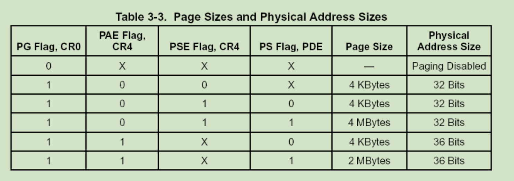
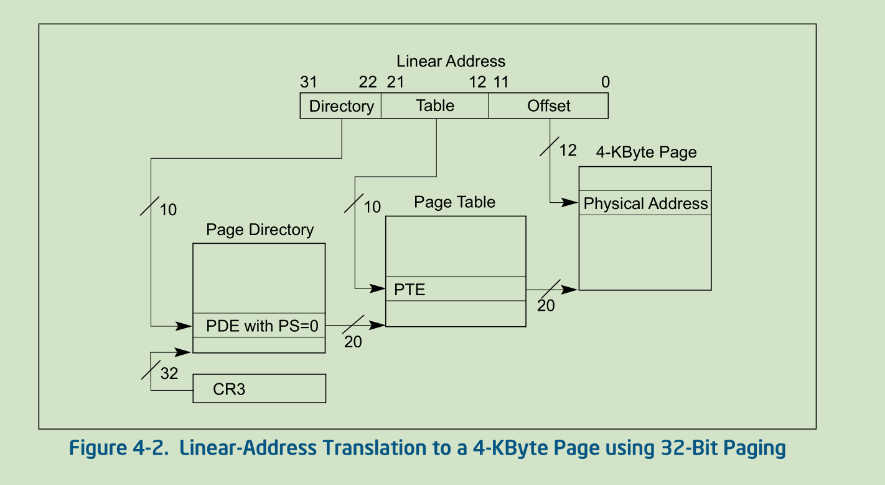
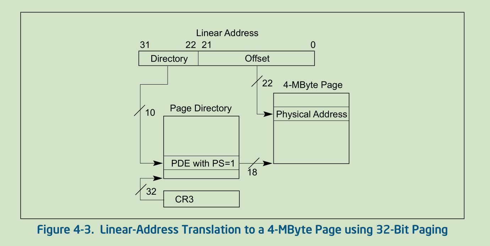
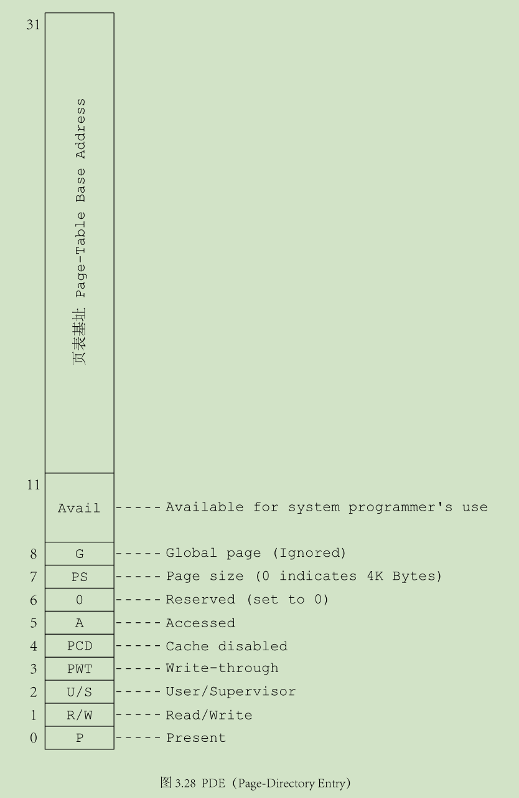
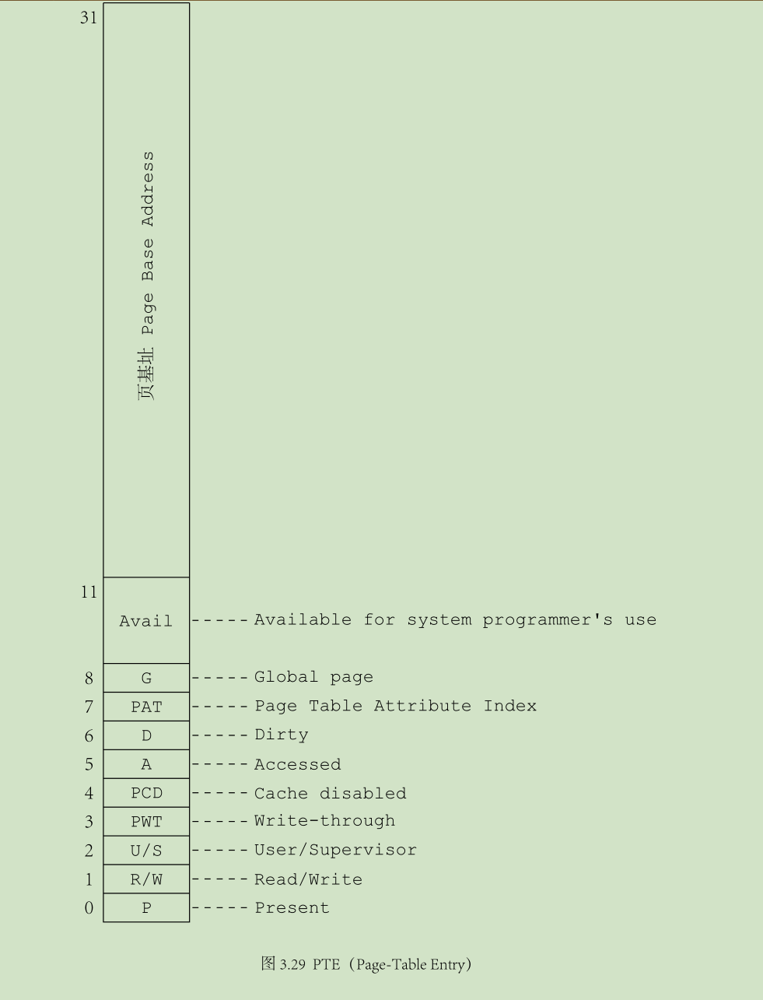

# 保护模式之分页

[TOC]

## 什么是分页？

上一篇介绍了：

 IA-32架构的内存管理机制主要分为两部分：**分段**和**分页**。 

- **分段**提供了一种隔绝各个代码、数据和堆栈区域的机制，保证了多个程序（或任务）可以运行在同一个处理器上，但不会相互干扰。
- **分页**则为传统需求页的虚拟内存系统提供了一种实现机制，在虚拟内存系统中，程序运行所需的环境的各个部分<u>按需</u>映射到物理内存中。 分页同样可以为多个任务之间提供隔离措施。 

在保护模式下，分段机制是必须的，分页机制是可选的。

- 在未打开分页机制时，线性地址等同于物理地址。于是可以认为，逻辑地址通过分段机制直接转换成物理地址。逻辑地址 -> 分段机制 -> 物理机制
- 当分页开启时，情况发生变化，分段机制将逻辑地址转换成线性地址，线性地址再通过分页机制转换成物理地址。逻辑地址 -> 分段机制 -> 线性地址 -> 分页机制 -> 物理机制

分页其实就像是一个函数：`物理地址 = f(线性地址)`

分页流程：

- 当使用分页时，处理器将线性地址空间划分成固定尺寸的页(通常一页是4KB)，这些页可以被映射到物理内存或者磁盘存储空间。
- 当一个进程(或者任务)引用一个内存中的逻辑地址的时候，处理器将这个地址转换为线性地址，然后使用分页机制将线性地址转换为相应的物理地址。
- 如果包含该线性地址的页不在内存中，处理器产生一个缺页异常(PF)，典型的缺页异常处理程序指导操作系统将该页从磁盘上调入内存(在这个过程当中，有可能另外一个页被调出内存，存放到磁盘上)。
- 当该页被调入内存后，导致缺页异常产生的指令将被重新执行。处理器用来映射线性地址到物理地址的信息和产生缺页异常(如有必要)的信息都在页目录和页表中，页目录和页表都存放在内存中。

如果仅仅使用分段作为唯一的地址转换形式，一个数据结构必须全部在物理内存中。但是如果启用了分页，一个数据结构可以部分在内存。部分在磁盘。

为了减少地址转换所使用的总线周期，最近被访问过的页目录和页表项都被缓存在一个叫做转换后备缓冲区(translation lookaside buffers，TLBs)的设备中。TLBs 可以满足多数的读当前页目录和页表的请求而不使用总线周期。仅当所访问的页表项不在TLBs中时，才需要额外的总线周期，而这种情景通常在访问一个很久不曾访问的页的时候才发生。

## 分页机制

### 分页选项

分页由处理器的控制寄存器的3个标志来控制：

- PG(分页)标志，CRO 寄存器的位31 (从inte1386™处理器开始的所有intel处理器都有这个标志)
- PSE(页尺寸扩展)标志，CR4寄存器的位4(在Pentium和Pentium Pro处理器中引入)，PSE 标志允许系统使用具有更大尺寸的页:4MB的页或者2MB的页
- PAE(物理地址扩展)标志，CR4寄存器的位5(在Pentium Pro处理器中引入)，PAE标志提供了将内存地址扩展到36位的一种方法。

具体情况如下：

- CR0.PG = 0，关闭分页单元，线性地址被直接解释成物理地址；
- CR0.PG = 1 && CR4.PAE = 0，使用32-bit分页机制，线性地址大小是232，物理地址大小可以达到240，支持的页大小是4KB和4MB；
- CR0.PG = 1 && CR4.PAE = 1，使用PAE(Physical Address Extension)分页机制，线性地址大小是232，物理地址大小可以达到252，支持的页大小是4KB和2MB；
- CR0.PG = 1 && CR4.PAE = 1 && IA32_EFER.LME = 1，使用4级分页机制，线性地址大小是248，物理地址大小可以达到252，支持的页大小是4KB、2MB和1GB；
- CR0.PG = 1 && CR4.PAE = 1 && IA32_EFER.LME = 1 && CR4.LA57 = 1，使用5级分页机制，线性地址大小是257，物理地址大小可以达到252，支持的页大小是4KB、2MB和1GB；

如下表所示：

### 页表和页目录

当启用分页机制时，处理器用来进行线性地址到物理地址转换的信息都包含在4个数据结构中：

- 页目录 - 一个由 32 位页目录项（page-directory entries: **PDEs**）组成的数组。它被放在一个 4KB 的页中。页目录最多包含1024个页目录项
    - 每个页目录表项都包含了一个 PS（page size）标志，这个标志说明了这个页目录表项所指向的是一个页表（其每个表项指向一个4KB的页）（PS置为0），或者这个页目录表项直接指向一个 4MB（PSE和PS置为1）或者2MB的页（PAE 和 PS 为 1）

- 页表 - 一个由 32 位页表项（page-table entries: **PTEs**）组成的数组。它存放于一个 4KB 的页中。页表最多包含 1024 个页表项。(对于 2MB 或者 4MB 的页,不使用页表。这些页直接从一个或者更多的页目录项映射。

- 页 - 一个 4KB，2MB 或者 4MB 的平坦地址空间。

- 页目录指针表 -  由 4 个 64 位的项组成的数组，每一项都指向一个页目录。仅当启用物理地址扩展时才使用这个数据结构。

## 32 位分页

### 分页原理

以下部分描述了在使用32位物理地址,最大物理地址空间为4GB时，IA-32架构的页变换机制。

上图展示了在映射线性地址到4KB的页时，页目录和页表的层次结构。

<u>页目录中的表项指向页表，而页表的表项指向物理内存中的页</u>。这种分页的方法可以用来寻址22的页，其跨越的线性地址空间为232字节(4GB)。

为了选择不同的表的入口，线性地址被分为3个部分:

- 页目录表项一位 22 到位 31 作为一个表项在页目录中的偏移量。该表项提供了一个页表的物理基地址。
- 页表项一线性地址位 12 到位 21 提供了一个表项在所选的页表中的偏移量。该表项提供了物理内存页的物理基地址。
- 页偏移量一位 0 到位 11 提供了该地址在页中的偏移量。

整个过程如下：

- CR3 中的页目录表，指向了页目录存放的基地址
- 通过分段后产生的为线性地址，此处表示为 32 位，高 10 位表示了页目录的偏移地址，然后通过 CR0 基地址 + 页目录偏移地址，定位到某一个页目录
- 而页目录中存放了某个页表的基地址，而分段后的线性地址的 中间 10 位表示了页表的偏移地址，然后通过 某个页表基地址 + 页表偏移地址，定位到页表的某一条记录
- 页表的元素就存放了某个页的物理地址基地址，分段后的低 12 位存放了物理页中的偏移地址，然后通过 物理页基地址 + 物理页中的偏移地址，定位到某一个内存地址上

显示如何使用页目录来映射线性地址到 4MB 的页。该页目录的表项指向物理内存中的 4MB 的页。这种分页方法可以将 1024 个页映射到 4GB 的线性地址空间。

通过设置控制寄存器CR4中的PSE标志和页目录表项中的页尺寸(page size PS)标志，可以启用4MB的页。通过设置这些标志,线性地址被分为2部分:

- 页目录表项一线性地址的22位到31位提供了该表项在页目录中的偏移量。该表项提供了4MB的页的物理基地址。

- 页偏移量一线性地址的0位位到21位位提供了该地址在页中的偏移量。

### 页目录与页表项

PDE（4KB 页表）和 PTE（4KB 页）的结构和各位详细解释。

#### 页目录 PDE

#### 页表 PTE

#### 标志位说明

- 存在(P)标志，位 0
    - 该表项所指向的页或者页表当前是否在内存中
    - P=0 表示页不在内存中，如果处理器试图访问此页，将会产生页异常（page-fault exception， #PF），P=1 表示页在内存中。
    - 处理器并不置位或者清零该位，而是由操作系统来维护该标志的状态。
    - 如果处理器产生一个缺页异常，操作系统必须按序执行如下操作:
        - 如果有必要，将该页从磁盘拷贝到内存中
        - 将该页地址装载入页表或者页目录项并设置它的存在标志。其他的位，比如脏位和访问位，也必须同时被设置。
        - 使TLB中的当前页表项失效
        - 从缺页异常处理程序返回，重新执行被中断的进程或任务。
- 读/写(R/W)标志，位  1
    - 该标志确定对一个页或者一组页(比如，一个指向一个页表的页目录项)的读写权限。
    - 此位与 U/S 位和寄存器cr0中的 WP 位相互作用。
    - R/W=0 表示只读，R/W=1 表示可读并可写。
- 普通用户/超级用户(U/S)标志，位 2
    - 该标志确定一个页或者一组页(比如,一个指向一个页表的页目录项)的用户权限（特权级）。
    - 此位与 R/W 位和寄存器cr0中的 WP 位相互作用
    - U/S=0 表示系统级别（Supervisor Privilege Level），如果 CPL 为 0、1 或 2，那么它便是在此级别，U/S=1 表示用户级别（User Privilege Level），如果 CPL 为 3，那么它便是在此级别
    - 如果 cr0 的 WP 位为 0，那么即便用户级（UserP.L.）页面的R/W=0，系统级（Supervisor P.L.）程序仍然具备写权限；如果 WP 位为 1，那么系统级（Supervisor P.L.）程序也不能写入用户级（User P.L.）只读页。
- 页级直写(PWT)标记，位 3
    - 控制单个页(页表)的直写或者回写缓存策略。
    - PWT=0 时使用 Write-back 回写缓冲策略，PWT=1 时使用 Write-through 直写缓冲策略。
    - 当cr0寄存器的 CD（Cache-Disable）位被设置时会被忽略。
- 页层次的缓存禁用(PCD)标志，位 4
    - 控制单个页或者页表的缓存。
    - PCD=0 时页或页表可以被缓冲，PCD=1 时页或页表不可以被缓冲。
    - 当cr0寄存器的 CD（Cache-Disable）位被设置时会被忽略。
- 访问(A)标志，位 5
    - 指明这个页或页表是否曾经被访问过。
    - 内存管理软件通常会在这个页或者页表被载入内存时，清零该位。当该页或者页表第一次被访问以后，处理器会置位该标志。
    - 处理器并不会自动清除此位，只有软件能清除它。
- 脏(D)位，位 6
    - 指明该页是否曾经被写入过(在指向页表的页目录项中,不使用该标志)
    - 此位往往在页或页表刚刚被加载到物理内存中时被内存管理程序清零，处理器会在第一次写入此页或页面时设置此位。
    - 处理器并不会自动清除此位，只有软件能清除它
    - A 位和 D 位都是被内存管理程序用来管理页和页表从物理内存中换入和换出的。

- 页尺寸(PS)标志，位 7
    - 确定页的尺寸。该标志仅被用于页目录项
    - 当该标志被清零时，页尺寸为 4KB，页目录项指向一个页表。当该标志被置位时，页的尺寸为 32 位寻址的 4MB(当扩展物理寻址启用时，页的尺寸位2MB)，页目录项指向一个页
- 页属性表索引(PAT)标志，4KB 页表项的位 7 和 4MB 页目录项的位 12
    - (在奔腾III处理器中采用)这个标志用来选择PAT项
    - 对于支持页属性表(PAT)的处理器来说，这个标志与PCD和PWT标志一起，被用来选取PAT项，PAT反过来选择该页的内存类型
    - 对于不支持PAT的处理器，这个位被保留，应该被置为0。

- 全局(G)标志，位 8
    - (在奔腾Pro处理器中引入)指明全局页
    - 当一个页被标明为全局，并且 CR4 中的启用全局页(PGE)标志被置位时，一旦CR3寄存器被载入或者发生任务切换，TLB 中的页表或者指向页的页目录项并不失效