# IA-32e 模式

[toc]

## 运行模式

目前，Intel处理器体系结构大体上可分为**IA-32体系结构**与**IA-32e体系结构**两种。

- 32位处理器采用IA-32体系结构
- 64位处理器采用IA-32e体系结构

在这两种体系结构中包含着多种运行模式，较为常用的运行模式有<u>IA-32体系结构的保护模式</u>和<u>IA-32e体系结构的64位模式</u>，其他运行模式主要用于模式切换或为了程序的兼容性。

运行模式有：

- **实模式（Real-Address Mode）**。它为处理器提供Intel 8086处理器的运行环境，并追加了保护模式和系统管理模式的切换扩展。
- **保护模式（Protected Mode）**。它**是32位处理器的主要运行模式**，为软件的运行提供了丰富的功能、严格的安全性检测以及向后兼容性。
- **系统管理模式（System Management Mode,SMM）**。它是32位处理器的标准功能，**提供一种对操作系统透明的机制来执行电源管理和OEM的特殊功能**。一旦切换至SMM模式，处理器将进入一个隔离的地址空间运行。
- **虚拟8086模式（Virtual-8086 Mode）**。它是处理器为保护模式提供的一种准运行模式，允许处理器在保护模式下执行8086软件和多任务环境。
-  **IA-32e模式（IA-32e Mode）**。它是**64位处理器的主要运行模式**，共包含两种子模式：兼容模式和64位模式（64-bit Mode）。
  - 64位模式为处理器提供64位的线性地址空间并支持超过64 GB的物理地址寻址
  - 兼容模式可使大部分保护模式的应用程序无修改运行于64位处理器中。

处理器运行模式转换图如下：

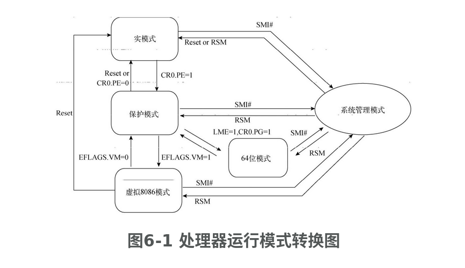

- **处理器在上电或重启后首先运行实模式**。
- **CR0控制寄存器的PE标志位控制着处理器运行在实模式或保护模式**。
- **EFLAGS标志寄存器的VM标志位可使处理器在保护模式与虚拟8086模式间切换**，切换过程往往通过任务切换或中断/异常返回程序实现。
- **在开启分页机制的保护模式下，置位IA32_EFER寄存器的LME标志位（位于IA32_EFER寄存器的第8位）可使处理器进入IA-32e模式**。
  - 通过IA32_EFER寄存器的LMA标志位（位于IA32_EFER寄存器的第10位）可以判断处理器是否运行在IA-32e模式下。
  - <u>当处理器运行于IA-32e模式，代码段描述符的L标志位可确定处理器运行于64位模式还是兼容模式</u>。
- 不论处理器正处于何种模式，一旦它**收到SMI信号便会进入SMM模式。只有在执行RSM指令后，处理器会返回到产生SMI信号前的模式**。

## 通用寄存器

通用寄存器在处理器中扮演着相当重要的角色，通过它们才可实现算术与逻辑运行、地址寻址以及访问内存等功能。IA-32体系结构下的通用寄存器有

- EAX
- EBX
- ECX
- EDX
- ESI
- EDI
- EBP
- ESP

在IA-32e体系结构的64位运行模式下，虽然通用寄存器的操作数默认是32位宽，但它们有能力支持64位宽的操作数。Intel公司在64位运行模式里加入了8个新的通用寄存器，因此处理器可使用：

- RAX
- RBX
- RCX
- RDX
- RDI
- RSI
- RBP
- RSP
- R8～R15

这16个通用寄存器，其中的R8～R15寄存器只在64位模式下有效。所有这些寄存器都可以访问其内部的字节、字、双字、四字空间。某些指令需要借助REX指令前缀加以修饰才可将操作数扩展至64位。

## CPUID 指令

CPUID汇编指令**用于鉴别处理器信息以及检测处理器支持的功能，它在任何模式下的执行效果均相同**。

通过EFLAGS标志寄存器的ID标志位（位于EFLAGS寄存器的第21位）可检测出处理器是否支持CPUID指令。如果处理器支持CPUID指令，那么软件可自由操作ID标志位

CPUID指令

- 使用**EAX寄存器**作为输入参数，该输入参数的术语叫作**主功能号**（main-leaf）。
- 对于一些复杂的主功能来说，它可能会需要子功能号来辅助查询，此时**ECX寄存器会向CPUID指令提供子功能号**（sub-leaf）。
- 当CPUID指令执行结束后，**CPUID指令会使用EAX、EBX、ECX和EDX寄存器保存执行结果**。<u>在64位模式下这些信息依然是32位的，因此处理器只使用RAX、RBX、RCX以及RDX寄存器的低32位保存执行结果，而高32位则被清0</u>

CPUID指令可以查询两类信息：**基础信息**和**扩展信息**，这两类信息均有主功能号。

- **基础信息的主功能号从0h开始**，目前处理器支持的最大主功能号是14h，处理器通过CPUID指令的主功能号0h可查询出处理器当前支持的最大基础功能号；
- **扩展信息的主功能号从80000000h开始**，目前处理器支持的最大主功能号是80000008h，处理器通过CPUID指令的主功能号80000000h可查询出处理器当前支持的最大扩展功能号。

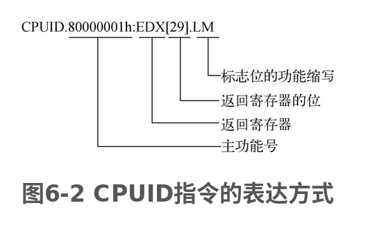

上图非常直观地展现出某一标志位的读取结果，此种表达方式亦可借鉴到其他寄存器的表述中。比如，EFLAGS.IF[9]表示引用EFLAGS标志寄存器的IF中断标志位，它位于EFLAGS标志寄存器的第9位；CR3[31:12]表示引用CR3控制寄存器的第12～31位。

## EFLAGS

见 `实模式与保护模式.md`

## 控制寄存器

见 `实模式与保护模式.md`

除CRn控制寄存器和XCR0扩展控制寄存器（用于控制浮点计算功能）外，**EFER寄存器也用于控制系统功能**。它是MSR寄存器组的**IA32_EFER寄存器，它提供了控制IA-32e运行模式开启的标志位，以及关于页表访问限制的控制区域**。下图是IA32_EFER寄存器的位功能说明：

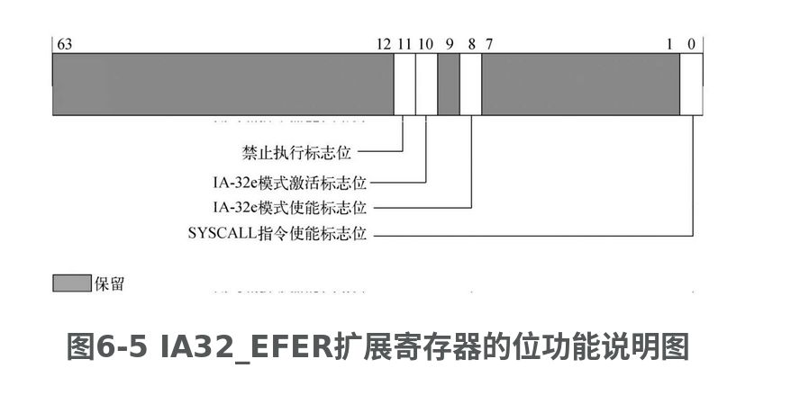

IA32_EFER寄存器的各标志位功能，其中的**LME标志位最为重要，它用于开启IA-32e模式**，而第0位则是SYSCALL/SYSRET指令的使能位。这对指令由AMD公司引入，Intel处理器对它们仅提供了有限的支持。

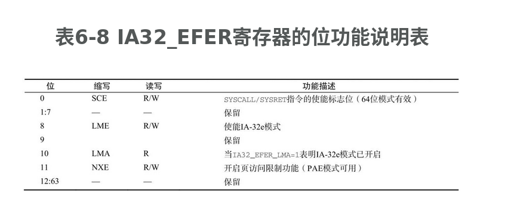

## MSR寄存器组

**MSR（Model-Specific Register）寄存器组可提供性能监测、运行轨迹跟踪与调试以及其他处理器功能**。在使用MSR寄存器组之前，我们应该**通过CPUID.01h:EDX[5]来检测处理器是否支持MSR寄存器组**。

每种处理器家族都有自己的MSR寄存器组，我们在使用MSR寄存器组前需要根据处理器家族信息（通过CPUID.01h查询处理器家族信息）选择与之相对应的MSR寄存器组。

**处理器可以使用指令 RDMSR 和 WRMSR 对MSR寄存器组进行访问，整个访问过程借助ECX寄存器索引寄存器地址，再由EDX:EAX组成的64位寄存器保持访问值**。这对指令必须在实模式或0特权级下执行，否则将会触发#GP异常

借助 RDMSR/WRMSR 令可以访问64位的MSR寄存器。**在访问MSR寄存器前，必须向ECX寄存器（在64位模式下，RCX寄存器的高32位被忽略）传入寄存器地址**。而目标MSR寄存器则是由 EDX:EAX 组成的64位寄存器代表，其中的EDX寄存器保存MSR寄存器的高32位，EAX寄存器保存低32位。（在64位模式下，RAX和RDX寄存器的高32位均为零。）

RDMSR与WRMSR指令必须在0特权级或实模式下执行。在使用这两条指令之前，应该使用CPUID指令（CPUID.01h:EDX[5] = 1）来检测处理器是否支持MSR寄存器组。

- RDMSR 读模式定义寄存器。对于RDMSR 指令，将会返回相应的MSR 中64bit 信息到(EDX：EAX)寄存器中
- WRMSR 写模式定义寄存器。对于WRMSR 指令，把要写入的信息存入(EDX：EAX)中，执行写指令后，即可将相应的信息存入ECX 指定的MSR 中

EFER是MSR中的一员，它的地址是0xC0000080，它是x64体系的基石。当EFER.LME=1时，表示要开起IA-32e模式。

可是，此时并不代表已经进入了`IA-32e`模式，因为开启`IA-32e`模式后必须要开启分页内存管理机制，也就是说，当`EFER.LME=1`（EFER 第8位）且`CR0.PG=1`时，处理器会将`EFER.LMA`（EFER 第10位）置为1，当其成功置为1以后，才表示`IA-32e`模式处于激活状态。

## IA-32e模式

### IA-32e 模式概述

IA-32e模式是Intel为64位处理器设计的全新运行模式，它通常也被叫作长模式，**通过CPUID. 80000001h:EDX[29].LM位可检测处理器是否支持IA-32e模式**。

IA-32e模式扩展于原有32位保护模式，它包含<u>兼容模式</u>和<u>64位模式</u>两种子运行模式

- 兼容模式用于兼容之前的32位保护模式，使得处理器无需改动64位运行环境（如寄存器值、段结构、页表项结构等）即可运行32位程序（通过段描述符的L标志位）。
- 值得注意的是，如果在兼容模式下触发系统异常或中断，处理器必须切换至64-bit Mode模式才能处理。

虽然IA-32e模式的线性地址位宽64位，但其线性寻址能力只有48位，**其低48位用于线性地址寻址，高16位将作为符号扩展**（将第47位数值扩展至第63位，即全为0或全为1），**此种格式的地址被称为Canonical地址**。

**IA-32e模式下，只有Canonical地址空间是可用地址空间**，而Non-Canonical空间则属于无效地址空间，下图描述了64位线性地址空间的功能划分情况。

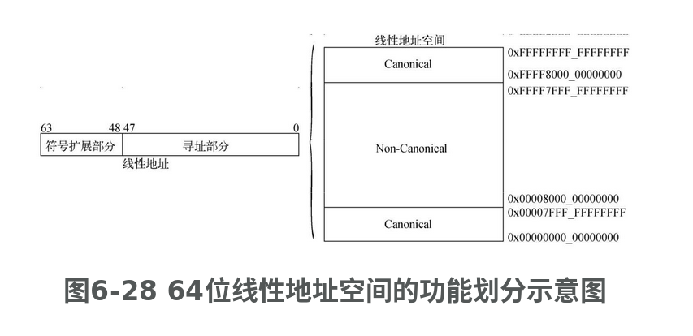

- Canonical 型线性地址区间 `0x00000000_00000000～0x00007FFF_FFFFFFFF`和 `0xFFFF8000_00000000～0xFFFFFFFF_FFFFFFFF`是程序的可用区域
- FFFFFFFF则不可被程序使用。如果程序试图访问Non-Canonical型线性地址区间将会触发#GP或#SS等异常

由于64-bit Mode模式改用Canonical地址空间，那么其地址空间转换过程将变为下图：

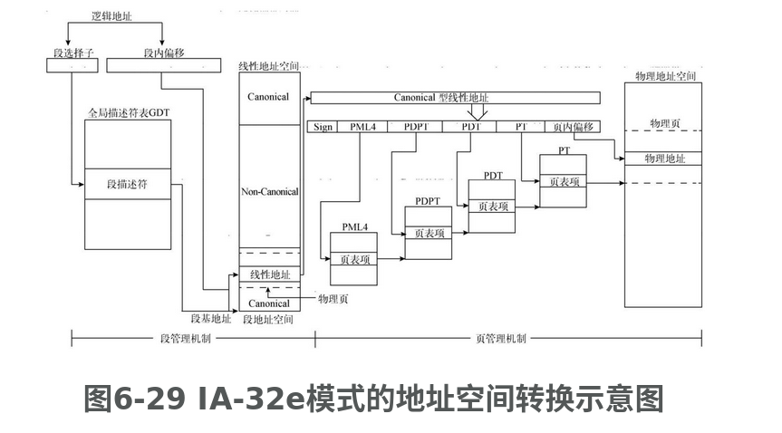

- **段描述符已强制将段基地址和段限长覆盖到整个线性地址空间，使得不易于管理的段地址空间扁平化、透明化，用户不必再关心段基地址和段长度**。
- 不仅如此，段管理机制的整体结构已被大幅度简化，进而使得性能得到显著提升。
- **当64位模式采用Canonical型的64位线性地址后，页管理机制也改成4级**，但**只有线性地址的低48位参与页表空间检索，高16位（符号扩展位）依然不参与页表空间检索**。而且，**页管理机制在支持4 KB物理页的基础上，还支持2 MB和1 GB的物理页**

### IA-32e 段管理机制

IA-32e模式的段管理机制依然延续自保护模式，但经过保护模式的洗礼后，IA-32e模式已对段管理机制进行了升级、改造和优化，从而使得它在不失兼容性的同时，显得更加简洁、高效、易编程。

#### 1. 代码段描述符

<u>IA-32e模式下的代码段仍然具备地址转换、权限检测等功能</u>，但是代码段描述符的标志位区域已被精简许多（如**段基地址和段限长等区域已被忽略**），只剩寥寥数个标志位有效。

**处理器在IA-32e模式下同样需要代码段描述符和代码段选择子来建立程序的运行环境，维护程序的执行特权级**。下图描述了IA-32e模式的代码段描述符位功能：

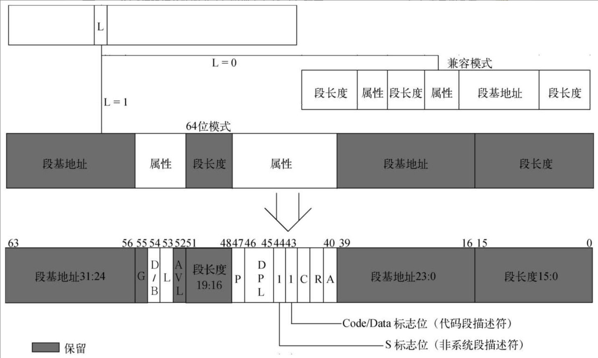

说明

- **IA-32e模式的代码段描述符启用了保护模式未曾使用的L标志位**（第53位），<u>此标志位用于标识代码段的运行模式（32位兼容模式或64位模式）</u>。
  - 在IA-32e模式处于激活（IA32_EFER.LMA=1）状态下，复位L标志位将使处理器运行于32位兼容模式，此时的D标志位则用于标识代码段的默认地址位宽和操作数位宽，D=0时默认位宽是16位，D=1时默认位宽是32位。
  - 当IA-32e模式处于激活状态，置位L标志位并复位D标志位时，代码段的默认操作数位宽是32位，地址位宽为64位，如果D=1则触发#GP异常。
- IA-32e模式的代码段描述符的各标志位功能与保护模式相同

#### 2. 数据段描述符

**数据段描述符并未在保护模式的基础上进行属性和功能扩展，处理器依然使用8 B的段描述符来描述一个数据段**，其与代码段描述符相同，都忽略掉段基地址和段长度。下图描述了IA-32e模式的数据段描述符位功能

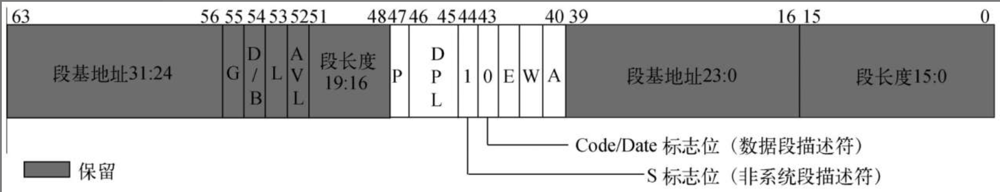

IA-32e模式的数据段描述符不仅忽略了段基地址和段长度，而且L标志位、D/B标志位、G标志位也均不起作用

对于D/B标志位的忽略问题，可能有些读者会有疑问，这是因为当段基地址和段长度覆盖整个线性地址空间后，数据段的起始地址和扩展方向就变得不再重要了，或者说通过指令和程序来控制数据的扩展方向比使用标志位更加精确，因此D/B标志位是可以忽略的。

#### 3. 系统段描述符

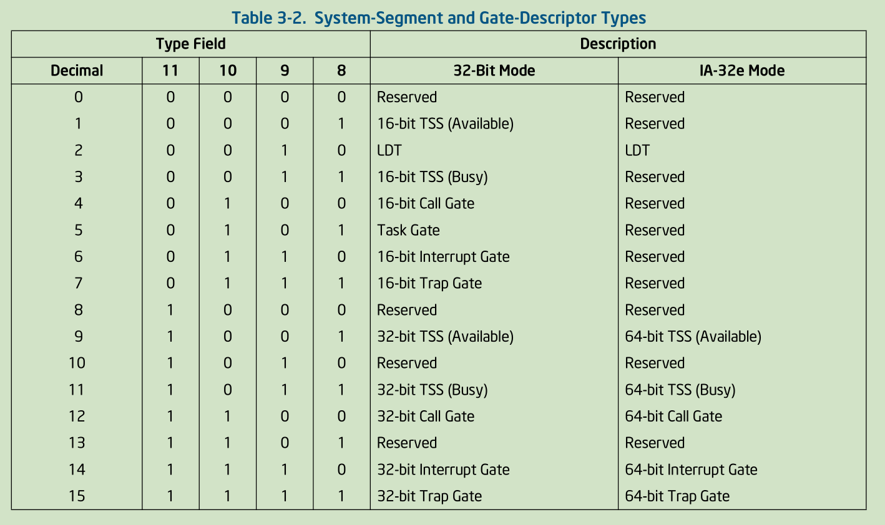

IA-32e模式只支持64位的系统段描述符。<u>IA-32e模式的系统段描述符已不再支持任务门描述符，进而不再支持基于任务门的任务切换</u>。既然少了任务门描述符，那么<u>系统只需创建一个TSS来提供不同特权级的栈空间即可</u>。其实，**保护模式下的操作系统，大多不会采用任务门描述符来实现任务切换，而改用软件逻辑来实现任务切换（切换页表空间）**。

1. **LDT段描述符**

IA-32e模式的LDT段描述符共占用16 B的内存空间，其与TSS描述符的位功能完全相同。

诸多系统内核不会使用LDT，原因可能是：尽管使用LDT和页表均可实现隔离进程的作用，但在进程切换方面页表的自由度更高、方便系统编程，还能减少处理器性能损耗，而LDT的优点只是对进程多一层隔离保护

2. **TSS描述符**

IA-32e模式的TSS描述符在系统中依然扮演着重要的角色，和其他系统段描述符一样，它也**从原来的8 B扩展至16 B**，**其低8B与保护模式的TSS描述符一致，而高8 B将保存段基地址的第32～63位**，下图描绘了IA-32e模式的TSS描述符位功能：

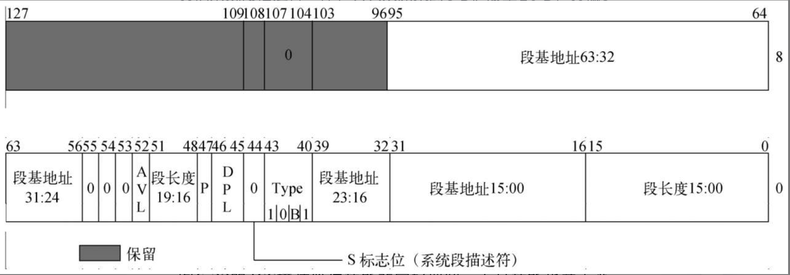

- TSS的内部结构却发生革命性的变化。既然TSS不再需要保存和还原程序（或任务）的执行现场环境，那么它**只负责不同特权级间的栈切换工作**

 32 位任务状态内存段的内部结构，保存各个寄存器的状态情况，见 `实模式与保护模式.md`。

下图是IA-32e模式TSS的内部结构:

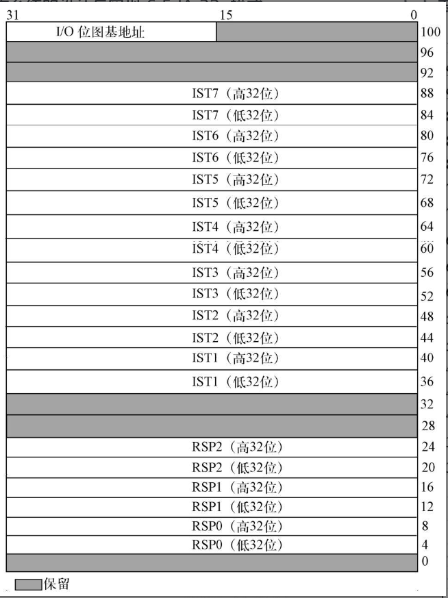

IA-32e模式的TSS已经与保护模式的TSS相差很大，相似的地方也仅有各特权级的栈指针（RSP0、RSP1、RSP2），下表记录着TSS各位的功能说明。

|     缩写      |             功能描述              |
| :-----------: | :-------------------------------: |
|     RSPn      | Canonical 型的栈指针（特权级0-2） |
|     ISTn      |  Canonical 型的中断栈表（共8组）  |
| I/O位图基地址 |            I/O许可位图            |

- 在IA-32e模式下，处理器允许加载一个空段选择子NULL段选择子（第0个GDT项）到除CS以外的段寄存器（3特权级的SS段寄存器不允许加载NULL段选择子）。<u>处理器加载NULL段选择子到段寄存器的过程，并非读取GDT的第0项到段寄存器，而是以一个无效的段描述符来初始化段寄存器</u>。
- <u>在发生特权级切换时，新的SS段寄存器将强制加载一个NULL段选择子，而RSP将根据特权级被赋值为RSPn（n=0～2）</u>。把新SS段寄存器设置为NULL段选择子是为了完成远跳转（far CALL, INTn，中断或异常）动作，而旧SS段寄存器和RSP将被保存到新栈中。
- **IST（Interrupt Stack Table，中断栈表）是IA-32e模式为任务状态段引入的新型栈指针**，其功能与RSP相同，只不过IST切换中断栈指针时不会考虑特权级切换

3. **调用门描述符**

**调用门描述符同样从原有的8 B扩展至16 B**，<u>其低8 B的Param Count（参数个数）位区域已被忽略</u>，而<u>高8 B则保存着程序入口地址的第31～63位</u>。下图描绘了IA-32e模式的调用门描述符各位功能：

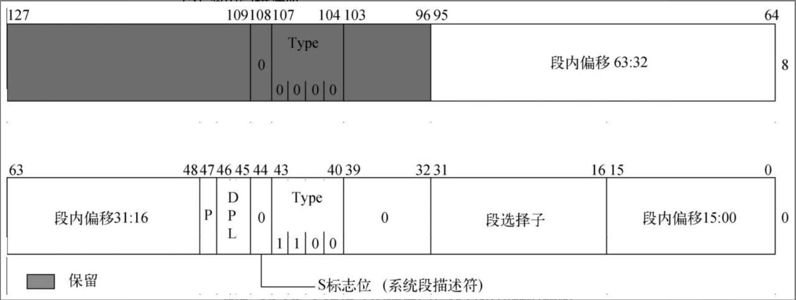

处理器在执行IA-32e模式的调用门时，将以8 B的数据位宽向栈中压入数据，而且IA-32e模式的调用门也不再支持参数传递功能。值得一提的是，**RETF指令的默认操作数为32位，如果要返回到64位程序中，则必须在RETF指令前额外加上指令前缀0x48，否则只能返回到32位程序中**。

### IA-32e 模式的中断/异常处理机制

IA-32e模式的中断/异常处理机制和保护模式的处理机制非常相似，只不过**中断发生时的栈空间（SS:RSP）保存工作已由选择性（特权级CPL变化时保存）保存，改为无条件保存**。与此同时，**IA-32e模式还引入一种全新的中断栈切换机制**。

由于IA-32e模式的系统段描述符已不再支持任务门描述符，那么**IDT仅剩下陷阱门描述符和中断门描述符可以使用**。下图是这两个门描述符的位功能说明。

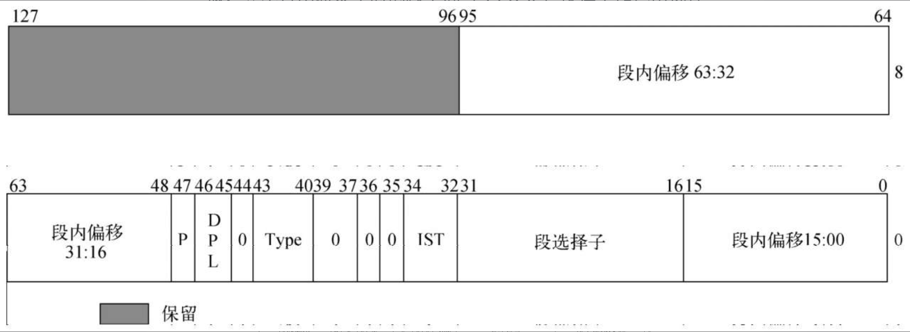

- 这**两个门描述符均从8 B扩展至16 B**，它的**高8 B保存着Offset区域的第32～63位**，不仅如此，其**低8B的第32～34位将用于IST功能**。
- **IST只在IA-32e模式下有效**，它为了给不同的中断提供一个理想的栈环境，而对原有栈切换机制进行了改良。**程序通过IST功能可使处理器无条件进行栈切换**。在IDT的任意一个门描述符都可以使用IST机制或原有栈切换机制，**当IST=0时，使用原有栈切换机制，否则使用IST机制**。
- <u>IA-32e模式的TSS已为IST机制提供了7个栈指针</u>，供IDT的门描述符使用。图中的**IST位区域（共3位）就用于为中断/异常处理程序提供IST栈表索引**，<u>当确定目标IST后处理器会强制将SS段寄存器赋值为NULL段选择子，并将中断栈地址加载到RSP寄存器中。最后，将原SS、RSP、RFLAGS、CS和RIP寄存器值压入新栈中。</u>

### IA-32e模式的页管理机制

**开启IA-32e模式必须伴随着页管理机制的开启**（**置位CR0.PG、CR4.PAE以及IA32_EFER.LME标志位**）。

**IA-32e模式的页管理机制可将Canonical型的线性地址映射到52位物理地址空间**（由处理器最高物理可寻址位宽值MAXPHYADDR决定）中，使得IA-32e模式可寻址4 PB（2^52B）的物理地址空间，可寻址256 TB（2^48B）的线性地址空间。

处理器通过CR3控制寄存器保存的物理地址，可将线性地址转换成一个**多层级页表结构**，**IA-32e模式的页管理机制共支持4 KB、2 MB和1 GB**（<u>CPUID. 80000001h:EDX[26].1G-Page位可检测是否支持1 GB物理页</u>）三种规格的物理页容量。下图描绘了IA-32e模式的地址映射关系：

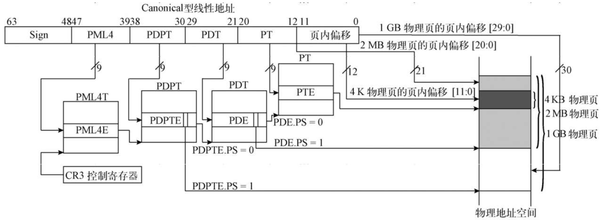

IA-32e模式的页管理机制使用**多层级页表**来结构化线性地址空间，**CR3控制寄存器负责定位顶层页表PML4（Page Map Level 4,4级页表）的物理基地址**。根据处理器对PCIDs功能的使能情况，CR3控制寄存器将会呈现出两套不同的位功能，下图描述了IA-32e模式的页表项位功能。

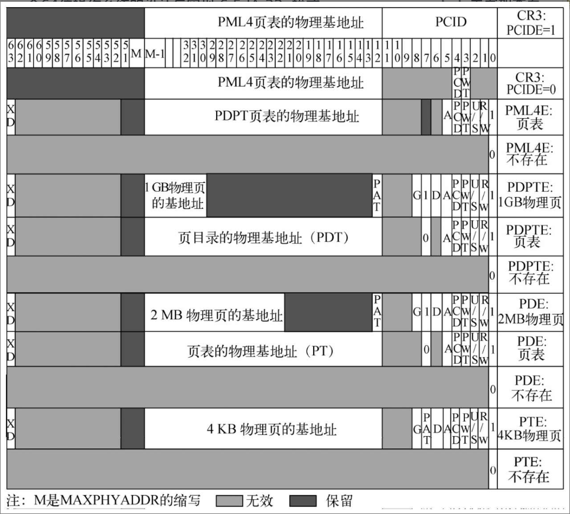

- M 是 **MAXPHYADDR** 的缩写，表示处理器支持的最大物理地址位数，该值最大为 52
- 其他标志位见 `4.保护模式之分页.md`
- 下面重点讲解下PCIDs标志位。**PCIDs（Process Context Identifiers，程序执行环境标识组）**功能（<u>CPUID.01h:ECX [17].PCID位可检测是否支持PCID功能</u>）**可使处理器缓存多套线性地址空间，并通过PCID加以唯一标识**。
  - PCID位区域拥有12位，**当置位CR4.PCIDE标志位时开启PCID功能**。
  - 在开启PCID功能的前提下，**使用MOV指令操作CR3控制寄存器的第63位，将会影响TLB的有效性**（全局页除外）

## 模式切换说明

### 1. 进入保护模式

为了进入保护模式，处理器必须在模式切换前，在内存中创建一段可在保护模式下执行的代码以及必要的系统数据结构，只有这样才能保证模式切换的顺利完成。相关系统数据结构包括

- IDT/GDT/LDT描述符表各一个（LDT表可选）
- 任务状态段TSS结构
- 至少一个页目录和页表（如果开启分页机制）
- 至少一个异常/中断处理模块。

在处理器切换到保护模式前，还必须初始化GDTR寄存器、IDTR寄存器（亦可推迟到进入保护模式后，使能中断前）、控制寄存器CR1～4、MTTRs内存范围类型寄存器。

- **系统数据结构**。
  - 系统在进入保护模式前，**必须创建一个拥有代码段描述符和数据段描述符的GDT**（Globad Descriptor Table，全局描述符表）（第一项必须是NULL描述符），并且一定要使用LGDT汇编指令将其加载到GDTR寄存器。
  - 保护模式的栈寄存器SS，使用可读写的数据段即可，无需创建专用描述符。对于多段式操作系统，可采用LDT（Local Descriptor Table，局部描述符表）（必须保存在GDT表的描述符中）来管理应用程序，多个应用程序可独享或共享一个局部描述符表LDT。
  - 如果希望开启分页机制，则必须准备至少一个页目录项和页表项。（如果使用4 MB页表，那么准备一个页目录即可。）
- **中断和异常**。
  - 在保护模式下，**中断/异常处理程序皆由IDT（Interrupt Descriptor Table，中断描述符表）来管理**。
  - IDT由若干个门描述符组成，如果采用中断门或陷阱门描述符，它们可以直接指向异常处理程序；
  - 如果采用任务门描述符，则必须为处理程序准备TSS段描述符、额外的代码和数据以及任务段描述符等结构。如果处理器允许接收外部中断请求，那么IDT还必须为每个中断处理程序建立门描述符。
  - 在使用IDT表前，必须使用LIDT汇编指令将其加载到IDTR寄存器，典型的加载时机是在处理器切换到保护模式前。
- **分页机制**。
  - **CR0控制寄存器的PG标志位用于控制分页机制的开启与关闭**。
  - 在开启分页机制（置位PG标志位）前，必须在内存中创建一个页目录和页表（此时的页目录和页表不可使用同一物理页），并将页目录的物理地址加载到CR3控制寄存器（或称PDBR寄存器）。
  - 当上述工作准备就绪后，可同时置位控制寄存器CR0的PE标志位和PG标志位，来开启分页机制。（分页机制往往与模式切换同时进行，不能在进入保护模式前开启分页机制。）
- **多任务机制**。
  - 如果希望使用多任务机制或允许改变特权级，则必须在首次执行任务切换前，创建至少一个任务状态段TSS结构和附加的TSS段描述符。（当特权级切换至0、1、2时，栈段寄存器与栈指针寄存器皆从TSS段结构中取得。）
  - 在使用TSS段结构前，必须使用LTR汇编指令将其加载至TR寄存器，这个过程只能在进入保护模式后执行。此表也必须保存在全局描述符表GDT中，而且任务切换不会影响其他段描述符、LDT表、TSS段结构以及TSS段描述符的自由创建。
  - 只有处理器才能在任务切换时置位TSS段描述符的忙状态位，否则忙状态位始终保持复位状态。如果既不想开启多任务机制，也不允许改变特权级，则无需加载TR任务寄存器，也无需创建TSS段结构。

为了保证代码在不同种Intel处理器中的前后兼容性，建议遵循以下步骤执行模式切换（保护模式）操作:

1.  执行CLI汇编指令禁止可屏蔽硬件中断，对于不可屏蔽中断NMI只能借助外部电路才能禁止。（模式切换程序必须保证在切换过程中不能产生异常和中断。）
2.  执行LGDT汇编指令将GDT的基地址和长度加载到GDTR寄存器。
3.  执行MOV CR0汇编指令位置CR0控制寄存器的PE标志位。（可同时置位CR0控制寄存器的PG标志位。）
4.  一旦MOV CR0汇编指令执行结束，紧随其后必须执行一条远跳转（far JMP）或远调用（far CALL）指令，以切换到保护模式的代码段去执行。（这是一个典型的保护模式切换方法。）
5.  通过执行JMP或CALL指令，可改变处理器的执行流水线，进而使处理器加载执行保护模式的代码段。
6.  如果开启分页机制，那么MOV CR0指令和JMP/CALL（跳转/调用）指令必须位于同一性地址映射的页面内。（因为保护模式和分页机制使能后的物理地址，与执行JMP/CALL指令前的线性地址相同。）至于JMP或CALL指令的目标地址，则无需进行同一性地址映射（线性地址与物理地址重合）。
7.  如需使用LDT，则必须借助LLDT汇编指令将GDT内的LDT段选择子加载到LDTR寄存器中。
8.  执行LTR汇编指令将一个TSS段描述符的段选择子加载到TR任务寄存器。处理器对TSS段结构无特殊要求，凡是可写的内存空间均可。
9.  进入保护模式后，数据段寄存器仍旧保留着实模式的段数据，必须重新加载数据段选择子或使用JMP/CALL指令执行新任务，便可将其更新为保护模式。（执行步骤(4)的JMP或CALL指令已将代码段寄存器更新为保护模式。）对于不使用的数据段寄存器（DS和SS寄存器除外），可将NULL段选择子加载到其中。
10.  执行LIDT指令，将保护模式下的IDT表的基地址和长度加载到IDTR寄存器。
11.  执行STI指令使能可屏蔽硬件中断，并执行必要的硬件操作使能NMI不可屏蔽中断。

### 2. 进入 IA-32e模式

在进入**IA-32e模式**前，处理器依然要为IA-32e模式准备执行代码、必要的系统数据结构以及配置相关控制寄存器。与此同时，**还要求处理器只能在开启分页机制的保护模式下切换到IA-32e模式**。

- **系统数据结构**。
  - <u>当IA-32e模式激活后，系统各描述符表寄存器（GDTR、LDTR、IDTR、TR）依然沿用保护模式的描述符表</u>。
  - <u>由于保护模式的描述符表基地址是32位，这使得它们均位于低4 GB线性地址空间内</u>。
  - 既然已经开启IA-32e模式，那么系统各描述符表寄存器理应（必须）重新加载（借助LGDT、LLDT、LIDT和LTR指令）为IA-32e模式的64位描述符表。
  - **中断和异常**。
    - <u>当软件激活IA-32e模式后，中断描述符表寄存器IDTR仍然使用保护模式的中断描述符表，那么在将IDTR寄存器更新为64位中断描述符表IDT前不要触发中断和异常，否则处理器会把32位兼容模式的中断门解释为64位中断门，从而导致不可预料的结果</u>。
    - 使用CLI指令能够禁止可屏蔽硬件中断，而NMI不可屏蔽中断，必须借助外部硬件电路才可禁止。

**IA32_EFER寄存器（位于MSR寄存器组内）的LME标志位用于控制IA-32e模式的开启与关闭，该寄存器会伴随着处理器的重启（重置）而清零**。

- <u>IA-32e模式的页管理机制将物理地址扩展为四层页表结构。</u>
- <u>在IA-32e模式激活前（CR0.PG=1，处理器运行在32位兼容模式）, CR3控制寄存器仅有低32位可写入数据，从而限制页表只能寻址4 GB物理内存空间，也就是说在初始化IA-32e模式时，分页机制只能使用前4 GB物理地址空间。一旦激活IA-32e模式，软件便可重定位页表到物理内存空间的任何地方</u>

以下是IA-32e模式的标准初始化步骤：

1. 在保护模式下，使用MOV CR0汇编指令复位CR0控制寄存器的PG标志位，以关闭分页机制。（此后的指令必须位于同一性地址映射的页面内。）
2. 置位CR4控制寄存器的PAE标志位，开启物理地址扩展功能（PAE）。在IA-32e模式的初始化过程中，如果PAE功能开启失败，将会产生通用保护性异常（#GP）。
3. 将页目录（顶层页表PML4）的物理基地址加载到CR3控制寄存器中。
4. 置位IA32_EFER寄存器的LME标志位，开启IA-32e模式。
5. 置位CR0控制寄存器的PG标志位开启分页机制，此时处理器会自动置位IA32_ERER寄存器的LMA标志位。当执行MOV CR0指令开启分页机制时，其后续指令必须位于同一性地址映射的页面内（直至处理器进入IA-32e模式后，才可以使用非同一性地址映射的页面）。