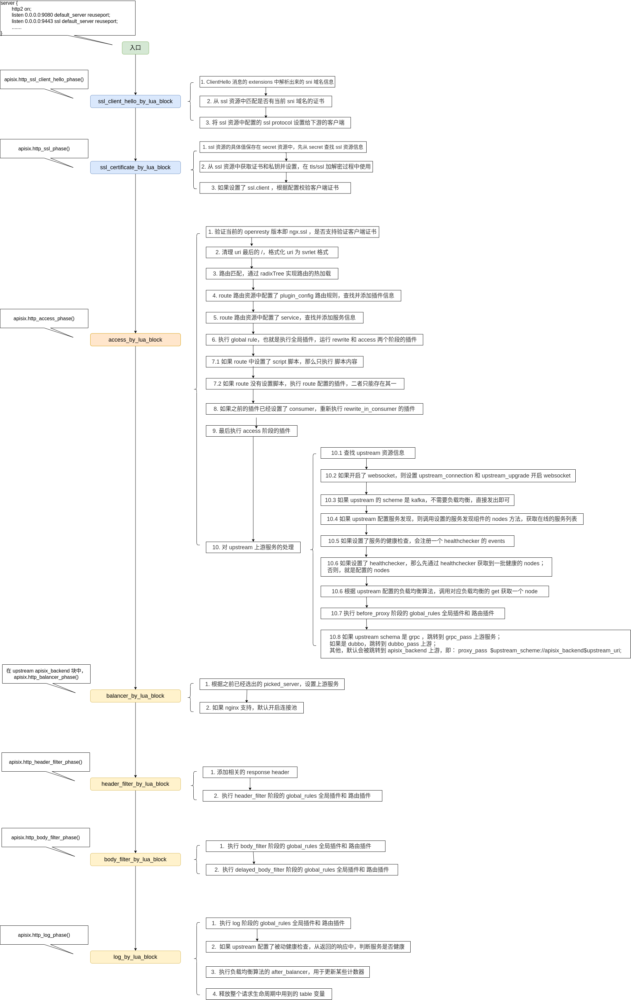

# Apisix 路由全过程

[toc]


## 概述


在 [1.Apisix启动](./1.Apisix启动.md) 章节中已经介绍了 apisix 通过 openresty 的命令启动，初始化，以及 nginx.conf 的生成，本章介绍当一个请求到达 Apisix 后的全过程。


首先，openresty 所有的阶段，可以在 [lua-nginx-module](https://github.com/openresty/lua-nginx-module) 中查到，下面就是 openresty 提供的所有的可以自定义 lua 脚本的阶段：


## Apisix 请求全过程





## Apisix 的路由配置


在生成的 nginx.conf 中，有以下配置：

```nginx
http {
    server {
        http2 on;
        # 用于转发的端口是 9080 和 9443（https）
        listen 0.0.0.0:9080 default_server reuseport;
        listen 0.0.0.0:9443 ssl default_server reuseport;
        
        ....
            
        ssl_client_hello_by_lua_block {
            apisix.http_ssl_client_hello_phase()
        }

        ssl_certificate_by_lua_block {
            apisix.http_ssl_phase()
        }

    	....
            
        location / {
            proxy_http_version 1.1;
            proxy_set_header   Host              $upstream_host;
            proxy_set_header   Upgrade           $upstream_upgrade;
            proxy_set_header   Connection        $upstream_connection;
            proxy_set_header   X-Real-IP         $remote_addr;
            proxy_pass_header  Date;

            ....
            access_by_lua_block {
            	apisix.http_access_phase()
            
            ....
            header_filter_by_lua_block {
                apisix.http_header_filter_phase()
            }

            body_filter_by_lua_block {
                apisix.http_body_filter_phase()
            }

            log_by_lua_block {
                apisix.http_log_phase()
            }

        }
    }

}
```

说明：apisix 用到了 openresty 的以下接个阶段：

- ssl_client_hello_by_lua_block
- ssl_certificate_by_lua_block
- access_by_lua_block - 重要
- header_filter_by_lua_block
- body_filter_by_lua_block
- log_by_lua_block


## 1. ssl_client_hello_by_lua_block


### TLS/SSL ClientHello

TLS 协议的简单过程：

```shell
Client                          Server
  | ----> (1) Client Hello ---->   |
  | <---- (2) Server Hello <----   |
  | <---- (3) Certificate  <----   |
  | <---- (4) Server Key Exchange  |
  | ----- (5) Server Hello Done    |
  | ----> (6) Client Key Exchange  |
  ---------------------------------- Part. 1
  | ----> (7) Change Cipher Spec   |
  | ----> (8) Finish       ---->   |
  | <---- (9) Change Cipher Spec   |
  | <---- (10) Finish      -----   |
  ---------------------------------- Part. 2
        Shakehand Finish
```


在 TLS 协议，在一次新的握手流程中，ClientHello 消息总是第一条消息，该消息向服务器表明想要建立安全连接的意愿，并且向服务器提供一些必要的信息，如接下来连接可以使用的密码套件（这里的密码指Cipher，是指一种用于**加密**及**解密**的算法，而不是我们通常意义上说的Password），以及用于生成主密钥的**客户端随机数1**，下面是 clientHello 的 请求参数：

| 字段                 | 用处                                                         |
| -------------------- | ------------------------------------------------------------ |
| `Version`            | 使用的TLS的版本号                                            |
| `Random`             | **客户端随机数1**，用于生成主密钥                            |
| `SessionId`          | 会话ID，用处在后面会讲                                       |
| `Cipher Suite`       | 客户端可以使用的密码套件，按优先级排序。一个密码套件包含**密钥交换协议**，**对称加密算法**，**消息认证码（MAC）算法**，**伪随机函数**。为什么是这四种后面会提到 |
| `Compression Method` | 数据压缩方法（由于存在安全漏洞，在TLS1.3中被禁用）           |
| `Extensions`         | 一些扩展信息，支持协议与算法的相关参数以及其它辅助信息等，常见的 SNI 就属于扩展字段 |


### SNI 扩展


**ssl_client_hello_by_lua_block 阶段就是在 clienthello 后执行的阶段的**，常用于 SNI。


**SNI 概述：**

- SNI (Server Name Indication)是 SSL (Secure Socket Layer)和 TLS (Transport Layer Security) 的一个扩展。主要**解决一台服务器只能使用一个证书(一个域名)的缺点**，随着服务器对虚拟主机的支持，一个服务器上可以为多个域名提供服务，因此SNI必须得到支持才能满足需求。


**SNI 背景：**

- SSL初期的设计顺应经典的公钥基础设施 PKI(Public Key Infrastructure)设计，PKI 认为一个服务器只为一个域名提供服务，从而一个服务器上也就只能使用一个证书。
- 客户端在发送请求的时候，利用DNS域名解析，只要向解析到的IP地址（服务器地址）发送请求，然后服务器将自身唯一的证书返回回来，交给客户端验证，验证通过，则继续进行后续通信。然后通过协商好的加密通道，获得所需要的内容。
- 随着 http 服务器开启虚拟主机发展，每个服务器通过相同的IP地址可以为很多域名提供服务，服务器端只根据请求的 ip 无法判断使用哪一个证书，导致出现问题。


**SNI 原理：**

- SNI 扩展的实现原理，**就是在Client Hello阶段，通过SNI扩展，将域名信息提前告诉服务器，服务器根据域名取得对应的证书返回给客户端已完成校验过程。**


### Apisix http_ssl_client_hello_phase 方法


```lua
function _M.http_ssl_client_hello_phase()
    -- 1. 获取 sni(Server Name Indication)
    local sni, err = apisix_ssl.server_name(true)
    if not sni or type(sni) ~= "string" then
        local advise = "please check if the client requests via IP or uses an outdated " ..
        "protocol. If you need to report an issue, " ..
        "provide a packet capture file of the TLS handshake."
        core.log.error("failed to find SNI: " .. (err or advise))
        ngx_exit(-1)
    end
    
    -- 2. 从 cleinthello 消息的扩展中获取原始数据
    local tls_ext_status_req = apisix_ssl.get_status_request_ext()

    local ngx_ctx = ngx.ctx
    local api_ctx = core.tablepool.fetch("api_ctx", 0, 32)
    ngx_ctx.api_ctx = api_ctx

    -- 3. 从 /ssls 中查找是否有通过 admin api 添加的 ssl 资源
    local ok, err = router.router_ssl.match_and_set(api_ctx, true, sni)

    ngx_ctx.matched_ssl = api_ctx.matched_ssl
    core.tablepool.release("api_ctx", api_ctx)
    ngx_ctx.api_ctx = nil
    ngx_ctx.tls_ext_status_req = tls_ext_status_req

    if not ok then
        if err then
            core.log.error("failed to fetch ssl config: ", err)
        end
        core.log.error("failed to match any SSL certificate by SNI: ", sni)
        ngx_exit(-1)
    end

    -- 4. 将 ssl 资源中配置的 ssl protocol 设置给下游的客户端。
    ok, err = apisix_ssl.set_protocols_by_clienthello(ngx_ctx.matched_ssl.value.ssl_protocols)
    if not ok then
        core.log.error("failed to set ssl protocols: ", err)
        ngx_exit(-1)
    end
end

```

说明：

1. 获取 sni(Server Name Indication) 时，使用的是  `ngx.ssl.clienthello.get_client_hello_server_name` ，该方法是从下游客户端 ClientHello 消息的 extensions 中解析出来的 sni 信息
2. 从 cleinthello 消息的扩展中获取原始数据，使用的是 `ngx.ssl.clienthello.get_client_hello_ext`，从 ClientHello 消息的 extensions 中解析出的原始数据的第一字节，保存的是 CertificateStatusType 属性，检查是否为 1
3. 从 /ssls 中查找是否有通过 admin api 添加的 ssl 资源，从 ssl 资源中匹配是否有当前 sni 域名的证书，能匹配到，返回 true，并且将 ssl 资源的相关配置写入到 api_ctx.matched_ssl 中
4. 将 ssl 资源中配置的 ssl protocol 设置给下游的客户端。


## 2. ssl_certificate_by_lua_block


### TLS/SSL Certificate

在 TLS/SSL 握手过程的第三个步骤 Certificate，服务器需要做的是把证书传递给客户端。传递内容包括：

| 字段         | 用处                                                         |
| ------------ | ------------------------------------------------------------ |
| 版本         | 数字证书符合的版本（[X.509](https://zh.wikipedia.org/wiki/X.509)） |
| 序列号       | 证书颁发机构给这份证书的序列号                               |
| 签名算法     | 对证书的重点内容进行非对称加密加密，生成签名使用的算法，用于验证证书确实由颁发者背书 |
| 签名哈希算法 | 对证书内容进行哈希，生成指纹使用的算法，用于验证证书是否完整无误 |
| 颁发者       | 证书的颁发机构                                               |
| 有效期       | 证书的有效期                                                 |
| 使用者       | 谁可以使用这份证书                                           |
| 公钥         | 这份证书认证的公钥以及非对称加密算法                         |
| 公钥参数     | 非对称加密算法采用的其他参数                                 |
| 指纹         | 对证书内容按签名哈希算法进行哈希得到的值                     |


### Apisix http_ssl_phase 方法


Apisix 在该阶段作了以下操作：

```lua
function _M.http_ssl_phase()
    -- 设置在 tls/ssl 过程中的证书 cert 和 私钥 key 
    local ok, err = router.router_ssl.set(ngx.ctx.matched_ssl)
    if not ok then
        if err then
            core.log.error("failed to fetch ssl config: ", err)
        end
        ngx_exit(-1)
    end
end
```

说明：

- 从 ssl 资源中获取证书和私钥，然后通过下面两个方法设置到 tls/ssl 加解密过程中使用：
  - `ngx.ssl.set_cert`
  - `ngx.ssl.set_priv_key`


## 3. access_by_lua_block

Apisix 在路由转发的 access 阶段，调用了 http_access_phase 方法


```lua
function _M.http_access_phase()
    -- from HTTP/3 to HTTP/1.1 we need to convert :authority pesudo-header
    -- to Host header, so we set upstream_host variable here.
    if ngx.req.http_version() == 3 then
        ngx.var.upstream_host = ngx.var.host .. ":" .. ngx.var.server_port
    end
    local ngx_ctx = ngx.ctx

    -- always fetch table from the table pool, we don't need a reused api_ctx
    local api_ctx = core.tablepool.fetch("api_ctx", 0, 32)
    ngx_ctx.api_ctx = api_ctx

    core.ctx.set_vars_meta(api_ctx)

    -- 1. 验证当前的 openresty 版本即 ngx.ssl ，是否支持验证客户端证书
    if not verify_https_client(api_ctx) then
        return core.response.exit(400)
    end

    debug.dynamic_debug(api_ctx)

    -- 2. 清理 uri 最后的 /，格式化 uri 为 svrlet 格式
    local uri = api_ctx.var.uri
    if local_conf.apisix then
        if local_conf.apisix.delete_uri_tail_slash then
            if str_byte(uri, #uri) == str_byte("/") then
                api_ctx.var.uri = str_sub(api_ctx.var.uri, 1, #uri - 1)
                core.log.info("remove the end of uri '/', current uri: ", api_ctx.var.uri)
            end
        end

        if local_conf.apisix.normalize_uri_like_servlet then
            local new_uri, err = normalize_uri_like_servlet(uri)
            if not new_uri then
                core.log.error("failed to normalize: ", err)
                return core.response.exit(400)
            end

            api_ctx.var.uri = new_uri
            -- forward the original uri so the servlet upstream
            -- can consume the param after ';'
            api_ctx.var.upstream_uri = uri
        end
    end

    -- To prevent being hacked by untrusted request_uri, here we
    -- record the normalized but not rewritten uri as request_uri,
    -- the original request_uri can be accessed via var.real_request_uri
    api_ctx.var.real_request_uri = api_ctx.var.request_uri
    api_ctx.var.request_uri = api_ctx.var.uri .. api_ctx.var.is_args .. (api_ctx.var.args or "")

    -- 3. 路由匹配
    router.router_http.match(api_ctx)

    -- 如果没有匹配到，返回 404
    local route = api_ctx.matched_route
    if not route then
        -- run global rule when there is no matching route
        local global_rules = apisix_global_rules.global_rules()
        plugin.run_global_rules(api_ctx, global_rules, nil)

        core.log.info("not find any matched route")
        return core.response.exit(404,
                    {error_msg = "404 Route Not Found"})
    end

    core.log.info("matched route: ",
                  core.json.delay_encode(api_ctx.matched_route, true))

    local enable_websocket = route.value.enable_websocket

    -- 4. 如果 apisix 的 route 路由资源中配置了 plugin_config，则查找资源
    if route.value.plugin_config_id then
        local conf = plugin_config.get(route.value.plugin_config_id)
        if not conf then
            core.log.error("failed to fetch plugin config by ",
                            "id: ", route.value.plugin_config_id)
            return core.response.exit(503)
        end

        route = plugin_config.merge(route, conf)
    end

    -- 5. 如果配置了 route 的 service_id ，同样查找资源，设置 conf_type 为 route&service
    if route.value.service_id then
        local service = service_fetch(route.value.service_id)
        if not service then
            core.log.error("failed to fetch service configuration by ",
                           "id: ", route.value.service_id)
            return core.response.exit(404)
        end

        route = plugin.merge_service_route(service, route)
        api_ctx.matched_route = route
        api_ctx.conf_type = "route&service"
        api_ctx.conf_version = route.modifiedIndex .. "&" .. service.modifiedIndex
        api_ctx.conf_id = route.value.id .. "&" .. service.value.id
        api_ctx.service_id = service.value.id
        api_ctx.service_name = service.value.name

        -- 优先使用 route 的 websocket 配置
        if enable_websocket == nil then
            enable_websocket = service.value.enable_websocket
        end

    else
        api_ctx.conf_type = "route"
        api_ctx.conf_version = route.modifiedIndex
        api_ctx.conf_id = route.value.id
    end
    api_ctx.route_id = route.value.id
    api_ctx.route_name = route.value.name

    -- run global rule
    -- 6. 执行 global rule，也就是全局插件
    local global_rules = apisix_global_rules.global_rules()
    plugin.run_global_rules(api_ctx, global_rules, nil)

    
    -- 7. 如果 route 中设置了 script 脚本，那么只执行 脚本内容
    if route.value.script then
        script.load(route, api_ctx)
        script.run("access", api_ctx)

    -- 否则执行 route 配置的插件，二者只能存在其一
    else
        local plugins = plugin.filter(api_ctx, route)
        api_ctx.plugins = plugins

        plugin.run_plugin("rewrite", plugins, api_ctx)
        
        -- 8. 如果在 auth 插件中，已经将 consumer attach 到 api_ctx,则将配置 merge 到 route 中
        if api_ctx.consumer then
            local changed
            local group_conf

            if api_ctx.consumer.group_id then
                group_conf = consumer_group.get(api_ctx.consumer.group_id)
                if not group_conf then
                    core.log.error("failed to fetch consumer group config by ",
                        "id: ", api_ctx.consumer.group_id)
                    return core.response.exit(503)
                end
            end

            route, changed = plugin.merge_consumer_route(
                route,
                api_ctx.consumer,
                group_conf,
                api_ctx
            )

            core.log.info("find consumer ", api_ctx.consumer.username,
                          ", config changed: ", changed)

            -- 如果发现 consumer 有变化，那么重新执行 rewrite_in_consumer 的插件
            if changed then
                api_ctx.matched_route = route
                core.table.clear(api_ctx.plugins)
                local phase = "rewrite_in_consumer"
                api_ctx.plugins = plugin.filter(api_ctx, route, api_ctx.plugins, nil, phase)
                -- rerun rewrite phase for newly added plugins in consumer
                plugin.run_plugin(phase, api_ctx.plugins, api_ctx)
            end
        end
        -- 最后执行 access 阶段的插件
        plugin.run_plugin("access", plugins, api_ctx)
    end
	-- 9. upstream 的处理
    _M.handle_upstream(api_ctx, route, enable_websocket)
end
```


步骤说明：

1. 如果使用了 https，并且 clienthello 匹配到的 ssl 资源中（即存储在 api_ctx.matched_ssl），设置了 client 的相关配置，则需要检查当前的 openresty 版本（即 ngx.ssl.verify_client ）是否支持验证客户端证书。

3. **路由匹配**，重要步骤，会从 radixtree router 路由树中查找当前的 uri，将匹配到的结果保存到 `api_ctx.matched_route` 中，其中包括了 route 的详细信息。
4. 如果 apisix 的 route 路由资源中配置了 plugin_config，则通过 plugin_config_id 查找具体 plugin_config 配置信息，找到后，将 plugin_config 中配置的插件信息，merge 到 route.value.plugins 中

6. 执行 global rule，也就是全局插件，在 http_init_worker 阶段，已经将所有的插件都初始化了，这里只需要调用具体的方法即可。

   - 首先过滤插件，有三条过滤规则。
     - 第一，插件是否禁用；
     - 第二，如果 route 中也有此插件，且run_policy == "prefer_route"，那么该插件放在 route 的plugin中执行。
     - 第三，如果插件有优先级，那么按照优先级排序

   - 在此处，运行了两个阶段的 插件，分别是 rewrite 和 access，最终执行的就是插件中的 rewrite 和 access 方法。

9. upstream 的处理，重要步骤，后面逐步分析。