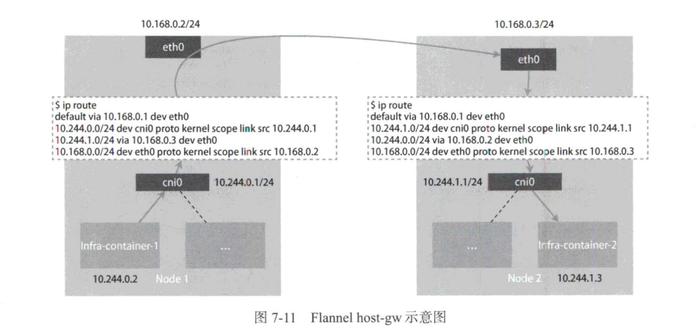

[TOC]

# Flannel 网络原理

## 单主机容器网络的实现原理(docker0)

“**网络栈**“包括了

- **网卡**(network interface)

- **回环设备**(loopback device)

- **路由表**(routing table)

- **iptables 规则**。

对于一个进程来说，这些要素其实构成了它发起和响应网络请求的基本环境。

接下来我们以 docker 为例来讨论单主机网络的实现。

作为容器，可以声明<u>直接使用宿主机的网络栈(-net=host）</u>，即不开启 Network Namespace，比如：

```shell
$ docker run -d -net=host --name nginx-host nginx
```

在这种情况下，这个容器启动后直接监听的就是宿主机的80端口。

像这样直接使用宿主机网络栈的方式，虽然可以为容器提供良好的网络性能，但会不可避免地带来共享网络资源的间题，比如端口冲突。所以，在大多数情况下，**希望容器进程能使用自己 Network Namespace 里的网络栈，即拥有自己的IP地址和端口**。

那么问题来了，<u>被隔离的两个 Network Namespace 之间，怎么通信呢</u>？

很容易想到，被隔离的 Network Namespace 相当于独立的局域网，那么怎么让两个局域网交互呢？很显然，将两个局域网连接同一台**交换机**上。

在 Linux 中，**能够起到虚拟交换机作用的网络设备是<u>网桥</u>(bridge)。它是一个在<u>数据链路层</u>(data link)工作的设备，主要功能是根据 MAC 地址学习将数据包转发到网桥的不同端口上**。

**docker 的实现**：

- 为了实现上述目的，Docker 项目会默认在宿主机上创建一个名叫 **docker0 的网桥**，凡是与 docker0 网桥连接的容器，都可以通过它来进行通信。

- 不同 Network Namespace 的设备，可以创建 **Veth Pair 虚拟设备**来与 docker0 网桥连接。
  
  - VethPair 设备的特点是：
    
    - <u>被创建出来后，总是以两张虚拟网卡(Veth Peer)的形式成对出现</u>。（例如容器-docker0网桥就是一对 veth pair设备）
    
    - 并且，<u>从其中一张 ”网卡(Veth Peer)“  发出的数据包可以直接出现在对应的 “网卡(Veth Peer)” 上</u>，哪怕这两张“网卡”在不同的 Network Namespace 里，这就**使得 Veth Pair 常用作连接不同 Network Namespace 的“网线”**。

例如：现在启动了一个叫作 nginx-1 的容器：

```shell
$ docker run -d --name nginx-1 nginx
```

然后*进入这个**容器中查看它的网络设备***：

```shell
# 宿主机执行，进入容器
root@ubuntu:~# docker exec -it nginx-1 /bin/bash
# 容器中查看网络信息
root@c58805d7b446:/#
root@c58805d7b446:/# ifconfig
eth0: flags=4163<UP,BROADCAST,RUNNING,MULTICAST>  mtu 1500
        inet 172.17.0.2  netmask 255.255.0.0  broadcast 172.17.255.255
        ether 02:42:ac:11:00:02  txqueuelen 0  (Ethernet)
        RX packets 1082  bytes 9516324 (9.0 MiB)
        RX errors 0  dropped 0  overruns 0  frame 0
        TX packets 1020  bytes 57853 (56.4 KiB)
        TX errors 0  dropped 0 overruns 0  carrier 0  collisions 0

lo: flags=73<UP,LOOPBACK,RUNNING>  mtu 65536
        inet 127.0.0.1  netmask 255.0.0.0
        loop  txqueuelen 1000  (Local Loopback)
        RX packets 0  bytes 0 (0.0 B)
        RX errors 0  dropped 0  overruns 0  frame 0
        TX packets 0  bytes 0 (0.0 B)
        TX errors 0  dropped 0 overruns 0  carrier 0  collisions 0
root@c58805d7b446:/# route
Kernel IP routing table
Destination     Gateway         Genmask         Flags Metric Ref    Use Iface
default         172.17.0.1      0.0.0.0         UG    0      0        0 eth0
172.17.0.0      0.0.0.0         255.255.0.0     U     0      0        0 eth0
```

可以看到，

1. 这个容器里有一张叫作 **eth0 的网卡(ip 为 172.17.0.2)，它正是一个 Veth Pair 设备在容器里的这一端**。

2. 通过 route 命令查看 nginx-1 容器的路由表，可以看到这个 eth0 网卡是该容器里的默认路由设备

3. <u>所有对 172.17.0.0/16 网段的请求，也会交给 eth0 来处理</u>（第二条172.17.0.0路由规则）。

在**宿主机**上查看网络设备：

```shell
# 在宿主机上查看网卡
root@ubuntu:~# ifconfig
    ....
docker0: flags=4163<UP,BROADCAST,RUNNING,MULTICAST>  mtu 1500
        inet 172.17.0.1  netmask 255.255.0.0  broadcast 172.17.255.255
        inet6 fe80::42:5eff:fe26:3e26  prefixlen 64  scopeid 0x20<link>
        ether 02:42:5e:26:3e:26  txqueuelen 0  (Ethernet)
        RX packets 1023  bytes 43698 (43.6 KB)
        RX errors 0  dropped 0  overruns 0  frame 0
        TX packets 1073  bytes 9515555 (9.5 MB)
        TX errors 0  dropped 0 overruns 0  carrier 0  collisions 0
vethadd362c: flags=4163<UP,BROADCAST,RUNNING,MULTICAST>  mtu 1500
        inet6 fe80::481b:f8ff:fe13:1cc6  prefixlen 64  scopeid 0x20<link>
        ether 4a:1b:f8:13:1c:c6  txqueuelen 0  (Ethernet)
        RX packets 1023  bytes 58020 (58.0 KB)
        RX errors 0  dropped 0  overruns 0  frame 0
        TX packets 1086  bytes 9516561 (9.5 MB)
        TX errors 0  dropped 0 overruns 0  carrier 0  collisions 0
# 查看宿主机的虚拟交换机信息
root@ubuntu:~# brctl show
bridge name     bridge id               STP enabled     interfaces
docker0         8000.02425e263e26       no              vethadd362c
# 查看宿主机的路由信息
root@ubuntu:~# route
Kernel IP routing table
Destination     Gateway         Genmask         Flags Metric Ref    Use Iface
default         _gateway        0.0.0.0         UG    100    0        0 ens33
10.113.0.0      0.0.0.0         255.255.0.0     U     0      0        0 br-868e99bff0cf
172.17.0.0      0.0.0.0         255.255.0.0     U     0      0        0 docker0
192.168.44.0    0.0.0.0         255.255.255.0   U     100    0        0 ens33
_gateway        0.0.0.0         255.255.255.255 UH    100    0        0 ens33
```

可以发现：

- `ifconfig` 命令的输出显示，nginx-1 容器对应的 Veth Pair 设备在宿主机上是一张虚拟网卡，名叫 veth9c02e56。
  
  - 怎么直到是这个名字呢，可以在容器中通过`ip a` 查看网卡信息，我这里容器的网卡名称为：`eth0@if6`
  
  - 在宿主机上通过`ip a` 查看网卡信息，找到对应 if5 的网卡即可：`vethadd362c@if5`

- `brctl show` 的输出显示，这张网卡被“插”在 dccker0 上。

- `route` 看到宿主机上的路由，所有 172 网段的流量都代理到了 docker0 网桥

这时候在创建一个容器，nginx-2 ：

```shell
docker run -d --name nginx-2 nginx
```

再次查看宿主机的交换机信息：

```shell
root@ubuntu:~# brctl show
bridge name     bridge id               STP enabled     interfaces
docker0         8000.02425e263e26       no              veth24ae452
                                                        vethadd362c
```

可以发现：

- veth24ae452（对应 nginx-2 容器的 eth0） 虚拟网卡也插在了 docker0 网桥上

- 此时 nginx-1 和 nginx-2 是可以连通的

此时 nginx-1 容器是可以与 nginx-2 容器互通的。通信流程图如下：


流程为：

1. 当在 nginx-1 容器里访问 nginx-2 容器的IP地址（比如 ping 172.17.0.3)时，这个目的IP地址会匹配到 nginx-1 容器里的第二条路由规则。可以看到，这条**路由规则的网关是 0.0.0.0，这就意味着这是一条直连规则**，即<u>凡是匹配到这条规则的 IP 包，应该经过本机的 eth0 网卡通过二层网络直接发往目的主机</u>。(*交给 eth0 处理*)

2. 要通过二层网络到达 nginx-2 容器，就需要有172.17.0.3 这个 IP 地址对应的 MAC 地址。所以 **nginx-1 容器的网络协议栈需要通过 eth0 网卡发送一个 ARP 广播，来通过 IP 地址查找对应的 MAC 地址**。（*eth0 ARP 广播找 nginx-2 的 MAC 地址*）

3. docker0 扮演交换机角色，广播 ARP 请求，寻找 nginx-2 的 MAC 地址返回给 nginx-1 容器。原因：（*docker0 网桥广播 ARP，将 nginx-2 的 MAC 地址返回给 nginx-1*）
   
   - eth0 网卡是一个 Veth Pair，它的一端在 nginx-1 容器的 Network Namespace 里，另一端位于宿主机(Host Namespace)上，并且被“插”在宿主机的 docker0 网桥上。
   
   - **一旦一张虚拟网卡被“插”在网桥上，它就会变成该网桥的“从设备＂。<u>从设备会被“剥夺"调用网络协议栈处理数据包的资格</u>，从而“降级”为网桥上的一个端口**。<u>该端口唯一的作用就是接收流入的数据包，然后把这些数据包的“生杀大权”（比如转发或者丢弃）全部交给对应的网桥</u>。
   
   - 所以，在收到这些 ARP 请求之后，docker0 网桥就会扮演二层交换机的角色，把 ARP 广播转发到其他“插”在 docker0 上的虚拟网卡上。这样，同样连接在 docker0 上的 nginx-2 容器的网络协议栈就会收到这个 ARP 请求，于是将 172.17.0.3 对应的 MAC 地址回复给 nginx-1 容器。

4. 有了这个目的 MAC 地址，nginx-1 容器的 eth0 网卡就可以发出数据包了。而根据 Veth Pair 设备的原理，这个数据包会立刻出现在宿主机上的 vethadd362c（nginx-1对应的宿主机虚拟网卡） 虚拟网卡上。（*nginx-1 通过 MAC 地址发出数据包到 docker0 网桥*）

5. <u>此时这个 vethadd362c 网卡的网络协议栈的资格已被“剥夺＂</u>，所以这个数据包直接流入 docker0 网桥里。 docker0 处理转发的过程则继续**扮演二层交换机的角色**。此时，docker0 网桥根据数据包的目的 MAC 地址(nginx-2容器的MAC地址），<u>在它的CAM表（交换机通过MAC地址学习维护的端口和MAC地址的对应表）里查到对应的端口</u>为：veth24ae452（nginx-2 对应的宿主机虚拟网卡）,然后把数据包发往该端口。（*docker0 网桥根据 CAM 表转发给 nginx-2*）

6. veth24ae452（nginx-2 对应的宿主机虚拟网卡）也 是一个 Veth Pair 设备。这样，数据包就进入 nginx-2 容器的 Network Namespace 里了。所以，nginx-2 容器“看到“自己的 eth0 网卡上出现流入的数据包。这样，nginx-2 的网络协议栈就会处理请求．最后将响应(pong)返回到 nginx-1。（nginx-2 收到包，eth0 开始处理，返回结果）

需要注意的是，在实际的数据传递时，上述数据传递过程在网络协议栈的不同层次都有 Linux 内核 Netfilter 参与其中。若有兴趣，可以打开 iptables 的 TRACE 功能查看数据包的传输过程，具体方法如下所示：

```shell
$ iptables -t raw -A OUTPUT -p icmp -j TRACE
$ iptables -t raw -A PREROUTING -p icmp -j TRACE
```

通过上述设置，就可以在/var/log/syslog里看到数据包传输的日志了。下面就是简单的分析：

```log
# 
Nov 13 16:20:39 ubuntu kernel: [ 4975.085378] TRACE: nat:OUTPUT:policy:2 IN= OUT=docker0 SRC=172.17.0.1 DST=172.17.0.3 LEN=84 TOS=0x00 PREC=0x00 TTL=64 ID=27620 DF PROTO=ICMP TYPE=8 CODE=0 ID=2 SEQ=1 UID=0 GID=0
Nov 13 16:20:39 ubuntu kernel: [ 4975.085391] TRACE: filter:OUTPUT:policy:1 IN= OUT=docker0 SRC=172.17.0.1 DST=172.17.0.3 LEN=84 TOS=0x00 PREC=0x00 TTL=64 ID=27620 DF PROTO=ICMP TYPE=8 CODE=0 ID=2 SEQ=1 UID=0 GID=0
Nov 13 16:20:39 ubuntu kernel: [ 4975.085402] TRACE: nat:POSTROUTING:policy:3 IN= OUT=docker0 SRC=172.17.0.1 DST=172.17.0.3 LEN=84 TOS=0x00 PREC=0x00 TTL=64 ID=27620 DF PROTO=ICMP TYPE=8 CODE=0 ID=2 SEQ=1 UID=0 GID=0
Nov 13 16:20:39 ubuntu kernel: [ 4975.085446] TRACE: filter:INPUT:policy:1 IN=docker0 OUT= PHYSIN=veth107d004 MAC=02:42:5e:26:3e:26:02:42:ac:11:00:03:08:00 SRC=172.17.0.3 DST=172.17.0.1 LEN=84 TOS=0x00 PREC=0x00 TTL=64 ID=38275 PROTO=ICMP TYPE=0 CODE=0 ID=2 SEQ=1
Nov 13 16:20:40 ubuntu kernel: [ 4976.090242] TRACE: filter:OUTPUT:policy:1 IN= OUT=docker0 SRC=172.17.0.1 DST=172.17.0.3 LEN=84 TOS=0x00 PREC=0x00 TTL=64 ID=27669 DF PROTO=ICMP TYPE=8 CODE=0 ID=2 SEQ=2 UID=0 GID=0
Nov 13 16:20:40 ubuntu kernel: [ 4976.090387] TRACE: filter:INPUT:policy:1 IN=docker0 OUT= PHYSIN=veth107d004 MAC=02:42:5e:26:3e:26:02:42:ac:11:00:03:08:00 SRC=172.17.0.3 DST=172.17.0.1 LEN=84 TOS=0x00 PREC=0x00 TTL=64 ID=38365 PROTO=ICMP TYPE=0 CODE=0 ID=2 SEQ=2
Nov 13 16:20:41 ubuntu kernel: [ 4977.114820] TRACE: filter:OUTPUT:policy:1 IN= OUT=docker0 SRC=172.17.0.1 DST=172.17.0.3 LEN=84 TOS=0x00 PREC=0x00 TTL=64 ID=27858 DF PROTO=ICMP TYPE=8 CODE=0 ID=2 SEQ=3 UID=0 GID=0
Nov 13 16:20:41 ubuntu kernel: [ 4977.114978] TRACE: filter:INPUT:policy:1 IN=docker0 OUT= PHYSIN=veth107d004 MAC=02:42:5e:26:3e:26:02:42:ac:11:00:03:08:00 SRC=172.17.0.3 DST=172.17.0.1 LEN=84 TOS=0x00 PREC=0x00 TTL=64 ID=38395 PROTO=ICMP TYPE=0 CODE=0 ID=2 SEQ=3
Nov 13 16:20:42 ubuntu kernel: [ 4978.138777] TRACE: filter:OUTPUT:policy:1 IN= OUT=docker0 SRC=172.17.0.1 DST=172.17.0.3 LEN=84 TOS=0x00 PREC=0x00 TTL=64 ID=28096 DF PROTO=ICMP TYPE=8 CODE=0 ID=2 SEQ=4 UID=0 GID=0
Nov 13 16:20:42 ubuntu kernel: [ 4978.138836] TRACE: filter:INPUT:policy:1 IN=docker0 OUT= PHYSIN=veth107d004 MAC=02:42:5e:26:3e:26:02:42:ac:11:00:03:08:00 SRC=172.17.0.3 DST=172.17.0.1 LEN=84 TOS=0x00 PREC=0x00 TTL=64 ID=38628 PROTO=ICMP TYPE=0 CODE=0 ID=2 SEQ=4
Nov 13 16:20:43 ubuntu kernel: [ 4979.162217] TRACE: filter:OUTPUT:policy:1 IN= OUT=docker0 SRC=172.17.0.1 DST=172.17.0.3 LEN=84 TOS=0x00 PREC=0x00 TTL=64 ID=28175 DF PROTO=ICMP TYPE=8 CODE=0 ID=2 SEQ=5 UID=0 GID=0
Nov 13 16:20:43 ubuntu kernel: [ 4979.162310] TRACE: filter:INPUT:policy:1 IN=docker0 OUT= PHYSIN=veth107d004 MAC=02:42:5e:26:3e:26:02:42:ac:11:00:03:08:00 SRC=172.17.0.3 DST=172.17.0.1 LEN=84 TOS=0x00 PREC=0x00 TTL=64 ID=38866 PROTO=ICMP TYPE=0 CODE=0 ID=2 SEQ=5
```

总结：

- 熟悉了 docker0 网桥的工作方式，就可以理解，在默认情况下被限制在 Network Namespace 里的容器进程，实际上是通过 **Veth Pair 设备＋宿主机网桥**的方式，实现了跟其他容器的数据交换的。

- 类似地，当在一台宿主机上访问该宿主机上的容器的 IP 地址时，这个请求的数据包也是先根据路由规则到达 docker0 网桥，然后转发到对应的 Veth Pair 设备，最后出现在容器里。

## 跨主机容器网络原理(Flannel)

上一节详细讲解了**单机环境中 Linux 容器网络**的实现原理（网桥模式），并且提到了在 Docker 的默认配置下，不同宿主机上的容器无法通过IP地址互相访问。

现在问题就来了，Kubernetes 是多节点集群部署的，那么在不同的 worker 主机上的容器是如何通信的呢？

**容器”跨主通信”的原理**，就一定要从 Flannel 这个项目说起。<u>Flannel 项目是 CoreOS 公司主推的容器网络方案，事实上，它只是一个框架，真正为我们提供容器网络功能的是 Flannel 的后端实现</u>。

目前，Flannel支持3种后端实现，分别是：

- VXLAN

- host-gw

- UDP

后面例子采用两台宿主机：

- 宿主机 Node1 上有一个容器 container-1，它的 IP 地址是 100.96.1.2，对应的 docker0 网桥的地址是 100.96.1.1/24

- 宿主机 Node2 上有一个容器 container-2，它的 IP 地址是 100.96.2.3，对应的 docker0 网桥的地址是 100.96.2.1/24

现在让 container-1 访问 container-2

### Flannel 使用 UDP 模式实现跨主机网络原理(UDP)

1. **在宿主机 Node1 上发包**

container-1 容器发起 IP 包，源地址为 100.96.1.2，目的地址就是 100.96.2.3。

在 container-1 容器内，由于目的地址 100.96.2.3 并不在 Node1 的 docker0 网桥（100.96.1.1/24）的网段里，因此这个 IP 包会被交给默认路由规则，通过容器的网关（eth0 网卡）进入 docker0 网桥（如果是同一台宿主机上的容器间通信，走的是直连规则），从而出现在宿主机上的 docker0 网桥中。

此时，flannel 已经在宿主机 Node1 上创建出了一些路由：

```shell
$ ip route
default via 10.168.0.1 dev ethO
100.96.0.0/16 dev flannelO proto kernel scope link src 100.96.1.0
100.96.1.0/24 dev dockerO proto kernel scope link src  100.96.1.1
10.168.0.0/24 dev ethO proto kernel scope link src 10.168.0.2
```

目的地址为 100.96.2.3 ，匹配不到本机 docker0 网桥对应的 100.96.1.0/24 网段，只能匹配到第二条，即 100.96.0.0/16 对应的这条路由规则，从而进入一个叫作 flannel0 的设备中。

flannel0 设备的类型很有意思：它是一个**TUN设备(tunnel设备）**。

- 在 Linux 中，TUN 设备是一种在**三层（网络层）工作的虚拟网络设备**。

- TUN设备的功能非常简单：**在操作系统内核和用户应用程序之间传递 IP 包**。

以 flannel0 设备为例。<u>当操作系统（宿主机网络栈）将一个 IP 包发送给 flannel0 设备（TUN 设备）之后</u>，<u>flannel0 就会把这个 IP 包交给创建该设备的应用程序，也就是 Flannel 进程</u>。这是**从内核态(Linux 操作系统）向用户态(Flannel 进程）的流动方向**。

反之，<u>如果 Flannel 进程向 flannel0 设备（TUN 设备）发送了一个 IP 包，这个 IP 包就会出现在宿主机网络栈中，然后根据宿主机的路由表进行下一步处理</u>。这是**从用户态向内核态的流动方向**。

因此，*当 IP 包从容器经过 docker0 出现在宿主机上，然后又根据路由表进入 flannel0 设备后，宿主机上的 flanneld 进程(Flannel项目在每个宿主机上的主进程）就会收到这个 IP 包*。然后，**flanneld "看到“ 这个 IP 包的目的地址是 100.96.2.3，就把它发送给了 Node2 宿主机**。

2. **flanneld 转发 IP 包**

flanneld 是如何知道这个 IP 地址对应的容器是在 Node2 上运行的呢？

这就用到了 Flannel 项目里一个非常重要的概念：**子网**（subnet）

- 事实上，<u>在由 Flannel 管理的容器网络里，一台宿主机上的所有容器都属于该宿主机被分配的一个“子网”</u>。在这个例子中，Node1 的子网是 100.96.1.0/24，container-1 的 IP 地址是 100.96.1.2。Node2 的子网是 100.96.2.0/24，container-2 的 IP 地址是 100.96.2.3。

- <u>子网与宿主机的对应关系正是保存在etcd当中</u>：
  
  ```shell
  $etcdctl ls /coreos.com/network/subnets
  /coreos.com/network/subnets/100.96.1.0-24
  /coreos.com/network/subnets/100.96.2.0-24
  /coreos.com/network/subnets/100.96.3.0-24
  ```

- 在 etcd 中每个子网存储的信息中，又包括了当前子网所在的节点：
  
  ```shell
  $  etcdctl get /coreos.com/network/subnets/100.96.2.0-24
  {"PublicIP": "10.168.0.3"}
  ```

因此，flanneld 进程在处理由 flannel0 传入的 IP 包时，就可以根据目的 IP 的地址（比如 100.96.2.3)，匹配到对应的子网（比如 100.96.2.0/24)，从 etcd 中找到这个子网对应的宿主机的 IP 地址是 10.168.0.3。

**flanneld 在收到 container-1 发给 container-2 的 IP 包之后，就会把这个 IP 包直接封装在一个 UDP 包里，然后发送给Node2**。

<u>这里介绍的是 UDP，其实 vxlan 也相似，只是在 udp 的基础上做了封装，不在进行数据包用户态-内核态的流转，减少消耗</u>。

这里能够进行 UDP 通信的前提是，Node1 和 Node2 上的 flanneld 进程都开启了对 UDP 8285 端口的监听。

3. **在宿主机 Node2 上接收包**

Node2 上的 flanneld 进程接收到 Node1 发过来的 UDP 包后，从中解析出封装在其中的 container-1 容器发来的原 IP 包。

接下来 flanneld 的工作就非常简单了：**flanneld 会直接把这个 IP 包发送给它所管理的 TUN设备，即 flannel0 设备**。

- 根据前面讲解的 TUN 设备的原理，这**正是从用户态向内核态的流动方向(Flannel 进程向 TUN 设备发送数据包）**，所以 Linux 内核网络栈就会负责处理这个 IP 包，具体做法是<u>通过本机的路由表来寻找这个 IP 包的下一步流向</u>。

Node2上的路由表跟NodeI的非常类似，如下所示：

```shell
＃在Node2上
$ ip route 
default via 10.168.0.1 dev ethO 
100.96.0.0/16 dev flannelO proto kernel scope link src 100.95.2.0
100.96.2.0/24 dev dockerO proto kernel scope link src 100.96.2.1
10.168.0.0/24 dev ethO proto kernel scope link src 10.168.0.3
```

- 由于这个 IP 包的目的地址是 I00.96.2.3，它跟第三条，也就是 I00.96.2.0/24 网段对应的路由规则匹配更加精确。因此 Linux 内核会按照这条路由规则把这个 IP 包转发给 docker0 网桥。

- 接下来的流程就如同上一节讲的那样，docker0 网桥会扮演二层交换机的角色，将数据包发送给正确的端口，进而通过 Veth Pair 设备进入 container-2 的 Network Namespace 里。

- 而container-2 返回给 container-1 的数据包，会经过与上述过程完全相反的路径问到 container-1中。

- 需要注意的是．上述流程要正确t作，还有一个重要前提：docker0 网桥的地址范围必须是 Flannel 为宿主机分配的子网

整个流程如下图所示：


Flannel UDP 模式提供的其实是一个三层的覆盖网络：

- 首先对发出端的 IP 包进行 UDP 封装，然后在接收端进行解封装拿到原始的 IP 包，接着把这个 IP 包转发给目标容器。

- 这就好比，Flannel 在不同宿主机上的两个容器之间打通了一条＂隧道”，使得这两个容器可以直接使用 IP 地址进行通信，而无须关心容器和宿主机的分布情况。

- **UDP 模式有严重的性能问题，所以已被废弃**

实际上，相比两台宿主机之间的直接通信，基于Flannel UDP 模式的容器通信**多了一个额外的步骤**：**flanneld 的处理过程**。<u>由于该过程用到了 flannel0 这个 TUN 设备，因此仅在发出 IP 包的过程中，就需要经过 3 次用户态与内核态之间的数据复制</u>，如下图：


- 第一次，用户态的容器进程发出的 IP 包经过 docker0 网桥进入内核态；

- 第二次，IP 包根据路由表进入 TUN(flannel0) 设备，从而回到用户态的 flanneld 进程；

- 第三次，flanneld 进行 UDP 封包之后重新进入内核态，将 UDP 包通过宿主机的 eth0 发出去。

<u>Flannel 进行 UDP 封装和解封装的过程也都是在用户态完成的</u>。在Linux操作系统中，上述**上下文切换和用户态操作的代价较高，这也正是造成FlannelUDP模式性能不佳的主要原因**。所以，进行系统级编程时，有一个非常重要的优化原则：**<u>减少用户态到内核态的切换次数，并且把核心的处理逻辑都放在内核态进行</u>**。这也是Flannel后来支持的VXLAN模式逐渐成为主流的容器网络方案的原因。

### Flannel 使用 Vxlan 模式实现跨主机网络原理（Vxlan）

**VXLAN  ( virtal extensible LAN ，虚拟可扩展局域网），是 Linux 内核本身就支持的一种网络虚似化技术**。

- 正因为 VXLAN 是 Linux 内核本身支持技术，因此 VXLAN 可以<u>完全在内核态实现上一节所述封装和解封装的操作</u>，从而通过与前面相似的＂隧道 " 机制构建出覆盖网络。

- **VXLAN 的覆盖网络的设计思想是，在现有的三层网络之上 “覆盖“ 一层虚拟的、<u>由内核 VXLAN 模块负责维护的二层网络</u>，使得这个 VXLAN 二层网络上的 " 主机＂（虚拟机或者容器都可以）之间，可以像在同一个局域网里那样自由通信。**

- 实际上，这些 " 主机 " 可能分布在不同的宿主机上，甚至是分布在不同的物理机房里**为了能够在二层网络上打通 " 隧道 " ，VXLAN 会在宿主机上设置一个特殊的网络设备作为＂隧道 " 的两端。这个设备叫作 <u>VTEP( VXLAN tunnel end point，虚拟隧道端点）</u>。**

- VTEP 设备的作用其实跟前面的 flanneld 进程非常相似。只不过，它<u>进行封装和解封装的对象是二层数据帧（Ethernet frame）</u>。<u>而且工作的执行流程全部是在内核里完成的</u>（因为 VXLAN 就是 Linux 内核中的一个模块）。

基于 VTEP 设备进行 " 隧道 " 通信的流程如下图：


注意：**每台宿主机上名叫 flannel.1 的设备就是 VXLAN 所需的 VTEP 设备，它既有 IP 地址，也有 MAC 地址**。

现在再梳理一下流程： 现在，我们的 container-1 的 IP 地址是 10.1.15.2 ，要访问的 container-2 的 IP 地址是 10.1.16.3。

1. **宿主机 Node1 发送数据包**

与前面 UDP 模式的流程类似，当 container-1 发出请求之后，这个目的地址是 10.1.16.3 的IP包，会先出现在 docker0 网桥，然后被路由到本机 flannel.1 设备进行处理。

<u>数据包发送到 flannel.1 设备处，来到了＂隧道 " 的入口</u>。方便起见，接下来把这个 IP 包称为 " 原始IP包 " 。**为了能将 " 原始IP包 " 封装并且发送到正确的宿主机，VXLAN 就需要找到这条＂隧道 " 的出口，即目的宿主机的 VTEP 设备**

<u>设备的信息正是由每台宿主机上的 flanneld 进程负责维护的</u>。比如，当 Node2 启动并加入 Flannel 网络之后，在 Node1 (以及其他所有节点）上，flanneld 就会添加一条如下所示的路由规则:

```shell
# 在宿主机 Node1 上
$ route -n 
Kernel IP routing table
Destination     Gateway     Genmask         Flags Metric Ref Use iface
...
10.1.16.0       10.1.16.0   255.255.255.0   UG    0      0   0   flannel.1
```

这条路由的意思是，<u>凡是发往 10.1.16.0/24 网段的IP包，都需要经 flannel.1 设备发出，并且它最后发往的网关地址是：10.1.16.0</u>。

从上面的数据流程图可以发现，10.1.16.0 正是 Node2 上的 VTEP 设备(flannel.1 设备）的IP地址。方便起见，接下来把 Node1 和 Node2 上的 flannel.1 设备分别称为＂源 VTEP 设备＂和＂目的 VTEP 设备＂。

VTEP 设备之间需要想办法组成一个虚拟的二层网络，即通过二层数据帧进行通信。所以在这个例子中，**＂源VTEP设备＂收到＂原始IP包＂后，就要想办法给＂原始IP包＂加上一个目的MAC地址，封装成一个二层数据帧，然后发送给＂目的VTEP设备＂（当然，这么做还是因为这个IP包的目的地址不是本机）**。

这里需要解决的问题就是，＂目的VTEP设备＂的MAC地址是什么？此时，<u>根据前面的路由记录，已经知道了＂目的 VTEP 设备＂的 IP 地址。而要根据三层 IP 地址查询对应的二层 MAC 地址，这正是 ARP 表的功能。</u>这里要用<u>到的ARP记录，也是 flanneld 进程在 Node2 启动时自动添加到 Node1 上的</u>。可以通过ip命令查看它，如下所示

```shell
＃在Node1上
$ ip neigh show dev flannel.l
10.1.16.0 lladdr 5e:f8:4f:OO:e3:37 PERMANENT
```

该命令的意思是：IP 地址 10.1.16.0 对应的 MAC 地址是 5e:f8:4f:OO:e3:37。可以看到，最新版本的 Flannel 并不依赖 L3 MISS 事件和 ARP 学习，而<u>会在每个节点启动时把它的 VTEP 设备对应的 ARP 记录直接下放到其他每台宿主机上</u>

有了这个 " 目的 VTEP 设备 " 的 MAC 地址，Linux内 核就可以开始二层封包工作了，二层数据帧的格式为：


注意：

- 这里的封包过程只是增加了一个二层的头，不会改变原始 IP 包的内容，也就是目的 IP 地址还是 container-2 的 IP，即 10.1.16.3。

- 这里封装的二层头，也只是目的 VTEP 设备的 MAC 是无法在真实的网络上传输的，也就是**内部数据帧**。

- 为了让该内部数据帧能够在真实的宿主机网络上执行，还需要再封装一层

Linux 内核<u>还需要再把 " 内部数据帧 " 进一步封装成为宿主机网络里的一个普通的数据帧</u>，好让它＂载着 " " 内部数据帧 " <u>通过宿主机的 eth0 网卡进行传输</u>。

把这次要封装出来的、宿主机对应的数据帧称为 "**外部数据帧**" 。为了实现这个 "搭便车" 的机制，并且再目的端能够根据 Vxlan 机制解出数据包，Linux 内核<u>会在 "内部数据帧" 前面加上一个特殊的 VXLAN 头，用来表示这个“乘客”实际上是VXLAN要使用的一个数据帧。</u> 

- **VXLAN 头里有一个重要的标志，叫作 VNI，它是 VTEP 设备识别某个数据帧是否应该归自己处理的重要标识**。

- <u>在 Flannel 中，VNI 的默认值是 1 ，这也是宿主机上的 VTEP 设备都叫 flannel.1 的原因，这里的 "1" 其实就是 VNI 的值。</u>

- 然后，**Linux 内核会把这个数据帧封装进一个 UDP 包里发出去**。所以，跟 UDP 模式类似，<u>宿主机会以为自己的flannel.1 设备只是在向另外一台宿主机的 flannel.1 设备发起了一次普通的 UDP 链接</u>。不会知道这个 UDP 包里面其实是一个完整的二层数据帧。

**问题**：一个 flannel.1 设备只知道另一端的 flannel.1 设备的 MAC 地址，却不知道对应的宿主机地址。那么，这个 UDP 包该发给哪台宿主机呢？

**答**：在这种场景中，flannel.1 设备实际上要扮演一个 "网桥" 的角色，在二层网络进行 UDP 包的转发。而在 Linux 内核中，"网桥" 设备进行转发的依据来自一个叫作 FDB(forwarding database) 的转发数据库。

**flannel.1 "网桥" 对应的 FDB 信息也是由 flanneld 进程负责维护的**。可以通过 `bridge fdb` 命令查看其内容:

```shell
＃ 在 Node1 上，使用 "目的VTEP设各" 的 MAC 地址进行查询
$ bridge fdb show flannel.1 | grep 5e:f8:4f:OO:e3:37
5e:f8:4f:OO:e3:37    dev    flannel.1    dst    10.168.0.3    self    permanent
```

可以看到：

- 在上面这条 FDB 记录里，指定了一条规则：发往 "目的 VTEP 设备" (MAC 地址是 5e:f8:4f:OO:e3:37) 的二层数据帧，应该通过 flannel.1 设备发往 IP 地址为 10.168.0.3 的主机。显然，这台主机正是 Node2，UDP包要发往的目的地就找到了。

下面就是封装 UDP 包的工作了，众所周知，UDP 是一个四层数据包，因此 Linux 内核会添加通过 FDB 查出来的目的宿主机的 IP （即 Node2 的 IP 地址 10.168.0.3）到数据包的 IP 头。如下图：


注意：

- 目的主机的 IP 地址，就是 Node2 的 IP 地址

- 目的主机 MAC 地址，是通过 ARP 查到对应 IP 地址的 Mac 地址

- 需要一个 Vxlan 头，最重要的就是 VNI 的值为 1

封装完成后，宿主机 Node1 上的 flannel.1 设备就可以把这个数据帧从 Node1 的 eth0 网卡发出去。

2. **宿主机 Node2 接收数据包**

这个帧会经过宿主机网络来到 Node2 的 eth0 网卡。此时，**Node2 的内核网络栈会发现这个数据帧里有VXLAN Header，并且 VNI=1**。所以 <u>Linux 内核会对它进行拆包，获取里面的内部数据帧，然后根据 VNI 的值把它交给 Node2 上的 flannel.1 设备</u>。

flannel.1 设备会进一步拆包，取出 "原始IP包" 。接下来就到了上一节介绍的单机容器网络的处理流程。最终，IP 包就进入了 container-2 容器的 Network Namespace 里。

以上就是 Flannel VXLAN 模式的具体工作原理。小结本节详细讲解了FlannelUDP和VXLAN模式的工作原理。

这两种模式其实都可以称作 **"隧道" 机制**，也是其他很多容器网络插件的基础。比如 Weave 的两种模式，以及 Docker 的 Overlay 模式。

**VXLAN 模式组建的覆盖网络其实就是一个由不同宿主机上的 VTEP 设备，也就是 flannel.1 设备组成的虚拟二层网络**。对于 VTEP 设备来说，它发出的 "内部数据帧" 就仿佛一直在这个虚拟的二层网络上流动。这正是覆盖网络的含义。

### Flannel 通过 host-gw 实现跨主机通信原理（host-gw）

Flannel 的 host-gw 模式的工作原理非常简单：



假设现在 Node1上的 Infra-container-1 要访问 Node2 上的 Infra-container-2。

当你设置 Flannel 使用 host-gw 模式之后，flanneld 会在宿主机上创建这样一条规则，以 Node1 为例：

```shell
$ ip route
10.244.1.0/24    via    10.168.0.3    dev    eth0
```

这条路由规则的含义是，目的 IP 地址属于 10.244.1.0/24 网段的 IP 包应该经过本机的 eth0 设备(dev eth0)发出；并且，它**下一跳(next-hop)**地址是 10.168.0.3(via 10.168.0.3)。

<u>所谓下一跳地址，就是如果 IP 包从主机 A 发送到主机 B，需要经过路由设备 X 的中转，那么 X 的 IP 地址就应该配置为主机 A 的下一跳地址</u>。

从上图看到，**下一跳地址对应的正是目的宿主机 Node2**。一旦配置了下一跳地址，那么接下来当 IP 包从网络层进入链路层封装成帧时，eth0 设备就会使用下一跳地址对应的 MAC 地址，作为该数据帧的目的 MAC 地址。

- 显然，这个 MAC 地址正是 Node2 的 MAC 地址。、

这个数据帧就会从 Node1 通过宿主机的二层网络顺利到达 Node2 上。

- Node2 的内核网络栈从二层数据帧里获取 IP 包后，会 "看到" 这个 IP 包的目的 IP 地址是 10.244.1.3，即 Infra-container-2 的IP地址。

- 根据 Node2 上的路由表，该目的地址会匹配到第二条路由规则(10.244.1.0对应的路由规则），从而进入 cni0 网桥，进而进入 Infra-container-2 当中。

由此可见，**host-gw 模式的工作原理其实就是将每个 Flannel 子网（比如10.244.1.0/24)的下一跳设置成了该子网对应的宿主机的 IP 地址。也就是说，这台 "主机" 会充当这条容器通信路径里的 "网关＂**。这正是"host-gw"的含义。
