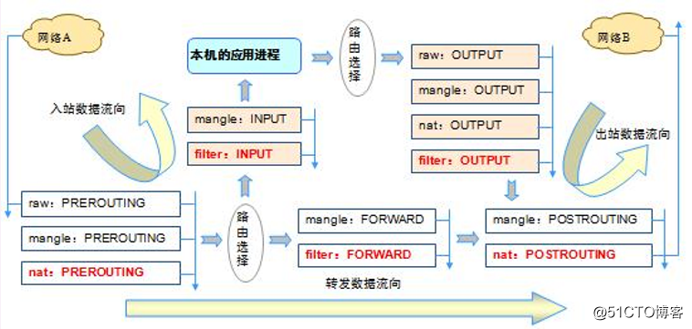

[TOC]

# iptables 详解

## iptables 简介

网络中的防火墙，是一种将内部和外部网络分开的方法,是一种隔离技术。防火墙在内网与外网通信时进行访问控制，依据所设置的规则对数据包作出判断，最大限度地阻止网络中不法分子破坏企业网络，从而加强了企业网络安全。

iptables 属于软件防火墙。Linux 内核中内置了 netfilter 包过滤功能模块，并且会自动加载，是内核很小的一部分称为Linux 防火墙的“内核态”，注意，真正生效的是内核态。

iptables 位于 `/sbin/iptables`，用来管理防火墙规则的工具称为 Linux 防火墙的 "用户态" 。仅仅是管理工具，真正起作用的是内核态。

也就是说，**netfilter 模块是属于内核态的，而 iptables 管理工具位于用户态**。

## iptables 定位

引子：一个服务器具有双网卡，数据入口是 eth0，数据出口是 eth1


    Linux **防火墙** 的工作区域为下图中的绿色阴影部分，也就是工作在**网络层，及网络层以下**：


Linux系统中防火墙功能的两大角色：

- iptables：iptables 是 Linux 系统下应用层内置控制防火墙的工具

- netfilter：netfilter 则是防火墙功能的具体实现，是内核空间的功能模块

所谓的 iptables "控制" 防火墙，就是用户利用 iptables 将防火墙规则设置给内核的 netfilter 功能模块，这中间涉及“四表五链”：


## iptables 的四表五链

### 关系

Linux 将用户规则依据**功能和规则所处链路位置**进行分组，<u>“四表”存放着功能一致的规则，“五链”存放着数据包所处链路一致的规则</u>


四表：

- **Filter 表**：<u>过滤</u>数据包
  
  - 三个链：INPUT、FORWARD、OUTPUT
  
  - 内核模块：iptables_filter 

- **NAT 表**：用于<u>网络地址转换</u>(IP、端口映射等)  
  
  - 三个链：PREROUTING、POSTROUTING、OUTPUT
  
  - 内核模块：iptable_nat

- **Mangle 表**：<u>修改数据包的服务类型、TTL、并且可以配置路由实现 QOS </u>
  
  - 五个链：PREROUTING、POSTROUTING、INPUT、OUTPUT、FORWARD
  
  - 内核模块：iptable_mangle

- **Raw 表**：<u>决定数据包是否被状态跟踪机制处理</u>，优先级最高，设置raw时一般是为了不再让iptables做数据包的链接跟踪处理，提高性能
  
  - 两个链：OUTPUT、PREROUTING
  
  - 内核模块：iptable_raw

五链：

- **PREROUTING 链**：对<u>数据包作路由选择前</u>应用此链中的规则

- **INPUT 链**：<u>通过路由表后进来，目的地为本机</u>的数据包应用此规则链中的规则

- **FORWARD 链**：<u>通过路由表后进来，目的地不是本机，需要转发</u>数据包时应用此规则链中的规则

- **OUTPUT 链**：<u>外出的数据包</u>应用此规则链中的规则

- **POSTROUTING 链**：<u>对数据包作路由选择后</u>应用此链中的规则

这里注意：**不是每一个 Table 都有 五链的**。

### 优先级

整个网络流量的流向如下图：




整体的流向为：

1. **Raw - PREROUTING** -> **Mangle - PREROUTING** -> **Nat - PREROUTING** （入站）

2. 路由选择：
   
   - 如果路由地址是本机，那么：**Filter - INPUT** -> **Mangle - INPUT**
     
     - 过滤完成后，发往本机的应用进程进行处理
     
     - 处理完成后，回复 response，返回结果经过路由选择 （出站）
     
     - 进行 **Raw - OUTPUT** -> **Mangle - OUTPUT** -> **Nat - OUTPUT** -> **Filter - OUTPUT**
   
   - 如果路由地址不是本机，那么：**Mangle - FORWARD** -> **Filter - FORWARD** （出站）

3. **Mangle - POSTROUTING** -> **Nat - POSTROUTING**

总体链式为：

- 路由到本机：PREROUTING Chain -> INPUT Chain -> OUTPUT Chain -> POSTROUTING Chain

- 转发：PREROUTING Chain -> FORWARD Chain -> POSTROUTING Chain

- 发出数据包：OUTPUT Chain -> POSTROUTING Chain

总结，规则链之间的优先顺序（分三种情况）：

- **第一种情况：入站数据流向**
  
  - 从外界到达防火墙的数据包，先被 **PREROUTING 规则**链处理（是否修改数据包地址等）
  
  - 之后会进行路由选择（判断该数据包应该发往何处），如果数据包的目标主机是防火墙本机（比如说 Internet 用户访问防火墙主机中的web服务器的数据包），那么内核将其传给 **INPUT 链**进行处理（决定是否允许通过等）
  
  - 通过以后**再交给系统上层的应用程序**（比如Apache服务器）进行响应。

- **第二冲情况：转发数据流向** 
  
  - 来自外界的数据包到达防火墙后，首先被 **PREROUTING 规则链**处理
  
  - 之后会进行路由选择，如果数据包的目标地址是其它外部地址（比如局域网用户通过网关访问 QQ 站点的数据包），则内核将其传递给 **FORWARD 链**进行处理（是否转发或拦截）
  
  - 然后再交给 **POSTROUTING 规则链**（是否修改数据包的地址等）进行处理。

- **第三种情况：出站数据流向**
  
  - 防火墙本机向外部地址发送的数据包（比如在防火墙主机中测试公网DNS服务器时），首先被 **OUTPUT 规则链**处理
  
  - 之后进行路由选择，然后传递给 **POSTROUTING 规则链**（是否修改数据包的地址等）进行处理。

## iptables 规则

**规则：是根据指定的匹配条件来尝试匹配每个流经此处的报文，一旦匹配成功，则由规则后面指定的处理动作进行处理；**

### 1. 匹配条件

匹配条件分为基本匹配条件与扩展匹配条件

1. 基本匹配条件： 
   
   - 源地址 Source IP，目标地址 Destination IP
   
   - 上述内容都可以作为基本匹配条件。

2. 扩展匹配条件： 
   
   - 除了上述的条件可以用于匹配，还有很多其他的条件可以用于匹配，这些条件泛称为扩展条件
   
   - 这些扩展条件其实也是 netfilter 中的一部分，只是以模块的形式存在，如果想要使用这些条件，则需要依赖对应的扩展模块。
   
   - 源端口 Source Port, 目标端口 Destination Port  ，上述内容都可以作为扩展匹配条件

### 2. 处理动作

**处理动作在 iptables 中被称为 target**（这样说并不准确，我们暂且这样称呼），动作也可以分为基本动作和扩展动作。  

此处列出一些常用的动作，之后的文章会对它们进行详细的示例与总结：

- **ACCEPT**：允许数据包通过。

- **DROP**：丢弃数据包不予处理，进行完此处理动作后，将不再比对其它规则，直接中断过滤程序

- **REJECT**： 拦阻该数据包，并返回数据包通知对方，可以返回的数据包有几个选择：ICMP port-unreachable、ICMP echo-reply 或是tcp-reset（这个数据包包会要求对方关闭联机），进行完此处理动作后，将不再比对其它规则，直接中断过滤程序。

- **SNAT**：源地址转换，解决内网用户用同一个公网地址上网的问题。改写封包来源 IP 为某特定 IP 或 IP 范围，可以指定 port 对应的范围，进行完此处理动作后，将直接跳往下一个规则链

- **MASQUERADE**：是SNAT的一种特殊形式，适用于动态的、临时会变的ip上。改写封包来源IP为防火墙的IP，可以指定port 对应的范围，进行完此处理动作后，直接跳往下一个规则链（mangle:postrouting）。这个功能与 SNAT 略有不同，当进行IP 伪装时，不需指定要伪装成哪个 IP，IP 会从网卡直接读取，当使用拨接连线时，IP 通常是由 ISP 公司的 DHCP服务器指派的，这个时候 MASQUERADE 特别有用。

- **DNAT**：目标地址转换。 改写数据包包目的地 IP 为某特定 IP 或 IP 范围，可以指定 port 对应的范围，进行完此处理动作后，将会直接跳往下一个规则链

- **REDIRECT**：将封包重新导向到另一个端口（PNAT），进行完此处理动作后，将会继续比对其它规则。这个功能可以用来实作透明代理 或用来保护web 服务器。

- **LOG**：在/var/log/messages文件中记录日志信息**MIRROR**  镜像数据包，也就是将来源 IP与目的地IP对调后，将数据包返回，进行完此处理动作后，将会中断过滤程序。

- **MIRROR：**  镜像数据包，也就是将来源 IP与目的地 IP 对调后，将数据包返回，进行完此处理动作后，将会中断过滤程序。

- **QUEUE：**   中断过滤程序，将封包放入队列，交给其它程序处理。透过自行开发的处理程序，可以进行其它应用，例如：计算联机费用.......等。

- **RETURN：**  结束在目前规则链中的过滤程序，返回主规则链继续过滤，如果把自订规则炼看成是一个子程序，那么这个动作，就相当于提早结束子程序并返回到主程序中。

- **MARK：** 将封包标上某个代号，以便提供作为后续过滤的条件判断依据，进行完此处理动作后，将会继续比对其它规则。

DROP 和 REJECT 的区别:

- DROP 是直接把匹配到的报文丢弃，发送方只能等待超时。

- REJECT 除了把报文丢弃还会给该报文中的源 IP 发一个 ICMP 报文说明目的不可达(直接回复不可达, 更强硬)，发送方因为收到了 ICMP 不可达所以马上就给出了提示。

### 3. 规则、链、表的联系

1. 数据到达不同的阶段会有不同的链进行处理，例如，数据包进来后，经由 PREROUTING 链处理

2. 每一条链都可以包含多个规则（rules），当数据包过来时，iptables 会从该链的第一条规则开始检查，看数据包是否满足所有的规则。

3. 而规则又可以对应到不同的表，也就是不同的处理动作、以及优先级。

## iptables 的使用

### 使用格式

iptables的命令格式较为复杂，一般的格式如下：

```shell
iptables [-t 表] -命令 匹配   操作
```

说明

1. `-t 表`
   
   - 表选项用于指定命令应用于哪个 iptables 内置表，例如 filter、raw 等。
   
   - 如果没有加 -t 选项，默认在 filter 表中

2- `-命令`

- 命令选项用于指定 iptables 的执行方式，包括插入规则，删除规则和添加规则，如下表所示

- 表明+链名，就能唯一确认在某一个位置
  
  | 命令                         | 说明                   |
  | -------------------------- | -------------------- |
  | `-P  --policy  <链名>`       | 定义默认策略               |
  | `-L  --list  <链名>`         | 查看iptables规则列表       |
  | `-A  --append  <链名>  `     | 在规则列表的最后增加1条规则       |
  | `-I  --insert  <链名>`       | 在指定的位置插入1条规则         |
  | `-D  --delete  <链名>`       | 从规则列表中删除1条规则         |
  | `-R  --replace  <链名>`      | 替换规则列表中的某条规则         |
  | `-F  --flush  <链名>`        | 删除表中所有规则             |
  | `-Z  --zero  <链名>`         | 将表中数据包计数器和流量计数器归零    |
  | `-X  --delete-chain  <链名>` | 删除自定义链               |
  | `-v  --verbose  <链名>`      | 与-L他命令一起使用显示更多更详细的信息 |
3. 匹配规则

匹配选项指定数据包与规则匹配所具有的特征，包括源地址，目的地址，传输协议和端口号，如下表所示

| 匹配                         | 说明                        |
| -------------------------- | ------------------------- |
| `-i --in-interface 网络接口名`  | 指定数据包从哪个网络接口进入            |
| `-o --out-interface 网络接口名` | 指定数据包从哪个网络接口输出            |
| `-p --proto 协议类型`          | 指定数据包匹配的协议，如TCP、UDP和ICMP等 |
| `-s --source 源地址或子网`       | 指定数据包匹配的源地址               |
| `--sport 源端口号`             | 指定数据包匹配的源端口号              |
| `--dport 目的端口号`            | 指定数据包匹配的目的端口号             |
| `-m --match`               | 指定数据包规则所使用的过滤模块           |

iptables 执行规则时，是从**规则表中从上至下顺序执行**的，如果没遇到匹配的规则，就一条一条往下执行，如果遇到匹配的规则后，那么就执行本规则，执行后根据本规则的动作(accept，reject，log，drop等)，决定下一步执行的情况，后续执行一般有三种情况。

- 一种是<u>继续执行当前规则队列内的下一条规则</u>。比如执行过 Filter 队列内的 LOG 后，还会执行 Filter 队列内的下一条规则。
- 一种是<u>中止当前规则队列的执行</u>，转到下一条规则队列。比如从执行过 accept 后就中断 Filter 队列内其它规则，跳到 nat 队列规则去执行
- 一种是<u>中止所有规则队列的执行</u>。

### 使用教程

#### 1. 查看规则

查看规则可以使用：

```shell
iptables -t [TableName] -L [ChainName]
```

- -t 可以不加，默认 filter 表

- ChainName 可以不加，显示所有的 Chain

例如：

```shell
root@ubuntu:~# iptables -t filter -L 
# Warning: iptables-legacy tables present, use iptables-legacy to see them
Chain INPUT (policy ACCEPT)
target     prot opt source               destination
ACCEPT     tcp  --  anywhere             anywhere             tcp dpt:http

Chain FORWARD (policy ACCEPT)
target     prot opt source               destination

Chain OUTPUT (policy ACCEPT)
target     prot opt source               destination
```

查看规则的详细信息可以添加下面的选项：

```shell
iptables -t [TableName] --line-numbers -nvL [ChainName]
```

选项：

- **-v --verbose** 
  
  - 详细输出。
  
  - 这个选项让 list 命令显示<u>接口地址、规则选项（如果有）和TOS （Type of Service）掩码</u>。<u>包和字节计数器也将被显示，分别用K、M、G (前缀)表示1000、1,000,000和1,000,000,000倍</u>（不过请参看-x标志改变它）， <u>对于添加,插入,删除和替换命令，这会使一个或多个规则的相关详细信息被打印</u>。

- **-n --numeric**
  
  - 数字输出。
  
  - IP 地址和端口会以数字的形式打印。默认情况下，程序试显 示主机名、网络名或者服务（只要可用）。

- **-x -exact**
  
  - 扩展数字。
  
  - 显示包和字节计数器的精确值，代替用K,M,G表示的约数。 这个选项仅能用于 -L 命令

- **--line-numbers**
  
  - 当列表显示规则时，在每个规则的前面加上行号，与该规则在链中的位置相对应。

例如：

```shell
root@ubuntu:~# iptables -t filter --line-numbers -nvL INPUT
# Warning: iptables-legacy tables present, use iptables-legacy to see them
Chain INPUT (policy ACCEPT 0 packets, 0 bytes)
num   pkts bytes target     prot opt in     out     source               destination
1        0     0 ACCEPT     tcp  --  *      *       0.0.0.0/0            0.0.0.0/0            tcp dpt:80
```

输出含义：

- pkts:对应规则匹配到的报文的个数。  

- bytes:对应匹配到的报文包的大小总和。  

- target:规则对应的target，往往表示规则对应的"动作"，即规则匹配成功后需要采取的措施。  

- prot:表示规则对应的协议，是否只针对某些协议应用此规则。  

- opt:表示规则对应的选项。  

- in:表示数据包由哪个接口(网卡)流入，我们可以设置通过哪块网卡流入的报文需要匹配当前规则。  

- out:表示数据包由哪个接口(网卡)流出，我们可以设置通过哪块网卡流出的报文需要匹配当前规则。  

- source:表示规则对应的源头地址，可以是一个IP，也可以是一个网段。  

- destination:表示规则对应的目标地址。可以是一个IP，也可以是一个网段。

#### 2. 添加规则

 添加规则的命令可以参考：

```shell
iptables -t [TableName] -I [ChainName] [插入序号] [匹配条件] -j [RuleName]
```

-  -t 选项指定了要操作的表，不使用-t选项指定表时，默认为操作filter表。

- **-I 选项**
  
  - 指明将”规则”插入至哪个链中，-I表示insert，即插入的意思
  
  - <u>根据给出的规则序号向所选链中插入一条或更多规则</u>。
  
  - <u>所以，如果规则序号为1， 规则会被插入链的头部。这也是不指定规则序号时的默认方式。</u>

- **-A 选项**
  
  - <u>在所选择的链末添加一条或更多规则</u>。当源（地址）或者/与 目的（地址）转换 为多于一个(多个)地址时，这条规则会加到所有可能的地址(组合)后面。
  
  - A 即  append ，添加到末尾。

- **-j 选项**，指明当”匹配条件”被满足时，所对应的动作RULE，例如 ACCEPT、DROP等

实例：

```shell
# 添加一条规则
root@ubuntu:~# iptables -A INPUT -p tcp --dport 80 -j ACCEPT
root@ubuntu:~# iptables -t filter --line-numbers -nvL INPUT
# Warning: iptables-legacy tables present, use iptables-legacy to see them
Chain INPUT (policy ACCEPT 0 packets, 0 bytes)
num   pkts bytes target     prot opt in     out     source               destination
1        0     0 ACCEPT     tcp  --  *      *       0.0.0.0/0            0.0.0.0/0            tcp dpt:80

# 通过 -A 添加到末尾
root@ubuntu:~# iptables -t filter -A INPUT -s 192.168.44.129 -j DROP
root@ubuntu:~# iptables -t filter --line-numbers -nvL INPUT
# Warning: iptables-legacy tables present, use iptables-legacy to see them
Chain INPUT (policy ACCEPT 0 packets, 0 bytes)
num   pkts bytes target     prot opt in     out     source               destination
1        0     0 ACCEPT     tcp  --  *      *       0.0.0.0/0            0.0.0.0/0            tcp dpt:80
2        0     0 DROP       all  --  *      *       192.168.44.129       0.0.0.0/0

# 通过 -I 添加到开头
root@ubuntu:~# iptables -t filter -I INPUT 1 -s 192.168.44.129 -j DROP
root@ubuntu:~# iptables -t filter --line-numbers -nvL INPUT
# Warning: iptables-legacy tables present, use iptables-legacy to see them
Chain INPUT (policy ACCEPT 0 packets, 0 bytes)
num   pkts bytes target     prot opt in     out     source               destination
1        0     0 DROP       all  --  *      *       192.168.44.129       0.0.0.0/0
2        0     0 ACCEPT     tcp  --  *      *       0.0.0.0/0            0.0.0.0/0            tcp dpt:80
3        0     0 DROP       all  --  *      *       192.168.44.129       0.0.0.0/0
```

#### 3. 删除规则

有两种办法删除规则：

- 方法一：**根据规则的编号**去删除规则  

- 方法二：**根据具体的匹配条件与动作**删除规则

两种删除方式：

```shell
# 两种删除方式
iptables -D [ChainName] [序号]
iptables -D [ChainName] [匹配规则] -j [RuleName]
```

- -D 选项
  
  - 即 delete，删除某一条规则

例如：

```shell
iptables -D INPUT 3
iptables -D INPUT -s 1.1.1.2 -j DROP
```

#### 4. 修改规则

添加规则后，如果想修改的话，可以先删除、再添加。

如果想要修改某一个 Chain 的默认策略，可以使用：

```shell
iptables -P [ChainName] [RuleName]
```

- **-P 选项**
  
  - 即 policy，定义默认的过滤策略。 
  
  - 数据包没有找到符合的策略，则根据此预设方式处理。

例如：

```shell
iptables -P INPUT DROP
```

#### 5. 保存规则

通过 iptables 命令添加了规则后，如果重启机器，规则会丢失，因此如果想要永久保存规则，可以使用：

1. 通过系统 service 命令保存
   
   ```shell
   service iptables save
   ```

2. 通过 iptables-save 命令保存
   
   ```shell
   # 保存规则
   iptables-save > /etc/sysconfig/iptables
   # 恢复规则
   iptables-restore < /etc/sysconfig/iptables
   ```

添加到系统启动脚本

   `echo ‘/sbin/iptables-restore /etc/sysconfig/iptables'>>/etc/rc.d/rc.local`

#### 6. 匹配规则


1. 参数 -p, --protocol

范例：`iptables -A INPUT -p tcp`

说明：比对通讯协议类型是否相符，可以使用 ! 运算子进行反向比对，例如：-p ! tcp ，意思是指除 tcp 以外的其它类型，包含udp、icmp ...等。如果要比对所有类型，则可以使用 all 关键词，例如：-p all。

2. 参数 -s, --src, --source

范例: ``iptables -A INPUT -s 192.168.1.100`

说明：用来比对数据包的来源IP，可以比对单机或网络，比对网络时请用数字来表示屏蔽，例如：-s 192.168.0.0/24，比对 IP 时可以使用!运算子进行反向比对，例如：-s ! 192.168.0.0/24。

3. 参数 -d, --dst, --destination

范例： `iptables -A INPUT -d 192.168.1.100`

说明：用来比对封包的目的地 IP，设定方式同上。

4. 参数 -i, --in-interface

范例 `iptables -A INPUT -i  lo`

说明:用来比对数据包是从哪个网卡进入，可以使用通配字符 + 来做大范围比对，如：-i eth+ 表示所有的 ethernet 网卡，也可以使用 ! 运算子进行反向比对，如：-i ! eth0。这里lo指本地换回接口。

5. 参数 -o, --out-interface

范例：`iptables -A FORWARD -o eth0`

说明：用来比对数据包要从哪个网卡流出，设定方式同上。

6. 参数 --sport, --source-port

范例：**iptables -A INPUT -p tcp --sport 22**

说明：用来比对数据的包的来源端口号，可以比对单一端口，或是一个范围，例如：--sport 22:80，表示从 22 到 80 端口之间都算是符合件，如果要比对不连续的多个端口，则必须使用 --multiport 参数，详见后文。比对端口号时，可以使用 ! 运算子进行反向比对。

7. 参数 --dport, --destination-port

范例 `iptables -A INPUT -p tcp --dport 22`  

说明 用来比对封包的目的地端口号，设定方式同上。

8. 参数 --tcp-flags

范例：`iptables -p tcp --tcp-flags SYN,FIN,ACK SYN`

说明：比对 TCP 封包的状态标志号，参数分为两个部分，第一个部分列举出想比对的标志号，第二部分则列举前述标志号中哪些有被设，未被列举的标志号必须是空的。TCP 状态标志号包括：SYN（同步）、ACK（应答）、FIN（结束）、RST（重设）、URG（紧急）PSH（强迫推送） 等均可使用于参数中，除此之外还可以使用关键词 ALL 和 NONE 进行比对。比对标志号时，可以使用 ! 运算子行反向比对。

9. 参数 --syn

范例：`iptables -p tcp --syn`

说明：用来比对是否为要求联机之TCP 封包，与 iptables -p tcp --tcp-flags SYN,FIN,ACK SYN 的作用完全相同，如果使用 !运算子，可用来比对非要求联机封包。

10. 参数 -m multiport --source-port

范例： `iptables -A INPUT -p tcp -m multiport --source-port 22,53,80,110 -j ACCEPT`

说明 用来比对不连续的多个来源端口号，一次最多可以比对 15 个端口，可以使用 ! 运算子进行反向比对。

11. 参数 -m multiport --destination-port

范例 ：`iptables -A INPUT -p tcp -m multiport --destination-port 22,53,80,110 -j ACCEPT`

说明：用来比对不连续的多个目的地端口号，设定方式同上。

12. 参数 -m multiport --port

范例：`iptables -A INPUT -p tcp -m multiport --port 22,53,80,110 -j ACCEPT`

说明：这个参数比较特殊，用来比对来源端口号和目的端口号相同的数据包，设定方式同上。注意：在本范例中，如果来源端口号为 80，目的地端口号为 110，这种数据包并不算符合条件。

13. 参数 --icmp-type

范例：`iptables -A INPUT -p icmp --icmp-type 8 -j DROP`

说明：用来比对 ICMP 的类型编号，可以使用代码或数字编号来进行比对。请打 iptables -p icmp --help 来查看有哪些代码可用。这里是指禁止ping如，但是可以从该主机ping出。

14. 参数 -m limit --limit

范例：`iptables -A INPUT -m limit --limit 3/hour`

说明：用来比对某段时间内数据包的平均流量，上面的例子是用来比对：每小时平均流量是否超过一次3个数据包。 除了每小时平均次外，也可以每秒钟、每分钟或每天平均一次，默认值为每小时平均一次，参数如后： /second、 /minute、/day。 除了进行数据包数量的比对外，设定这个参数也会在条件达成时，暂停数据包的比对动作，以避免因洪水攻击法，导致服务被阻断。

15. 参数 --limit-burst

范例：`iptables -A INPUT -m limit --limit-burst 5`

说明：用来比对瞬间大量封包的数量，上面的例子是用来比对一次同时涌入的封包是否超过 5 个（这是默认值），超过此上限的封将被直接丢弃。使用效果同上。

16. 参数 -m mac --mac-source

范例：`iptables -A INPUT -m mac --mac-source 00:00:00:00:00:01 -j ACCEPT`

说明：用来比对数据包来源网络接口的硬件地址，这个参数不能用在 OUTPUT 和 Postrouting 规则链上，这是因为封包要送出到网后，才能由网卡驱动程序透过 ARP 通讯协议查出目的地的 MAC 地址，所以 iptables 在进行封包比对时，并不知道封包会送到个网络接口去。linux基础

17. 参数 --mark

范例：`iptables -t mangle -A INPUT -m mark --mark 1`

说明：用来比对封包是否被表示某个号码，当封包被比对成功时，我们可以透过 MARK 处理动作，将该封包标示一个号码，号码最不可以超过 4294967296。linux基础

18. 参数 -m owner --uid-owner

范例：`iptables -A OUTPUT -m owner --uid-owner 500`

说明：用来比对来自本机的封包，是否为某特定使用者所产生的，这样可以避免服务器使用 root 或其它身分将敏感数据传送出，可以降低系统被骇的损失。可惜这个功能无法比对出来自其它主机的封包。

19、参数 -m owner --gid-owner

范例：`iptables -A OUTPUT -m owner --gid-owner 0`

说明：用来比对来自本机的数据包，是否为某特定使用者群组所产生的，使用时机同上。

20. 参数 -m owner --pid-owner

范例：`iptables -A OUTPUT -m owner --pid-owner 78`

说明：用来比对来自本机的数据包，是否为某特定行程所产生的，使用时机同上。

21. 参数 -m owner --sid-owner

范例： `iptables -A OUTPUT -m owner --sid-owner 100`

说明： 用来比对来自本机的数据包，是否为某特定联机（Session ID）的响应封包，使用时机同上。

22. 参数 -m state --state

范例： `iptables -A INPUT -m state --state RELATED,ESTABLISHED -j ACCEPT`

说明 用来比对联机状态，联机状态共有四种：INVALID、ESTABLISHED、NEW 和 RELATED。
